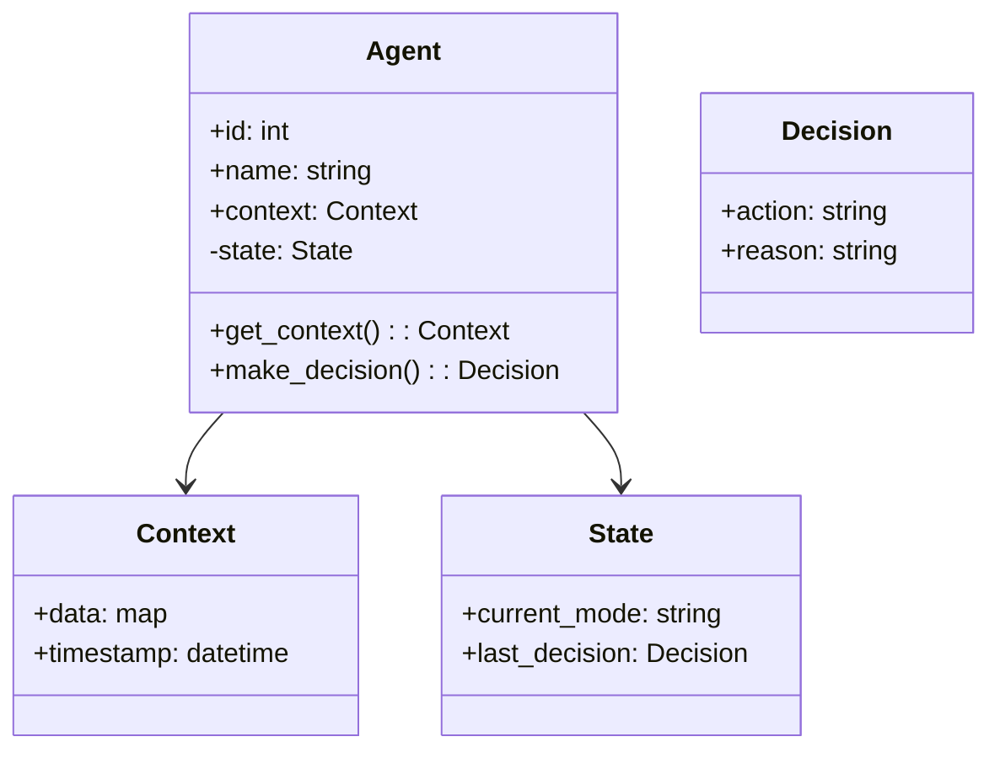
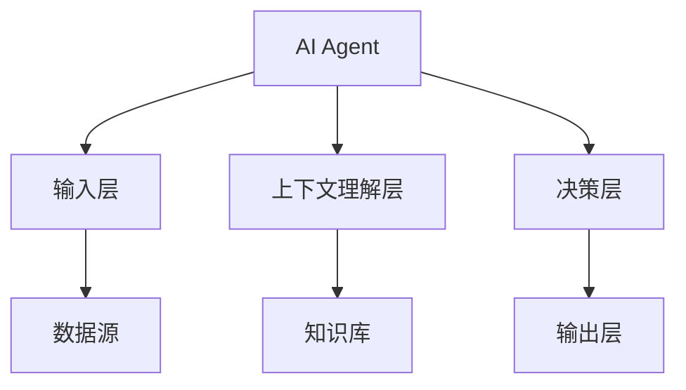
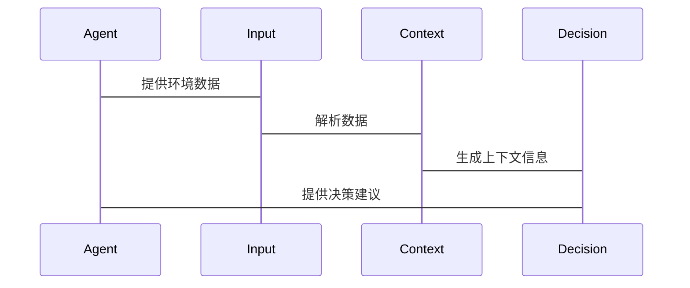

                 


# 构建具有上下文感知能力的AI Agent

## 关键词：AI Agent、上下文感知、注意力机制、深度学习、智能决策

## 摘要：上下文感知AI Agent是一种能够理解当前上下文环境并做出智能决策的AI系统。本文从基本概念、核心算法、系统架构到项目实战，全面讲解如何构建具有上下文感知能力的AI Agent，涵盖从理论到实践的各个方面。

---

# 第一部分: 构建具有上下文感知能力的AI Agent概述

## 第1章: 上下文感知AI Agent的背景与概念

### 1.1 AI Agent的基本概念

#### 1.1.1 AI Agent的定义与特点
- **定义**: AI Agent是一种智能实体，能够感知环境、自主决策并执行任务。
- **特点**: 智能性、自主性、反应性、社交性。

#### 1.1.2 上下文感知能力的引入
- 上下文感知AI Agent能够理解当前环境和情境，提供更精准的服务。

#### 1.1.3 上下文感知AI Agent的核心价值
- 提高决策准确性，增强用户体验，适应复杂场景。

### 1.2 上下文感知AI Agent的背景与需求

#### 1.2.1 当前AI技术的局限性
- 传统AI Agent难以处理动态和复杂环境。

#### 1.2.2 上下文感知能力的必要性
- 需要理解上下文以提供更智能的服务。

#### 1.2.3 上下文感知AI Agent的应用场景
- 智能助手、自动驾驶、智能客服。

### 1.3 上下文感知AI Agent与传统AI Agent的区别

#### 1.3.1 传统AI Agent的工作方式
- 基于规则或预设模型，缺乏灵活性。

#### 1.3.2 上下文感知AI Agent的独特优势
- 能够动态调整行为，适应环境变化。

#### 1.3.3 两者的对比分析
- 对比表格和Mermaid图展示区别。

---

## 第2章: 上下文感知AI Agent的核心概念与原理

### 2.1 上下文感知的定义与特征

#### 2.1.1 上下文的定义
- 上下文是环境中的相关信息，影响当前任务。

#### 2.1.2 上下文感知的核心特征
- 理解、关联、动态性。

### 2.2 上下文感知AI Agent的体系结构

#### 2.2.1 输入层: 数据采集与处理
- 传感器、API接口。

#### 2.2.2 上下文理解层: 意义解析与关联
- NLP技术、知识图谱。

#### 2.2.3 决策层: 基于上下文的智能决策
- 多目标优化、强化学习。

### 2.3 上下文感知AI Agent的工作原理

#### 2.3.1 数据输入与预处理
- 清洗、格式化数据。

#### 2.3.2 上下文分析与建模
- 词袋模型、注意力机制。

#### 2.3.3 智能决策与输出
- 生成决策、反馈优化。

---

## 第3章: 上下文感知AI Agent的核心算法与数学模型

### 3.1 注意力机制

#### 3.1.1 注意力机制的定义
- 一种衡量输入数据中各部分重要性的方法。

#### 3.1.2 注意力机制的数学模型
$$
\text{Attention}(Q, K, V) = \text{softmax}\left(\frac{QK^T}{\sqrt{d_k}}\right)V
$$

#### 3.1.3 注意力机制的应用场景
- 机器翻译、语音识别。

### 3.2 上下文推理模型

#### 3.2.1 上下文推理模型的定义
- 基于上下文信息进行推理的模型。

#### 3.2.2 基于上下文的推理算法
- 基于规则的推理、基于概率的推理。

#### 3.2.3 上下文推理模型的数学表达
$$
P(x|y) = \prod_{i=1}^{n} P(x_i|x_{i-1}, y)
$$

### 3.3 深度学习模型在上下文感知中的应用

#### 3.3.1 RNN在上下文感知中的应用
- 处理序列数据。

#### 3.3.2 Transformer在上下文感知中的应用
- 并行处理，捕捉长距离依赖。

#### 3.3.3 深度学习模型的优缺点对比
- 对比表格展示优缺点。

---

## 第4章: 系统架构设计与实现

### 4.1 系统功能设计

#### 4.1.1 领域模型类图


### 4.2 系统架构设计

#### 4.2.1 系统架构图


### 4.3 系统接口设计

#### 4.3.1 接口描述
- 输入接口：接收环境数据。
- 输出接口：发送决策指令。

#### 4.3.2 系统交互序列图


---

## 第5章: 项目实战与案例分析

### 5.1 项目环境安装

#### 5.1.1 安装Python和依赖
```bash
pip install numpy tensorflow keras
```

### 5.2 核心功能实现

#### 5.2.1 上下文解析模块
```python
def parse_context(context):
    # 解析上下文数据
    return parsed_data
```

#### 5.2.2 智能决策模块
```python
def make_decision(parsed_data):
    # 基于上下文数据生成决策
    return decision
```

### 5.3 项目小结

#### 5.3.1 核心代码解读
- 解析模块和决策模块的代码分析。

#### 5.3.2 实际案例分析
- 智能助手处理用户查询的案例。

---

## 第6章: 最佳实践与注意事项

### 6.1 小结

#### 6.1.1 项目总结
- 成功构建上下文感知AI Agent。

#### 6.1.2 经验总结
- 系统设计的重要性，算法选择的影响。

### 6.2 注意事项

#### 6.2.1 开发中的注意事项
- 数据质量、模型调优。

#### 6.2.2 部署中的注意事项
- 性能优化、安全性考虑。

### 6.3 拓展阅读

#### 6.3.1 相关领域推荐
- 推荐书籍和论文。

---

## 参考文献

- TensorFlow官方文档
- PyTorch官方文档
- 相关学术论文

---

以上是《构建具有上下文感知能力的AI Agent》的完整目录大纲，从基础到高级全面覆盖了构建上下文感知AI Agent的知识。希望对您有所帮助！

