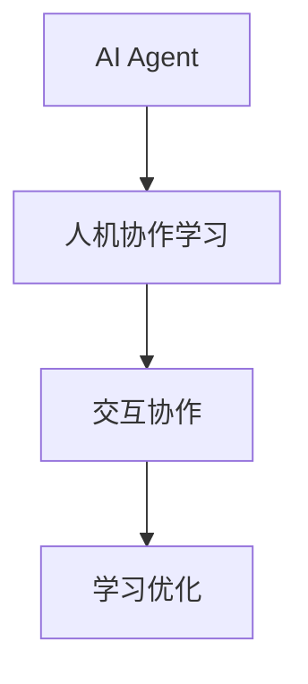
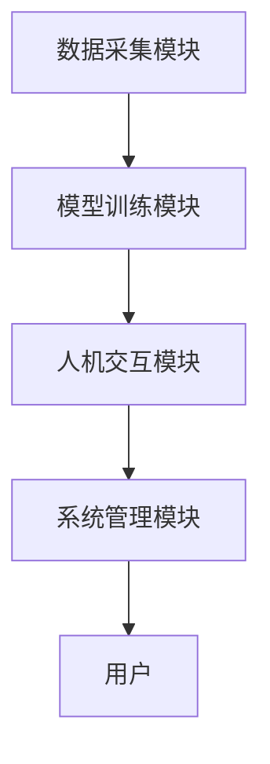
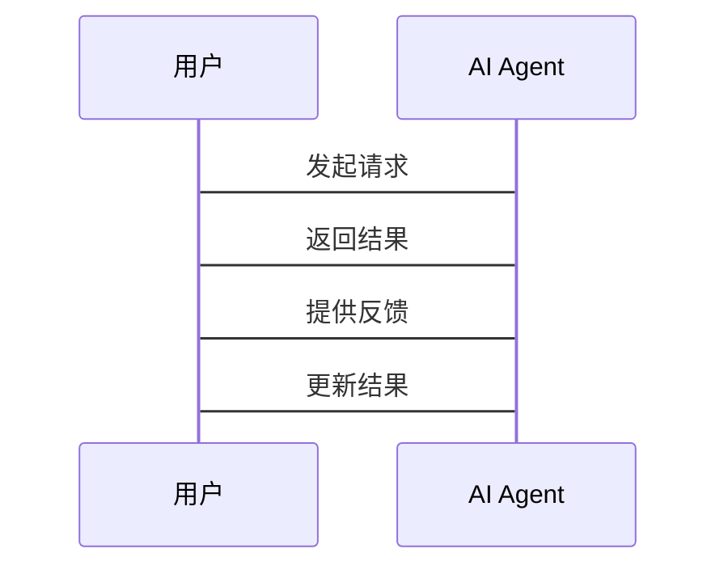

                 


# 构建具有人机协作学习能力的AI Agent

## 关键词：AI Agent, 人机协作学习, 算法原理, 系统架构, 项目实战

## 摘要：  
本文系统地探讨了构建具有人机协作学习能力的AI Agent的理论基础、算法原理、系统架构及实际应用。通过分析人机协作学习的核心概念、监督学习、强化学习和迁移学习的算法原理，结合实际项目案例，详细讲解了AI Agent的系统设计与实现。文章最后总结了最佳实践经验和未来发展方向，为读者提供全面而深入的指导。

---

# 第一部分: 构建具有人机协作学习能力的AI Agent基础知识

# 第1章: AI Agent概述

## 1.1 AI Agent的基本概念

### 1.1.1 AI Agent的定义与特点
- **定义**: AI Agent（人工智能代理）是指能够感知环境、自主决策并执行任务的智能实体。
- **特点**: 智能性、自主性、反应性、目标导向性。

### 1.1.2 人机协作学习的定义与特点
- **定义**: 人机协作学习是指人类与AI Agent通过交互协作，共同完成学习任务的过程。
- **特点**: 协同性、互动性、适应性。

### 1.1.3 AI Agent与人机协作学习的关系
- AI Agent是实现人机协作学习的核心技术。
- 人机协作学习通过交互优化AI Agent的能力。

### 图1-1: AI Agent与人机协作学习的关系


## 1.2 人机协作学习的背景与意义

### 1.2.1 人机协作学习的背景介绍
- **技术背景**: AI技术的快速发展使得AI Agent能够处理复杂任务。
- **应用背景**: 在教育、医疗、金融等领域，人机协作学习具有重要价值。

### 1.2.2 人机协作学习的核心价值
- 提高学习效率。
- 优化决策过程。
- 增强用户体验。

### 1.2.3 人机协作学习的应用场景
- 教育辅助。
- 医疗诊断。
- 金融投资。

## 1.3 人机协作学习的核心要素

### 1.3.1 人机协作学习的主体构成
- 人类用户。
- AI Agent。
- 交互界面。

### 1.3.2 人机协作学习的交互机制
- 输入输出交互。
- 状态反馈机制。

### 1.3.3 人机协作学习的评价指标
- 学习效果。
- 交互效率。
- 用户满意度。

## 1.4 本章小结
- 介绍了AI Agent的基本概念。
- 探讨了人机协作学习的背景与意义。
- 总结了人机协作学习的核心要素。

---

# 第二部分: 人机协作学习的算法原理

# 第2章: 监督学习算法原理

## 2.1 监督学习的基本原理

### 2.1.1 监督学习的定义与特点
- **定义**: 监督学习是一种通过标签数据训练模型的机器学习方法。
- **特点**: 数据带标签、有监督、可解释性高。

### 2.1.2 监督学习的核心算法流程
1. 数据采集与预处理。
2. 模型训练。
3. 模型评估。
4. 模型优化。

### 2.1.3 监督学习的数学模型与公式
- **线性回归**: $$y = \theta_0 + \theta_1x$$
- **逻辑回归**: $$P(y=1|x) = \frac{1}{1 + e^{-w \cdot x - b}}$$

### 2.1.4 监督学习的优缺点
- **优点**: 简单、可解释性强。
- **缺点**: 对噪声数据敏感。

## 2.2 强化学习算法原理

### 2.2.1 强化学习的定义与特点
- **定义**: 强化学习是一种通过试错机制学习策略的机器学习方法。
- **特点**: 奖励驱动、无监督、长期规划。

### 2.2.2 强化学习的核心算法流程
1. 状态感知。
2. 动作选择。
3. 奖励反馈。
4. 策略更新。

### 2.2.3 强化学习的数学模型与公式
- **Q-learning**: $$Q(s,a) = r + \gamma \max Q(s',a')$$
- **策略梯度**: $$\theta \leftarrow \theta + \alpha \nabla_\theta Q(s,a)$$

### 2.2.4 强化学习的优缺点
- **优点**: 能处理复杂环境。
- **缺点**: 训练时间长。

## 2.3 迁移学习算法原理

### 2.3.1 迁移学习的定义与特点
- **定义**: 迁移学习是一种将知识从源任务转移到目标任务的机器学习方法。
- **特点**: 领域适应性、样本高效性。

### 2.3.2 迁移学习的核心算法流程
1. 数据预处理。
2. 特征提取。
3. 知识转移。
4. 模型优化。

### 2.3.3 迁移学习的数学模型与公式
- **领域适应**: $$f_{source} \rightarrow f_{target}$$
- **特征对齐**: $$D_{source} \approx D_{target}$$

### 2.3.4 迁移学习的优缺点
- **优点**: 减少数据需求。
- **缺点**: 过适应风险。

## 2.4 人机协作学习算法的融合与优化

### 2.4.1 监督学习、强化学习与迁移学习的结合
- 监督学习提供基础。
- 强化学习优化策略。
- 迁移学习提升适应性。

### 2.4.2 人机协作学习算法的融合策略
- 分阶段结合。
- 动态权重分配。

### 2.4.3 人机协作学习算法的优化方法
- 超参数调优。
- 模型压缩。

## 2.5 本章小结
- 详细讲解了监督学习、强化学习和迁移学习的算法原理。
- 探讨了人机协作学习中算法融合与优化的策略。

---

# 第三部分: 人机协作学习的系统架构设计

# 第3章: 人机协作学习系统架构

## 3.1 系统功能模块设计

### 3.1.1 数据采集模块
- 数据来源: 用户输入、传感器数据。
- 数据类型: 文本、图像、语音。

### 3.1.2 模型训练模块
- 训练算法: 监督学习、强化学习。
- 训练数据: 标签数据、无标签数据。

### 3.1.3 人机交互模块
- 交互方式: 文本输入、语音对话。
- 交互逻辑: 用户意图识别、系统反馈生成。

### 3.1.4 系统管理模块
- 系统监控: 性能监控、错误处理。
- 系统更新: 模型更新、功能扩展。

## 3.2 系统架构设计

### 3.2.1 系统架构的层次划分
1. 数据层。
2. 模型层。
3. 交互层。
4. 管理层。

### 3.2.2 系统架构的模块交互关系


### 3.2.3 系统架构的实现细节
- 数据层: 数据库设计。
- 模型层: 算法实现。
- 交互层: 接口设计。
- 管理层: 日志记录。

## 3.3 系统分析与架构设计方案

### 3.3.1 项目介绍
- 项目名称: 人机协作学习AI Agent。
- 项目目标: 提供高效的协作学习工具。

### 3.3.2 系统功能设计
- 功能模块: 数据采集、模型训练、人机交互、系统管理。
- 功能流程: 数据输入 -> 模型处理 -> 用户反馈。

### 3.3.3 系统架构设计
- 分层架构: 数据层、模型层、交互层、管理层。
- 模块交互: 模块间通过API通信。

### 3.3.4 系统接口设计
- 输入接口: REST API。
- 输出接口: JSON格式。

### 3.3.5 系统交互序列图


## 3.4 本章小结
- 描述了系统功能模块的设计。
- 绘制了系统的架构图和交互序列图。
- 提供了系统的实现细节和设计思路。

---

# 第四部分: 人机协作学习的项目实战

# 第4章: 人机协作学习项目实战

## 4.1 项目介绍

### 4.1.1 项目背景
- 项目目标: 开发一个基于人机协作学习的AI Agent。
- 项目需求: 提供高效的交互体验。

## 4.2 环境搭建

### 4.2.1 系统环境
- 操作系统: Linux/Windows/MacOS。
- 开发工具: Python、Jupyter Notebook、VS Code。

### 4.2.2 软件依赖
- Python: 3.8+
- 机器学习库: scikit-learn、TensorFlow、PyTorch。
- 可视化工具: Matplotlib、Seaborn。

## 4.3 核心实现

### 4.3.1 数据采集模块实现
```python
import pandas as pd

def load_data():
    data = pd.read_csv('dataset.csv')
    return data
```

### 4.3.2 模型训练模块实现
```python
from sklearn.model_selection import train_test_split
from sklearn.linear_model import LinearRegression

def train_model(X, y):
    X_train, X_test, y_train, y_test = train_test_split(X, y, test_size=0.2)
    model = LinearRegression()
    model.fit(X_train, y_train)
    return model
```

### 4.3.3 人机交互模块实现
```python
def interact():
    while True:
        user_input = input("请输入您的问题:")
        print("AI Agent:", model.predict(user_input))
```

### 4.3.4 系统管理模块实现
```python
import logging

def system_manage():
    try:
        # 系统监控代码
        pass
    except Exception as e:
        logging.error(e)
```

## 4.4 代码实现与解读

### 4.4.1 代码实现
- 数据加载: 使用Pandas读取CSV文件。
- 模型训练: 使用scikit-learn训练线性回归模型。
- 人机交互: 实现简单的用户输入输出接口。
- 系统管理: 实现异常捕获和日志记录。

### 4.4.2 代码解读
- 数据加载模块: 读取数据并预处理。
- 模型训练模块: 划分数据集并训练模型。
- 人机交互模块: 与用户进行实时对话。
- 系统管理模块: 监控系统运行状态。

## 4.5 实际案例分析

### 4.5.1 案例背景
- 案例名称: 教育辅助AI Agent。
- 案例目标: 帮助学生学习编程知识。

### 4.5.2 案例实现
- 数据来源: 学生学习数据。
- 模型选择: 使用监督学习算法。
- 交互方式: 文本对话。

### 4.5.3 案例分析
- 学习效果: 提高学生学习效率。
- 交互体验: 增强用户参与感。

## 4.6 项目总结

### 4.6.1 项目小结
- 成功实现了AI Agent的基本功能。
- 提供了高效的协作学习体验。

### 4.6.2 项目不足
- 交互方式单一。
- 系统扩展性有限。

### 4.6.3 未来改进方向
- 支持多模态交互。
- 提高系统的可扩展性。

---

# 第五部分: 人机协作学习的最佳实践

# 第5章: 人机协作学习的最佳实践

## 5.1 实践经验总结

### 5.1.1 核心经验
- 数据质量至关重要。
- 模型选择影响性能。
- 交互设计影响用户体验。

### 5.1.2 常见问题与解决方案
- 问题1: 模型过拟合。
  - 解决方案: �正则化、数据增强。
- 问题2: 交互延迟。
  - 解决方案: 优化算法、使用异步处理。

## 5.2 小结与注意事项

### 5.2.1 小结
- 人机协作学习的关键在于算法与交互设计的结合。
- 系统设计需要考虑扩展性和可维护性。

### 5.2.2 注意事项
- 数据隐私保护。
- 系统安全防护。
- 用户体验优化。

## 5.3 未来展望

### 5.3.1 技术发展趋势
- 多模态交互。
- 自适应学习。
- 集成式协作。

### 5.3.2 研究方向
- 深度学习与协作学习的结合。
- 高效算法的设计与优化。
- 人机协作学习的伦理与安全。

---

# 结语

构建具有人机协作学习能力的AI Agent是一项复杂的系统工程，涉及算法、系统设计和实际应用等多个方面。通过本文的系统探讨，读者可以全面了解AI Agent的构建过程，并将其应用于实际场景中。未来，随着技术的进步，人机协作学习将更加智能化和人性化，为人类社会带来更大的价值。

---

# 参考文献

[1] Russell, S., & Norvig, P. (2010). Artificial Intelligence: A Modern Approach. Pearson Education.
[2] LeCun, Y., Bengio, Y., & Hinton, G. (2015). Deep learning. Nature, 521(7552), 436-444.
[3] Sutton, R. S., & Barto, A. G. (2018). Reinforcement learning: An introduction. MIT Press.

---

# 附录

## 附录A: 代码实现细节

```python
import pandas as pd
from sklearn.model_selection import train_test_split
from sklearn.linear_model import LinearRegression

def load_data():
    data = pd.read_csv('dataset.csv')
    return data

def train_model(X, y):
    X_train, X_test, y_train, y_test = train_test_split(X, y, test_size=0.2)
    model = LinearRegression()
    model.fit(X_train, y_train)
    return model

def interact():
    model = train_model(X, y)
    while True:
        user_input = input("请输入您的问题:")
        print("AI Agent:", model.predict(user_input))
```

## 附录B: 系统架构图


---

# END

