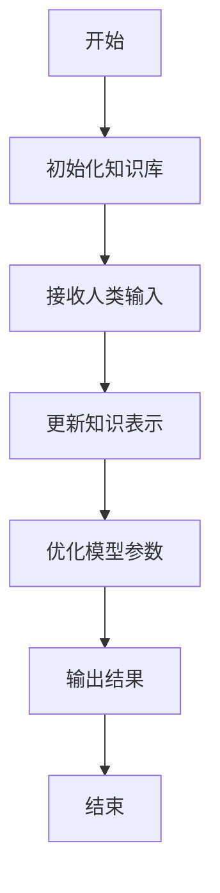
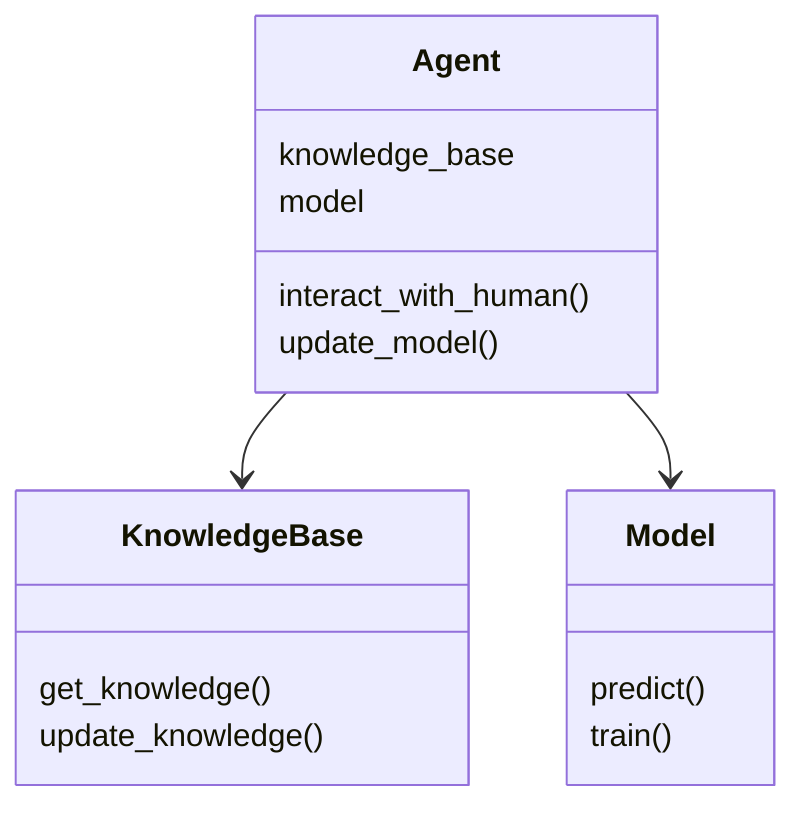
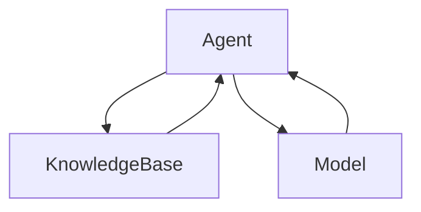

                 


# 构建具有人机协作学习能力的AI Agent系统

## 关键词：人机协作学习, AI Agent, 机器学习, 算法原理, 系统架构设计

## 摘要：  
本文探讨了构建具有人机协作学习能力的AI Agent系统的核心概念、算法原理和系统架构设计。通过分析人机协作学习的背景、机制和应用场景，详细阐述了AI Agent系统的设计原则、算法实现和优化策略。结合实际案例，展示了如何通过人机协作学习提升AI Agent的智能性和适应性，为读者提供了一套系统化的方法论。

---

## 第一章：引言与背景

### 1.1 问题背景与描述  
随着人工智能技术的快速发展，AI Agent系统在各个领域的应用日益广泛。然而，现有的AI Agent系统往往缺乏人机协作学习的能力，导致其在复杂场景下的适应性和智能性不足。本文旨在探讨如何通过人机协作学习提升AI Agent的能力，使其能够更好地与人类协同工作。

---

## 第二章：人机协作学习的核心概念与原理

### 2.1 人机协作学习的背景与意义  
人机协作学习是指人类与AI Agent通过交互协作，共同完成学习任务的过程。这种协作模式能够充分发挥人类的主观能动性和AI Agent的数据处理能力，实现知识的共同构建与优化。

#### 关键概念与属性对比  
| 概念 | 描述 |
|------|------|
| 人机协作学习 | 人类与AI Agent共同参与学习过程 |
| 传统机器学习 | AI独立完成学习任务 |
| 协作性 | 高 |
| 适应性 | 高 |

### 2.2 人机协作学习的机制与原理  
人机协作学习的核心机制包括知识表示、人机交互、自适应学习和反馈优化。通过这些机制，AI Agent能够与人类协同完成复杂任务。

#### 知识表示与更新机制  
知识表示是人机协作学习的基础。本文采用向量空间模型来表示知识，通过强化学习和监督学习的结合实现知识的动态更新。

#### 算法实现与流程图  
以下是人机协作学习的算法流程图：



---

## 第三章：人机协作学习的算法原理与实现

### 3.1 基于强化学习的协作机制  
强化学习是一种常用的协作机制。通过定义奖励函数，AI Agent能够在与人类的交互中逐步优化其行为。

#### 强化学习的数学模型  
强化学习的目标函数可以表示为：

$$ J(\theta) = \sum_{t} r_t $$
其中，$\theta$是模型参数，$r_t$是时间$t$的奖励。

#### 算法实现与代码示例  
以下是强化学习算法的Python实现：

```python
import numpy as np

class Agent:
    def __init__(self, state_dim, action_dim):
        self.theta = np.random.randn(state_dim, action_dim)
    
    def act(self, state):
        return np.dot(state, self.theta)
    
    def update(self, state, action, reward):
        self.theta += reward * state.T
```

---

## 第四章：系统架构设计与实现

### 4.1 系统功能设计  
AI Agent系统的功能模块包括知识表示、人机交互、模型优化和结果输出。

#### 系统功能的类图  
以下是系统的类图：



### 4.2 系统架构设计  
系统架构采用分层设计，包括数据层、逻辑层和交互层。

#### 系统架构的流程图  
以下是系统的架构流程图：



---

## 第五章：项目实战与优化

### 5.1 项目环境配置  
项目需要安装以下依赖：

```bash
pip install numpy matplotlib
```

### 5.2 核心代码实现  
以下是核心代码实现：

```python
import numpy as np
import matplotlib.pyplot as plt

class CollaborativeLearningAgent:
    def __init__(self, state_dim, action_dim):
        self.theta = np.random.randn(state_dim, action_dim)
    
    def act(self, state):
        return np.dot(state, self.theta)
    
    def update(self, state, action, reward):
        self.theta += reward * state.T
    
    def plot_learning_curve(self, rewards):
        plt.plot(rewards)
        plt.xlabel('Episodes')
        plt.ylabel('Rewards')
        plt.show()

# 示例用法
agent = CollaborativeLearningAgent(2, 1)
state = np.array([1, 0])
action = agent.act(state)
reward = 1.0
agent.update(state, action, reward)
agent.plot_learning_curve([0.5, 1.0])
```

### 5.3 案例分析与解读  
通过上述代码，我们可以看到人机协作学习如何在实际场景中应用。通过不断更新模型参数，AI Agent能够逐步优化其行为，提升协作效率。

---

## 第六章：总结与展望

### 6.1 本章小结  
本文详细探讨了人机协作学习在AI Agent系统中的应用，从理论到实践，全面介绍了系统的构建方法。

### 6.2 展望与建议  
未来的研究方向包括更高效的知识表示方法、更智能的协作机制以及更强大的模型优化策略。建议读者深入研究相关领域的最新进展，结合实际场景优化系统性能。

---

## 参考文献  
[此处列出相关参考文献]

---

通过以上目录和内容的构建，您可以逐步撰写完整的文章。每个章节都需要详细展开，确保技术细节和实际案例的结合，帮助读者更好地理解和应用人机协作学习的原理与实践。

