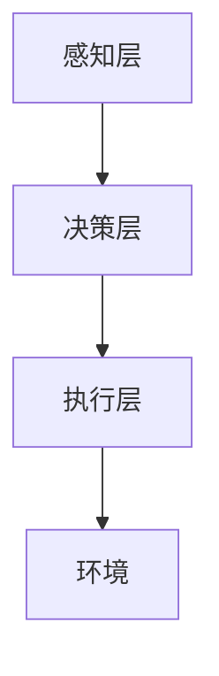
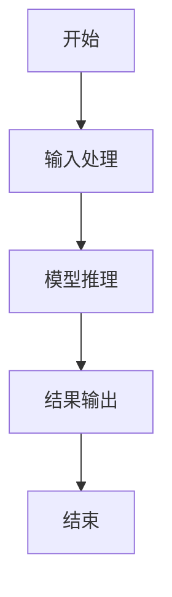
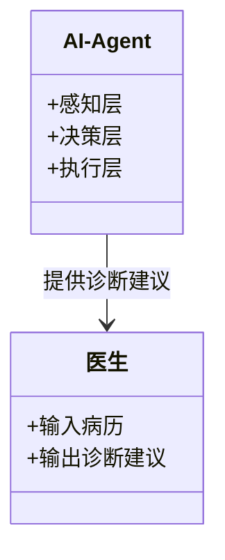
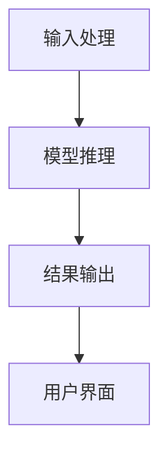
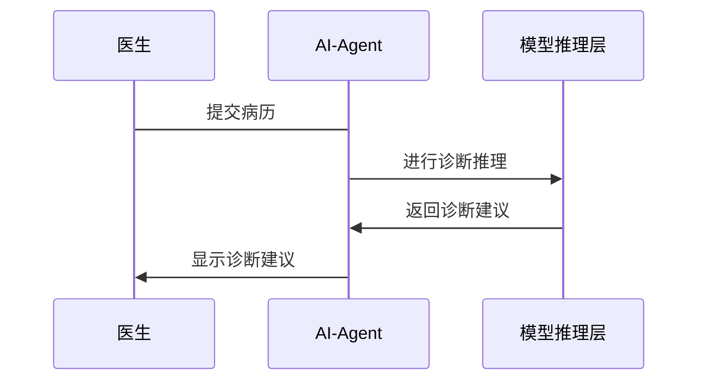

                 


# 构建具有人机协作能力的AI Agent系统

## 关键词：AI Agent, 人机协作, 智能体系统, 算法原理, 系统架构, 项目实战

## 摘要：  
本文详细探讨了构建具有人机协作能力的AI Agent系统的各个方面，从核心概念到算法实现，从系统架构到项目实战，为读者提供全面的指导。文章首先介绍了AI Agent的基本概念和人机协作的重要性，然后深入讲解了AI Agent的核心算法和体系结构，接着通过实际项目展示了如何将理论应用到实践中。最后，总结了最佳实践和未来发展趋势。

---

# 第一部分: AI Agent系统背景与概念

## 第1章: AI Agent系统背景与概念

### 1.1 人机协作的基本概念

#### 1.1.1 人机协作的定义与特点
人机协作是指人类与机器之间通过互动和合作，共同完成任务的过程。其特点包括：
- **互补性**：人类与机器在能力上互相补充。
- **实时性**：协作过程需要实时互动。
- **智能性**：机器能够理解并响应人类的需求。

#### 1.1.2 人机协作的核心要素
- **交互界面**：提供人与机器之间的沟通渠道。
- **任务分解**：将任务分解为人与机器的协同部分。
- **反馈机制**：实时反馈协作效果，以便调整策略。

#### 1.1.3 人机协作的背景与发展趋势
随着人工智能技术的进步，人机协作在各个领域（如医疗、教育、金融）的应用越来越广泛。趋势包括：
- **智能化**：机器越来越智能，能够处理复杂任务。
- **个性化**：协作系统能够根据用户需求定制服务。
- **无缝化**：协作过程更加自然，用户感受更佳。

### 1.2 AI Agent系统的定义与特点

#### 1.2.1 AI Agent的基本概念
AI Agent（智能体）是指能够感知环境、自主决策并执行任务的实体。其特点包括：
- **自主性**：无需外部干预，自主完成任务。
- **反应性**：能够实时感知环境变化并调整行为。
- **目标导向**：所有行为都以实现目标为导向。

#### 1.2.2 AI Agent的核心能力
- **感知能力**：通过传感器或数据输入感知环境。
- **决策能力**：基于感知信息做出决策。
- **执行能力**：通过执行机构完成任务。

#### 1.2.3 AI Agent与传统自动化的区别
传统自动化依赖预设规则，而AI Agent具备学习和适应能力，能够处理复杂和动态的环境。

### 1.3 人机协作在AI Agent中的作用

#### 1.3.1 人机协作的必要性
AI Agent在复杂任务中可能需要人类的介入，尤其是在需要伦理判断或创造性思维的领域。

#### 1.3.2 人机协作的优势与挑战
- **优势**：结合人类的创造力和机器的高效性。
- **挑战**：协作过程中可能出现信息不对称和协调困难。

#### 1.3.3 人机协作的应用场景
- **医疗领域**：AI Agent辅助医生进行诊断和治疗方案设计。
- **金融领域**：AI Agent与人类分析师合作进行投资决策。
- **教育领域**：AI Agent作为虚拟助教，辅助教师进行教学。

### 1.4 本章小结
本章介绍了人机协作的基本概念、核心要素以及AI Agent系统的定义和特点。通过分析人机协作的优势与挑战，为后续章节的深入讨论奠定了基础。

---

# 第二部分: AI Agent系统的核心概念与原理

## 第2章: AI Agent的核心概念与体系结构

### 2.1 AI Agent的体系结构

#### 2.1.1 分层架构
AI Agent的体系结构通常分为感知层、决策层和执行层：
- **感知层**：负责数据的采集和处理。
- **决策层**：基于感知数据进行推理和决策。
- **执行层**：根据决策结果执行具体操作。

#### 2.1.2 模块化设计
模块化设计使得AI Agent系统更加灵活和易于维护。常见的模块包括：
- **输入处理模块**：接收来自环境的输入数据。
- **模型推理模块**：对输入数据进行分析和推理。
- **输出执行模块**：根据推理结果执行相应的操作。

#### 2.1.3 组件之间的关系
各组件之间的关系可以通过Mermaid图表示：



### 2.2 AI Agent的能力模型

#### 2.2.1 感知能力
AI Agent需要具备感知环境的能力，这通常通过传感器或数据输入接口实现。

#### 2.2.2 决策能力
决策能力是AI Agent的核心，通常基于概率论和强化学习算法。

#### 2.2.3 执行能力
执行能力是AI Agent将决策转化为具体行动的能力。

### 2.3 人机协作的机制

#### 2.3.1 交互模型
交互模型描述了人与AI Agent之间的互动方式，通常包括：
- **输入输出接口**：用户通过键盘、语音或图形界面与AI Agent交互。
- **反馈机制**：AI Agent根据用户的输入做出反馈。

#### 2.3.2 协作流程
协作流程通常包括任务分解、协同执行和结果反馈三个阶段。

#### 2.3.3 状态管理
状态管理确保AI Agent能够实时感知和调整协作过程中的状态变化。

### 2.4 本章小结
本章详细探讨了AI Agent的体系结构和能力模型，分析了人机协作的机制和流程。通过Mermaid图和表格的形式，帮助读者更好地理解各部分之间的关系。

---

# 第三部分: AI Agent系统的算法与数学模型

## 第3章: AI Agent的核心算法原理

### 3.1 大模型在AI Agent中的应用

#### 3.1.1 大模型的基本原理
大模型通常基于Transformer架构，通过自注意力机制和前馈网络实现强大的语言处理能力。

#### 3.1.2 大模型的训练过程
训练过程包括数据预处理、模型初始化、正向传播、反向传播和参数更新。

#### 3.1.3 大模型的推理机制
推理过程包括输入处理、编码、解码和输出生成。

### 3.2 AI Agent的决策算法

#### 3.2.1 基于规则的决策
基于规则的决策算法通过预设的规则库进行决策，适用于任务简单、规则明确的场景。

#### 3.2.2 基于概率的决策
基于概率的决策算法通过计算各种可能结果的概率，选择概率最高的行动。

#### 3.2.3 基于强化学习的决策
强化学习通过奖惩机制，训练AI Agent在复杂环境中做出最优决策。

### 3.3 人机协作的算法实现

#### 3.3.1 交互式算法
交互式算法通过实时互动，动态调整协作策略。

#### 3.3.2 联合推理算法
联合推理算法结合人机双方的推理过程，共同得出最优解决方案。

#### 3.3.3 实时协作算法
实时协作算法通过高效的通信机制，确保协作过程的实时性和准确性。

### 3.4 算法流程图（Mermaid）



### 3.5 算法实现代码示例

#### 3.5.1 大模型训练代码
```python
import torch
import torch.nn as nn

class TransformerModel(nn.Module):
    def __init__(self):
        super(TransformerModel, self).__init__()
        # 定义编码器和解码器层
        self.encoder = nn.TransformerEncoder(...)
        self.decoder = nn.TransformerDecoder(...)

    def forward(self, x):
        encoded = self.encoder(x)
        decoded = self.decoder(encoded)
        return decoded

# 初始化模型和优化器
model = TransformerModel()
optimizer = torch.optim.Adam(model.parameters(), lr=0.001)
criterion = nn.CrossEntropyLoss()

# 训练过程
for epoch in range(num_epochs):
    for batch in batches:
        outputs = model(batch)
        loss = criterion(outputs, targets)
        optimizer.zero_grad()
        loss.backward()
        optimizer.step()
```

#### 3.5.2 决策算法实现
```python
def decide_action(state):
    # 基于概率的决策
    probabilities = model.predict(state)
    action = torch.multinomial(probabilities, 1).item()
    return action
```

### 3.6 数学公式

#### 3.6.1 Transformer模型的注意力机制
$$\text{Attention}(Q, K, V) = \text{softmax}\left(\frac{QK^T}{\sqrt{d_k}}\right)V$$

#### 3.6.2 强化学习中的策略梯度
$$\nabla \theta = \frac{1}{M}\sum_{i=1}^{M} \nabla \log \pi_\theta(a_i|s_i) Q(s_i, a_i)$$

### 3.7 本章小结
本章详细讲解了大模型在AI Agent中的应用，以及各种决策算法的实现原理。通过代码示例和数学公式，帮助读者理解算法的实现细节。

---

# 第四部分: AI Agent系统的系统架构设计

## 第4章: AI Agent系统的系统架构设计

### 4.1 问题场景介绍
我们以一个医疗诊断辅助系统为例，设计一个AI Agent的系统架构。

### 4.2 系统功能设计

#### 4.2.1 领域模型设计
领域模型描述了系统中各实体及其关系。通过Mermaid类图表示：



### 4.3 系统架构设计

#### 4.3.1 系统架构图
系统架构图通过Mermaid表示：



#### 4.3.2 系统接口设计
系统接口设计包括：
- **输入接口**：接收医生的输入数据。
- **输出接口**：将诊断建议返回给医生。

#### 4.3.3 系统交互流程
系统交互流程通过Mermaid序列图表示：



### 4.4 本章小结
本章通过医疗诊断系统的案例，详细讲解了AI Agent系统的系统架构设计。通过类图、架构图和序列图，帮助读者更好地理解系统的各个部分。

---

# 第五部分: AI Agent系统的项目实战

## 第5章: 项目实战

### 5.1 环境安装
项目需要以下环境：
- **Python 3.8以上版本**
- **TensorFlow或PyTorch框架**
- **Jupyter Notebook**

### 5.2 系统核心实现

#### 5.2.1 输入处理模块
```python
def process_input(input_data):
    # 对输入数据进行预处理
    processed_data = preprocess(input_data)
    return processed_data
```

#### 5.2.2 模型推理模块
```python
def model_inference(processed_data):
    # 使用预训练模型进行推理
    output = model.predict(processed_data)
    return output
```

#### 5.2.3 输出执行模块
```python
def execute_output(output):
    # 根据输出结果执行相应操作
    if output == 'action1':
        execute_action1()
    elif output == 'action2':
        execute_action2()
```

### 5.3 代码应用解读与分析
通过上述代码，我们可以看到AI Agent系统的实现流程：输入处理 -> 模型推理 -> 结果输出。

### 5.4 实际案例分析
以医疗诊断系统为例，输入病历数据，AI Agent进行诊断推理，输出诊断建议。

### 5.5 项目小结
本章通过实际项目展示了AI Agent系统的实现过程，从环境搭建到代码实现，帮助读者掌握理论知识。

---

# 第六部分: 最佳实践与未来展望

## 第6章: 最佳实践与未来展望

### 6.1 最佳实践

#### 6.1.1 设计原则
- **模块化**：确保系统各部分独立可替换。
- **可扩展性**：系统应具备扩展能力，以适应未来需求。

#### 6.1.2 开发注意事项
- **数据安全**：确保用户数据的安全性和隐私性。
- **用户体验**：注重人机交互的友好性，提升用户体验。

### 6.2 未来展望

#### 6.2.1 前沿技术
- **多模态学习**：结合视觉、听觉等多种感知方式，提升AI Agent的能力。
- **边缘计算**：在边缘设备上部署AI Agent，减少延迟和带宽消耗。

#### 6.2.2 未来趋势
- **智能化升级**：AI Agent将更加智能，具备更强的自主决策能力。
- **人机协作深化**：协作过程将更加无缝化和个性化。

### 6.3 本章小结
本章总结了开发AI Agent系统时的最佳实践，并展望了未来的发展趋势，帮助读者更好地应对未来的挑战和机遇。

---

# 总结

通过本文的详细讲解，读者可以系统地掌握构建具有人机协作能力的AI Agent系统的各个方面。从核心概念到算法实现，从系统架构到项目实战，每一步都进行了深入的探讨。希望本文能为读者提供有价值的指导，帮助他们在实际项目中取得成功。

