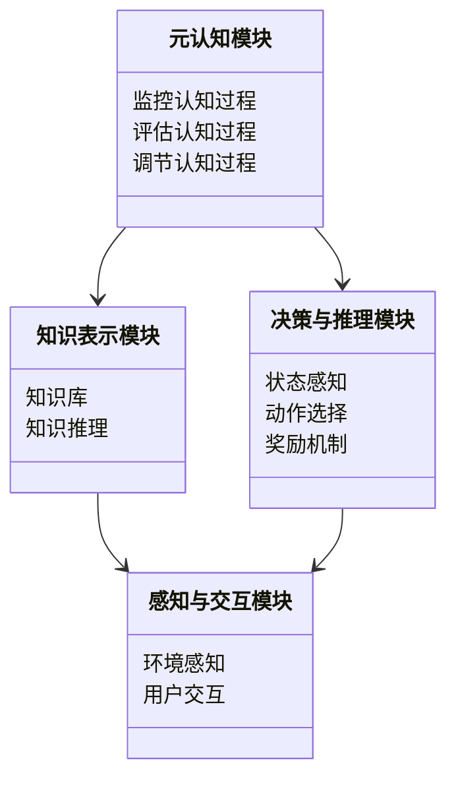
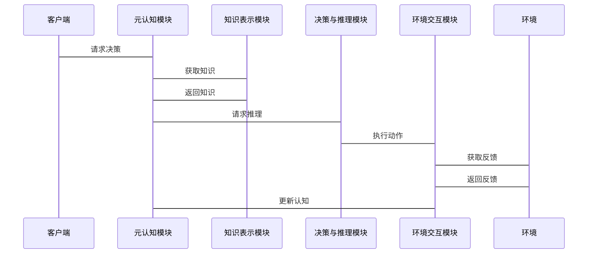

                 


# 构建具有元认知能力的AI Agent

## 关键词
- 元认知能力，AI Agent，算法原理，系统架构，项目实战

## 摘要
本文详细探讨了构建具有元认知能力的AI Agent的关键技术，从元认知能力的基本概念到AI Agent的系统架构设计，再到具体的项目实现，全面解析了如何赋予AI Agent自我认知和优化的能力。文章首先介绍了元认知能力与AI Agent的核心概念，然后深入分析了相关的算法原理，包括元学习和强化学习的实现细节。接下来，通过系统架构设计和接口设计，展示了如何将元认知能力整合到AI Agent中。最后，通过项目实战部分，详细讲解了如何从环境搭建到代码实现，构建一个具有元认知能力的AI Agent，并通过实际案例进行了分析和测试。

---

# 第1章 元认知能力与AI Agent的背景介绍

## 1.1 元认知能力的基本概念
### 1.1.1 元认知的定义与特征
元认知（Metacognition）是指个体对自身认知过程的认知和调控能力。它包括对认知过程的监控、评估和调节。元认知的核心特征包括自我监控、自我评估和自我调节。

### 1.1.2 元认知能力的核心要素
元认知能力由三个核心要素组成：
1. **认知过程监控**：对当前认知过程的实时监控，例如注意力分配、信息处理方式等。
2. **认知过程评估**：对认知过程的 effectiveness 进行评估，判断当前策略的有效性。
3. **认知过程调节**：根据评估结果调整认知策略，优化后续的认知过程。

### 1.1.3 元认知与AI Agent的关系
AI Agent需要具备元认知能力，以便在复杂环境中自主决策、学习和适应。元认知能力使AI Agent能够监控自己的决策过程，评估当前策略的有效性，并在必要时调整行为。

---

## 1.2 AI Agent的基本概念
### 1.2.1 AI Agent的定义与分类
AI Agent是一种智能体，能够感知环境、自主决策并执行任务。根据智能水平，AI Agent可以分为反应式智能体、基于模型的智能体和混合智能体。

### 1.2.2 AI Agent的核心功能
AI Agent的核心功能包括感知、推理、决策和执行。这些功能使AI Agent能够与环境交互并完成特定任务。

### 1.2.3 AI Agent的发展历程
AI Agent的发展经历了从简单的行为反应式智能体到具备复杂推理和学习能力的智能体的演变。

---

## 1.3 元认知能力在AI Agent中的应用
### 1.3.1 元认知能力对AI Agent的提升作用
元认知能力使AI Agent能够更好地监控和优化自身的决策过程，提高任务执行的效率和准确性。

### 1.3.2 元认知能力在AI Agent中的实现方式
通过元学习算法和强化学习方法，可以实现AI Agent的元认知能力。

### 1.3.3 元认知能力在AI Agent中的应用场景
元认知能力在复杂任务规划、动态环境适应和多智能体协作等领域具有重要应用。

---

## 1.4 本章小结
本章介绍了元认知能力的基本概念、核心要素及其在AI Agent中的应用。元认知能力是AI Agent实现自主决策和优化的关键能力。

---

# 第2章 元认知能力与AI Agent的核心概念分析

## 2.1 元认知能力的核心原理
### 2.1.1 元认知的层次结构
元认知包括元认知知识、元认知体验和元认知调控三个层次。

### 2.1.2 元认知的执行过程
元认知的执行过程包括初始监控、评估和调节三个阶段。

### 2.1.3 元认知的评估机制
元认知的评估机制通过比较当前策略与预期目标的差异，调整认知策略。

---

## 2.2 AI Agent的核心功能模块
### 2.2.1 知识表示模块
知识表示模块负责将环境信息表示为可处理的形式，例如知识图谱或向量表示。

### 2.2.2 感知与交互模块
感知与交互模块负责与环境交互，获取感知信息并执行动作。

### 2.2.3 决策与推理模块
决策与推理模块基于感知信息和内部知识，进行推理和决策。

---

## 2.3 元认知能力与AI Agent的结合
### 2.3.1 元认知能力对AI Agent决策的影响
元认知能力使AI Agent能够监控和优化决策过程，提高决策的准确性和效率。

### 2.3.2 元认知能力对AI Agent学习的促进作用
元认知能力使AI Agent能够更有效地学习和适应新任务。

### 2.3.3 元认知能力对AI Agent自适应能力的提升
元认知能力使AI Agent能够根据环境变化动态调整行为策略。

---

## 2.4 核心概念对比分析
### 2.4.1 元认知能力与传统AI能力的对比
通过表格对比元认知能力与传统AI能力的异同点。

### 2.4.2 元认知能力与机器学习算法的对比
通过表格对比元认知能力与机器学习算法的异同点。

### 2.4.3 元认知能力与强化学习的对比
通过表格对比元认知能力与强化学习的异同点。

---

## 2.5 本章小结
本章分析了元认知能力与AI Agent的核心概念及其相互关系，为后续章节的算法实现和系统设计奠定了理论基础。

---

# 第3章 元认知能力的算法原理

## 3.1 元学习算法
### 3.1.1 元学习的基本概念
元学习（Meta-Learning）是一种通过在多个任务上学习，以快速适应新任务的学习方法。

### 3.1.2 元学习的数学模型
元学习的数学模型包括元学习器和任务学习器，元学习器通过参数更新优化任务学习器的性能。

### 3.1.3 元学习的算法流程
元学习算法流程包括任务采样、任务学习器训练、元学习器更新和任务执行。

### 3.1.4 元学习的优缺点
元学习的优点包括快速适应新任务和减少数据需求，缺点包括对任务分布的敏感性和算法复杂性。

---

## 3.2 强化学习算法
### 3.2.1 强化学习的基本概念
强化学习是一种通过与环境交互，学习最优策略的方法。

### 3.2.2 强化学习的数学模型
强化学习的数学模型包括状态、动作、奖励和策略。

### 3.2.3 强化学习的算法流程
强化学习算法流程包括状态感知、动作选择、奖励获取和策略更新。

### 3.2.4 强化学习的优缺点
强化学习的优点包括自主学习和适应性，缺点包括收敛速度慢和样本效率低。

---

## 3.3 元认知能力的算法实现
### 3.3.1 元学习与强化学习的结合
通过结合元学习和强化学习，可以实现具有元认知能力的AI Agent。

### 3.3.2 元学习算法的实现步骤
1. 初始化元学习器和任务学习器的参数。
2. 采样多个任务，训练任务学习器。
3. 使用任务学习器的梯度更新元学习器。
4. 重复上述步骤，优化元学习器的性能。

### 3.3.3 元认知能力的评估指标
评估元认知能力的指标包括任务适应速度、决策准确性和学习效率。

---

## 3.4 本章小结
本章详细介绍了元学习和强化学习的算法原理，并探讨了如何结合这两种算法实现具有元认知能力的AI Agent。

---

# 第4章 元认知能力的系统分析与架构设计

## 4.1 系统分析
### 4.1.1 问题场景介绍
构建具有元认知能力的AI Agent需要解决的任务包括复杂环境中的自主决策和动态适应。

### 4.1.2 项目介绍
本项目旨在设计和实现一个具有元认知能力的AI Agent，使其能够在复杂环境中自主优化行为策略。

---

## 4.2 系统功能设计
### 4.2.1 领域模型设计
通过mermaid类图展示AI Agent的各个功能模块及其相互关系。



---

### 4.2.2 系统架构设计
通过mermaid架构图展示AI Agent的整体架构，包括前端和后端模块。


---

### 4.2.3 系统接口设计
系统接口设计包括元认知模块与知识表示模块的接口、元认知模块与决策与推理模块的接口，以及感知与交互模块与环境的接口。

---

### 4.2.4 系统交互设计
通过mermaid序列图展示系统交互流程。



---

## 4.3 本章小结
本章通过系统分析与架构设计，展示了如何将元认知能力整合到AI Agent中，为后续的项目实现奠定了基础。

---

# 第5章 元认知能力的项目实战

## 5.1 环境安装
### 5.1.1 开发环境选择
推荐使用Python 3.8及以上版本，安装必要的库，如TensorFlow、Keras和numpy。

### 5.1.2 环境配置
配置虚拟环境并安装所需依赖。

---

## 5.2 系统核心实现
### 5.2.1 元认知模块的实现
实现元认知模块的核心功能，包括认知过程监控、评估和调节。

### 5.2.2 知识表示模块的实现
使用知识图谱或向量表示实现知识表示模块。

### 5.2.3 决策与推理模块的实现
基于强化学习算法实现决策与推理模块。

### 5.2.4 环境交互模块的实现
实现与环境的交互接口，获取感知信息并执行动作。

---

## 5.3 代码实现与解读
### 5.3.1 元认知模块的代码实现
```python
class MetaCognition:
    def __init__(self):
        self.monitor = Monitor()
        self.evaluater = Evaluater()
        self.regulator = Regulator()
```

### 5.3.2 知识表示模块的代码实现
```python
class KnowledgeRepresentation:
    def __init__(self):
        self.knowledge_base = {}
```

### 5.3.3 决策与推理模块的代码实现
```python
class DecisionAndReasoning:
    def __init__(self):
        self.state = None
        self.action = None
```

---

## 5.4 项目测试与优化
### 5.4.1 系统测试
通过测试用例验证系统的功能和性能。

### 5.4.2 性能优化
针对系统中的瓶颈进行优化，例如优化元认知模块的监控效率。

---

## 5.5 本章小结
本章通过项目实战展示了如何将元认知能力整合到AI Agent中，并通过具体的代码实现和测试验证了系统的有效性。

---

# 第6章 总结与展望

## 6.1 总结
本文详细探讨了构建具有元认知能力的AI Agent的关键技术，从理论到实践，全面解析了元认知能力在AI Agent中的实现和应用。

## 6.2 展望
未来的研究方向包括更复杂的元学习算法、多智能体协作中的元认知应用以及元认知能力的实时监控与优化。

---

# 参考文献
（此处列出相关的参考文献）

---

通过以上目录和内容，我们可以系统地构建一个具有元认知能力的AI Agent，从理论分析到实际实现，全面解析了元认知能力在AI Agent中的重要性和实现方法。

