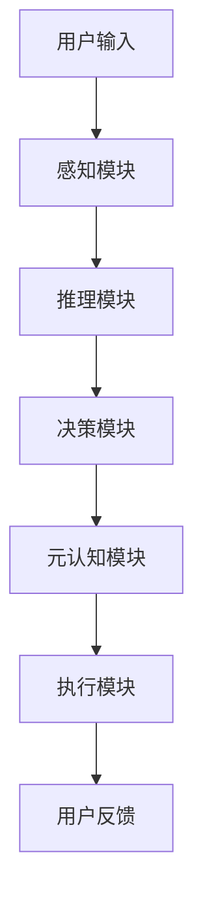
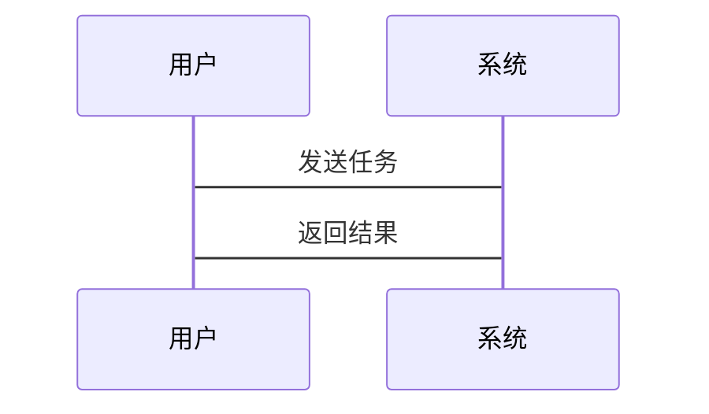

                 


# 构建具有元认知能力的AI Agent

> 关键词：元认知能力，AI Agent，元学习，算法原理，系统架构，项目实战

> 摘要：本文将深入探讨如何构建具有元认知能力的AI Agent。通过分析元认知能力的核心概念、算法原理和系统架构，结合实际案例，展示如何实现一个具备自我监控和自我调节能力的智能系统。从理论到实践，逐步解析构建过程中的关键点和最佳实践。

---

# 第一部分: 元认知能力与AI Agent的背景介绍

# 第1章: 元认知能力与AI Agent概述

## 1.1 元认知能力的定义与特点
### 1.1.1 元认知的定义
元认知（Metacognition）指的是“对认知的认知”，即个体对自身认知过程的认知和调控能力。元认知能力包括对自身认知状态的监控、评估和调节能力。

### 1.1.2 元认知的核心特点
- **自我监控**：能够实时监控自身的认知过程。
- **自我调节**：根据监控结果调整认知策略。
- **元知识**：关于认知过程的知识，如记忆策略、问题解决方法。

### 1.1.3 元认知与传统认知的区别
| 特性 | 元认知 | 传统认知 |
|------|--------|----------|
| 对象 | 认知过程 | 问题解决、信息处理 |
| 功能 | 监控和调节 | 获取和处理信息 |
| 层次 | 第二层 | 第一层 |

## 1.2 AI Agent的基本概念
### 1.2.1 AI Agent的定义
AI Agent（人工智能代理）是指能够感知环境、自主决策并执行任务的智能实体。AI Agent可以是软件程序、机器人或其他智能系统。

### 1.2.2 AI Agent的核心功能
- **感知**：通过传感器或数据输入感知环境。
- **推理**：基于感知信息进行逻辑推理。
- **决策**：根据推理结果做出最优决策。
- **执行**：执行决策并输出结果。

### 1.2.3 AI Agent与传统程序的区别
| 特性 | AI Agent | 传统程序 |
|------|-----------|-----------|
| 智能性 | 高 | 低 |
| 自主性 | 高 | 低 |
| 学习能力 | 支持 | 不支持 |

## 1.3 元认知能力在AI Agent中的作用
### 1.3.1 元认知能力的必要性
- 提高AI Agent的自适应能力。
- 支持复杂环境中的决策优化。
- 提升系统的容错性和鲁棒性。

### 1.3.2 元认知能力对AI Agent性能的提升
- 更强的环境适应能力。
- 更高效的资源分配和任务执行。
- 更好的错误检测和纠正能力。

### 1.3.3 元认知能力的实现方式
- **自我监控**：实时监控自身的决策过程。
- **自我评估**：评估当前决策的正确性和效果。
- **自我调节**：根据评估结果调整决策策略。

## 1.4 本章小结
本章介绍了元认知能力的基本概念和特点，并对比了传统认知和元认知的区别。同时，详细阐述了AI Agent的核心功能及其与传统程序的区别，最后分析了元认知能力在AI Agent中的重要作用和实现方式。

---

# 第二部分: 元认知AI Agent的核心概念与联系

# 第2章: 元认知AI Agent的核心概念

## 2.1 元认知模型的构建
### 2.1.1 元认知模型的定义
元认知模型是对元认知过程的抽象和建模，通常包括自我监控、自我评估和自我调节三个模块。

### 2.1.2 元认知模型的属性特征对比表
| 属性 | 自我监控 | 自我评估 | 自我调节 |
|------|----------|----------|----------|
| 功能 | 监控认知过程 | 评估认知结果 | 调节认知策略 |
| 输入 | 认知过程信息 | 认知结果信息 | 认知策略信息 |
| 输出 | 监控信号 | 评估结果 | 调节信号 |

### 2.1.3 元认知模型的ER实体关系图
```mermaid
er
actor: 元认知模型
属性: 监控信号, 评估结果, 调节信号
```

## 2.2 元学习机制的原理
### 2.2.1 元学习的定义
元学习（Meta-Learning）是指通过学习如何学习来提高学习效率和效果的过程。

### 2.2.2 元学习的核心算法
元学习的核心算法包括元学习器（meta-learner）和任务学习器（task-learner）两个部分。

### 2.2.3 元学习与传统学习的区别
| 特性 | 元学习 | 传统学习 |
|------|--------|----------|
| 学习目标 | 学习如何学习 | 学习具体任务 |
| 数据需求 | 少量数据 | 大量数据 |
| 适用场景 | 高度相似的任务 | 不同的任务 |

## 2.3 元认知AI Agent的系统架构
### 2.3.1 元认知AI Agent的模块划分
- **感知模块**：负责环境感知和数据输入。
- **推理模块**：负责逻辑推理和问题解决。
- **决策模块**：负责决策制定和策略选择。
- **元认知模块**：负责自我监控和自我调节。

### 2.3.2 元认知AI Agent的交互流程


### 2.3.3 元认知AI Agent的通信机制
- **内部通信**：模块之间的信息传递和协同工作。
- **外部通信**：与外部环境或用户的交互。

## 2.4 本章小结
本章详细介绍了元认知模型的构建、元学习机制的原理以及元认知AI Agent的系统架构。通过对比分析和ER实体关系图，帮助读者更好地理解元认知能力在AI Agent中的应用。

---

# 第三部分: 元认知AI Agent的算法原理

# 第3章: 元认知模型的算法实现

## 3.1 元学习算法的概述
### 3.1.1 元学习算法的定义
元学习算法是一种通过元学习器和任务学习器的协同工作来实现高效学习的算法。

### 3.1.2 元学习算法的核心思想
通过元学习器对多个任务学习器进行优化，提高整体学习效率和效果。

### 3.1.3 元学习算法的分类
- **基于梯度的元学习算法**：如Meta-SGD。
- **基于模型的元学习算法**：如MAML。

## 3.2 元学习算法的数学模型
### 3.2.1 元学习算法的数学表达式
$$ \text{Meta-Learner} = \arg\min_{\theta} \sum_{i=1}^{N} \mathcal{L}_i(\theta) $$
其中，$\theta$ 是元学习器的参数，$\mathcal{L}_i$ 是任务学习器的损失函数。

### 3.2.2 元学习算法的优化方法
- **Adam优化器**：常用于元学习算法的参数优化。
- **梯度下降**：基本的优化方法。

### 3.2.3 元学习算法的收敛性分析
通过数学推导和实验验证，分析元学习算法的收敛性。

## 3.3 元学习算法的实现步骤
### 3.3.1 数据预处理
对输入数据进行清洗和标准化处理。

### 3.3.2 模型初始化
初始化元学习器和任务学习器的参数。

### 3.3.3 元学习过程
通过优化元学习器的参数，优化任务学习器的性能。

### 3.3.4 模型优化
使用优化算法对模型参数进行调整，提高整体性能。

## 3.4 本章小结
本章详细讲解了元学习算法的数学模型和优化方法，通过具体的实现步骤帮助读者理解如何构建元认知模型。

---

# 第四部分: 元认知AI Agent的系统架构与设计

# 第4章: 元认知AI Agent的系统架构

## 4.1 系统功能设计
### 4.1.1 系统功能模块划分
- **感知模块**：负责环境感知和数据输入。
- **推理模块**：负责逻辑推理和问题解决。
- **决策模块**：负责决策制定和策略选择。
- **元认知模块**：负责自我监控和自我调节。

### 4.1.2 系统功能流程图


### 4.1.3 系统功能的交互设计
- **用户输入**：通过界面或API输入任务。
- **系统反馈**：系统根据输入做出响应。

## 4.2 系统架构设计
### 4.2.1 系统架构的层次划分
- **数据层**：存储和管理数据。
- **算法层**：实现元认知模型的算法。
- **应用层**：实现系统功能和用户交互。

### 4.2.2 系统架构的通信机制
- **内部通信**：模块之间的信息传递。
- **外部通信**：与外部环境或用户的交互。

## 4.3 系统接口设计
### 4.3.1 系统接口的功能描述
- **输入接口**：接收用户输入的任务。
- **输出接口**：输出系统处理结果。

### 4.3.2 系统接口的交互流程


## 4.4 本章小结
本章详细介绍了元认知AI Agent的系统架构设计，包括功能模块划分、通信机制和接口设计，帮助读者理解如何构建一个完整的元认知AI Agent系统。

---

# 第五部分: 项目实战与案例分析

# 第5章: 元认知AI Agent的项目实战

## 5.1 项目背景与目标
### 5.1.1 项目背景
介绍项目的背景和应用场景，如智能助手、自动驾驶等。

### 5.1.2 项目目标
通过实现一个具有元认知能力的AI Agent，展示其在实际应用中的优势。

## 5.2 项目环境与工具
### 5.2.1 环境安装
安装必要的开发工具和库，如Python、TensorFlow等。

### 5.2.2 工具配置
配置开发环境，如安装Python包、设置虚拟环境等。

## 5.3 项目核心实现
### 5.3.1 元认知模型的实现
通过Python代码实现元认知模型的核心算法。

```python
import tensorflow as tf

# 元学习器定义
def metalearner():
    # 定义元学习器的网络结构
    pass

# 任务学习器定义
def tasklearner():
    # 定义任务学习器的网络结构
    pass

# 元学习过程
def meta_learning():
    # 优化元学习器的参数，优化任务学习器的性能
    pass
```

### 5.3.2 系统功能的实现
实现AI Agent的感知、推理、决策和元认知功能。

## 5.4 项目案例分析
### 5.4.1 案例背景
介绍具体案例的背景和应用场景。

### 5.4.2 案例实现
通过具体案例展示元认知AI Agent的实现过程和效果。

## 5.5 项目小结
总结项目的实现过程和取得的成果，分析存在的问题和改进方向。

## 5.6 本章小结
本章通过具体的项目实战，展示了如何实现一个具有元认知能力的AI Agent，并通过案例分析验证了其有效性和实用性。

---

# 第六部分: 总结与展望

# 第6章: 元认知AI Agent的总结与展望

## 6.1 元认知能力的实现总结
总结元认知能力在AI Agent中的实现过程和关键点。

## 6.2 元认知AI Agent的应用前景
探讨元认知AI Agent在各个领域的应用前景和潜力。

## 6.3 未来研究方向
提出未来在元认知AI Agent领域的研究方向和挑战。

## 6.4 本章小结
本章总结了元认知AI Agent的实现过程和应用前景，并展望了未来的研究方向。

---

# 总结

通过本文的详细讲解，读者可以全面了解如何构建具有元认知能力的AI Agent。从理论到实践，从算法到系统架构，再到项目实战，本文为读者提供了完整的构建过程和实用的实现方案。未来，随着技术的不断发展，元认知AI Agent将在更多领域展现出其强大的潜力和应用价值。

