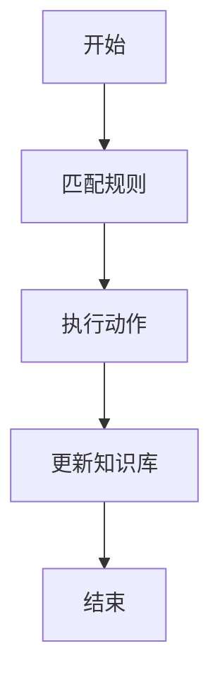
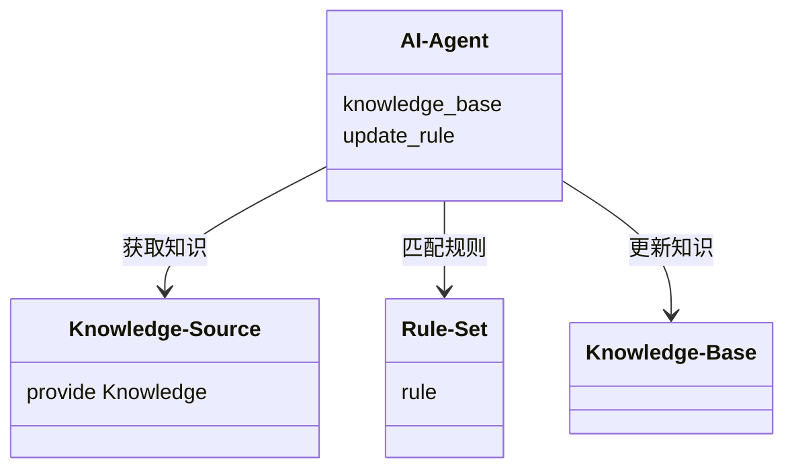

                 


# 构建具有动态知识更新能力的AI Agent

> 关键词：AI Agent，动态知识更新，知识表示，知识融合，知识推理

> 摘要：构建一个能够实时动态更新知识的AI Agent是实现智能化系统的核心挑战。本文系统阐述了动态知识更新AI Agent的核心概念、算法原理、系统架构及实现方法，并通过实际案例展示了如何构建这样一个系统。我们从动态知识更新的背景出发，深入分析了知识表示、知识获取、知识融合和知识推理的关键技术，提出了基于规则的动态知识更新机制，并结合具体案例详细介绍了系统的实现过程。

---

# 第一部分: AI Agent概述

## 第1章: AI Agent的基本概念

### 1.1 动态知识更新能力的定义

动态知识更新能力是指AI Agent能够根据新的输入数据或环境变化，实时更新其知识库或推理模型的能力。这种能力使得AI Agent能够适应不断变化的环境，并持续优化其决策和执行能力。

### 1.2 AI Agent的类型

AI Agent可以分为以下几类：

1. **简单反射型AI Agent**：基于预定义规则进行简单决策，无法动态更新知识。
2. **基于模型的AI Agent**：维护内部状态模型，能够根据新信息更新模型。
3. **基于学习的AI Agent**：通过机器学习算法不断优化其知识或模型。
4. **人机协作型AI Agent**：与人类协同工作，能够动态调整知识库以适应人类反馈。

### 1.3 动态知识更新的重要性

动态知识更新能力是AI Agent适应复杂环境的核心能力。例如，在智能客服系统中，AI Agent需要根据用户的实时反馈动态更新其知识库，以提供更精准的服务。

---

# 第二部分: 动态知识更新的核心概念与联系

## 第2章: 动态知识更新的机制

### 2.1 知识表示

知识表示是动态知识更新的基础。常见的知识表示方法包括：

1. **符号表示**：使用符号逻辑表示知识，例如谓词逻辑。
2. **向量表示**：使用向量空间模型表示知识，例如Word2Vec。
3. **图表示**：使用图结构表示知识，例如知识图谱。

### 2.2 知识获取

知识获取是动态知识更新的第一步。获取知识的渠道包括：

1. **结构化数据**：例如数据库中的表格数据。
2. **非结构化数据**：例如文本、图像等。
3. **实时数据流**：例如传感器数据或用户实时输入。

### 2.3 知识融合

知识融合是将多源知识整合的过程。常用的知识融合方法包括：

1. **基于规则的融合**：根据预定义规则合并知识。
2. **基于概率的融合**：利用概率模型进行知识融合。
3. **基于图的融合**：利用图结构进行知识融合。

### 2.4 知识推理

知识推理是基于知识库进行推理的过程。常用的推理方法包括：

1. **基于规则的推理**：根据预定义规则进行推理。
2. **基于逻辑的推理**：利用逻辑推理进行推导。
3. **基于机器学习的推理**：利用机器学习模型进行推理。

---

# 第三部分: 动态知识更新的算法原理

## 第3章: 动态知识更新的算法实现

### 3.1 基于规则的动态知识更新算法

#### 3.1.1 算法原理

基于规则的动态知识更新算法是一种简单有效的知识更新方法。其基本原理如下：

1. **知识表示**：将知识表示为符号逻辑形式。
2. **规则匹配**：根据新知识匹配预定义规则。
3. **知识更新**：根据匹配规则更新知识库。

#### 3.1.2 算法实现

以下是一个基于规则的动态知识更新算法的伪代码示例：

```python
def update_knowledge_base(rule_set, newKnowledge):
    for rule in rule_set:
        if rule.condition.match(newKnowledge):
            rule.action.apply(rule_set, newKnowledge)
            break
```

#### 3.1.3 算法流程图



---

# 第四部分: 动态知识更新的系统架构设计

## 第4章: 动态知识更新系统的架构

### 4.1 系统模块划分

动态知识更新系统可以划分为以下几个模块：

1. **知识获取模块**：负责获取新知识。
2. **知识融合模块**：负责将多源知识进行融合。
3. **知识推理模块**：负责基于知识库进行推理。
4. **知识更新模块**：负责更新知识库。

### 4.2 系统架构图



---

# 第五部分: 动态知识更新的项目实战

## 第5章: 动态知识更新系统的实现

### 5.1 项目背景

本项目旨在开发一个能够动态更新知识的AI Agent，用于智能问答系统。

### 5.2 项目实现

#### 5.2.1 环境安装

```bash
pip install numpy
pip install networkx
```

#### 5.2.2 核心代码实现

```python
class KnowledgeAgent:
    def __init__(self, knowledge_base):
        self.knowledge_base = knowledge_base

    def update_knowledge(self, newKnowledge, rule_set):
        for rule in rule_set:
            if rule.matches(newKnowledge):
                rule.apply(self.knowledge_base, newKnowledge)
                break

class Rule:
    def __init__(self, condition, action):
        self.condition = condition
        self.action = action

    def matches(self, newKnowledge):
        return self.condition(newKnowledge)

    def apply(self, knowledge_base, newKnowledge):
        self.action(knowledge_base, newKnowledge)
```

### 5.2.3 实际案例分析

以智能问答系统为例，当用户提出新问题时，AI Agent会根据预定义规则动态更新知识库，以提供更准确的答案。

---

# 第六部分: 动态知识更新的扩展与最佳实践

## 第6章: 动态知识更新的扩展

### 6.1 知识图谱与动态知识更新的结合

知识图谱是一种有效的知识表示方法，可以与动态知识更新技术结合，提升知识管理的效率。

### 6.2 动态知识更新的未来发展方向

随着人工智能技术的不断发展，动态知识更新能力将成为AI Agent的核心竞争力。

---

# 第七部分: 小结

## 7.1 本章总结

本文系统阐述了动态知识更新AI Agent的核心概念、算法原理、系统架构及实现方法，并通过实际案例展示了如何构建这样一个系统。动态知识更新能力是AI Agent适应复杂环境的核心能力，未来将在更多领域得到广泛应用。

## 7.2 下一步行动

建议读者进一步研究动态知识更新的具体应用场景，并尝试将这些技术应用到实际项目中。

---

# 参考文献

1. Russell, S., & Norvig, P. (2010). Artificial Intelligence: A Modern Approach.
2. Lecun, Y., Bengio, Y., & Hinton, G. (2015). Deep learning.
3. Mitchell, T. M. (1997). Machine Learning.

--- 

通过以上结构化的内容，您可以根据实际需求逐步展开每一部分的具体内容，撰写出一篇完整且具有深度的技术博客文章。

