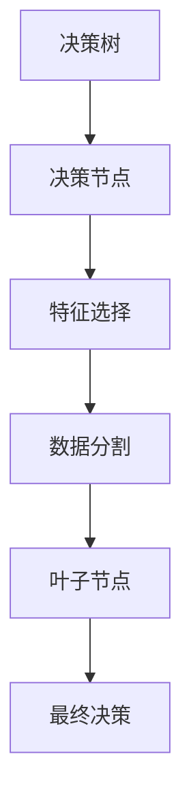
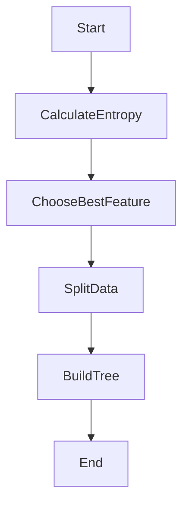

                 


# 构建具有可解释性决策树的AI Agent

## 关键词：可解释性决策树、AI Agent、机器学习、决策树算法、可解释性AI

## 摘要：  
本文探讨如何构建具有可解释性决策树的AI Agent，强调在AI系统中实现可解释性决策的重要性。通过分析决策树的基本原理、可解释性关键因素，以及在AI Agent中的应用，本文旨在为读者提供构建可解释性AI Agent的系统方法，包括算法原理、系统架构设计和实际案例分析。

---

# 第一部分: 构建具有可解释性决策树的AI Agent背景介绍

## 第1章: 可解释性决策树与AI Agent概述

### 1.1 问题背景  
AI Agent在决策过程中的可解释性需求日益增长。随着AI技术的广泛应用，决策透明性和可解释性成为用户信任和合规性的重要因素。传统的黑箱模型难以满足这一需求，而决策树作为一种经典的机器学习算法，因其直观性和可解释性成为构建AI Agent的理想选择。

#### 1.1.1 当前AI Agent的挑战与机遇  
- AI Agent在医疗、金融、自动驾驶等领域的广泛应用，要求决策过程必须可解释。  
- 黑箱模型（如深度神经网络）难以满足监管要求和用户信任。  
- 可解释性决策树通过明确的决策逻辑，解决了这一痛点。  

#### 1.1.2 可解释性决策树的必要性  
- 可解释性决策树能够清晰地展示决策路径，便于用户理解和验证。  
- 在高风险领域（如医疗诊断），可解释性是法律和伦理的基本要求。  
- 通过可解释性，AI Agent能够更好地与用户交互，提供基于逻辑的决策依据。  

#### 1.1.3 问题描述与目标  
- **问题描述**: 构建一个能够生成可解释性决策树的AI Agent，使其在复杂场景中做出透明的决策。  
- **目标**: 提供一种高效、可解释的决策机制，确保AI Agent在实际应用中的可信性和实用性。  

### 1.2 可解释性决策树的核心概念  
可解释性决策树是一种基于树状结构的决策模型，通过层次化的特征选择和规则提取，实现对决策过程的清晰解释。  

#### 1.2.1 决策树的基本原理  
- 决策树是一种监督学习算法，通过数据特征的递归分割，构建树状结构。  
- 决策树的核心是信息增益、基尼指数等指标，用于选择最优特征进行节点分裂。  

#### 1.2.2 可解释性的定义与衡量标准  
- **定义**: 可解释性决策树是指能够通过直观的规则或路径，明确展示决策逻辑的模型。  
- **衡量标准**:  
  1. 规则的清晰性：决策路径是否易于理解。  
  2. 规则的可验证性：是否可以通过逻辑推理验证决策的正确性。  
  3. 规则的覆盖率：是否能够覆盖所有可能的决策场景。  

#### 1.2.3 AI Agent的决策机制与可解释性需求  
- AI Agent需要在动态环境中做出实时决策，可解释性决策树能够提供快速且透明的决策支持。  
- 通过可解释性，AI Agent能够与用户建立信任，并在出现问题时快速定位原因。  

### 1.3 问题解决与边界  
#### 1.3.1 可解释性决策树的实现路径  
- 数据预处理：特征选择、数据清洗。  
- 模型训练：基于决策树算法构建可解释性模型。  
- 可视化展示：通过树状图展示决策逻辑。  

#### 1.3.2 边界与外延  
- **边界**: 可解释性决策树适用于数据量较小、特征清晰的场景。  
- **外延**: 针对复杂场景，可结合其他算法（如随机森林）提升性能。  

#### 1.3.3 核心要素与组成结构  
- 数据输入：特征选择和数据清洗。  
- 决策规则：基于信息增益或基尼指数的特征分裂。  
- 决策输出：明确的决策路径和结果。  

---

# 第二部分: 可解释性决策树的核心概念与联系

## 第2章: 可解释性决策树的原理与属性  

### 2.1 核心原理  
#### 2.1.1 决策树的构建过程  
- 数据预处理：选择相关特征，去除冗余数据。  
- 根节点：基于特征的熵或基尼指数选择最优特征。  
- 子节点：递归分裂，直到叶子节点（决策结果）。  

#### 2.1.2 可解释性的实现机制  
- 通过树状结构展示决策路径，用户可以直观理解决策逻辑。  
- 每个节点的特征选择和分裂条件都可以被解释。  

#### 2.1.3 决策树的可解释性特征  
- **层次化**: 决策过程可以通过层次化的规则展示。  
- **直观性**: 树状结构易于理解，适合非技术用户。  
- **可追溯性**: 每个决策都可以追溯到具体的特征和规则。  

### 2.2 核心概念对比  
#### 2.2.1 决策树与随机森林的对比  
| 特性             | 决策树        | 随机森林     |  
|------------------|---------------|--------------|  
| 可解释性         | 高            | 低           |  
| 抗过拟合能力     | 低            | 高           |  
| 计算效率         | 高            | 低           |  

#### 2.2.2 ID3、C4.5、CART算法的对比  
| 算法         | ID3      | C4.5      | CART      |  
|--------------|----------|-----------|-----------|  
| 分裂准则     | 信息增益 | 信息增益率 | 基尼指数   |  
| 优势         | 计算快    | 抗偏倚     | 分类准确   |  
| 劣势         | 易过拟合  | 计算复杂   | 适合分类   |  

#### 2.2.3 可解释性与准确性的权衡  
- 可解释性决策树在准确性上可能略逊于深度学习模型，但在透明性和可解释性上具有明显优势。  
- 在实际应用中，需要根据场景需求权衡准确性和可解释性的优先级。  

### 2.3 ER实体关系图  


---

## 第3章: 决策树算法的实现与优化  

### 3.1 算法原理  

#### 3.1.1 ID3算法  



**熵公式**：  
$$ H(S) = -\sum_{i=1}^{n} p_i \log p_i $$  

**信息增益公式**：  
$$ \text{信息增益}(D, A) = H(D) - H(D|A) $$  

#### 3.1.2 C4.5算法  

**信息增益率公式**：  
$$ \text{信息增益率}(D, A) = \frac{\text{信息增益}(D, A)}{\text{熵}(D|A)} $$  

#### 3.1.3 CART算法  

**基尼指数公式**：  
$$ G(D, A) = \sum_{i=1}^{n} p_i (1 - p_i) $$  

---

## 第4章: 可解释性决策树的数学模型  

### 4.1 决策树的数学表示  

#### 4.1.1 决策树的层次化规则  
- 决策树可以表示为一组条件规则，例如：  
  - 如果特征A的值大于X，则进入子节点。  

#### 4.1.2 决策树的叶子节点表示  
- 叶子节点表示最终的决策结果，例如：  
  - 类别标签（分类任务）或数值预测（回归任务）。  

---

## 第5章: 可解释性决策树的系统架构  

### 5.1 系统功能设计  

#### 5.1.1 系统功能模块  
- 数据预处理模块：特征选择和数据清洗。  
- 模型训练模块：基于决策树算法构建可解释性模型。  
- 可视化展示模块：生成树状图展示决策逻辑。  

#### 5.1.2 系统交互流程  
- 用户输入数据和特征选择需求。  
- 系统生成决策树并展示可视化结果。  

---

## 第6章: 项目实战  

### 6.1 环境安装  

#### 6.1.1 安装Python和相关库  
- 使用Anaconda或虚拟环境安装Python 3.8及以上版本。  
- 安装Scikit-learn、Matplotlib等库。  

### 6.2 核心代码实现  

#### 6.2.1 决策树实现代码  
```python
from sklearn.tree import DecisionTreeClassifier
from sklearn.datasets import make_classification
from sklearn.metrics import accuracy_score

# 生成数据集
X, y = make_classification(n_samples=100, n_features=2, n_classes=2, random_state=42)

# 初始化决策树模型
model = DecisionTreeClassifier()

# 训练模型
model.fit(X, y)

# 预测结果
y_pred = model.predict(X)

# 评估准确率
print("准确率:", accuracy_score(y, y_pred))
```

#### 6.2.2 可视化代码  
```python
from sklearn.tree import plot_tree

# 可视化决策树
plot_tree(model, filled=True)
plt.show()
```

### 6.3 案例分析  

#### 6.3.1 应用场景  
- 电商用户行为预测：基于用户特征预测购买行为。  
- 医疗诊断：根据症状和检查结果诊断疾病。  

#### 6.3.2 案例实现  
```python
# 数据预处理
import pandas as pd
data = pd.read_csv("dataset.csv")

# 特征选择
features = ['age', 'gender', 'income']
target = 'purchase'

# 训练模型
model = DecisionTreeClassifier()
model.fit(data[features], data[target])

# 可视化
from sklearn.tree import export_graphviz
export_graphviz(model, out_file="tree.dot", feature_names=features, class_names=['0', '1'])
```

---

## 第7章: 小结  

### 7.1 最佳实践  

#### 7.1.1 可解释性决策树的应用建议  
- 在需要透明决策的领域（如医疗、金融）优先使用可解释性决策树。  
- 结合其他算法（如随机森林）提升模型性能，同时通过特征重要性分析增强可解释性。  

#### 7.1.2 可解释性决策树的优化方向  
- 增强模型的可解释性，例如通过可视化工具展示决策路径。  
- 研究动态更新机制，使决策树能够适应数据变化。  

### 7.2 注意事项  

#### 7.2.1 数据质量的影响  
- 数据清洗和特征选择是构建可解释性决策树的关键步骤，数据质量直接影响模型性能。  

#### 7.2.2 模型选择的权衡  
- 在实际应用中，需要根据场景需求权衡可解释性与准确性的优先级。  

### 7.3 拓展阅读  

#### 7.3.1 推荐书籍  
- 《机器学习实战》  
- 《可解释的人工智能：理论、算法与应用》  

#### 7.3.2 推荐博客和资源  
- Towards Data Science: [可解释性AI系列](https://towardsdatascience.com/interpretable-ai)  
- Kaggle: [决策树实战案例](https://www.kaggle.com/datasets)  

---

# 结语  

构建具有可解释性决策树的AI Agent是一项具有重要理论和实践意义的任务。通过本文的分析，读者可以深入了解可解释性决策树的核心原理、系统架构设计和实际应用案例。未来的研究可以进一步探索可解释性决策树的动态更新机制和与其他算法的结合，以满足更复杂场景的需求。

