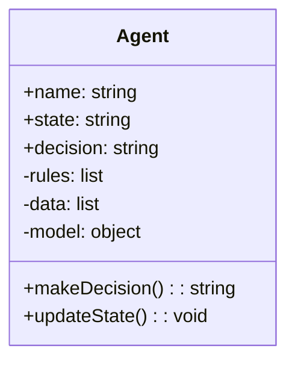
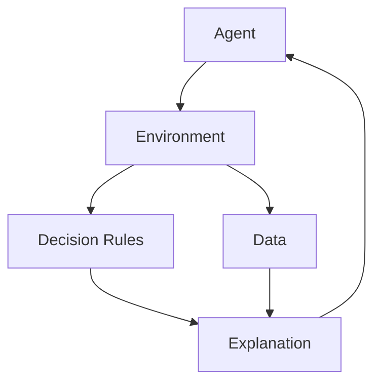
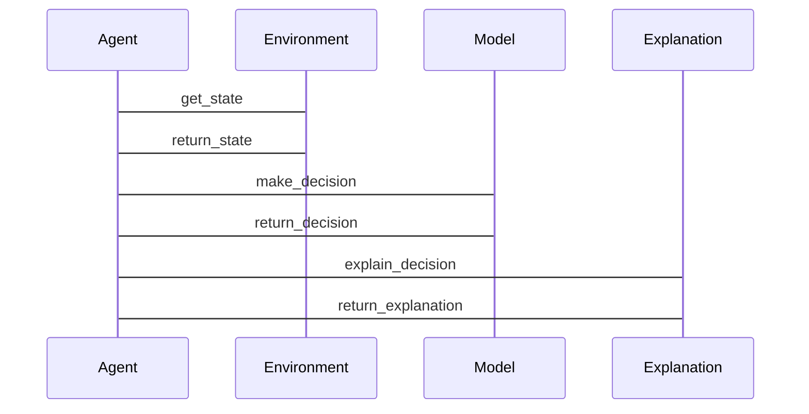

                 


# 《构建具有可解释性决策能力的AI Agent》

---

## 关键词：
AI Agent, 可解释性决策, 强化学习, 决策树, 系统架构设计

---

## 摘要：
构建具有可解释性决策能力的AI Agent是当前人工智能领域的重要研究方向。本文从背景介绍出发，详细探讨了可解释性决策的核心概念、算法原理、系统架构设计及项目实战。通过强化学习和决策树等算法的分析，结合实际案例，展示了如何设计和实现一个可解释性强、决策高效的AI Agent。本文还总结了实现过程中的关键点和注意事项，为后续研究提供了参考。

---

## 第1章: 构建可解释性AI Agent的背景与挑战

### 1.1 问题背景
#### 1.1.1 AI决策系统的现状与问题
当前，AI决策系统在多个领域得到广泛应用，但其决策过程往往缺乏透明性和可解释性，导致用户信任度不足。

#### 1.1.2 可解释性决策的重要性
可解释性决策能够帮助用户理解AI的决策过程，增强信任，并便于调试和优化。

#### 1.1.3 当前AI决策系统的局限性
现有AI决策系统多基于复杂模型（如深度神经网络），决策过程难以解释。

### 1.2 问题描述
#### 1.2.1 AI Agent的定义与特点
AI Agent是一种能够感知环境、自主决策的智能体，具有主动性、反应性和社会性。

#### 1.2.2 可解释性决策的核心问题
如何在保证决策效率的同时，提供清晰的决策逻辑和依据。

#### 1.2.3 问题的边界与外延
可解释性决策的边界包括决策过程的透明度和可追溯性，外延涉及决策的公平性和伦理问题。

### 1.3 问题解决
#### 1.3.1 可解释性决策的目标
实现决策过程的透明化和可解释性，提升用户信任度。

#### 1.3.2 解决方案的总体思路
结合强化学习和决策树等可解释性算法，设计一种高效的可解释性决策框架。

#### 1.3.3 解决方案的关键技术
强化学习、决策树、可解释性模型等。

### 1.4 概念结构与核心要素
#### 1.4.1 可解释性决策的要素组成
包括决策规则、决策逻辑、决策依据和决策结果。

#### 1.4.2 AI Agent的决策过程
感知环境、分析问题、生成决策、执行决策。

#### 1.4.3 可解释性与不可解释性模型的对比
| 对比维度 | 可解释性模型 | 不可解释性模型 |
|----------|--------------|----------------|
| 解释性   | 高            | 低              |
| 透明度   | 高            | 低              |
| 算法复杂度 | 低           | 高              |

---

## 第2章: 可解释性决策的原理与方法

### 2.1 可解释性决策的定义与特点
#### 2.1.1 可解释性的定义
可解释性是指AI Agent的决策过程能够被人类理解和解释。

#### 2.1.2 可解释性决策的特征
透明性、可追溯性、可验证性。

### 2.2 可解释性决策的核心原理
#### 2.2.1 解释性模型的基本原理
基于规则的解释性模型通过预定义的规则生成决策。

#### 2.2.2 解释性决策的数学模型
$$
\text{决策} = \text{输入特征} \times \text{权重} + \text{偏置}
$$

#### 2.2.3 解释性决策的实现方法
包括基于规则的方法、基于模型的方法和基于数据的方法。

### 2.3 可解释性决策的工具与方法
#### 2.3.1 基于规则的解释方法
通过预定义规则生成决策，例如决策树。

#### 2.3.2 基于模型的解释方法
通过模型的参数解释决策过程，例如线性回归模型。

#### 2.3.3 基于数据的解释方法
通过数据特征的重要性排序解释决策。

### 2.4 核心概念的ER实体关系图
```mermaid
er
actor(Agent, Decision, Explanation)
```

---

## 第3章: 可解释性决策算法的原理与实现

### 3.1 强化学习算法
#### 3.1.1 强化学习的基本原理
通过智能体与环境的交互，学习最优策略。

#### 3.1.2 基于强化学习的决策树构建
通过强化学习优化决策树的结构。

#### 3.1.3 强化学习的可解释性问题
强化学习的决策过程复杂，难以解释。

### 3.2 解释性决策树的构建
#### 3.2.1 决策树的构建过程
通过特征选择和分裂标准生成决策树。

#### 3.2.2 决策树的解释方法
通过可视化决策树结构解释决策过程。

#### 3.2.3 决策树的数学模型
$$
\text{决策} = \sum_{i=1}^{n} \text{特征}_i \times \text{权重}_i
$$

### 3.3 基于决策树的可解释性决策算法实现
#### 3.3.1 算法实现步骤
1. 数据预处理
2. 特征选择
3. 决策树构建
4. 决策树解释

#### 3.3.2 代码实现
```python
import pandas as pd
from sklearn.tree import DecisionTreeClassifier
from sklearn.model_selection import train_test_split
from sklearn.metrics import accuracy_score

# 数据加载
data = pd.read_csv('data.csv')
X = data.drop('target', axis=1)
y = data['target']

# 数据分割
X_train, X_test, y_train, y_test = train_test_split(X, y, test_size=0.2)

# 模型训练
model = DecisionTreeClassifier()
model.fit(X_train, y_train)

# 模型预测
y_pred = model.predict(X_test)
print('Accuracy:', accuracy_score(y_test, y_pred))
```

---

## 第4章: 系统分析与架构设计方案

### 4.1 问题场景介绍
构建一个可解释性决策的AI Agent，应用于金融领域的风险评估。

### 4.2 项目介绍
项目目标：设计一个可解释性强的AI Agent，用于金融风险评估。

### 4.3 系统功能设计
#### 4.3.1 领域模型设计


#### 4.3.2 系统架构设计


### 4.4 系统接口设计
#### 4.4.1 接口描述
- 输入：环境状态和特征
- 输出：决策和解释

#### 4.4.2 接口交互


---

## 第5章: 项目实战

### 5.1 环境安装
安装必要的库：
```
pip install pandas scikit-learn matplotlib
```

### 5.2 系统核心实现源代码
```python
from sklearn.tree import DecisionTreeClassifier
from sklearn.metrics import accuracy_score
from sklearn.model_selection import train_test_split
import pandas as pd

# 数据加载
data = pd.read_csv('data.csv')
X = data.drop('target', axis=1)
y = data['target']

# 数据分割
X_train, X_test, y_train, y_test = train_test_split(X, y, test_size=0.2)

# 模型训练
model = DecisionTreeClassifier()
model.fit(X_train, y_train)

# 模型预测
y_pred = model.predict(X_test)
print('Accuracy:', accuracy_score(y_test, y_pred))

# 可解释性分析
feature_importance = model.feature_importances_
print('Feature Importance:', feature_importance)
```

### 5.3 代码应用解读与分析
- 数据预处理：加载数据并分割训练集和测试集。
- 模型训练：使用决策树模型进行训练。
- 模型预测：进行预测并计算准确率。
- 可解释性分析：分析特征的重要性。

### 5.4 实际案例分析
通过具体案例分析决策树的构建和解释过程，验证模型的可解释性和决策效率。

### 5.5 项目小结
总结项目的实现过程，分析优缺点，并提出改进建议。

---

## 第6章: 总结与展望

### 6.1 本章总结
总结本文的主要内容，包括背景、核心概念、算法原理、系统架构设计和项目实战。

### 6.2 未来研究方向
进一步优化可解释性决策算法，探索新的可解释性模型。

### 6.3 注意事项
在实际应用中，需注意数据质量和模型的可解释性与决策效率的平衡。

### 6.4 最佳实践 Tips
- 选择合适的可解释性算法
- 定期验证模型的可解释性和决策效率
- 结合领域知识优化模型

---

通过以上目录结构，可以系统地撰写一篇关于构建具有可解释性决策能力的AI Agent的技术博客文章。

