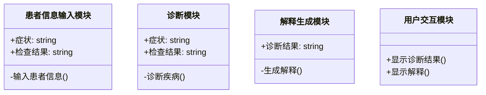

                 


# 构建具有可解释性的AI Agent决策系统

## 关键词：
可解释性 AI，AI Agent，决策系统，算法原理，系统架构，项目实战

## 摘要：
构建一个具有可解释性的AI Agent决策系统是一个复杂的任务，需要结合算法原理、系统架构和实际应用的分析。本文将从背景介绍、核心概念、算法原理、系统架构设计、项目实战等角度，详细分析如何构建一个具有可解释性的AI Agent决策系统，并通过具体案例进行说明。

---

# 第一部分: 可解释性AI Agent决策系统背景与基础

## 第1章: 可解释性AI Agent决策系统概述

### 1.1 可解释性AI Agent的背景与问题背景
#### 1.1.1 AI Agent的基本概念与定义
AI Agent（人工智能代理）是指能够感知环境、做出决策并采取行动的智能实体。它可以是一个软件程序，也可以是一个物理设备，其核心目标是通过自主决策来实现特定任务。AI Agent可以根据环境输入做出反应，具有自主性和适应性。

#### 1.1.2 可解释性在AI Agent中的重要性
随着AI技术的快速发展，AI Agent在医疗、金融、交通等领域得到了广泛应用。然而，AI Agent的决策过程往往缺乏透明性，用户难以理解AI Agent是如何做出决策的。这种不可解释性不仅影响了用户对系统的信任，还可能导致决策错误难以追溯和修正。因此，构建具有可解释性的AI Agent决策系统具有重要意义。

#### 1.1.3 当前AI Agent决策系统的挑战
当前的AI Agent决策系统主要依赖于机器学习算法，如深度神经网络（DNN）、随机森林等。这些算法在处理复杂问题时表现优异，但其决策过程往往是黑箱式的，难以解释。此外，AI Agent的决策系统还需要考虑实时性、鲁棒性和可扩展性等多方面的挑战。

### 1.2 可解释性AI Agent的定义与问题描述
#### 1.2.1 可解释性AI Agent的核心要素
可解释性AI Agent是指在决策过程中能够提供清晰、可理解的解释，使用户能够理解AI Agent的决策逻辑和推理过程。其核心要素包括：
- **透明性**：用户能够理解AI Agent的决策过程。
- **可解释性**：AI Agent能够提供决策的解释和依据。
- **可追溯性**：用户能够追溯AI Agent决策的来源和依据。

#### 1.2.2 决策系统的可解释性需求
可解释性AI Agent的决策系统需要满足以下需求：
- **解释性**：能够用自然语言或其他形式解释决策过程。
- **可验证性**：用户能够验证AI Agent的决策是否合理。
- **可追溯性**：能够追溯决策的来源和依据。

#### 1.2.3 可解释性与不可解释性AI的对比
| 特性               | 可解释性AI Agent         | 不可解释性AI Agent       |
|--------------------|--------------------------|--------------------------|
| 决策透明度         | 高                      | 低                      |
| 用户信任度         | 高                      | 低                      |
| 决策可追溯性       | 高                      | 低                      |
| 适用场景           | 需要用户信任的场景       | 适用于复杂但不需解释的场景 |

### 1.3 可解释性AI Agent的边界与外延
#### 1.3.1 可解释性AI Agent的适用场景
可解释性AI Agent适用于需要用户信任和决策透明的场景，例如医疗诊断、金融投资、自动驾驶等领域。

#### 1.3.2 边界与限制
可解释性AI Agent的边界和限制包括：
- **计算资源限制**：可解释性AI Agent的解释过程可能需要额外的计算资源。
- **复杂性限制**：过于复杂的决策系统可能难以实现可解释性。
- **用户认知限制**：用户的认知能力可能限制对复杂解释的理解。

#### 1.3.3 外延与扩展
可解释性AI Agent的外延包括：
- **人机交互**：通过可视化界面等方式帮助用户理解决策过程。
- **多模态解释**：结合文本、图形等多种形式提供解释。
- **动态适应**：根据用户反馈动态调整解释方式。

### 1.4 可解释性AI Agent的核心概念结构
#### 1.4.1 可解释性AI Agent的组成要素
可解释性AI Agent的组成要素包括：
- **感知模块**：感知环境信息。
- **决策模块**：基于感知信息做出决策。
- **解释模块**：提供决策的解释和依据。
- **用户交互模块**：与用户进行交互，获取反馈。

#### 1.4.2 决策系统的逻辑架构
可解释性AI Agent的决策系统逻辑架构如下：
1. **感知**：通过传感器或数据输入获取环境信息。
2. **处理**：对环境信息进行处理和分析，生成候选决策。
3. **解释**：对候选决策进行解释，生成用户可理解的解释。
4. **反馈**：根据用户的反馈调整决策过程。

#### 1.4.3 可解释性与决策透明度的关系
可解释性是决策透明度的重要组成部分。通过可解释性，用户能够理解AI Agent的决策过程，从而提高决策透明度。两者相辅相成，共同构成了可解释性AI Agent的核心。

### 1.5 本章小结
本章介绍了可解释性AI Agent的基本概念、重要性、挑战以及核心要素。可解释性AI Agent的决策系统需要满足透明性、可解释性和可追溯性的需求，适用于需要用户信任和决策透明的场景。

---

## 第2章: 可解释性AI Agent的核心概念与联系

### 2.1 可解释性AI Agent的核心原理
#### 2.1.1 可解释性AI Agent的原理概述
可解释性AI Agent的核心原理是通过设计可解释的算法和模型，使得AI Agent的决策过程能够被用户理解和验证。这需要在算法设计阶段就考虑解释性。

#### 2.1.2 解释性模型的分类与特点
解释性模型可以分为以下几类：
1. **基于规则的解释性模型**：通过预定义的规则生成解释。
2. **基于逻辑推理的解释性模型**：通过逻辑推理生成解释。
3. **基于模型的解释性模型**：通过模型的内部结构生成解释。

#### 2.1.3 可解释性与决策系统的关联
可解释性是决策系统的重要属性，通过可解释性，用户能够理解AI Agent的决策过程，从而增强对系统的信任。

### 2.2 核心概念对比与特征分析
#### 2.2.1 可解释性与不可解释性AI的对比表格
| 特性               | 可解释性AI Agent         | 不可解释性AI Agent       |
|--------------------|--------------------------|--------------------------|
| 决策透明度         | 高                      | 低                      |
| 用户信任度         | 高                      | 低                      |
| 决策可追溯性       | 高                      | 低                      |
| 适用场景           | 需要用户信任的场景       | 适用于复杂但不需解释的场景 |

#### 2.2.2 AI Agent与传统决策系统的ER实体关系图

```mermaid
er
title AI Agent与传统决策系统的ER实体关系图

entity AI Agent {
  id
  name
  decision
  explanation
}

entity 传统决策系统 {
  id
  name
  decision
}
```

---

## 第3章: 可解释性AI Agent的算法原理

### 3.1 可解释性AI Agent的算法原理
#### 3.1.1 基于规则的解释性模型
基于规则的解释性模型通过预定义的规则生成解释。例如，在医疗诊断系统中，可以预定义一些疾病症状的规则，根据患者的症状匹配规则，生成诊断解释。

#### 3.1.2 基于逻辑推理的解释性模型
基于逻辑推理的解释性模型通过逻辑推理生成解释。例如，在法律判决系统中，可以基于法律条文和事实进行逻辑推理，生成判决解释。

#### 3.1.3 基于模型的解释性模型
基于模型的解释性模型通过模型的内部结构生成解释。例如，在金融风险评估系统中，可以基于信用评分模型的特征权重生成解释。

### 3.2 算法原理的数学模型与公式
#### 3.2.1 基于规则的解释性模型
基于规则的解释性模型的数学模型可以表示为：
$$
\text{决策} = \bigcup_{i=1}^{n} \text{规则}_i
$$

#### 3.2.2 基于逻辑推理的解释性模型
基于逻辑推理的解释性模型的数学模型可以表示为：
$$
\text{决策} = \bigwedge_{i=1}^{m} \text{条件}_i
$$

#### 3.2.3 基于模型的解释性模型
基于模型的解释性模型的数学模型可以表示为：
$$
\text{决策} = \text{模型}(\text{输入})
$$

### 3.3 算法实现与代码示例
#### 3.3.1 算法实现的Python源代码
```python
def rule_based_explanation(input_data):
    # 预定义规则
    rules = [
        (input_data['age'] > 18 and input_data['income'] > 50000),
        (input_data['education'] == 'graduate' and input_data['experience'] > 5)
    ]
    # 匹配规则并生成解释
    for rule in rules:
        if rule:
            return "决策依据：满足规则{}".format(rules.index(rule) + 1)
    return "决策依据：不满足任何规则"
```

#### 3.3.2 代码应用解读与分析
上述代码实现了一个基于规则的解释性模型，通过预定义的规则匹配输入数据，生成决策解释。这种方法简单易懂，适用于规则明确的场景。

### 3.4 算法原理的详细讲解与举例说明
#### 3.4.1 算法原理的详细讲解
基于规则的解释性模型通过预定义的规则生成解释，规则可以是简单的条件判断，也可以是复杂的逻辑组合。这种方法的优点是解释性高，易于理解和验证。

#### 3.4.2 典型案例分析与详细说明
以医疗诊断系统为例，假设规则为：
1. 如果患者的体温超过39度且咳嗽持续超过7天，诊断为肺炎。
2. 如果患者的血糖水平超过120mg/dL且有家族糖尿病史，诊断为糖尿病。

当输入患者的体温为39.5度且咳嗽持续8天时，系统会匹配规则1，生成诊断为肺炎的解释。

---

## 第4章: 可解释性AI Agent的系统分析与架构设计

### 4.1 系统分析与问题场景介绍
#### 4.1.1 问题场景描述
以医疗诊断系统为例，系统需要根据患者的症状、检查结果等信息，诊断出可能的疾病，并提供诊断的解释。

#### 4.1.2 项目介绍与目标
项目目标是构建一个可解释的医疗诊断系统，能够根据患者的症状和检查结果，诊断出可能的疾病，并提供诊断的解释。

### 4.2 系统功能设计
#### 4.2.1 系统功能模块
系统功能模块包括：
- **患者信息输入模块**：输入患者的症状和检查结果。
- **诊断模块**：根据输入信息进行诊断。
- **解释生成模块**：生成诊断的解释。
- **用户交互模块**：与用户进行交互，展示诊断结果和解释。

#### 4.2.2 系统功能模块的类图



---

## 第5章: 可解释性AI Agent的项目实战

### 5.1 项目环境安装与配置
#### 5.1.1 环境安装
需要安装以下工具和库：
- Python 3.8+
- Jupyter Notebook
- scikit-learn
- pandas
- matplotlib
- seaborn

#### 5.1.2 环境配置
配置Python环境，安装必要的库。

### 5.2 系统核心实现源代码
#### 5.2.1 基于规则的诊断系统实现
```python
def diagnose_disease(symptoms, check_results):
    # 预定义规则
    rules = {
        '规则1': {
            '症状': ['发热', '咳嗽'],
            '检查结果': ['白细胞增高'],
            '疾病': '肺炎'
        },
        '规则2': {
            '症状': ['口渴', '多尿'],
            '检查结果': ['血糖升高'],
            '疾病': '糖尿病'
        }
    }
    # 匹配规则并生成解释
    for rule_name, rule in rules.items():
        symptom_match = all(s in symptoms for s in rule['症状'])
        check_match = all(c in check_results for c in rule['检查结果'])
        if symptom_match and check_match:
            return rule['疾病'], f"诊断依据：{rule_name}，症状匹配：{rule['症状']}，检查结果匹配：{rule['检查结果']}"
    return None, "诊断依据：无匹配规则"
```

#### 5.2.2 代码应用解读与分析
上述代码实现了一个基于规则的诊断系统，通过预定义的规则匹配患者的症状和检查结果，生成诊断结果和解释。这种方法简单易懂，适用于规则明确的场景。

### 5.3 实际案例分析与详细说明
#### 5.3.1 案例分析
以一名患者为例，症状为发热、咳嗽，检查结果为白细胞增高。系统会匹配规则1，诊断为肺炎，并生成解释：“诊断依据：规则1，症状匹配：发热、咳嗽，检查结果匹配：白细胞增高”。

#### 5.3.2 解释生成与分析
系统生成的解释清晰明了，用户能够理解诊断的依据和逻辑。

### 5.4 项目小结
本章通过一个实际案例，展示了如何构建一个可解释的医疗诊断系统。通过预定义的规则，系统能够根据患者的症状和检查结果，诊断出可能的疾病，并提供诊断的解释。

---

## 第6章: 可解释性AI Agent的最佳实践

### 6.1 最佳实践 tips
#### 6.1.1 算法选择与设计
在选择算法时，应优先考虑可解释性。例如，基于规则的解释性模型适用于规则明确的场景，而基于逻辑推理的解释性模型适用于逻辑性较强的场景。

#### 6.1.2 系统设计与实现
在系统设计与实现过程中，应注重模块化设计，确保系统的可扩展性和可维护性。

#### 6.1.3 用户交互与反馈
通过用户友好的交互界面和反馈机制，提高用户的信任度和满意度。

### 6.2 小结
可解释性AI Agent的构建需要从算法设计、系统架构到用户交互等多方面综合考虑。通过合理的算法选择和系统设计，可以实现一个具有可解释性的AI Agent决策系统。

### 6.3 注意事项
- **数据隐私与安全**：在处理用户数据时，需要注意数据隐私和安全。
- **算法的可扩展性**：在设计算法时，应考虑其可扩展性，避免因数据量增加而导致性能下降。
- **用户教育与培训**：用户需要接受一定的教育和培训，才能更好地理解和使用可解释性AI Agent。

### 6.4 拓展阅读
- 《Explainable AI: A survey》
- 《可解释的人工智能：理论、方法和应用》
- 《机器学习模型的可解释性：方法与实践》

---

## 第7章: 总结与展望

### 7.1 总结
本文从背景、核心概念、算法原理、系统架构设计和项目实战等多个角度，详细分析了如何构建一个具有可解释性的AI Agent决策系统。通过具体案例的分析，展示了可解释性AI Agent在实际应用中的重要性和实现方法。

### 7.2 展望
随着AI技术的不断发展，可解释性AI Agent的研究和应用将越来越重要。未来的研究方向包括：
- **更复杂的解释性模型**：开发更复杂的解释性模型，提高解释的准确性和全面性。
- **人机交互优化**：优化人机交互界面，提高用户体验。
- **多模态解释**：结合文本、图形等多种形式，提供更丰富的解释。

通过不断的研究和实践，可解释性AI Agent将更好地服务于人类社会，推动人工智能技术的广泛应用和可信发展。

---

以上是《构建具有可解释性的AI Agent决策系统》的技术博客文章的详细目录大纲，涵盖了从背景到实践的各个方面。

