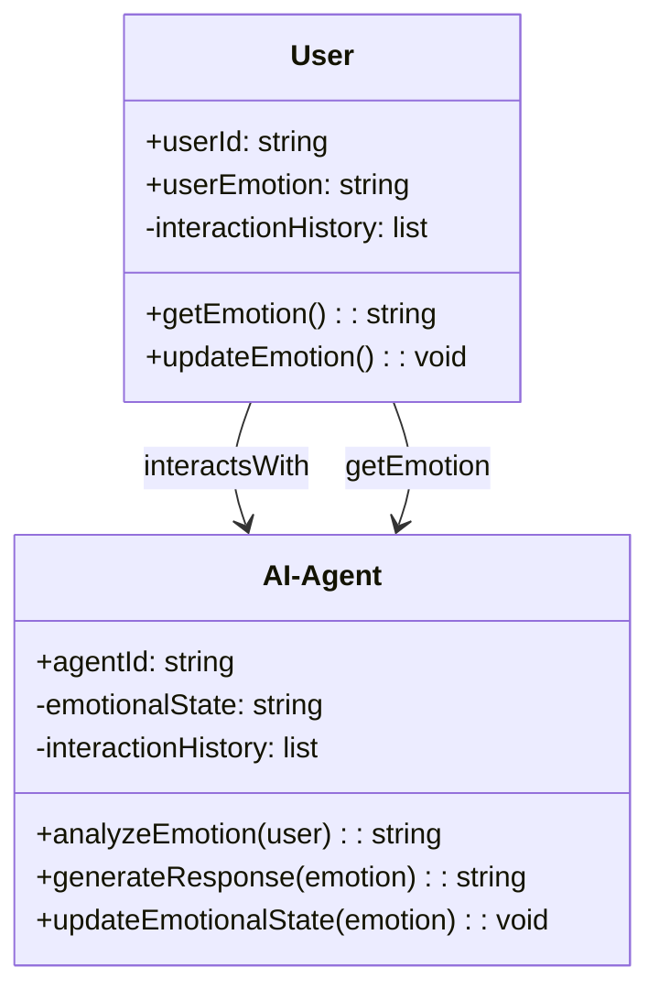
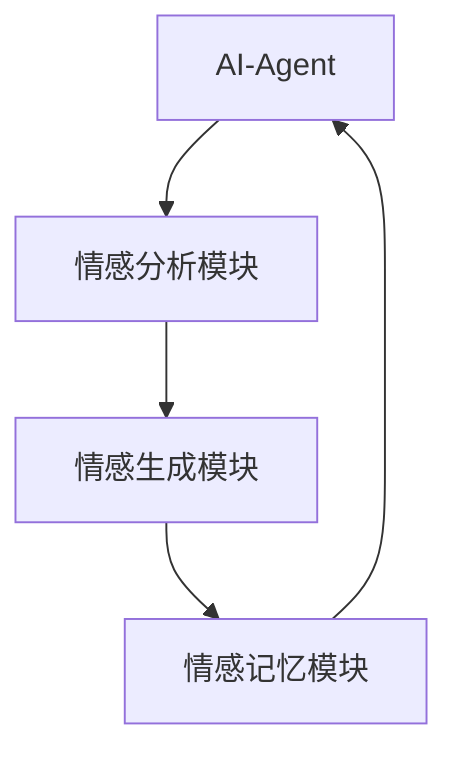

                 


# 构建具有同理心的AI Agent

> 关键词：AI Agent, 同理心, 情感计算, 共情机制, 人机交互, 伦理设计, 深度学习

> 摘要：本文深入探讨了如何构建一个具有同理心的AI Agent，从背景介绍到算法实现，再到系统架构设计，全面分析了情感计算、共情机制、伦理设计等关键问题。通过详细的数学模型和代码示例，结合实际项目案例，为读者提供了从理论到实践的完整指导。

---

# 第一部分: 背景与核心概念

# 第1章: AI Agent与同理心的概述

## 1.1 AI Agent的基本概念

### 1.1.1 什么是AI Agent

AI Agent（人工智能代理）是指能够感知环境、自主决策并执行任务的智能实体。AI Agent可以是软件程序、机器人或其他智能系统，其核心目标是通过与环境交互，完成特定任务并优化目标函数。

### 1.1.2 AI Agent的核心特征

- **自主性**：能够在没有外部干预的情况下自主决策。
- **反应性**：能够实时感知环境并做出响应。
- **目标导向**：所有行为都围绕实现特定目标展开。
- **学习能力**：能够通过经验改进性能。

### 1.1.3 同理心在AI Agent中的重要性

同理心是指理解并感受他人情感的能力。在AI Agent中，同理心使其能够更好地理解用户需求，提供更自然和贴心的服务，从而提升用户体验。

---

## 1.2 同理心的定义与实现

### 1.2.1 同理心的定义

同理心（Empathy）是指个体能够理解并分享他人情感状态的能力。在AI Agent中，同理心体现在系统能够识别、理解和回应用户的情感状态。

### 1.2.2 同理心在AI Agent中的应用

- **情感分析**：识别用户的语调和情绪。
- **情感生成**：模拟情感回应。
- **情感记忆**：记住用户的偏好和情感状态。

### 1.2.3 同理心与AI Agent的结合

通过结合情感计算和共情机制，AI Agent能够更好地与人类交互，理解用户的需求和情感，从而提供更个性化的服务。

---

## 1.3 构建具有同理心的AI Agent的意义

### 1.3.1 提升用户体验

同理心使AI Agent能够理解用户的情感需求，从而提供更贴心的服务。

### 1.3.2 增强人机交互的自然性

通过模拟人类的共情能力，AI Agent的交互方式更接近人类，减少用户与机器之间的隔阂。

### 1.3.3 伦理与社会影响

具有同理心的AI Agent能够更好地遵守伦理规范，减少潜在的负面影响，同时促进社会和谐。

---

## 1.4 本章小结

本章介绍了AI Agent的基本概念、同理心的定义及其在AI Agent中的重要性。构建具有同理心的AI Agent不仅能够提升用户体验，还能增强人机交互的自然性，具有重要的伦理和社会意义。

---

# 第2章: 同理心AI Agent的核心概念与理论基础

## 2.1 情感计算与AI Agent

### 2.1.1 情感计算的定义

情感计算（Affective Computing）是指通过计算方法分析、识别和处理人类情感的过程。它涉及多模态数据，如文本、语音、面部表情和生理信号。

### 2.1.2 情感计算的关键技术

- **文本情感分析**：通过自然语言处理技术分析文本中的情感倾向。
- **语音情感分析**：分析语音特征（如语调、语速）来识别情感。
- **面部表情识别**：通过计算机视觉技术识别面部表情。
- **生理信号分析**：分析心率、皮肤电反应等生理指标。

### 2.1.3 情感计算在AI Agent中的应用

AI Agent可以通过情感计算技术实时感知用户情感，从而调整交互策略，提供更个性化的服务。

---

## 2.2 共情机制的实现

### 2.2.1 共情的定义与分类

共情（Empathy）是指理解并感受他人情感的能力。它可以分为认知共情和情感共情，前者侧重于理解他人的想法，后者侧重于感受他人的情感。

### 2.2.2 基于规则的共情实现

通过预定义的规则和情感词典，AI Agent可以识别特定的情感表达并生成相应的回应。

### 2.2.3 基于机器学习的共情实现

使用深度学习模型（如LSTM、Transformer）训练情感生成模型，使其能够自动生成共情的回应。

---

## 2.3 同理心AI Agent的伦理与社会影响

### 2.3.1 AI Agent的伦理问题

- **隐私问题**：情感数据的收集和使用可能涉及隐私问题。
- **责任归属**：当AI Agent的行为导致问题时，责任归属不明确。

### 2.3.2 同理心对社会的影响

具有同理心的AI Agent可以促进社会和谐，减少人机冲突。

### 2.3.3 伦理设计的挑战与解决方案

- **透明性**：确保用户了解AI Agent的行为和决策过程。
- **可解释性**：AI Agent的行为应具备可解释性，以便用户理解其决策逻辑。

---

## 2.4 本章小结

本章探讨了情感计算和共情机制在AI Agent中的实现方法，并分析了同理心AI Agent的伦理和社会影响。基于规则和机器学习的共情实现方法各有优缺点，结合使用可以提升系统的性能。

---

# 第3章: 同理心AI Agent的核心算法与数学模型

## 3.1 情感分析算法

### 3.1.1 基于规则的情感分析

- **规则设定**：通过预定义的规则和情感词典识别情感。
- **优缺点分析**：简单易实现，但灵活性差，难以处理复杂情感。

### 3.1.2 基于机器学习的情感分析

- **特征提取**：提取文本中的关键词、句法特征等。
- **模型训练**：使用支持向量机（SVM）、随机森林（Random Forest）等传统机器学习模型进行分类。

### 3.1.3 深度学习在情感分析中的应用

- **模型选择**：使用LSTM、Transformer等深度学习模型。
- **训练过程**：通过大规模数据训练情感分类器。

---

## 3.2 共情生成算法

### 3.2.1 基于规则的共情生成

- **规则设定**：通过预定义的规则生成回应。
- **优缺点分析**：生成的回应可能缺乏灵活性和深度。

### 3.2.2 基于机器学习的共情生成

- **数据准备**：收集和标注情感对话数据。
- **模型训练**：使用生成式模型（如GPT）生成情感回应。

---

## 3.3 情感记忆与学习

### 3.3.1 情感记忆的定义

情感记忆是指AI Agent能够记录和利用过去的情感交互信息。

### 3.3.2 情感记忆的实现

- **数据存储**：使用数据库或知识图谱存储情感交互信息。
- **模型训练**：通过强化学习优化情感记忆策略。

---

## 3.4 数学模型与公式

### 3.4.1 情感分析的数学模型

情感分析可以通过逻辑回归模型实现：

$$ P(y=1|x) = \frac{1}{1 + e^{-\beta x}} $$

其中，$x$ 是输入特征向量，$\beta$ 是模型参数。

### 3.4.2 共情生成的数学模型

生成式模型的损失函数可以表示为：

$$ \mathcal{L} = -\sum_{i=1}^{N} \log P(x_i|y_i) $$

其中，$x_i$ 是输入文本，$y_i$ 是生成的回应。

---

## 3.5 本章小结

本章详细介绍了情感分析和共情生成的核心算法，包括基于规则和机器学习的方法，并给出了相关的数学模型。情感记忆与学习的实现可以进一步提升AI Agent的共情能力。

---

# 第4章: 系统分析与架构设计方案

## 4.1 问题场景介绍

### 4.1.1 项目背景

假设我们正在开发一个智能客服AI Agent，需要其具备同理心，能够理解和回应客户的情感需求。

### 4.1.2 项目目标

实现一个能够理解客户情感、提供个性化服务的智能客服系统。

---

## 4.2 系统功能设计

### 4.2.1 领域模型

以下是领域模型的Mermaid类图：



### 4.2.2 系统架构设计

以下是系统架构的Mermaid图：



### 4.2.3 系统接口设计

- **情感分析接口**：`/analyze-emotion`
- **情感生成接口**：`/generate-response`

---

## 4.3 本章小结

本章通过问题场景介绍和系统功能设计，展示了如何构建一个具有同理心的AI Agent系统。系统架构设计包括情感分析、情感生成和情感记忆模块，各模块协同工作以实现共情交互。

---

# 第5章: 项目实战

## 5.1 环境安装

### 5.1.1 Python环境安装

安装Python和必要的库：

```bash
pip install numpy
pip install scikit-learn
pip install transformers
```

### 5.1.2 项目代码安装

克隆GitHub仓库并安装依赖：

```bash
git clone https://github.com/yourusername/empathetic-agent.git
cd empathetic-agent
pip install -r requirements.txt
```

---

## 5.2 核心代码实现

### 5.2.1 情感分析模块

```python
from sklearn.feature_extraction.text import TfidfVectorizer
from sklearn.svm import SVC

# 训练情感分析模型
def train_emotion_classifier(X, y):
    vectorizer = TfidfVectorizer()
    X_vec = vectorizer.fit_transform(X)
    classifier = SVC()
    classifier.fit(X_vec, y)
    return vectorizer, classifier

# 预测情感
def predict_emotion(text, vectorizer, classifier):
    text_vec = vectorizer.transform([text])
    return classifier.predict(text_vec)[0]
```

### 5.2.2 情感生成模块

```python
from transformers import GPT2Tokenizer, GPT2LMHeadModel

# 初始化模型
tokenizer = GPT2Tokenizer.from_pretrained('gpt2')
model = GPT2LMHeadModel.from_pretrained('gpt2')

# 生成情感回应
def generate_response(emotion):
    prompt = f"Respond with empathy to the emotion {emotion}: "
    inputs = tokenizer.encode(prompt, return_tensors='pt')
    outputs = model.generate(inputs, max_length=50)
    response = tokenizer.decode(outputs[0], skip_special_tokens=True)
    return response
```

---

## 5.3 代码解读与分析

### 5.3.1 情感分析模块

- 使用TF-IDF向量化文本特征。
- 使用SVM进行情感分类。

### 5.3.2 情感生成模块

- 使用GPT-2生成情感回应。
- 生成的回应需要与用户情感保持一致。

---

## 5.4 实际案例分析

### 5.4.1 案例背景

用户输入：“我感到非常沮丧，因为项目进度延迟了。”

### 5.4.2 情感分析

预测结果：沮丧

### 5.4.3 情感生成

生成回应：“我理解你的沮丧，项目延迟确实让人感到压力。我们可以一起寻找解决方案。”

---

## 5.5 本章小结

本章通过项目实战展示了如何实现具有同理心的AI Agent。从环境安装到核心代码实现，再到实际案例分析，提供了完整的实现步骤和代码解读。

---

# 第6章: 总结与展望

## 6.1 本章小结

本文从理论到实践，详细探讨了如何构建具有同理心的AI Agent。通过情感计算、共情机制和伦理设计，AI Agent能够更好地理解并回应用户情感需求。

---

## 6.2 展望

未来，随着深度学习和多模态技术的发展，AI Agent的同理心实现将更加自然和智能。同时，伦理设计也需要进一步优化，以应对日益复杂的现实挑战。

---

# 参考文献

（此处列出相关文献和资源）

---

通过以上目录结构，文章从背景介绍到算法实现，再到系统设计和项目实战，全面探讨了如何构建具有同理心的AI Agent。每一章都深入展开，确保读者能够系统性地掌握相关知识和技能。

