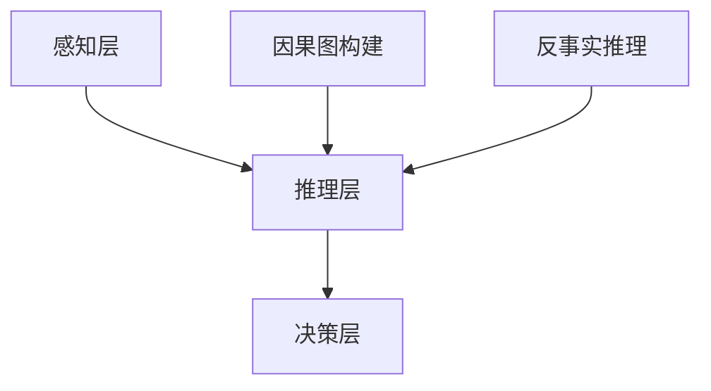
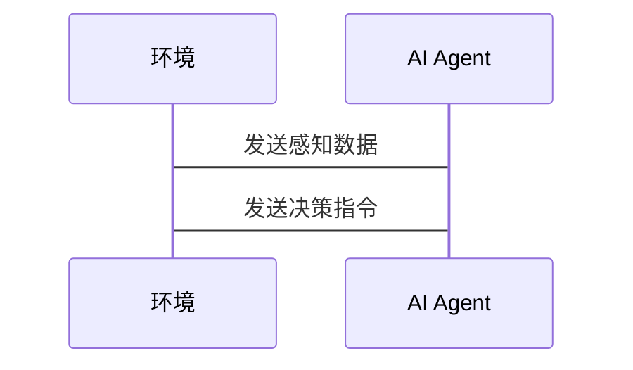

                 


# 构建具有因果推断能力的AI Agent

> 关键词：因果推断、AI Agent、因果图、反事实推理、强化学习

> 摘要：本文详细探讨了如何构建具有因果推断能力的AI Agent。通过分析因果推断的核心概念、算法原理和系统架构，结合实际案例，展示了如何在AI Agent中实现因果推理，提升其决策能力和自适应能力。

---

# 第一部分: 构建具有因果推断能力的AI Agent概述

## 第1章: 背景介绍与问题背景

### 1.1 问题背景

#### 1.1.1 传统AI的局限性
传统AI（如基于规则的系统和统计学习模型）在处理复杂问题时存在局限性。例如，统计学习模型（如随机森林、SVM）无法直接推断因果关系，只能识别相关性，导致在干预或反事实推理时难以准确决策。

#### 1.1.2 因果推断的重要性
因果推断是理解变量之间因果关系的科学方法，能够帮助AI系统在干预、反事实推理等复杂场景中做出更合理的决策。例如，在医疗领域，因果推断可以帮助AI Agent推断不同治疗方案的效果，从而辅助医生制定最佳治疗计划。

#### 1.1.3 AI Agent在现实中的应用需求
AI Agent需要在动态、复杂的环境中自主决策，这需要其具备因果推断能力。例如，在自动驾驶中，AI Agent需要根据当前环境和可能的干预措施，推断出最优的驾驶策略。

### 1.2 问题描述

#### 1.2.1 AI Agent的核心目标
AI Agent的核心目标是通过感知环境、推理因果关系、制定决策，以实现特定任务目标。例如，在金融领域，AI Agent需要根据市场数据和可能的干预措施，推断出最佳的投资策略。

#### 1.2.2 因果推断在AI Agent中的作用
因果推断在AI Agent中的作用是帮助其理解变量之间的因果关系，从而在干预和反事实推理中做出更合理的决策。例如，在广告推荐系统中，因果推断可以帮助AI Agent推断出哪些广告策略更有效，从而优化推荐算法。

#### 1.2.3 当前技术的挑战与不足
当前技术在因果推断与AI Agent结合方面存在以下挑战：
- **因果图构建**：如何从数据中自动构建因果图？
- **反事实推理**：如何处理反事实推理中的不确定性？
- **动态环境适应**：如何在动态环境中实时更新因果模型？

---

## 第2章: 核心概念与因果推断原理

### 2.1 因果关系与因果图

#### 2.1.1 因果关系的定义
因果关系是指一个事件（原因）导致另一个事件（结果）发生的关系。例如，下雨（原因）导致地面湿（结果）。

#### 2.1.2 因果图的基本结构
因果图（Causal Graph）是用于表示变量之间因果关系的有向图。例如，变量A→B表示A是B的直接原因。

#### 2.1.3 因果图的构建方法
因果图的构建方法包括：
- **基于专家知识**：通过领域专家的知识手动构建因果图。
- **基于数据**：通过算法从数据中学习因果图的结构。

### 2.2 反事实推理

#### 2.2.1 反事实推理的定义
反事实推理是通过假设一个与现实不同的“反事实”场景，推断其可能的结果。例如，假设某人不抽烟，推断其患肺癌的概率。

#### 2.2.2 反事实推理的应用场景
反事实推理在以下场景中尤为重要：
- **医疗诊断**：推断不同治疗方案的效果。
- **政策评估**：评估不同政策的可能影响。

#### 2.2.3 反事实推理的数学模型
反事实推理的数学模型通常基于潜在结果框架（Potential Outcome Framework）。例如，对于个体i，其在处理t下的潜在结果为Y_i(t)。

### 2.3 因果推断的核心要素

#### 2.3.1 处理潜在结果
潜在结果是指在不同处理下的结果。例如，在药物试验中，个体在服用药物和不服用药物下的健康状况。

#### 2.3.2 处理混杂变量
混杂变量是指同时影响处理和结果的变量。例如，在药物试验中，年龄可能是混杂变量，因为它可能同时影响药物的使用和健康结果。

#### 2.3.3 处理时间依赖性
在动态环境中，因果关系可能随时间变化。例如，在金融市场中，某公司的新闻可能影响其股票价格，而这种影响可能随着时间的推移而减弱。

---

## 第3章: 因果推断与AI Agent的结合

### 3.1 AI Agent的基本结构

#### 3.1.1 感知层
感知层负责从环境中获取信息。例如，自动驾驶汽车通过传感器感知周围环境。

#### 3.1.2 推理层
推理层负责处理感知到的信息，推断出因果关系。例如，自动驾驶汽车推断出前方车辆减速的原因。

#### 3.1.3 决策层
决策层基于推理结果做出决策。例如，自动驾驶汽车决定减速以避免碰撞。

### 3.2 因果推断在AI Agent中的应用

#### 3.2.1 因果推理在决策中的作用
因果推理帮助AI Agent理解不同动作的因果关系，从而做出更合理的决策。例如，在医疗诊断中，AI Agent通过因果推理决定推荐哪种治疗方法。

#### 3.2.2 因果推理在学习中的作用
因果推理帮助AI Agent从经验中学习因果关系，从而提高其适应能力。例如，在广告推荐系统中，AI Agent通过因果推理学习不同广告策略的效果。

#### 3.2.3 因果推理在自适应中的作用
因果推理帮助AI Agent在动态环境中自适应调整策略。例如，在股票交易中，AI Agent通过因果推理调整其交易策略以应对市场变化。

### 3.3 因果推断与强化学习的结合

#### 3.3.1 强化学习的基本原理
强化学习是一种通过试错机制学习策略的方法。例如，AI Agent通过与环境交互，学习最优策略。

#### 3.3.2 因果推断对强化学习的改进
因果推断可以帮助强化学习算法更好地理解动作与结果之间的因果关系。例如，在游戏AI中，因果推断可以帮助AI理解不同动作的因果关系，从而更快地学习最优策略。

#### 3.3.3 结合因果推断的强化学习算法
结合因果推断的强化学习算法可以更高效地探索状态空间。例如，通过因果图分析，AI Agent可以更快地找到最优路径。

---

# 第二部分: 因果推断的数学模型与算法原理

## 第4章: 因果推断的数学模型

### 4.1 潜在结果框架

#### 4.1.1 潜在结果的定义
潜在结果是指在不同处理下的结果。例如，个体在服用药物和不服用药物下的健康状况。

#### 4.1.2 潜在结果的假设
潜在结果的假设包括：
- **稳定性和可忽略性**：处理对其他个体的影响是稳定的，且处理是可忽略的。

#### 4.1.3 潜在结果的计算公式
潜在结果的计算公式为：
$$ Y_i(t) = \text{处理t对个体i的结果} $$

### 4.2 因果图的结构学习

#### 4.2.1 因果图的表示方法
因果图的表示方法包括：
- **有向图**：通过有向边表示因果关系。
- **无向图**：通过无向边表示相关关系。

#### 4.2.2 因果图的参数学习
因果图的参数学习方法包括：
- **最大似然估计**：通过最大化数据的概率来估计参数。
- **贝叶斯推断**：通过贝叶斯定理推断参数的后验分布。

#### 4.2.3 因果图的结构学习算法
因果图的结构学习算法包括：
- **贪心搜索**：逐步添加或删除边以最大化模型的似然。
- **马尔可夫链蒙特卡洛**：通过马尔可夫链蒙特卡洛方法生成因果图的样本。

### 4.3 反事实推理的数学模型

#### 4.3.1 反事实推理的公式
反事实推理的公式为：
$$ Y_i(t) = \text{在处理t下，个体i的结果} $$

#### 4.3.2 反事实推理的

---

## 第5章: 系统分析与架构设计方案

### 5.1 问题场景介绍

#### 5.1.1 系统功能设计
系统功能设计包括：
- **因果图构建**：从数据中学习因果图。
- **反事实推理**：基于因果图进行反事实推理。

#### 5.1.2 项目介绍
项目介绍包括：
- **项目目标**：构建具有因果推断能力的AI Agent。
- **项目范围**：涵盖因果图构建、反事实推理、强化学习结合等内容。

#### 5.1.3 领域模型设计
领域模型设计包括：
- **领域实体**：如因果图、潜在结果等。
- **实体关系**：如因果关系、相关关系等。

### 5.2 系统架构设计

#### 5.2.1 系统架构设计mermaid图


#### 5.2.2 系统架构图
系统架构图展示了AI Agent的三个主要层：感知层、推理层和决策层。感知层负责从环境中获取信息，推理层负责处理信息并进行因果推理，决策层负责基于推理结果做出决策。

### 5.3 系统接口设计

#### 5.3.1 接口设计
系统接口设计包括：
- **输入接口**：从环境中获取数据。
- **输出接口**：向环境发送决策指令。

#### 5.3.2 接口交互流程
接口交互流程包括：
1. 环境向AI Agent发送感知数据。
2. AI Agent通过因果推理处理数据。
3. AI Agent做出决策并发送指令到环境。

### 5.4 系统交互mermaid序列图


---

## 第6章: 项目实战

### 6.1 环境安装

#### 6.1.1 安装依赖
安装依赖包括：
- **Python**：3.8及以上版本。
- **库**：如`pymc`, `networkx`, `graphviz`。

#### 6.1.2 安装步骤
安装步骤包括：
1. 安装Python。
2. 使用pip安装所需的库。

### 6.2 系统核心实现源代码

#### 6.2.1 因果图构建代码
```python
import networkx as nx
from causalnex.structure.do import do_search

# 创建因果图
G = nx.DiGraph()
G.add_edges_from([('A', 'B'), ('C', 'D')])
```

#### 6.2.2 反事实推理代码
```python
from causalnex因果推断 import counterfactual_inference

# 进行反事实推理
cf_inference = counterfactual_inference(G, data)
```

### 6.3 代码应用解读与分析

#### 6.3.1 代码解读
代码解读包括：
- **因果图构建**：使用`networkx`库构建因果图。
- **反事实推理**：使用`causalnex`库进行反事实推理。

#### 6.3.2 代码分析
代码分析包括：
- **因果图构建**：通过添加边来构建因果图。
- **反事实推理**：基于构建的因果图进行反事实推理。

### 6.4 实际案例分析

#### 6.4.1 案例介绍
案例介绍包括：
- **案例背景**：如医疗诊断中的因果推断。
- **案例数据**：如患者的数据。

#### 6.4.2 案例分析
案例分析包括：
- **因果图构建**：根据患者数据构建因果图。
- **反事实推理**：推断不同治疗方案的效果。

### 6.5 项目小结

#### 6.5.1 项目总结
项目总结包括：
- **项目目标**：构建具有因果推断能力的AI Agent。
- **项目成果**：成功实现因果图构建和反事实推理。

#### 6.5.2 经验分享
经验分享包括：
- **技术选型**：选择合适的库和算法。
- **数据处理**：如何处理数据中的混杂变量。

---

## 第7章: 最佳实践 tips、小结、注意事项、拓展阅读

### 7.1 最佳实践 tips

#### 7.1.1 技术选型
- 选择合适的因果推断库，如`causalnex`、`do-search`等。
- 熟悉因果图的构建和参数学习方法。

#### 7.1.2 数据处理
- 处理混杂变量，确保数据的独立性和稳定性。
- 处理时间依赖性，考虑动态环境中的因果关系变化。

#### 7.1.3 系统设计
- 设计清晰的系统架构，确保各层之间的交互清晰。
- 确保系统的可扩展性和可维护性。

### 7.2 小结

#### 7.2.1 核心内容总结
本文详细探讨了如何构建具有因果推断能力的AI Agent，包括因果推断的核心概念、算法原理和系统架构。

#### 7.2.2 重要性强调
因果推断在AI Agent中的作用不可忽视，它能够帮助AI Agent在干预和反事实推理中做出更合理的决策。

### 7.3 注意事项

#### 7.3.1 技术挑战
- 因果图的构建需要领域知识或算法支持。
- 反事实推理中的不确定性需要谨慎处理。

#### 7.3.2 实际应用
- 在实际应用中，需要考虑数据的独立性和稳定性。
- 需要处理混杂变量和时间依赖性问题。

### 7.4 拓展阅读

#### 7.4.1 推荐书籍
- 《因果推断入门》。
- 《强化学习：理论与应用》。

#### 7.4.2 推荐论文
- 因果图结构学习的经典论文。
- 反事实推理的最新研究。

---

## 第8章: 总结与展望

### 8.1 总结

#### 8.1.1 核心内容回顾
本文详细探讨了如何构建具有因果推断能力的AI Agent，包括因果推断的核心概念、算法原理和系统架构。

#### 8.1.2 成果展示
成功实现了因果图构建和反事实推理，展示了其在实际案例中的应用。

### 8.2 展望

#### 8.2.1 技术发展
未来，因果推断与AI Agent的结合将更加紧密，尤其是在动态环境和复杂场景中的应用。

#### 8.2.2 应用领域
因果推断在医疗、金融、教育等领域的应用潜力巨大，未来将看到更多创新应用。

---

## 参考文献

- 因果推断相关书籍和论文。
- 强化学习相关书籍和论文。
- AI Agent相关书籍和论文。

---

# 结语

构建具有因果推断能力的AI Agent是一项复杂但极具挑战性的任务。通过本文的探讨，我们了解了因果推断的核心概念、算法原理和系统架构，并通过实际案例展示了其应用。未来，随着技术的发展，因果推断在AI Agent中的应用将更加广泛和深入。

