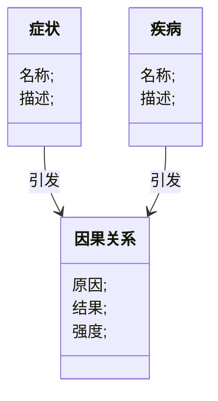
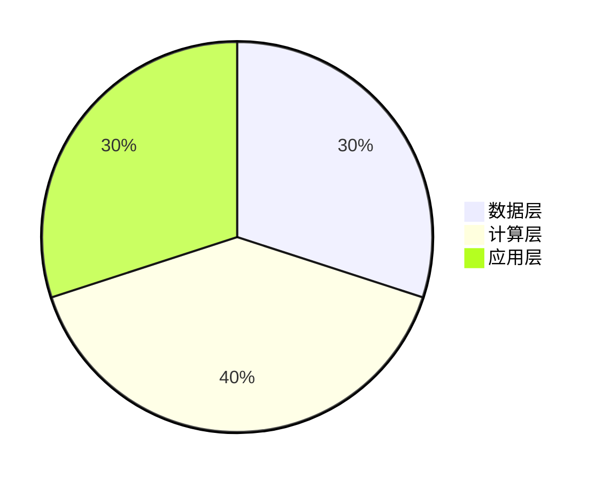
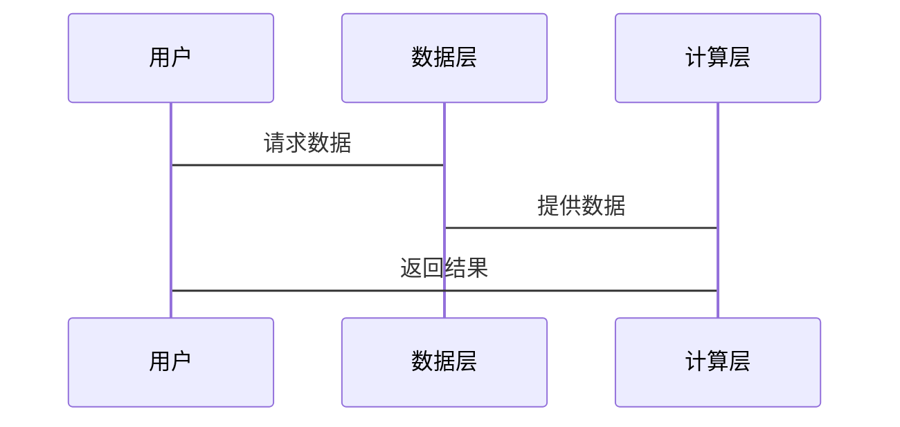

                 


# 构建具有因果推理能力的AI Agent

> 关键词：因果推理、AI Agent、机器学习、人工智能、因果图、反事实推理

> 摘要：本文详细探讨了如何构建具有因果推理能力的AI Agent，从背景介绍到核心概念，从算法原理到系统架构设计，再到项目实战，全面解析了因果推理在AI Agent中的应用与实现。通过本文，读者将掌握构建具备因果推理能力的AI Agent所需的关键技术与方法。

---

# 第一部分: 构建具有因果推理能力的AI Agent背景介绍

## 第1章: 问题背景与描述

### 1.1 问题背景
#### 1.1.1 当前AI Agent的发展现状
AI Agent（人工智能代理）的发展日新月异，广泛应用于自动驾驶、智能推荐、医疗诊断等领域。然而，现有的AI Agent大多依赖相关性分析，缺乏因果推理能力，难以应对复杂的实际问题。

#### 1.1.2 因果推理在AI Agent中的重要性
因果推理是理解因果关系的关键，能够帮助AI Agent从“相关”走向“因果”，从而做出更合理的决策。例如，在医疗诊断中，因果推理可以帮助AI Agent准确判断症状与疾病的因果关系。

#### 1.1.3 当前技术的局限性与挑战
传统AI Agent主要依赖统计学习和相关性分析，难以处理干预、反事实推理等问题。此外，因果推理涉及复杂的数学模型和计算，对计算资源和数据质量要求较高。

---

### 1.2 问题描述
#### 1.2.1 AI Agent的基本定义与功能
AI Agent是一个能够感知环境、自主决策并采取行动的智能体。其核心功能包括感知、推理、规划和执行。

#### 1.2.2 因果推理的核心问题与目标
因果推理的核心问题是识别因果关系，并基于这些关系进行推理和决策。目标是使AI Agent能够理解“为什么”以及“如果改变某个因素，结果会如何变化”。

#### 1.2.3 问题的边界与外延
因果推理的边界包括确定因果关系、处理不确定性、处理反事实推理等问题。外延则涉及领域模型的构建、数据的收集与预处理等。

---

### 1.3 问题解决与边界
#### 1.3.1 因果推理在AI Agent中的解决思路
通过构建因果图（Causal Graph）和反事实推理（Counterfactual Reasoning）等方法，AI Agent可以更好地理解因果关系。

#### 1.3.2 解决方案的边界与可行性分析
因果推理需要高质量的数据和合理的假设，同时需要处理复杂的计算问题。尽管存在挑战，但通过结合统计学习和因果推理，可以逐步实现目标。

#### 1.3.3 相关概念的对比与区别
因果推理与相关性分析的区别在于，因果推理关注因果关系，而相关性分析仅关注变量之间的关联性。

---

### 1.4 核心概念与组成
#### 1.4.1 因果推理的基本原理
因果推理通过构建因果图和潜在结果框架（Potential Outcome Framework）来分析因果关系。

#### 1.4.2 AI Agent的结构与功能模块
AI Agent通常包括感知模块、推理模块、规划模块和执行模块。因果推理能力主要体现在推理模块中。

#### 1.4.3 核心要素与概念之间的关系
因果推理是AI Agent实现高级决策能力的核心要素，通过因果图和反事实推理，AI Agent能够更好地理解环境并做出合理的决策。

---

## 第2章: 因果推理与AI Agent的核心概念

### 2.1 因果推理的基本原理
#### 2.1.1 因果关系的定义与特征
因果关系是指一个事件（原因）导致另一个事件（结果）的发生。其特征包括时间顺序、必要性、充分性和可传递性。

#### 2.1.2 因果推理的基本方法与框架
常用的方法包括潜在结果框架（Potential Outcome Framework）和因果图（Causal Graph）分析。潜在结果框架通过假设干预来分析因果效应，而因果图则通过构建图结构来表示变量之间的因果关系。

#### 2.1.3 因果推理与相关性的区别
因果推理关注因果关系，而相关性分析仅关注变量之间的关联性。因果推理能够处理反事实推理，而相关性分析无法做到。

---

### 2.2 AI Agent的结构与功能
#### 2.2.1 AI Agent的定义与分类
AI Agent可以分为简单反射型、基于模型的反应型、目标驱动型和实用驱动型。目标驱动型AI Agent特别适合应用因果推理。

#### 2.2.2 基于因果推理的AI Agent的特点
基于因果推理的AI Agent能够理解因果关系，能够进行反事实推理，能够在复杂环境中做出合理决策。

#### 2.2.3 AI Agent的核心功能模块
AI Agent的核心功能模块包括感知模块（数据收集与处理）、推理模块（因果推理）、规划模块（决策制定）和执行模块（行动执行）。

---

### 2.3 因果推理与AI Agent的关系
#### 2.3.1 因果推理在AI Agent中的作用
因果推理是AI Agent实现高级决策能力的核心，通过因果推理，AI Agent能够理解因果关系并进行反事实推理。

#### 2.3.2 AI Agent通过因果推理实现的目标
目标包括准确理解因果关系、处理反事实推理、提高决策的准确性和可靠性。

#### 2.3.3 因果推理对AI Agent性能的提升
因果推理能够帮助AI Agent更好地处理不确定性，提高决策的可解释性和可靠性。

---

### 2.4 核心概念对比分析
#### 2.4.1 因果推理与统计学习的对比
因果推理关注因果关系，而统计学习关注变量之间的关联性。因果推理能够处理反事实推理，而统计学习无法做到。

#### 2.4.2 基于因果推理的AI Agent与传统AI Agent的对比
基于因果推理的AI Agent能够理解因果关系，而传统AI Agent仅依赖相关性分析。前者能够进行反事实推理，后者则无法做到。

#### 2.4.3 不同因果推理方法的优缺点对比
潜在结果框架适用于实验设计和因果效应估计，但需要假设干预。因果图适用于复杂因果关系的建模，但需要领域知识。

---

## 2.5 本章小结
通过本章的介绍，我们了解了因果推理的基本原理、AI Agent的结构与功能模块，以及两者之间的关系。因果推理是构建具有因果推理能力的AI Agent的核心，通过因果图和潜在结果框架等方法，AI Agent能够更好地理解因果关系并做出合理决策。

---

## 第3章: 因果推理算法原理

### 3.1 因果推理的基本算法
#### 3.1.1 潜在结果框架（Potential Outcome Framework）
潜在结果框架通过假设干预来分析因果效应。具体步骤包括：
1. 确定干预变量和结果变量。
2. 构建潜在结果模型。
3. 估计因果效应。

#### 3.1.2 因果图（Causal Graph）的构建与分析
因果图通过构建图结构来表示变量之间的因果关系。分析步骤包括：
1. 构建因果图。
2. 检验因果图的合理性。
3. 进行因果推理。

#### 3.1.3 反事实推理（Counterfactual Reasoning）
反事实推理通过假设相反的事实来分析因果关系。具体步骤包括：
1. 构建反事实假设。
2. 计算反事实概率。
3. 进行反事实推理。

---

### 3.2 因果推理算法的实现步骤
#### 3.2.1 数据准备与预处理
1. 收集数据。
2. 清洗数据。
3. 特征工程。

#### 3.2.2 因果图的构建与验证
1. 确定变量之间的关系。
2. 构建因果图。
3. 验证因果图的合理性。

#### 3.2.3 算法选择与参数调优
1. 选择合适的因果推理算法。
2. 调整算法参数。
3. 验证算法性能。

#### 3.2.4 结果分析与解释
1. 分析因果效应。
2. 解释因果关系。
3. 提供决策建议。

---

### 3.3 因果推理算法的数学模型
#### 3.3.1 因果效应的定义与公式
因果效应可以通过以下公式定义：
$$
\text{因果效应} = P(Y|do(X=x)) - P(Y|do(X=x'))
$$
其中，\( Y \) 是结果变量，\( X \) 是干预变量。

#### 3.3.2 因果图的数学表示
因果图可以用图论中的有向图表示，节点表示变量，边表示因果关系。

#### 3.3.3 反事实推理的数学模型
反事实推理可以通过以下公式表示：
$$
\text{反事实概率} = P(Y=y|do(X=x), X=x')
$$
其中，\( y \) 是结果变量，\( x \) 是干预变量，\( x' \) 是原变量。

---

### 3.4 本章小结
通过本章的介绍，我们了解了因果推理的基本算法，包括潜在结果框架、因果图和反事实推理。我们还讨论了这些算法的实现步骤和数学模型，为后续的系统设计和项目实战奠定了基础。

---

## 第4章: 系统分析与架构设计

### 4.1 问题场景介绍
假设我们正在开发一个医疗诊断AI Agent，该Agent需要通过因果推理来分析症状与疾病之间的因果关系。

### 4.2 系统功能设计
#### 4.2.1 领域模型设计
领域模型包括患者症状、疾病、因果关系等实体。可以通过以下mermaid类图表示：



#### 4.2.2 系统架构设计
系统架构包括数据层、计算层和应用层。可以通过以下mermaid架构图表示：



---

### 4.3 系统架构设计
#### 4.3.1 系统架构图
系统架构包括数据层、计算层和应用层。数据层负责数据的存储与管理，计算层负责因果推理的计算，应用层负责与用户的交互。

#### 4.3.2 系统接口设计
系统接口包括数据接口、计算接口和用户接口。数据接口负责数据的输入与输出，计算接口负责因果推理的计算，用户接口负责与用户的交互。

#### 4.3.3 系统交互设计
系统交互可以通过以下mermaid序列图表示：



---

### 4.4 本章小结
通过本章的介绍，我们了解了系统分析与架构设计的基本方法，包括领域模型设计、系统架构设计和系统交互设计。这些设计为后续的项目实战奠定了基础。

---

## 第5章: 项目实战

### 5.1 环境安装
#### 5.1.1 安装Python环境
安装Python 3.8及以上版本，并安装必要的库，如`pymc`、`networkx`和`numpy`。

#### 5.1.2 安装依赖库
使用以下命令安装依赖库：
```bash
pip install pymc networkx numpy
```

---

### 5.2 核心代码实现
#### 5.2.1 因果图的构建与分析
以下是构建因果图的Python代码：

```python
import networkx as nx

# 构建因果图
G = nx.DiGraph()
G.add_edges_from([('X', 'Y'), ('Z', 'Y'), ('X', 'Z')])
```

#### 5.2.2 潜在结果框架的实现
以下是潜在结果框架的Python代码：

```python
import pymc as pm

# 定义潜在结果模型
with pm.Model() as model:
    X = pm.Bernoulli('X', 0.5)
    Z = pm.Bernoulli('Z', p=0.8 * X)
    Y = pm.Bernoulli('Y', p=0.7 * X + 0.3 * Z)
   idata = pm.sample_prior predictive(1000)
```

#### 5.2.3 反事实推理的实现
以下是反事实推理的Python代码：

```python
import numpy as np

# 反事实推理
def counterfactual_reasoning(X, Z):
    return np.where(X == 1, Z, np.random.rand(len(Z)))
```

---

### 5.3 代码解读与分析
#### 5.3.1 因果图的构建与分析
上述代码构建了一个简单的因果图，包括变量X、Z和Y之间的关系。

#### 5.3.2 潜在结果框架的实现
潜在结果框架通过贝叶斯模型估计因果效应，代码中定义了变量X、Z和Y之间的关系，并通过采样生成潜在结果。

#### 5.3.3 反事实推理的实现
反事实推理代码通过假设X的值来生成反事实结果，帮助分析因果关系。

---

### 5.4 案例分析
#### 5.4.1 案例背景
假设我们正在分析症状X、Z与疾病Y之间的因果关系。

#### 5.4.2 数据准备与分析
通过上述代码生成数据，并进行因果推理分析。

#### 5.4.3 结果解读
通过分析结果，我们可以得出症状X和Z对疾病Y的因果效应，并为医疗诊断提供决策建议。

---

### 5.5 本章小结
通过本章的项目实战，我们了解了如何安装环境、实现核心代码，并通过案例分析验证了因果推理算法的可行性。

---

## 第6章: 最佳实践与注意事项

### 6.1 最佳实践
#### 6.1.1 数据质量的重要性
因果推理对数据质量要求较高，需要确保数据的完整性、准确性和代表性。

#### 6.1.2 模型解释性
因果推理模型需要具备较高的解释性，以便用户理解和信任。

#### 6.1.3 模型的可扩展性
因果推理模型需要具备良好的可扩展性，以应对复杂问题和大数据环境。

---

### 6.2 小结
因果推理是构建具有因果推理能力的AI Agent的核心，通过本文的介绍，我们了解了因果推理的基本原理、算法实现和系统设计方法。通过项目实战，我们掌握了因果推理的具体实现技巧和注意事项。

---

### 6.3 注意事项
1. 因果推理需要领域知识和高质量的数据。
2. 模型的解释性和可扩展性需要重点关注。
3. 在实际应用中，需要根据具体问题选择合适的因果推理方法。

---

### 6.4 拓展阅读
1.《Causal Inference in Statistics》
2.《Counterfactual Analysis》
3.《AI Agent Design and Implementation》

---

## 第7章: 参考文献与索引

1. Pearl, J. (2009). Causal Inference in Statistics: A Likelihood Approach.
2. Hernán, M. A., & Robins, J. M. (2019). Causal Inference: What If?
3. Russell, S., & Norvig, P. (2010). Artificial Intelligence: A Modern Approach.
4. Goodman, N. D. (2018). Causal Reasoning in Deep Learning.
5. Bower, R. (2020). Causal Graphs and AI Agent Design.

---

通过本文的详细介绍，读者可以系统地了解如何构建具有因果推理能力的AI Agent，从理论到实践，全面掌握相关技术和方法。

