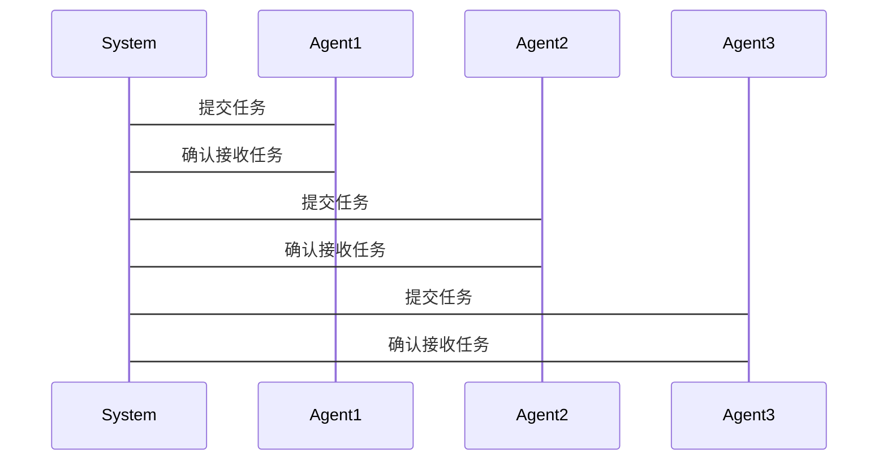

                 


# 构建具有多Agent协同决策能力的系统

> 关键词：多Agent系统、协同决策、分布式计算、一致性算法、博弈论、系统架构

> 摘要：本文详细讲解了构建具有多Agent协同决策能力系统的各个方面，从基本概念到算法原理，从系统设计到项目实战，全面分析了多Agent协同决策的核心思想和实现方法。通过丰富的实例和详细的代码实现，帮助读者掌握多Agent协同决策系统的构建技巧。

---

# 第一部分: 多Agent协同决策系统概述

## 第1章: 多Agent系统的基本概念

### 1.1 多Agent系统概述

#### 1.1.1 什么是多Agent系统
多Agent系统（Multi-Agent System, MAS）是由多个智能体（Agent）组成的分布式系统，这些智能体能够通过协作完成复杂的任务。每个智能体都是一个独立的实体，具有自主性、反应性和社会性。

#### 1.1.2 多Agent系统的特征
- **自主性**：每个Agent都能独立决策。
- **反应性**：Agent能够感知环境并做出实时响应。
- **社会性**：Agent之间可以通过通信协作完成任务。
- **分布性**：系统中的Agent分布在不同的节点上，通过网络进行通信。

#### 1.1.3 多Agent系统的优势与劣势
- **优势**：
  - 高可用性：单个Agent故障不会导致整个系统崩溃。
  - 高扩展性：可以方便地添加新的Agent。
  - 分布式计算能力强：能够处理大规模数据和复杂任务。
- **劣势**：
  - 通信开销大：Agent之间的通信可能会增加系统开销。
  - 协调复杂：多个Agent之间的协作需要复杂的协议和机制。

### 1.2 多Agent协同决策的背景与问题

#### 1.2.1 协同决策的定义
协同决策是指多个智能体通过协作，共同完成决策任务的过程。它强调智能体之间的信息共享和决策协调。

#### 1.2.2 多Agent协同决策的典型问题
- **信息不一致**：不同Agent可能拥有不同的信息，如何整合这些信息是关键。
- **决策冲突**：多个Agent的目标可能不一致，如何协调这些冲突是挑战。
- **实时性要求**：某些场景下，协同决策需要实时完成。

#### 1.2.3 多Agent协同决策的应用场景
- **分布式计算**：如分布式数据库、分布式计算任务调度。
- **智能交通系统**：如自动驾驶汽车之间的协作。
- **机器人协作**：如工业机器人在生产线上的协作。

### 1.3 本章小结
本章介绍了多Agent系统的基本概念、特征、优势与劣势，以及协同决策的背景和应用场景。通过这些内容，读者可以理解多Agent协同决策的基本思想和重要性。

---

## 第2章: 多Agent系统的通信与协作

### 2.1 多Agent通信协议

#### 2.1.1 通信协议的定义
通信协议是多Agent之间进行信息交换的规则。它定义了消息的格式、传输方式和处理流程。

#### 2.1.2 常见的多Agent通信协议
- **FIPA（Foundation for Intelligent Physical Agents）**：基于标准的通信协议，广泛应用于多Agent系统。
- **JADE（Java Agent Development Environment）**：基于J ava的多Agent通信框架。
- **CORBA（Common Object Request Broker Architecture）**：分布式计算标准，支持多Agent通信。

#### 2.1.3 通信协议的选择与实现
选择通信协议时需要考虑系统的扩展性、实时性和安全性。实现通信协议时，需要定义消息格式、通信方式和错误处理机制。

### 2.2 多Agent协作机制

#### 2.2.1 协作机制的分类
- **基于任务分配的协作机制**：根据任务需求分配Agent的角色和任务。
- **基于状态共享的协作机制**：通过共享状态信息实现协作。
- **基于博弈论的协作机制**：通过博弈论模型实现Agent之间的协作。

#### 2.2.2 基于任务分配的协作机制
任务分配是多Agent协作的重要方式。通过任务分配，可以确保每个Agent都能发挥其优势。

#### 2.2.3 基于状态共享的协作机制
状态共享可以确保所有Agent对系统状态有相同的理解，从而做出一致的决策。

### 2.3 本章小结
本章详细讲解了多Agent系统的通信协议和协作机制，包括常见的通信协议、协作机制的分类以及任务分配和状态共享的协作方式。

---

## 第3章: 多Agent系统的决策模型

### 3.1 基于博弈论的决策模型

#### 3.1.1 博弈论的基本概念
博弈论是研究多个决策者在竞争环境下的行为和策略的理论。它可以帮助我们理解多Agent之间的决策过程。

#### 3.1.2 博弈论在多Agent决策中的应用
- **纳什均衡**：在博弈论中，纳什均衡是一种稳定状态，此时每个Agent的策略都是最优的。
- **囚徒困境**：博弈论中的经典案例，用于说明合作与背叛的决策问题。

#### 3.1.3 常见博弈模型的优缺点
- **完全理性模型**：假设所有Agent都是理性的，但实际中可能存在信息不对称的问题。
- **有限理性模型**：考虑了Agent的决策能力有限，更适合实际应用。

### 3.2 基于分布式计算的决策模型

#### 3.2.1 分布式计算的基本原理
分布式计算是将计算任务分布在多个节点上，通过协作完成任务。它强调任务的并行性和资源的共享。

#### 3.2.2 分布式决策模型的实现
分布式决策模型需要考虑数据一致性、任务分配和结果整合等问题。

#### 3.2.3 分布式决策模型的优缺点
- **优点**：高扩展性、高可用性。
- **缺点**：通信开销大、协调复杂。

### 3.3 本章小结
本章介绍了基于博弈论和分布式计算的决策模型，分析了它们的优缺点以及应用场景。

---

## 第4章: 多Agent系统的数学模型与公式

### 4.1 协同决策的数学模型

#### 4.1.1 协同决策的基本数学模型
协同决策的数学模型通常包括状态、动作和奖励三个部分。状态表示系统的当前情况，动作是Agent的决策，奖励是对决策的评估。

#### 4.1.2 协同决策的优化目标
协同决策的优化目标是最大化整体收益，通常可以通过数学公式表示为：
$$ \max_{\theta} \sum_{i=1}^{n} r_i $$
其中，$\theta$是决策参数，$r_i$是第i个Agent的收益。

#### 4.1.3 协同决策的约束条件
协同决策需要满足一定的约束条件，例如：
$$ \sum_{i=1}^{n} x_i = 1 $$
其中，$x_i$是第i个Agent的资源分配比例，总和为1。

### 4.2 基于博弈论的数学公式

#### 4.2.1 博弈论的基本公式
在博弈论中，纳什均衡的条件是：
$$ \forall i, u_i(a_i, a_{-i}) \geq u_i(a'_i, a_{-i}) $$
其中，$u_i$是第i个Agent的效用函数，$a_i$是当前策略，$a'_i$是其他策略。

#### 4.2.2 协同决策的纳什均衡公式
纳什均衡在协同决策中的数学表达式为：
$$ \forall i, u_i(a_i, a_{-i}) \geq u_i(a'_i, a_{-i}) $$
其中，$a_i$是第i个Agent的策略，$a_{-i}$是其他Agent的策略。

#### 4.2.3 协同决策的收益分配公式
收益分配可以采用公平分配原则，例如：
$$ \text{收益分配比例} = \frac{r_i}{\sum_{j=1}^{n} r_j} $$
其中，$r_i$是第i个Agent的收益。

### 4.3 本章小结
本章通过数学公式详细讲解了协同决策的模型和博弈论的原理，为后续的算法实现奠定了基础。

---

## 第5章: 多Agent系统的算法实现

### 5.1 分布式一致性算法

#### 5.1.1 分布式一致性算法的定义
分布式一致性算法用于保证分布式系统中数据的一致性。常见的算法包括Paxos、Raft等。

#### 5.1.2 基于一致性算法的协同决策
通过一致性算法，可以确保多个Agent对系统状态的一致性，从而做出一致的决策。

#### 5.1.3 一致性算法的实现步骤
1. 提出提案。
2. 通过投票确定提案的合法性。
3. 更新系统状态。

### 5.2 协同决策算法

#### 5.2.1 协同决策算法的分类
- **基于一致性的算法**：如Paxos、Raft等。
- **基于分布式优化的算法**：如分布式线性规划、分布式强化学习。

#### 5.2.2 基于一致性算法的协同决策
通过一致性算法，确保多个Agent对系统状态的一致性。

#### 5.2.3 基于分布式优化的协同决策
分布式优化算法通过优化目标函数，实现多个Agent的协同决策。

### 5.3 本章小结
本章详细讲解了分布式一致性算法和协同决策算法的实现，为后续的系统设计提供了算法支持。

---

## 第6章: 多Agent系统的系统分析与架构设计

### 6.1 问题场景介绍

#### 6.1.1 问题背景
假设我们有一个分布式计算任务调度系统，需要多个Agent协作完成任务。

#### 6.1.2 问题描述
多个Agent需要协作完成任务分配、资源分配和结果整合。

### 6.2 系统功能设计

#### 6.2.1 领域模型类图
```mermaid
classDiagram
    class Agent {
        id: int
        role: string
        state: string
    }
    class Task {
        id: int
        type: string
        status: string
    }
    class System {
        agents: list(Agent)
        tasks: list(Task)
        allocateTask(Agent, Task)
        updateState(Agent, Task)
    }
    System -> Agent: manage
    System -> Task: manage
```

#### 6.2.2 系统架构设计
```mermaid
archiectureDiagram
    [System] -- (通信模块) -- [Agent1]
    [System] -- (通信模块) -- [Agent2]
    [System] -- (通信模块) -- [Agent3]
```

#### 6.2.3 系统接口设计
- **allocateTask(Agent, Task)**：分配任务给特定的Agent。
- **updateState(Agent, Task)**：更新Agent的状态。

#### 6.2.4 系统交互序列图


### 6.3 本章小结
本章通过系统分析和架构设计，详细讲解了多Agent协同决策系统的实现方案。

---

## 第7章: 多Agent系统的项目实战

### 7.1 环境安装与配置

#### 7.1.1 环境要求
- 操作系统：Linux/Windows/MacOS
- 开发工具：Python/Java/C++
- 依赖库：Paxos/Raft框架

#### 7.1.2 环境配置
安装必要的依赖库，配置开发环境。

### 7.2 系统核心实现

#### 7.2.1 通信模块实现
使用FIPA协议实现Agent之间的通信。

#### 7.2.2 任务分配模块实现
基于一致性算法实现任务分配。

#### 7.2.3 决策模块实现
基于分布式优化算法实现决策。

### 7.3 代码实现与解读

#### 7.3.1 Python代码实现
```python
class Agent:
    def __init__(self, id):
        self.id = id
        self.role = "idle"
        self.state = "inactive"
        
    def receive_task(self, task):
        self.role = "busy"
        self.state = "active"
        
    def complete_task(self):
        self.role = "idle"
        self.state = "inactive"
```

#### 7.3.2 系统代码实现
```python
class System:
    def __init__(self):
        self.agents = []
        self.tasks = []
        
    def allocate_task(self, agent, task):
        agent.receive_task(task)
        
    def complete_task(self, agent):
        agent.complete_task()
```

#### 7.3.3 代码解读
- **Agent类**：表示单个Agent，包含角色和状态属性。
- **System类**：管理多个Agent和任务，实现任务分配和完成。

### 7.4 案例分析与详细解读

#### 7.4.1 实际案例
假设我们有一个分布式计算任务调度系统，包含3个Agent，每个Agent负责不同的任务。

#### 7.4.2 案例分析
1. 系统初始化。
2. 分配任务给Agent1。
3. Agent1完成任务，系统更新状态。

### 7.5 本章小结
本章通过项目实战，详细讲解了多Agent协同决策系统的实现过程，包括环境配置、代码实现和案例分析。

---

## 第8章: 总结与展望

### 8.1 总结
本篇文章详细讲解了构建具有多Agent协同决策能力系统的各个方面，包括基本概念、通信协议、决策模型、算法原理、系统设计和项目实战。

### 8.2 未来展望
未来，随着人工智能和分布式计算的发展，多Agent协同决策系统将有更广泛的应用场景。我们需要进一步研究高效的通信协议和决策算法，以应对更大的挑战。

### 8.3 小结
通过本文的学习，读者可以掌握多Agent协同决策系统的构建方法，并能够将其应用到实际项目中。

---

# 附录: 常用工具与库

- **通信库**：FIPA、JADE、CORBA
- **一致性算法库**：Paxos、Raft
- **分布式计算框架**：Docker、Kubernetes

---

# 参考文献

1. FIPA标准文档
2. JADE官方文档
3. Paxos一致性算法论文
4. 分布式计算教材

---

通过以上内容，我们可以系统地构建一个具有多Agent协同决策能力的系统。从基础概念到算法实现，从系统设计到项目实战，本文提供了全面的指导和详细的代码实现。希望本文能够帮助读者掌握多Agent协同决策的核心思想和实现方法。

