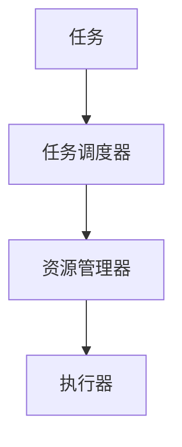
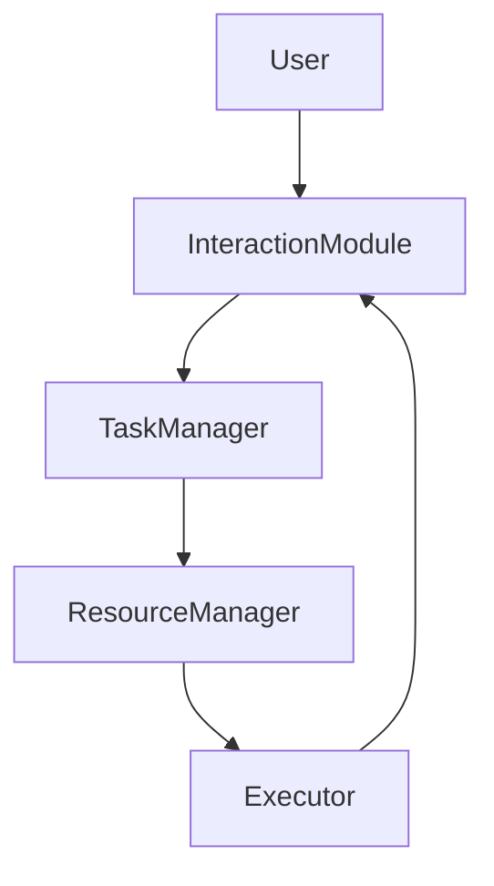

                 


# 构建具有多任务处理能力的AI Agent

## 关键词：AI Agent, 多任务处理, 任务调度, 资源分配, 并行计算

## 摘要：  
在现代人工智能系统中，构建具有多任务处理能力的AI Agent是实现高效、智能和灵活系统的关键。本文将从背景介绍、核心概念、算法原理、系统架构、项目实战到最佳实践，详细讲解如何构建一个能够同时处理多个任务的AI Agent。通过具体的技术分析和实例实现，帮助读者全面理解多任务处理AI Agent的设计与实现。

---

## 第一部分: 多任务处理AI Agent的背景与核心概念

### 第1章: 多任务处理AI Agent的背景介绍

#### 1.1 问题背景与问题描述
现代AI系统往往需要在复杂环境中完成多种任务，例如智能助手需要同时处理用户的消息响应、日历管理、任务提醒等。然而，传统AI Agent通常只能处理单一任务，难以应对多任务场景的需求。多任务处理AI Agent的构建需求由此而来。

#### 1.2 问题解决与边界定义
多任务处理AI Agent的目标是实现任务的并行处理、资源的有效分配和任务间的协同。其边界包括任务类型、资源限制和任务优先级。

#### 1.3 多任务处理的核心目标
- **任务并行处理**：实现多个任务的同时执行。
- **资源高效利用**：合理分配计算资源以避免冲突。
- **任务协同**：处理任务之间的依赖关系和协同需求。

### 第2章: 多任务处理AI Agent的核心概念与联系

#### 2.1 核心概念原理
- **任务调度机制**：通过优先级或负载均衡算法分配任务。
- **资源分配策略**：动态分配计算资源以适应任务需求。
- **并行处理原理**：利用多线程或分布式计算技术实现任务并行。

#### 2.2 概念属性特征对比表
| 概念 | 属性 | 特征 |
|------|------|------|
| 任务调度 | 优先级 | 静态/动态 |
| 资源分配 | 负载均衡 | CPU/内存/网络 |
| 并行处理 | 并行粒度 | 细粒度/粗粒度 |

#### 2.3 ER实体关系图


---

## 第二部分: 多任务处理AI Agent的算法原理

### 第3章: 多任务处理算法原理

#### 3.1 任务调度算法
基于优先级的调度算法：
1. 任务优先级计算公式：
   $$ 优先级 = 权重1 \times 属性1 + 权重2 \times 属性2 $$
2. 示例代码：
   ```python
   def calculate_priority(task, weight1, weight2):
       attribute1 = task.get_attribute1()
       attribute2 = task.get_attribute2()
       return weight1 * attribute1 + weight2 * attribute2
   ```

#### 3.2 资源分配策略
- 基于负载均衡的资源分配算法：
  ```mermaid
  graph TD
      LoadBalancer --> Worker1
      LoadBalancer --> Worker2
      LoadBalancer --> Worker3
  ```

#### 3.3 并行处理实现
细粒度并行处理示例：
```python
import threading

def task_function(args):
    # 处理任务
    pass

threads = []
for task in tasks:
    thread = threading.Thread(target=task_function, args=(task,))
    thread.start()
    threads.append(thread)

for thread in threads:
    thread.join()
```

---

## 第三部分: 系统分析与架构设计方案

### 第4章: 系统架构设计

#### 4.1 项目背景介绍
构建一个多任务处理AI Agent，用于智能家居环境中的设备控制、信息查询和日程管理。

#### 4.2 系统功能设计
- 用户交互模块
- 任务管理模块
- 资源管理模块
- 执行器模块

#### 4.3 系统架构图


#### 4.4 系统接口设计
- `start_task(task)`：启动任务。
- `stop_task(task_id)`：停止任务。
- `get_task_status(task_id)`：获取任务状态。

---

## 第四部分: 项目实战

### 第5章: 项目实战

#### 5.1 环境安装
安装Python、多线程库和相关AI框架。

#### 5.2 核心代码实现
```python
import threading

class TaskManager:
    def __init__(self):
        self.tasks = []
        self.active_threads = []

    def add_task(self, task):
        self.tasks.append(task)

    def start_task(self, task):
        thread = threading.Thread(target=self.execute_task, args=(task,))
        thread.start()
        self.active_threads.append(thread)

    def execute_task(self, task):
        # 处理任务
        print(f"Executing task: {task}")

    def stop_task(self, task_id):
        for thread in self.active_threads:
            if thread.getName() == task_id:
                thread.join()
                self.active_threads.remove(thread)

# 使用示例
task_manager = TaskManager()
task1 = "下载文件"
task2 = "处理邮件"
task_manager.add_task(task1)
task_manager.add_task(task2)
task_manager.start_task(task1)
task_manager.start_task(task2)
```

#### 5.3 代码功能解读与分析
- `TaskManager`类管理任务列表和线程。
- `start_task`方法启动任务并添加线程。
- `stop_task`方法根据任务ID停止任务。

---

## 第五部分: 最佳实践与总结

### 第6章: 最佳实践

#### 6.1 注意事项
- **资源分配**：避免资源争抢，使用锁机制。
- **任务优先级**：动态调整优先级以适应任务需求。
- **错误处理**：处理任务执行中的异常。

#### 6.2 小结
构建多任务处理AI Agent需要综合考虑任务调度、资源分配和并行处理。通过合理设计算法和架构，可以实现高效的任务管理。

#### 6.3 拓展阅读
- 多线程与多进程的区别
- 分布式任务调度系统
- AI Agent的协同工作机制

---

通过以上内容，读者可以全面理解构建具有多任务处理能力的AI Agent的技术细节和实现方法。

