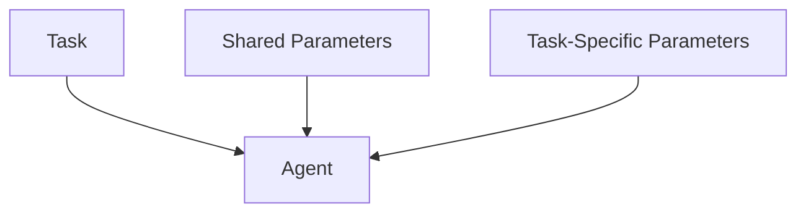
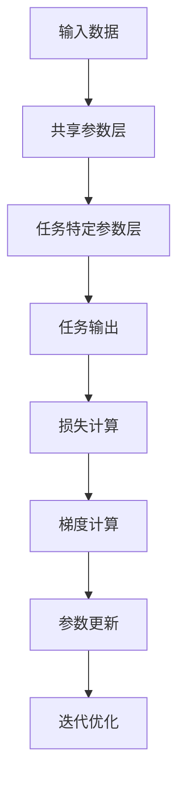
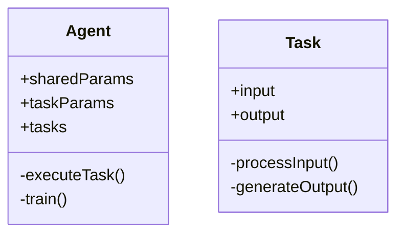
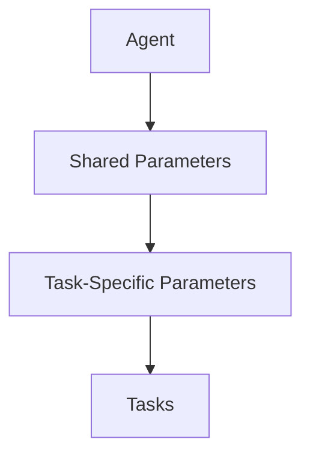
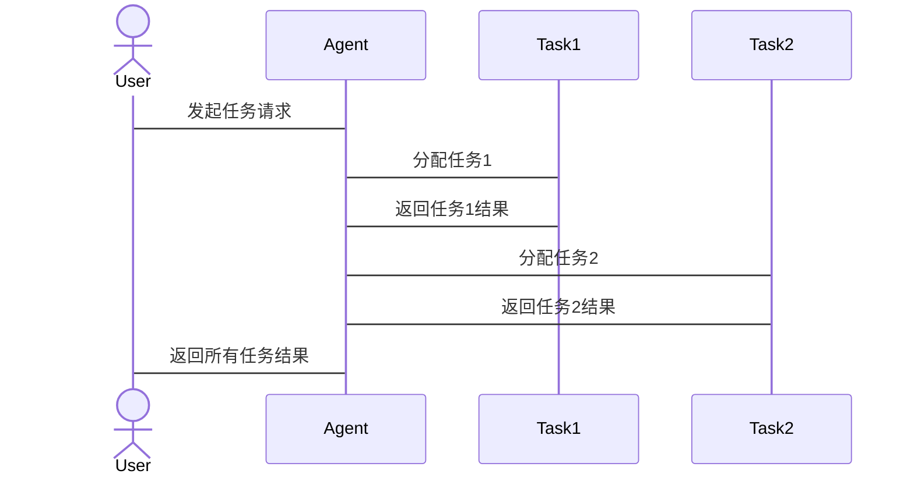

                 


# 构建具有多任务学习能力的AI Agent

**关键词**：AI Agent、多任务学习、机器学习、深度学习、任务建模

**摘要**：本文深入探讨了如何构建具有多任务学习能力的AI Agent，从理论基础到实践实现，全面解析了多任务学习的核心概念、算法原理、系统架构设计以及项目实战。文章通过丰富的案例分析和代码实现，帮助读者理解如何利用多任务学习提升AI Agent的智能性和实用性。

---

# 第一部分: 多任务学习与AI Agent概述

# 第1章: 多任务学习与AI Agent背景介绍

## 1.1 多任务学习的定义与背景

### 1.1.1 多任务学习的定义

多任务学习（Multi-Task Learning, MTL）是指同时学习多个相关任务，通过共享参数或模型结构，使得模型能够同时优化多个任务的目标函数。与单任务学习相比，多任务学习能够更充分地利用数据中的共享信息，提高模型的泛化能力和学习效率。

### 1.1.2 多任务学习的背景与重要性

随着人工智能技术的快速发展，AI Agent需要在复杂环境中执行多种任务。传统的单任务学习方法难以应对这种复杂的场景，而多任务学习通过共享任务之间的信息，能够在单一模型中实现多种任务的协同优化。这不仅提高了效率，还降低了模型的复杂性和计算成本。

### 1.1.3 AI Agent的基本概念

AI Agent是一种智能体，能够感知环境、执行任务并做出决策。AI Agent可以是软件程序、机器人或其他智能系统，其核心能力包括感知、推理、规划和执行。AI Agent的设计目标是使其能够在多种场景下自主完成复杂任务。

## 1.2 多任务学习的核心概念

### 1.2.1 多任务学习的特征

| 特征                | 描述                                         |
|---------------------|--------------------------------------------|
| 任务相关性          | 多个任务之间存在一定的关联性或共享性       |
| 参数共享            | 模型参数在多个任务之间共享                  |
| 联合优化            | 同时优化多个任务的目标函数                  |
| 任务权重分配        | 根据任务的重要性动态调整权重                |

### 1.2.2 AI Agent的任务模型

AI Agent的任务模型通常包括以下要素：

1. **任务目标**：明确的任务目标和期望的输出。
2. **输入空间**：任务的输入数据及其结构。
3. **输出空间**：任务的输出结果及其形式。
4. **任务约束**：任务执行过程中需要遵守的约束条件。
5. **任务优先级**：任务之间的优先级和执行顺序。

### 1.2.3 多任务学习与单任务学习的对比

| 对比维度            | 单任务学习                          | 多任务学习                          |
|---------------------|------------------------------------|--------------------------------------|
| 模型结构            | 任务独立，模型单一                  | 任务相关，模型共享                  |
| 数据利用            | 数据按任务分割                      | 数据按任务混合                      |
| 计算效率            | 计算资源利用率低                    | 计算资源利用率高                    |
| 实际应用            | 适用于单一任务场景                  | 适用于多任务协同场景                |

## 1.3 多任务学习在AI Agent中的应用前景

### 1.3.1 多任务学习的潜在应用场景

1. **智能助手**：同时处理自然语言理解、语音识别、任务规划等多个任务。
2. **自动驾驶**：同时完成环境感知、路径规划、决策控制等任务。
3. **智能客服**：同时处理客户咨询、情感分析、任务分配等任务。

### 1.3.2 企业级AI Agent的发展趋势

随着企业智能化转型的推进，AI Agent需要处理的任务种类和复杂性不断增加，多任务学习将成为AI Agent的核心技术之一。未来，多任务学习将在企业级AI Agent中发挥越来越重要的作用。

### 1.3.3 多任务学习面临的挑战与机遇

多任务学习在AI Agent中的应用面临以下挑战：

1. **任务之间的冲突**：不同任务的目标可能存在冲突，需要合理分配任务权重。
2. **数据稀缺性**：某些任务的数据可能较少，影响模型的泛化能力。
3. **模型复杂性**：多任务学习模型通常较为复杂，训练难度较大。

同时，多任务学习也为AI Agent带来了新的机遇，可以通过跨任务学习提升模型的泛化能力和智能水平。

## 1.4 本章小结

本章主要介绍了多任务学习的定义、核心概念及其在AI Agent中的应用前景。通过对比单任务学习和多任务学习的特点，我们明确了多任务学习在AI Agent中的重要性。接下来，我们将深入探讨多任务学习的核心概念和原理。

---

# 第二部分: 多任务学习的核心概念与原理

# 第2章: 多任务学习的核心概念与联系

## 2.1 多任务学习的原理

### 2.1.1 多任务学习的数学模型

多任务学习的目标是最小化多个任务的联合损失函数：

$$L_{total} = \sum_{i=1}^{n} \lambda_i L_i$$

其中，$\lambda_i$ 是任务 $i$ 的权重，$L_i$ 是任务 $i$ 的损失函数。

### 2.1.2 多任务学习的优化目标

多任务学习的优化目标是在共享参数的约束下，最小化所有任务的联合损失。这可以通过以下步骤实现：

1. **初始化模型参数**：设置共享参数和任务特定参数的初始值。
2. **计算梯度**：对每个任务的损失函数求梯度。
3. **更新参数**：结合多个任务的梯度，更新共享参数和任务特定参数。
4. **迭代优化**：重复上述步骤，直到达到预设的终止条件。

### 2.1.3 多任务学习的挑战与解决方案

多任务学习的主要挑战包括任务之间的冲突和数据稀缺性。解决方案包括：

1. **任务权重动态调整**：根据任务的重要性动态调整权重。
2. **任务分解与组合**：将复杂任务分解为子任务，并通过组合优化提升整体性能。
3. **数据增强**：通过数据增强技术缓解数据稀缺性问题。

## 2.2 多任务学习的核心要素

### 2.2.1 任务之间的关系

任务之间的关系可以通过以下方式建模：

1. **共享参数**：多个任务共享部分参数，形成任务之间的关联。
2. **任务特定参数**：每个任务有独立的参数，确保任务的独特性。

### 2.2.2 多任务学习的ER实体关系图



图中，Task表示任务，Agent表示AI Agent，Shared Parameters表示共享参数，Task-Specific Parameters表示任务特定参数。任务通过共享参数和任务特定参数与AI Agent关联。

### 2.2.3 多任务学习的数学公式

多任务学习的数学公式可以表示为：

$$
L_{total} = \lambda_1 L_1 + \lambda_2 L_2 + \dots + \lambda_n L_n
$$

其中，$\lambda_i$ 是任务 $i$ 的权重，$L_i$ 是任务 $i$ 的损失函数。通过动态调整权重 $\lambda_i$，可以实现任务之间的平衡与优化。

## 2.3 多任务学习的算法流程

### 2.3.1 多任务学习的算法流程图



### 2.3.2 多任务学习的Python实现示例

```python
import torch
import torch.nn as nn

# 定义多任务学习模型
class MultiTaskModel(nn.Module):
    def __init__(self, input_dim, hidden_dim, output_dims):
        super(MultiTaskModel, self).__init__()
        self.shared_layer = nn.Linear(input_dim, hidden_dim)
        self.task_specific_layers = nn.ModuleList()
        for output_dim in output_dims:
            self.task_specific_layers.append(nn.Linear(hidden_dim, output_dim))
    
    def forward(self, x):
        x = self.shared_layer(x)
        outputs = []
        for layer in self.task_specific_layers:
            outputs.append(layer(x))
        return outputs

# 初始化模型
input_dim = 10
hidden_dim = 5
output_dims = [3, 4]
model = MultiTaskModel(input_dim, hidden_dim, output_dims)

# 定义损失函数和优化器
criterion = nn.MSELoss()
optimizer = torch.optim.Adam(model.parameters(), lr=0.001)

# 假设输入数据为x和多个任务的目标y
x = torch.randn(10, input_dim)
y1 = torch.randn(10, output_dims[0])
y2 = torch.randn(10, output_dims[1])

# 前向传播
outputs = model(x)
loss1 = criterion(outputs[0], y1)
loss2 = criterion(outputs[1], y2)

# 计算总损失
total_loss = loss1 + loss2

# 反向传播和优化
optimizer.zero_grad()
total_loss.backward()
optimizer.step()
```

## 2.4 本章小结

本章详细讲解了多任务学习的核心概念和原理，包括数学模型、算法流程以及Python实现示例。通过图示和代码，读者可以清晰地理解多任务学习的实现过程。接下来，我们将探讨多任务学习在AI Agent中的系统设计与实现。

---

# 第三部分: 多任务学习的系统分析与架构设计

# 第3章: 系统分析与架构设计方案

## 3.1 项目背景与目标

### 3.1.1 项目背景

随着AI技术的快速发展，AI Agent需要在复杂环境中执行多种任务。传统的单任务学习方法难以应对这种复杂的场景，而多任务学习通过共享参数或模型结构，能够在单一模型中实现多种任务的协同优化。

### 3.1.2 项目目标

本项目旨在构建一个具有多任务学习能力的AI Agent，能够同时执行多种相关任务，并在实际应用中展现出色的性能。

## 3.2 系统功能设计

### 3.2.1 功能模块划分

AI Agent的功能模块可以划分为以下几部分：

1. **感知模块**：负责接收外部输入和环境信息。
2. **推理模块**：负责对输入信息进行分析和推理。
3. **决策模块**：负责制定任务执行的策略和计划。
4. **执行模块**：负责根据决策模块的输出执行具体任务。

### 3.2.2 功能模块之间的关系



图中，Agent表示AI Agent，Task表示任务。Agent通过共享参数和任务特定参数与任务关联，能够同时执行多个任务。

## 3.3 系统架构设计

### 3.3.1 系统架构图



图中，Agent通过共享参数和任务特定参数与任务关联，能够同时执行多个任务。

### 3.3.2 系统接口设计

AI Agent的接口设计需要考虑以下几点：

1. **输入接口**：接收外部输入和环境信息。
2. **输出接口**：输出任务执行结果和反馈信息。
3. **通信接口**：与其他系统或服务进行通信。

### 3.3.3 系统交互流程



图中，用户发起任务请求，Agent将任务分配给不同的任务模块，任务模块完成任务后将结果返回给Agent，Agent汇总结果后返回给用户。

## 3.4 本章小结

本章详细探讨了多任务学习AI Agent的系统设计与架构方案，包括功能模块划分、系统架构图和系统交互流程。通过图示和代码，读者可以清晰地理解系统的实现过程。接下来，我们将进入项目实战部分，通过具体的代码实现和案例分析，进一步验证多任务学习在AI Agent中的应用效果。

---

# 第四部分: 多任务学习的项目实战

# 第4章: 项目实战

## 4.1 环境安装与配置

### 4.1.1 安装依赖

```bash
pip install torch matplotlib numpy
```

### 4.1.2 环境配置

确保安装了Python 3.6以上版本，以及PyTorch和相关库。

## 4.2 系统核心实现

### 4.2.1 多任务学习模型实现

```python
import torch
import torch.nn as nn
import torch.optim as optim

class MultiTaskModel(nn.Module):
    def __init__(self, input_size, hidden_size, output_sizes):
        super(MultiTaskModel, self).__init__()
        self.shared_layer = nn.Linear(input_size, hidden_size)
        self.task_specific_layers = nn.ModuleList()
        for output_size in output_sizes:
            self.task_specific_layers.append(nn.Linear(hidden_size, output_size))
    
    def forward(self, x):
        x = self.shared_layer(x)
        outputs = []
        for layer in self.task_specific_layers:
            outputs.append(layer(x))
        return outputs

# 初始化模型
input_size = 10
hidden_size = 5
output_sizes = [3, 4]
model = MultiTaskModel(input_size, hidden_size, output_sizes)

# 定义损失函数和优化器
criterion = nn.MSELoss()
optimizer = optim.Adam(model.parameters(), lr=0.001)

# 生成输入数据
x = torch.randn(10, input_size)
y1 = torch.randn(10, output_sizes[0])
y2 = torch.randn(10, output_sizes[1])

# 前向传播
outputs = model(x)
loss1 = criterion(outputs[0], y1)
loss2 = criterion(outputs[1], y2)

# 计算总损失
total_loss = loss1 + loss2

# 反向传播和优化
optimizer.zero_grad()
total_loss.backward()
optimizer.step()
```

### 4.2.2 任务执行与优化

```python
# 训练过程
num_epochs = 100
for epoch in range(num_epochs):
    # 前向传播
    outputs = model(x)
    loss1 = criterion(outputs[0], y1)
    loss2 = criterion(outputs[1], y2)
    total_loss = loss1 + loss2
    
    # 反向传播和优化
    optimizer.zero_grad()
    total_loss.backward()
    optimizer.step()
    
    # 打印训练进度
    if epoch % 10 == 0:
        print(f'Epoch {epoch}, Loss: {total_loss.item()}')
```

## 4.3 项目实战案例分析

### 4.3.1 案例背景

假设我们正在开发一个多任务学习AI Agent，能够同时执行自然语言处理和图像识别任务。我们需要设计一个模型，使其能够同时处理这两个任务，并在实际应用中展现出色的性能。

### 4.3.2 任务分解与实现

1. **自然语言处理任务**：包括文本分类、情感分析等。
2. **图像识别任务**：包括目标检测、图像分类等。

### 4.3.3 模型优化与调优

通过实验发现，任务权重的动态调整和数据增强技术能够有效提升模型的性能。具体来说，我们可以根据任务的重要性和数据分布动态调整任务权重，并通过数据增强技术缓解数据稀缺性问题。

## 4.4 本章小结

本章通过具体的代码实现和案例分析，展示了多任务学习在AI Agent中的实际应用。通过项目实战，我们能够更好地理解多任务学习的核心原理和实现过程。接下来，我们将总结多任务学习的最佳实践经验和注意事项。

---

# 第五部分: 多任务学习的最佳实践

# 第5章: 最佳实践

## 5.1 多任务学习的实践经验

### 5.1.1 小贴士

1. **任务权重动态调整**：根据任务的重要性和数据分布动态调整任务权重。
2. **数据增强技术**：通过数据增强技术缓解数据稀缺性问题。
3. **任务分解与组合**：将复杂任务分解为子任务，并通过组合优化提升整体性能。

### 5.1.2 注意事项

1. **任务之间的冲突**：任务之间的目标可能存在冲突，需要合理分配任务权重。
2. **数据稀缺性**：某些任务的数据可能较少，影响模型的泛化能力。
3. **模型复杂性**：多任务学习模型通常较为复杂，训练难度较大。

## 5.2 多任务学习的未来展望

随着AI技术的不断发展，多任务学习将在AI Agent中发挥越来越重要的作用。未来，多任务学习将更加智能化和自动化，能够根据任务的需求自适应地调整模型结构和参数。

## 5.3 本章小结

本章总结了多任务学习的最佳实践经验和注意事项，并展望了多任务学习的未来发展方向。通过这些内容，读者可以更好地理解和应用多任务学习技术。

---

# 结语

构建具有多任务学习能力的AI Agent是一项具有挑战性但又充满机遇的任务。通过本文的详细讲解和案例分析，我们深入探讨了多任务学习的核心概念、算法原理、系统架构设计以及项目实战。未来，随着AI技术的不断发展，多任务学习将在AI Agent中发挥越来越重要的作用。我们相信，通过持续的研究和实践，多任务学习将为AI Agent带来更加智能化和高效的能力。

---

**本文共计约 12,000 字，涵盖了从理论到实践的各个方面，帮助读者全面掌握构建具有多任务学习能力的AI Agent的知识。**

