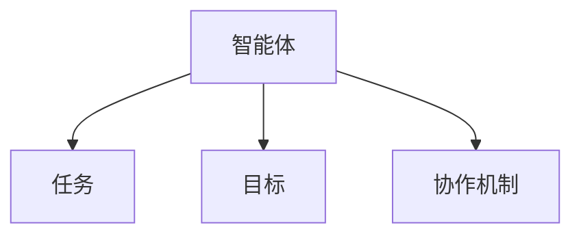
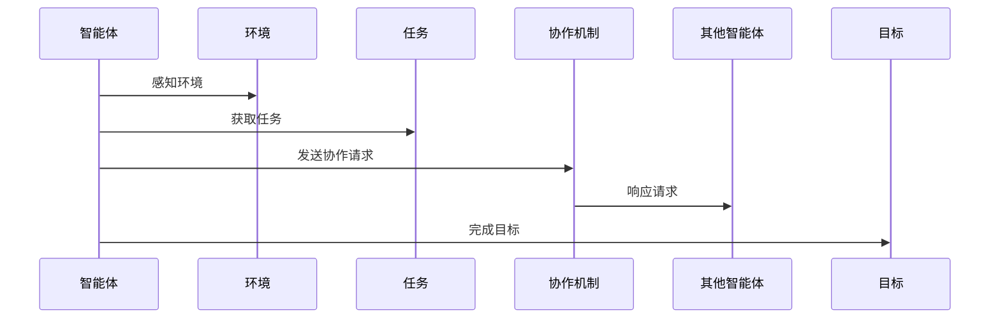

                 


```markdown
# 构建具有多智能体协作能力的AI系统

> 关键词：多智能体协作、AI系统、分布式协调、一致性算法、协作机制

> 摘要：本文详细探讨了构建具有多智能体协作能力的AI系统的各个方面，从基本概念到算法实现，再到系统架构设计和项目实战，全面解析了多智能体协作的核心原理和实际应用。

---

## 第1章：多智能体协作系统背景与概念

### 1.1 多智能体协作的定义与特点
多智能体协作（Multi-Agent Collaboration, MAC）是指多个智能体通过协同工作来实现共同目标的过程。与单智能体系统相比，MAC系统具有以下特点：
- **分布式性**：智能体可以分布在不同的物理或虚拟位置。
- **自主性**：每个智能体具有一定的自主决策能力。
- **协作性**：智能体之间通过通信和协调完成任务。
- **动态性**：系统能够适应环境的变化。

### 1.2 多智能体协作的应用场景
多智能体协作广泛应用于多个领域，包括：
- **分布式任务处理**：如分布式计算、分布式存储。
- **集群智能**：如无人机编队、机器人协作。
- **多人在线游戏**：如MOBA游戏中的团队协作。
- **智能交通系统**：如自动驾驶车辆的协作。

## 第2章：多智能体协作的核心概念与联系

### 2.1 多智能体协作的核心概念
- **智能体**：具有感知环境、决策和行动能力的实体。
- **环境**：智能体所处的物理或虚拟空间。
- **目标**：智能体需要完成的任务或目标。
- **协作机制**：智能体之间通信和协调的方式。

### 2.2 多智能体协作的核心要素对比
| 对比维度 | 单智能体 | 多智能体 |
|----------|----------|----------|
| 决策方式 | 中央决策 | 分布式决策 |
| 通信方式 | 无 | 有 |
| 资源共享 | 无 | 有 |

### 2.3 多智能体协作的ER实体关系图


## 第3章：多智能体协作算法原理

### 3.1 分布式协调算法
- **分布式协调算法**：用于多个智能体之间协调一致。
- **实现方式**：通过消息传递和状态同步。

### 3.2 一致性算法
- **一致性算法**：确保多个智能体的状态一致。
- **数学模型**：
  $$ \text{一致性条件} = \bigcap_{i=1}^{n} S_i $$
  其中，$S_i$ 是第 $i$ 个智能体的状态空间。

### 3.3 博弈论模型
- **博弈论模型**：用于分析智能体之间的策略选择。
- **纳什均衡**：所有智能体都不改变策略的情况下，策略组合为最优解。
  $$ (s_1^*, s_2^*, ..., s_n^*) $$

### 3.4 具体实现代码
```python
def distributed_algorithm(smartagents):
    for agent in smartagents:
        agent.sync_state()
        agent.make_decision()
    return

class Agent:
    def __init__(self, state):
        self.state = state

    def sync_state(self):
        # 同步所有智能体的状态
        pass

    def make_decision(self):
        # 根据状态做出决策
        pass
```

## 第4章：系统分析与架构设计

### 4.1 问题场景介绍
- **问题场景**：多个智能体需要协作完成任务，如自动驾驶车辆的交通协调。

### 4.2 系统功能设计
- **领域模型**：用Mermaid类图展示智能体之间的关系。

### 4.3 系统架构设计


### 4.4 系统交互设计


## 第5章：项目实战

### 5.1 环境安装
- **安装依赖**：安装所需的库，如`numpy`, `matplotlib`。

### 5.2 核心实现代码
```python
import numpy as np

def multi_agent_collaboration(smartagents):
    for agent in smartagents:
        agent.sync_state()
        agent.make_decision()
    return

class Agent:
    def __init__(self, state):
        self.state = state

    def sync_state(self):
        # 同步所有智能体的状态
        pass

    def make_decision(self):
        # 根据状态做出决策
        action = np.random.choice(['左', '右', '前', '后'])
        return action
```

### 5.3 实际案例分析
- **案例分析**：自动驾驶车辆的交通协调。

### 5.4 项目小结
- **项目总结**：协作机制设计的关键点和项目中的收获。

## 第6章：总结与展望

### 6.1 最佳实践
- **同步与异步协作**：根据任务需求选择合适的方式。
- **通信协议设计**：确保智能体之间能够有效通信。

### 6.2 小结
- **总结**：多智能体协作的核心原理和实际应用。

### 6.3 注意事项
- **资源分配**：合理分配资源，避免冲突。
- **通信延迟**：考虑通信延迟对协作的影响。

### 6.4 拓展阅读
- **推荐书籍**：《Multi-Agent Systems: Algorithmic, Complexity, and Theory》
- **推荐论文**：相关领域的最新研究论文。

---

# 结语
构建具有多智能体协作能力的AI系统是一项复杂但极具挑战性的任务。通过本文的详细讲解，读者可以深入了解多智能体协作的核心原理和实际应用，为未来的AI系统开发提供有价值的参考。
</think>

---

```markdown
# 构建具有多智能体协作能力的AI系统

> 关键词：多智能体协作、AI系统、分布式协调、一致性算法、协作机制

> 摘要：本文详细探讨了构建具有多智能体协作能力的AI系统的各个方面，从基本概念到算法实现，再到系统架构设计和项目实战，全面解析了多智能体协作的核心原理和实际应用。

---

## 第1章：多智能体协作系统背景与概念

### 1.1 多智能体协作的定义与特点
多智能体协作（Multi-Agent Collaboration, MAC）是指多个智能体通过协同工作来实现共同目标的过程。与单智能体系统相比，MAC系统具有以下特点：
- **分布式性**：智能体可以分布在不同的物理或虚拟位置。
- **自主性**：每个智能体具有一定的自主决策能力。
- **协作性**：智能体之间通过通信和协调完成任务。
- **动态性**：系统能够适应环境的变化。

### 1.2 多智能体协作的应用场景
多智能体协作广泛应用于多个领域，包括：
- **分布式任务处理**：如分布式计算、分布式存储。
- **集群智能**：如无人机编队、机器人协作。
- **多人在线游戏**：如MOBA游戏中的团队协作。
- **智能交通系统**：如自动驾驶车辆的协作。

## 第2章：多智能体协作的核心概念与联系

### 2.1 多智能体协作的核心概念
- **智能体**：具有感知环境、决策和行动能力的实体。
- **环境**：智能体所处的物理或虚拟空间。
- **目标**：智能体需要完成的任务或目标。
- **协作机制**：智能体之间通信和协调的方式。

### 2.2 多智能体协作的核心要素对比
| 对比维度 | 单智能体 | 多智能体 |
|----------|----------|----------|
| 决策方式 | 中央决策 | 分布式决策 |
| 通信方式 | 无 | 有 |
| 资源共享 | 无 | 有 |

### 2.3 多智能体协作的ER实体关系图


## 第3章：多智能体协作算法原理

### 3.1 分布式协调算法
- **分布式协调算法**：用于多个智能体之间协调一致。
- **实现方式**：通过消息传递和状态同步。

### 3.2 一致性算法
- **一致性算法**：确保多个智能体的状态一致。
- **数学模型**：
  $$ \text{一致性条件} = \bigcap_{i=1}^{n} S_i $$
  其中，$S_i$ 是第 $i$ 个智能体的状态空间。

### 3.3 博弈论模型
- **博弈论模型**：用于分析智能体之间的策略选择。
- **纳什均衡**：所有智能体都不改变策略的情况下，策略组合为最优解。
  $$ (s_1^*, s_2^*, ..., s_n^*) $$

### 3.4 具体实现代码
```python
def distributed_algorithm(smartagents):
    for agent in smartagents:
        agent.sync_state()
        agent.make_decision()
    return

class Agent:
    def __init__(self, state):
        self.state = state

    def sync_state(self):
        # 同步所有智能体的状态
        pass

    def make_decision(self):
        # 根据状态做出决策
        action = np.random.choice(['左', '右', '前', '后'])
        return action
```

## 第4章：系统分析与架构设计

### 4.1 问题场景介绍
- **问题场景**：多个智能体需要协作完成任务，如自动驾驶车辆的交通协调。

### 4.2 系统功能设计
- **领域模型**：用Mermaid类图展示智能体之间的关系。

### 4.3 系统架构设计


### 4.4 系统交互设计


## 第5章：项目实战

### 5.1 环境安装
- **安装依赖**：安装所需的库，如`numpy`, `matplotlib`。

### 5.2 核心实现代码
```python
import numpy as np

def multi_agent_collaboration(smartagents):
    for agent in smartagents:
        agent.sync_state()
        agent.make_decision()
    return

class Agent:
    def __init__(self, state):
        self.state = state

    def sync_state(self):
        # 同步所有智能体的状态
        pass

    def make_decision(self):
        # 根据状态做出决策
        action = np.random.choice(['左', '右', '前', '后'])
        return action
```

### 5.3 实际案例分析
- **案例分析**：自动驾驶车辆的交通协调。

### 5.4 项目小结
- **项目总结**：协作机制设计的关键点和项目中的收获。

## 第6章：总结与展望

### 6.1 最佳实践
- **同步与异步协作**：根据任务需求选择合适的方式。
- **通信协议设计**：确保智能体之间能够有效通信。

### 6.2 小结
- **总结**：多智能体协作的核心原理和实际应用。

### 6.3 注意事项
- **资源分配**：合理分配资源，避免冲突。
- **通信延迟**：考虑通信延迟对协作的影响。

### 6.4 拓展阅读
- **推荐书籍**：《Multi-Agent Systems: Algorithmic, Complexity, and Theory》
- **推荐论文**：相关领域的最新研究论文。

---

# 结语
构建具有多智能体协作能力的AI系统是一项复杂但极具挑战性的任务。通过本文的详细讲解，读者可以深入了解多智能体协作的核心原理和实际应用，为未来的AI系统开发提供有价值的参考。
```

