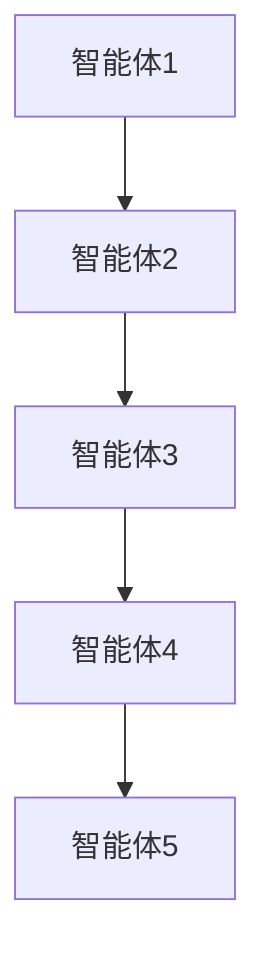

                 


# 构建具有多智能体协同决策能力的系统

## 关键词：多智能体、协同决策、系统架构、算法原理、系统设计、项目实战

## 摘要：  
多智能体协同决策系统是人工智能领域的重要研究方向，旨在通过多个智能体的协作实现复杂的决策任务。本文从多智能体协同决策的基本概念出发，深入分析其核心算法原理，并结合实际应用场景，详细讲解系统架构设计与项目实现。通过本文，读者将能够理解多智能体协同决策的核心思想，掌握其算法实现方法，并能够将其应用于实际项目中。

---

## 第一部分: 多智能体协同决策系统概述

### 第1章: 多智能体协同决策系统概述

#### 1.1 多智能体系统的定义与特点
##### 1.1.1 多智能体系统的定义  
多智能体系统（Multi-Agent System，MAS）是由多个智能体（Agent）组成的分布式系统，这些智能体能够通过协作完成复杂的任务。智能体是具有感知环境、自主决策、执行动作能力的实体。

##### 1.1.2 多智能体系统的分类  
多智能体系统可以按照以下方式分类：
- **按智能体的智能水平**：简单反应型智能体、基于模型的反射型智能体、目标驱动型智能体、效用驱动型智能体。
- **按系统的规模**：小型系统、中型系统、大型系统。
- **按应用场景**：分布式计算、机器人协作、自动驾驶、智能交通等。

##### 1.1.3 多智能体系统的核心特点  
- **分布性**：多个智能体独立运行，协同完成任务。
- **自主性**：智能体能够自主决策，无需中央控制。
- **协作性**：智能体之间通过通信与协作完成共同目标。
- **动态性**：系统环境和智能体状态动态变化。

#### 1.2 协同决策的定义与意义
##### 1.2.1 协同决策的定义  
协同决策是指多个智能体通过信息共享、协商和协作，共同制定决策的过程。它是多智能体系统的核心功能之一。

##### 1.2.2 协同决策的核心要素  
- **信息共享**：智能体之间共享感知到的信息。
- **协商机制**：智能体通过协商确定各自的决策。
- **协作机制**：智能体通过协作实现共同目标。

##### 1.2.3 协同决策的意义与应用领域  
协同决策的意义在于通过多个智能体的协作，能够实现单个智能体无法完成的任务。其应用领域包括：
- **智能交通系统**：通过协同决策优化交通流量。
- **智能制造**：通过协作完成生产过程的优化。
- **智慧城市**：通过协同决策实现资源的高效利用。

#### 1.3 多智能体协同决策系统的应用场景
##### 1.3.1 智能交通系统  
智能交通系统通过多个智能体（如交通灯、自动驾驶车辆）的协同决策，实现交通流量的优化。

##### 1.3.2 智能制造  
智能制造系统中，多个智能机器人通过协同决策完成生产任务的优化。

##### 1.3.3 智慧城市  
智慧城市中，多个智能体（如智能路灯、智能垃圾箱）通过协同决策实现城市资源的高效管理。

#### 1.4 本章小结  
本章介绍了多智能体协同决策系统的基本概念、分类和特点，并通过实际应用场景展示了其重要性。

---

## 第二部分: 多智能体协同决策的核心概念与联系

### 第2章: 多智能体协同决策的核心概念

#### 2.1 智能体的基本概念
##### 2.1.1 智能体的定义  
智能体（Agent）是一个能够感知环境、自主决策并执行动作的实体。它可以是一个软件程序、一个机器人或一个物理设备。

##### 2.1.2 智能体的分类  
智能体可以按照以下方式分类：
- **按智能水平**：反应式智能体、基于模型的智能体、目标驱动智能体。
- **按环境类型**：静态环境、动态环境、不确定环境。
- **按智能体类型**：简单智能体、复杂智能体。

##### 2.1.3 智能体的特征  
- **自主性**：智能体能够自主决策。
- **反应性**：智能体能够感知环境并做出反应。
- **协作性**：智能体能够与其他智能体协作。

#### 2.2 协同决策的原理
##### 2.2.1 协同决策的定义  
协同决策是指多个智能体通过信息共享、协商和协作，共同制定决策的过程。

##### 2.2.2 协同决策的过程  
- **信息收集**：智能体感知环境并收集信息。
- **信息共享**：智能体之间共享信息。
- **协商与决策**：智能体通过协商确定决策。
- **执行决策**：智能体根据决策执行动作。

##### 2.2.3 协同决策的机制  
- **信息共享机制**：智能体之间通过通信共享信息。
- **协商机制**：智能体通过协商确定决策。
- **协作机制**：智能体通过协作实现共同目标。

#### 2.3 多智能体系统中的角色与关系
##### 2.3.1 智能体的角色  
- **领导角色**：负责协调和指挥其他智能体。
- **执行角色**：负责执行具体的任务。
- **观察者角色**：负责监控系统状态。

##### 2.3.2 智能体之间的关系  
- **协作关系**：智能体之间协作完成任务。
- **竞争关系**：智能体之间在资源有限的情况下进行竞争。
- **中立关系**：智能体之间互不干扰。

##### 2.3.3 智能体之间的通信与协作  
智能体之间的通信可以通过以下方式进行：
- **直接通信**：智能体之间直接交换信息。
- **间接通信**：通过中间媒介传递信息。

---

## 第三章: 多智能体协同决策的核心概念与联系

#### 3.1 多智能体系统的核心概念
##### 3.1.1 智能体的自主性  
智能体的自主性是指智能体能够自主决策，无需外部干预。

##### 3.1.2 智能体的反应性  
智能体的反应性是指智能体能够感知环境并做出反应。

##### 3.1.3 智能体的协作性  
智能体的协作性是指智能体能够与其他智能体协作完成任务。

#### 3.2 多智能体协同决策的数学模型与公式
##### 3.2.1 协同决策的数学模型概述  
协同决策的数学模型用于描述智能体之间的协作过程。常见的数学模型包括博弈论模型、分布式计算模型等。

##### 3.2.2 协同决策的数学模型构建  
以下是一个简单的协同决策数学模型示例：
$$
\text{收益} = \sum_{i=1}^{n} u_i \cdot x_i
$$
其中，$u_i$ 是智能体 $i$ 的效用函数，$x_i$ 是智能体 $i$ 的决策变量。

##### 3.2.3 协同决策的数学模型应用  
通过数学模型，可以分析智能体之间的协作关系，并优化决策过程。

#### 3.3 多智能体系统中的实体关系图
##### 3.3.1 实体关系图的定义  
实体关系图（ER图）用于描述系统中各实体之间的关系。

##### 3.3.2 多智能体系统中的实体关系图  
以下是一个多智能体系统的实体关系图示例：

```mermaid
er
actor: 智能体
attribute: 智能体ID, 状态, 决策
relation: 协作关系
```

##### 3.3.3 实体关系图的绘制方法  
通过分析系统的实体和关系，可以绘制出相应的实体关系图。

---

## 第四章: 多智能体协同决策的算法原理

### 4.1 协同决策算法概述
#### 4.1.1 协同决策算法的定义  
协同决策算法是指用于实现多智能体协同决策的算法。

#### 4.1.2 协同决策算法的分类  
协同决策算法可以分为以下几类：
- **基于博弈论的算法**：通过博弈论模型实现智能体之间的协作。
- **基于分布式计算的算法**：通过分布式计算实现智能体之间的协作。

#### 4.1.3 协同决策算法的核心思想  
协同决策算法的核心思想是通过智能体之间的协作，实现共同目标的最优决策。

### 4.2 基于博弈论的协同决策算法
#### 4.2.1 博弈论的基本概念  
博弈论是研究多个参与者之间策略互动的数学理论。

#### 4.2.2 博弈论在协同决策中的应用  
博弈论可以用于分析智能体之间的协作关系，并制定最优决策。

#### 4.2.3 基于博弈论的协同决策算法实现  
以下是一个基于博弈论的协同决策算法实现示例：

```python
def game_theory_decision(members):
    # 计算每个成员的效用
    utilities = [calculate_utility(member) for member in members]
    # 确定最优决策
    optimal_decision = max(utilities)
    return optimal_decision
```

### 4.3 基于分布式计算的协同决策算法
#### 4.3.1 分布式计算的基本概念  
分布式计算是指通过多台计算机协作完成计算任务。

#### 4.3.2 分布式计算在协同决策中的应用  
分布式计算可以用于实现多智能体之间的协作与决策。

#### 4.3.3 基于分布式计算的协同决策算法实现  
以下是一个基于分布式计算的协同决策算法实现示例：

```python
import concurrent.futures

def distributed_decision(members):
    with concurrent.futures.ThreadPoolExecutor() as executor:
        futures = {executor.submit(member.decision) for member in members}
        for future in concurrent.futures.as_completed(futures):
            print(future.result())
```

---

## 第五章: 多智能体协同决策系统的架构设计

### 5.1 多智能体协同决策系统的架构概述
#### 5.1.1 系统架构的定义  
系统架构是指系统中各组件之间的结构关系。

#### 5.1.2 多智能体系统中的架构设计  
多智能体系统架构设计需要考虑以下几点：
- **组件划分**：将系统划分为多个组件。
- **组件之间的关系**：确定组件之间的协作关系。
- **通信机制**：设计组件之间的通信方式。

#### 5.1.3 多智能体系统架构设计的步骤  
1. 确定系统目标。
2. 划分系统组件。
3. 设计组件之间的关系。
4. 设计组件之间的通信机制。

### 5.2 多智能体协同决策系统的功能设计
#### 5.2.1 系统功能设计概述  
系统功能设计需要考虑以下几点：
- **信息采集**：智能体感知环境并采集信息。
- **信息共享**：智能体之间共享信息。
- **决策制定**：智能体通过协作制定决策。
- **决策执行**：智能体根据决策执行动作。

#### 5.2.2 系统功能设计的步骤  
1. 确定系统功能需求。
2. 设计系统功能模块。
3. 设计功能模块之间的交互。
4. 实现功能模块。

### 5.3 多智能体协同决策系统的架构图
以下是一个多智能体协同决策系统的架构图示例：



### 5.4 多智能体协同决策系统的接口设计
#### 5.4.1 系统接口设计概述  
系统接口设计需要考虑以下几点：
- **接口定义**：定义系统接口的输入输出。
- **接口实现**：实现系统接口的功能。
- **接口测试**：测试系统接口的正确性。

#### 5.4.2 多智能体系统中的接口设计  
1. 定义智能体之间的通信接口。
2. 实现智能体之间的通信接口。
3. 测试智能体之间的通信接口。

### 5.5 多智能体协同决策系统的交互设计
#### 5.5.1 系统交互设计概述  
系统交互设计需要考虑以下几点：
- **交互流程**：设计系统交互的流程。
- **交互界面**：设计系统交互的界面。
- **交互逻辑**：设计系统交互的逻辑。

#### 5.5.2 多智能体系统中的交互设计  
1. 设计智能体之间的交互流程。
2. 设计智能体之间的交互界面。
3. 设计智能体之间的交互逻辑。

---

## 第六章: 多智能体协同决策系统的项目实战

### 6.1 项目介绍
#### 6.1.1 项目背景  
本项目旨在通过多智能体协同决策技术，实现一个简单的交通灯控制系统。

#### 6.1.2 项目目标  
通过多智能体协同决策技术，实现交通灯的智能控制。

### 6.2 系统功能设计
#### 6.2.1 系统功能模块  
- **交通灯智能体**：负责控制交通灯的状态。
- **车辆智能体**：负责感知车辆的位置和状态。
- **行人智能体**：负责感知行人的位置和状态。

#### 6.2.2 系统功能设计的步骤  
1. 确定系统功能需求。
2. 设计系统功能模块。
3. 设计功能模块之间的交互。
4. 实现功能模块。

### 6.3 系统实现
#### 6.3.1 环境安装  
需要安装以下环境：
- Python 3.8及以上版本。
- Mermaid工具。
- Concurrent.futures库。

#### 6.3.2 系统核心实现源代码  
以下是一个简单的交通灯控制系统实现示例：

```python
import concurrent.futures

class TrafficLight:
    def __init__(self):
        self.state = "green"

    def decision(self):
        if self.state == "green":
            return "go"
        else:
            return "stop"

def traffic_control(members):
    with concurrent.futures.ThreadPoolExecutor() as executor:
        futures = {executor.submit(member.decision) for member in members}
        for future in concurrent.futures.as_completed(futures):
            print(future.result())

# 创建智能体实例
traffic_light = TrafficLight()
vehicle = Vehicle()
pedestrian = Pedestrian()

# 启动交通灯控制系统
traffic_control([traffic_light, vehicle, pedestrian])
```

#### 6.3.3 代码应用解读与分析  
上述代码实现了一个简单的交通灯控制系统，通过多智能体的协作，实现交通灯的智能控制。

### 6.4 实际案例分析
#### 6.4.1 案例背景  
本案例通过多智能体协同决策技术，实现交通灯的智能控制。

#### 6.4.2 案例分析  
通过分析案例，可以验证多智能体协同决策技术的有效性。

### 6.5 项目小结  
本项目通过多智能体协同决策技术，实现了一个简单的交通灯控制系统，验证了该技术的可行性。

---

## 第七章: 总结与展望

### 7.1 本章小结  
本文从多智能体协同决策的基本概念出发，深入分析了其核心算法原理，并结合实际应用场景，详细讲解了系统架构设计与项目实现。

### 7.2 最佳实践 tips  
- 在多智能体协同决策系统中，智能体之间的通信与协作是关键。
- 在系统设计中，需要考虑智能体的自主性、反应性和协作性。
- 在项目实现中，需要注重系统架构设计和接口设计。

### 7.3 展望  
随着人工智能技术的不断发展，多智能体协同决策技术将在更多领域得到应用，未来的研究方向包括更高效的协作算法、更智能的系统架构设计等。

---

## 参考文献  
[此处列出相关的参考文献]

---

通过本文，读者可以全面了解多智能体协同决策系统的构建过程，并能够将其应用于实际项目中。

