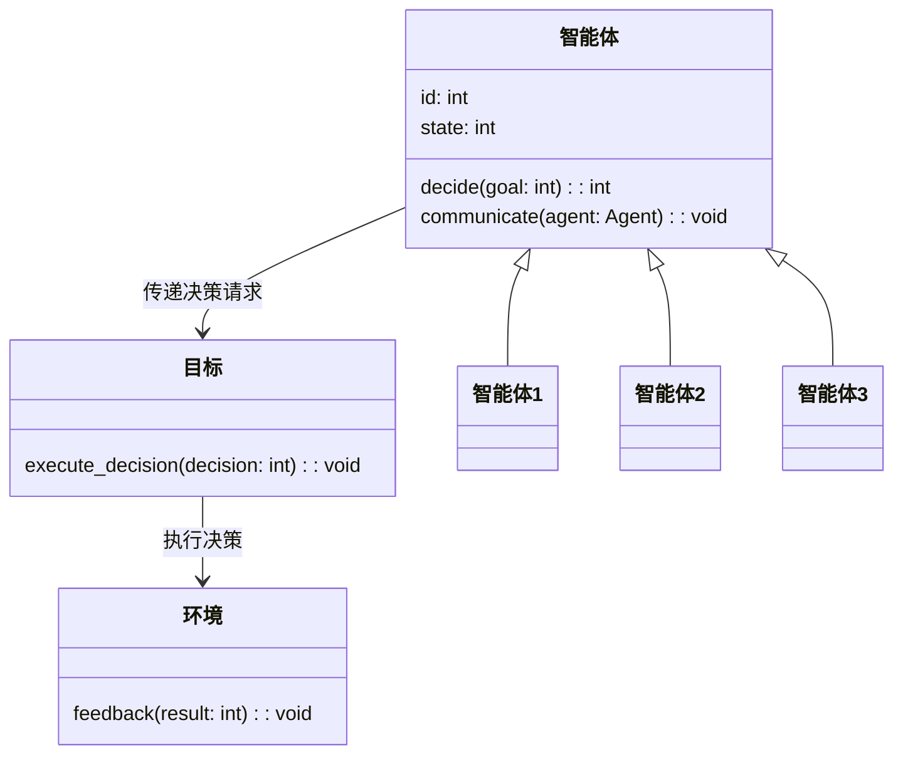
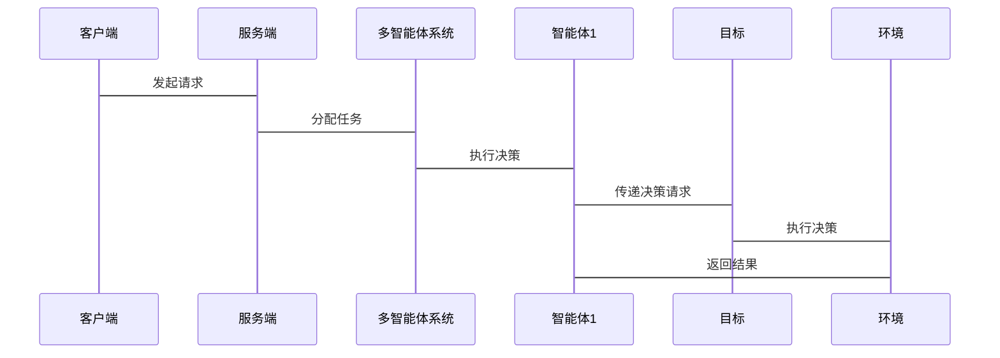

                 


# 构建具有多智能体协同决策能力的系统

> 关键词：多智能体协同决策、分布式计算、共识机制、系统架构、人工智能

> 摘要：本文详细探讨了构建具有多智能体协同决策能力的系统的关键技术与实现方法。从背景介绍到核心概念，从算法原理到系统架构，从项目实战到最佳实践，全面解析了多智能体协同决策系统的构建过程。通过实际案例分析，深入探讨了系统设计中的关键问题，并给出了具体的解决方案和优化建议。

---

## 第1章: 多智能体协同决策系统背景介绍

### 1.1 多智能体协同决策的基本概念

#### 1.1.1 多智能体系统定义
多智能体系统（Multi-Agent System, MAS）是由多个智能体（Agent）组成的分布式系统，这些智能体通过协作完成复杂任务。智能体是具有感知、推理和自主决策能力的实体，能够独立工作并与其他智能体或环境进行交互。

#### 1.1.2 协同决策的定义与特征
协同决策是指多个智能体通过协作，共同制定最优决策的过程。其核心特征包括：
- **自主性**：智能体能够自主决策。
- **协作性**：智能体之间通过通信和协作完成任务。
- **动态性**：系统状态和环境可能动态变化。

#### 1.1.3 多智能体协同决策的核心要素
- 智能体：系统的基本单元。
- 决策：智能体的核心功能。
- 通信：智能体之间协作的基础。
- 环境：智能体的外部世界。

### 1.2 多智能体协同决策的背景与问题背景

#### 1.2.1 问题背景介绍
随着分布式系统和人工智能技术的发展，单智能体系统已难以满足复杂场景的需求。多智能体协同决策系统能够更好地应对复杂任务，如自动驾驶、智能交通、分布式计算等。

#### 1.2.2 问题描述与目标
多智能体协同决策系统的目标是实现多个智能体的协作，共同制定最优决策。核心问题包括：
- 如何保证智能体之间的通信与协作。
- 如何处理动态环境下的决策问题。
- 如何保证系统的可扩展性和容错性。

#### 1.2.3 系统边界与外延
系统边界包括智能体、环境和决策结果。外延包括分布式计算、人工智能、实时通信等技术。

#### 1.2.4 核心概念结构与组成
多智能体协同决策系统由智能体、环境、通信协议和决策机制组成。

### 1.3 多智能体协同决策的应用场景

#### 1.3.1 分布式计算与协作
多智能体协同决策系统在分布式计算中的应用，如分布式任务分配、资源优化等。

#### 1.3.2 多智能体在AI系统中的应用
如自动驾驶、智能交通管理、智能电网等场景。

#### 1.3.3 多智能体在分布式系统中的优势
如高可用性、可扩展性、动态适应性等。

---

## 第2章: 多智能体协同决策的核心概念与联系

### 2.1 多智能体系统的核心原理

#### 2.1.1 多智能体系统的组成与功能
- **智能体**：感知环境、推理、决策。
- **环境**：智能体的外部世界。
- **通信**：智能体之间的交互。

#### 2.1.2 协同决策的基本原理
智能体通过通信和协作，共同制定最优决策。

#### 2.1.3 多智能体之间的通信与协作机制
通信机制：消息传递、广播、点对点通信。
协作机制：任务分配、协同推理、决策同步。

### 2.2 多智能体协同决策的关键特征

#### 2.2.1 智能体的自主性与反应性
自主性：智能体能够自主决策。
反应性：智能体能够实时感知环境变化并调整决策。

#### 2.2.2 协同决策的实时性与动态性
实时性：决策过程需要快速响应。
动态性：环境和系统状态可能动态变化。

#### 2.2.3 系统的可扩展性与容错性
可扩展性：系统能够扩展智能体数量。
容错性：系统能够容忍部分智能体故障。

### 2.3 多智能体协同决策的核心概念对比

#### 2.3.1 不同多智能体模型的对比分析
| 模型         | 特点                     |
|--------------|--------------------------|
| 单智能体     | 独立决策，不考虑协作     |
| 多智能体     | 协作决策，动态调整       |
| 分布式系统   | 分布式计算，任务分配     |

#### 2.3.2 多智能体与单智能体的对比
- 多智能体系统更具灵活性和可扩展性。
- 单智能体系统实现简单，但难以应对复杂任务。

#### 2.3.3 协同决策与分布式计算的对比
- 协同决策注重智能体之间的协作。
- 分布式计算注重任务分配和资源管理。

### 2.4 多智能体协同决策的ER实体关系图

```mermaid
er
    actor 智能体1
    actor 智能体2
    actor 智能体3
    actor 目标
    actor 环境
    智能体1 --> 目标: 传递决策请求
    智能体2 --> 目标: 传递决策请求
    智能体3 --> 目标: 传递决策请求
    目标 --> 环境: 执行决策
```

---

## 第3章: 多智能体协同决策算法原理

### 3.1 多智能体协同决策算法概述

#### 3.1.1 分布式计算的基本原理
分布式计算通过多个节点协作完成任务。

#### 3.1.2 多智能体协同决策的算法分类
- 分布式一致性算法。
- 多智能体共识机制。

#### 3.1.3 协同决策算法的核心思想
通过通信和协作，实现全局最优决策。

### 3.2 协同决策算法的详细讲解

#### 3.2.1 分布式一致性算法
- **Raft算法**：用于分布式系统中的一致性问题。
- **Paxos算法**：用于分布式系统中的共识问题。

#### 3.2.2 多智能体共识机制
- **PBFT（ Practical Byzantine Fault Tolerance）**：拜占庭容错共识算法。
- **RAFT**：Raft一致性算法。

#### 3.2.3 协同决策的数学模型
$$P(A|B) = P(B|A)P(A)/P(B)$$

### 3.3 协同决策算法的mermaid流程图

```mermaid
graph TD
    A[智能体1] --> B[智能体2]: 传递决策请求
    B --> C[智能体3]: 传递决策请求
    C --> D[目标]: 执行决策
    D --> E[环境]: 反馈结果
```

### 3.4 协同决策算法的Python实现

```python
class Agent:
    def __init__(self, id):
        self.id = id
        self.state = 0

    def decide(self, goal):
        # 智能体决策逻辑
        return self.state

    def communicate(self, other_agent):
        # 智能体间通信
        pass

# 示例代码
agent1 = Agent(1)
agent2 = Agent(2)
agent3 = Agent(3)

goal = 1
result = agent1.decide(goal)
```

---

## 第4章: 系统分析与架构设计方案

### 4.1 问题场景介绍
以一个多智能体协同决策系统为例，系统需要实现多个智能体的协作，共同制定最优决策。

### 4.2 系统功能设计

#### 4.2.1 领域模型（mermaid类图）


### 4.3 系统架构设计

#### 4.3.1 系统架构图


#### 4.3.2 系统接口设计
- 智能体接口：`AgentInterface`，定义决策和通信方法。
- 目标接口：`GoalInterface`，定义执行决策的方法。

#### 4.3.3 系统交互图


---

## 第5章: 项目实战

### 5.1 环境配置与依赖管理

#### 5.1.1 项目依赖
- Python 3.8+
- Mermaid图生成工具
- PyYAML

### 5.2 系统核心实现源代码

```python
from typing import List
from dataclasses import dataclass

@dataclass
class Agent:
    id: int
    state: int

    def decide(self, goal: int) -> int:
        # 示例决策逻辑
        return self.state

    def communicate(self, other_agents: List['Agent']):
        # 示例通信逻辑
        pass

def main():
    # 初始化智能体
    agents = [Agent(i, 0) for i in range(3)]
    goal = 1
    # 分配任务
    for agent in agents:
        result = agent.decide(goal)
        print(f"Agent {agent.id} decision: {result}")

if __name__ == "__main__":
    main()
```

### 5.3 代码实现与应用解读

#### 5.3.1 代码实现
如上代码实现了一个简单的多智能体协同决策系统。

#### 5.3.2 代码应用解读
- 每个智能体都有独立的决策逻辑。
- 智能体之间通过通信协作完成任务。

### 5.4 实际案例分析

#### 5.4.1 案例描述
一个多智能体协同决策系统，用于智能交通管理。

#### 5.4.2 系统实现
实现多个智能体协作，共同管理交通流量。

#### 5.4.3 实验结果与分析
通过实验验证系统性能和决策效果。

### 5.5 项目总结

#### 5.5.1 项目成果
实现了多智能体协同决策系统。

#### 5.5.2 经验总结
- 通信机制的设计至关重要。
- 系统的可扩展性和容错性需要重点考虑。

---

## 第6章: 总结与未来展望

### 6.1 本章总结
本文详细探讨了多智能体协同决策系统的构建过程，涵盖了背景、核心概念、算法原理、系统架构、项目实战等多个方面。

### 6.2 未来展望
- 更高效的一致性算法。
- 更智能的协作机制。
- 更广泛的应用场景。

### 6.3 最佳实践 tips
- 系统设计时要注重通信机制的设计。
- 系统实现时要关注可扩展性和容错性。
- 系统优化时要结合具体应用场景。

---

## 关键词：多智能体协同决策、分布式计算、共识机制、系统架构、人工智能

---

以上是《构建具有多智能体协同决策能力的系统》的技术博客文章的详细目录和部分正文内容。

