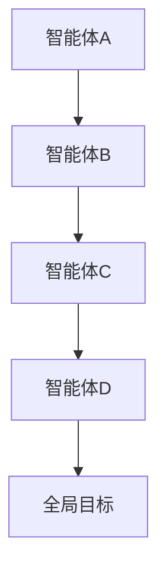
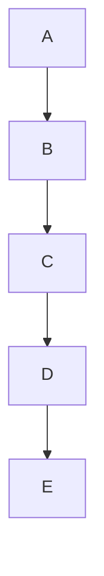
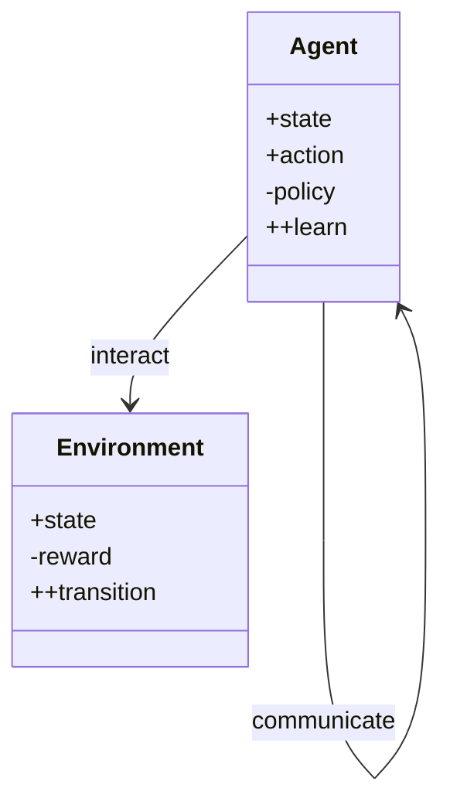
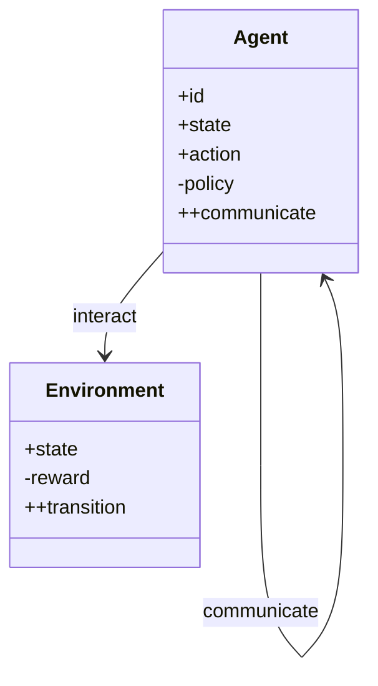
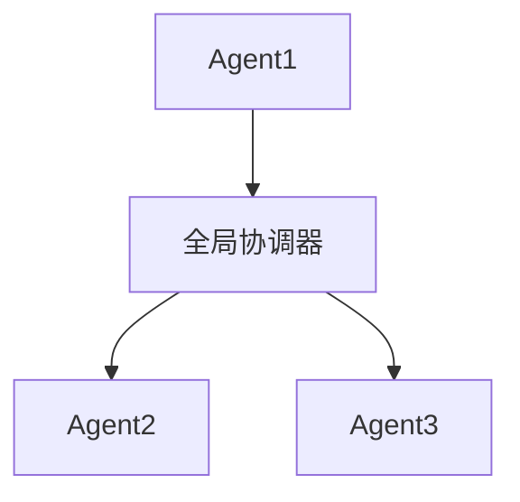
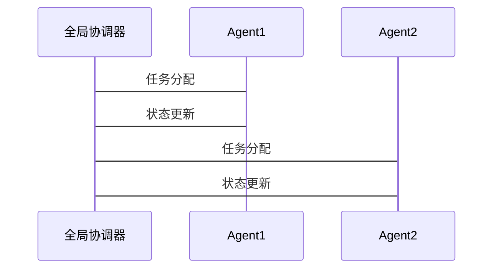

                 


# 构建具有多智能体协同学习能力的系统

## 关键词：多智能体、协同学习、分布式系统、边缘计算、机器学习、系统架构、项目实战

## 摘要：多智能体协同学习是一种新兴的人工智能技术，通过多个智能体的协作，实现复杂任务的高效完成。本文将从背景、核心概念、算法原理、系统架构到项目实战，逐步解析构建多智能体协同学习系统的全过程。通过实际案例分析，帮助读者深入理解并掌握多智能体协同学习的核心技术与应用实践。

---

# 第1章: 多智能体协同学习概述

## 1.1 多智能体协同学习的背景与意义
### 1.1.1 问题背景
随着人工智能技术的快速发展，单点智能已经难以应对复杂场景下的多样化需求。例如，在自动驾驶、智能城市、机器人协作等领域，单个智能体的能力有限，需要多个智能体协同合作，才能完成复杂的任务。

### 1.1.2 问题描述
在复杂场景中，单个智能体往往无法有效处理所有信息，也无法覆盖所有可能的决策空间。通过多个智能体的协作，可以有效分担任务负载，提高系统的整体性能和智能性。

### 1.1.3 问题解决方法
多智能体协同学习通过分布式计算、协作算法和通信机制，使得多个智能体能够共同感知环境、共享信息、协调动作，从而实现复杂任务的高效完成。

### 1.1.4 边界与外延
多智能体协同学习的边界在于多个智能体的协作，而单个智能体的学习不属于此范畴。其外延包括分布式系统、边缘计算、群体智能等领域。

### 1.1.5 核心要素组成
- **智能体**：具有感知和决策能力的个体。
- **协作机制**：智能体之间信息共享和动作协调的方式。
- **通信协议**：智能体之间交互信息的规则和格式。
- **任务分配**：根据环境动态调整任务分工的策略。

## 1.2 多智能体协同学习的核心概念
### 1.2.1 多智能体系统定义
多智能体系统（Multi-Agent System，MAS）是由多个智能体组成的分布式系统，智能体通过协作完成任务。

### 1.2.2 协同学习机制
- **同步学习**：多个智能体同时学习同一任务。
- **异步学习**：智能体按顺序学习，逐步优化模型。
- **联合学习**：智能体共享数据，共同优化模型。

### 1.2.3 智能体类型对比
| 类型       | 特征描述                       |
|------------|--------------------------------|
| 单智能体    | 独立决策，不与其他智能体协作   |
| 多智能体    | 通过协作完成复杂任务           |
| 增强型多智能体 | 具有强化学习机制，动态调整策略 |

### 1.2.4 与其他相关概念的区分
- **分布式系统**：多智能体系统是分布式系统的一种形式，但更强调智能性和协作性。
- **边缘计算**：多智能体协同学习可以运行在边缘计算环境中，但边缘计算更关注数据处理的地理位置分布。

---

# 第2章: 多智能体协同学习的核心概念

## 2.1 多智能体系统的定义与特征
### 2.1.1 智能体的定义
智能体（Agent）是一个能够感知环境、做出决策并采取行动的实体。

### 2.1.2 智能体的特征
| 特征       | 描述                       |
|------------|----------------------------|
| 自主性     | 能够自主决策               |
| 反应性     | 能够感知并及时响应         |
| 协作性     | 能够与其他智能体协作       |
| 学习能力   | 能够通过经验优化策略       |

### 2.1.3 智能体类型对比
| 类型       | 优点                         | 缺点                         |
|------------|------------------------------|-------------------------------|
| 简单反应型 | 实现简单                     | 无法处理复杂任务             |
| 基于模型型 | 能够处理复杂环境             | 计算资源消耗较大             |
| 目标驱动型 | 有明确目标，效率高           | 目标冲突时协调困难           |

### 2.1.4 多智能体系统的ER实体关系图
```mermaid
erDiagram
    user {
        role User
        player Agent
        group Task
    }
    user --> task : Assigns
    user --> agent : Manages
```

## 2.2 协同学习的机制与原理
### 2.2.1 协同学习的定义
协同学习是指多个智能体通过共享信息、协作推理，共同优化学习模型的过程。

### 2.2.2 协同学习的类型
| 类型       | 描述                       |
|------------|----------------------------|
| 联合学习    | 智能体共享数据，共同训练模型 |
| 分层学习    | 智能体分工协作，分层训练模型 |
| 联合推理    | 智能体协作推理，共同决策   |

### 2.2.3 协同学习的关键因素
- **通信机制**：智能体之间如何交换信息。
- **协作策略**：任务分配、决策协调的方式。
- **激励机制**：如何激励智能体高效协作。

---

# 第3章: 多智能体协同学习的算法原理

## 3.1 多智能体协同学习的算法模型
### 3.1.1 多智能体系统建模
多智能体系统可以看作是一个动态博弈过程，每个智能体都是一个参与者，通过策略选择和环境反馈优化决策。

### 3.1.2 协同学习算法的分类
| 类型       | 描述                       |
|------------|----------------------------|
| 基于规则的 | 通过预定义规则进行协作     |
| 基于模型的 | 基于环境模型进行推理和决策   |
| 基于强化学习的 | 通过强化学习优化协作策略   |

### 3.1.3 算法选择与优化
选择算法时需要考虑系统的复杂度、实时性要求和资源约束。

## 3.2 多智能体协同学习的关键算法
### 3.2.1 分布式强化学习算法


### 3.2.2 联合学习算法


### 3.2.3 分层学习算法


### 3.2.4 算法实现的数学模型
#### 分布式强化学习模型
$$ V(s) = \max_a Q(s,a) $$
其中，$s$ 是状态，$a$ 是动作，$Q$ 是价值函数。

#### 联合学习模型
$$ \theta_{new} = \theta_1 + \theta_2 + \dots + \theta_n $$
其中，$\theta_i$ 是第 $i$ 个智能体的参数。

---

# 第4章: 多智能体协同学习的系统架构设计

## 4.1 系统功能设计
### 4.1.1 领域模型


### 4.1.2 系统架构


## 4.2 系统架构设计
### 4.2.1 系统架构图


### 4.2.2 系统接口设计
- **智能体接口**：提供感知环境、决策、通信的功能。
- **全局协调器接口**：负责任务分配、状态同步、策略协调。

### 4.2.3 系统交互流程


---

# 第5章: 多智能体协同学习的项目实战

## 5.1 环境配置
- **开发环境**：Python 3.8+
- **框架选择**：使用强化学习框架如TensorFlow、PyTorch
- **通信机制**：使用gRPC或WebSocket实现智能体间通信

## 5.2 核心代码实现
```python
class Agent:
    def __init__(self, id):
        self.id = id
        self.state = None
        self.policy = None

    def receive_message(self, message):
        # 处理接收到的消息
        pass

    def send_message(self, message, receiver):
        # 发送消息
        pass

    def make_decision(self):
        # 根据当前状态做出决策
        pass
```

## 5.3 实际案例分析
- **案例背景**：多智能体协同学习在智能交通系统中的应用。
- **案例分析**：通过多智能体协作优化交通流量，减少拥堵。

---

# 第6章: 扩展与优化

## 6.1 性能优化
- **算法优化**：如分布式训练、并行计算。
- **通信优化**：减少信息交换的开销。

## 6.2 可扩展性设计
- **模块化设计**：便于扩展和维护。
- **弹性架构**：支持动态添加或移除智能体。

---

# 第7章: 总结与展望

## 7.1 总结
多智能体协同学习通过多个智能体的协作，实现了复杂任务的高效完成。本文详细解析了其核心概念、算法原理、系统架构及项目实战。

## 7.2 展望
未来，随着5G、边缘计算的发展，多智能体协同学习将有更广泛的应用场景，如智能城市、智能制造、智能医疗等领域。

---

# 总结

通过以上内容，我们详细解析了构建多智能体协同学习系统的全过程。希望读者能够通过本文，深入了解多智能体协同学习的核心技术，并能够将其应用到实际项目中。

