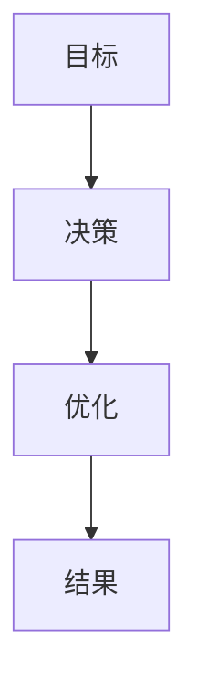
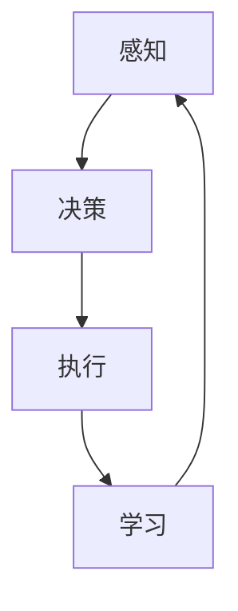
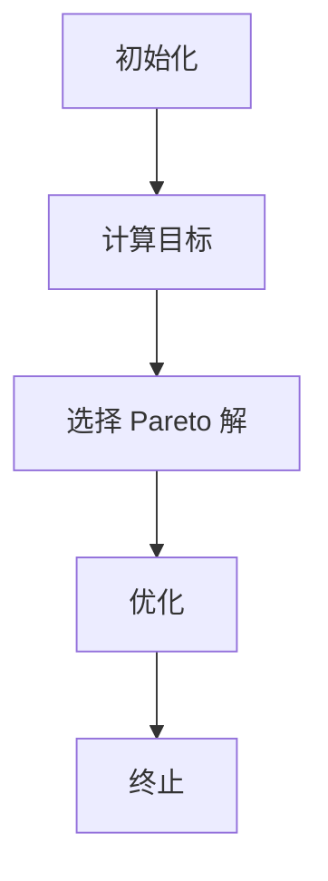
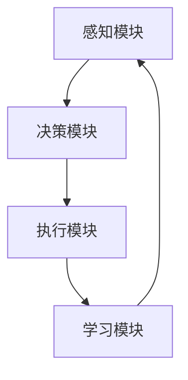
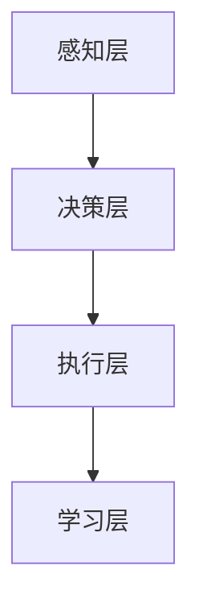
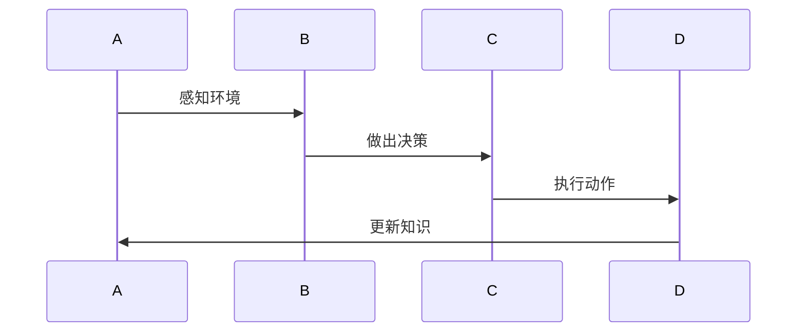

                 


# 《构建具有多目标优化能力的AI Agent》

---

## 关键词：AI Agent、多目标优化、强化学习、系统架构、算法原理

---

## 摘要

随着人工智能技术的快速发展，AI Agent（智能体）在多个领域中的应用越来越广泛。然而，AI Agent在实际应用中常常面临多目标优化的问题，即在多个目标之间找到平衡点，以实现最优性能。本文将详细探讨如何构建一个具有多目标优化能力的AI Agent，从理论基础到实际实现，帮助读者理解并掌握这一技术的核心要点。

---

## 第1章: 多目标优化与AI Agent的背景介绍

### 1.1 多目标优化问题背景

#### 1.1.1 问题背景与挑战

在实际应用中，许多问题需要在多个目标之间进行权衡。例如，在自动驾驶系统中，AI Agent需要同时优化安全性、效率和舒适性。这种多目标优化的问题在AI Agent的设计中尤为突出，因为AI Agent需要在复杂环境中做出决策，而这些决策往往涉及到多个相互冲突的目标。

#### 1.1.2 多目标优化的核心概念

多目标优化是指在多个目标之间找到一个最优解的过程。与单目标优化不同，多目标优化需要考虑多个目标之间的权衡关系，通常通过 Pareto 优化来实现。

#### 1.1.3 多目标优化的边界与外延

多目标优化的边界在于如何定义目标之间的关系，以及如何选择适当的优化方法。外延则包括了从数学建模到算法实现的整个过程。

### 1.2 AI Agent的定义与特点

#### 1.2.1 AI Agent的基本定义

AI Agent 是一个能够感知环境、做出决策并执行动作的智能体。它可以自主地在环境中运行，以实现特定的目标。

#### 1.2.2 多目标优化在AI Agent中的作用

在 AI Agent 的设计中，多目标优化用于处理复杂的决策问题，确保 Agent 在多个目标之间找到平衡点，从而实现最优性能。

#### 1.2.3 AI Agent的核心要素组成

AI Agent 的核心要素包括感知能力、决策能力、执行能力和学习能力。这些能力共同决定了 Agent 的性能。

---

## 第2章: 多目标优化与AI Agent的关系

### 2.1 多目标优化的核心原理

#### 2.1.1 多目标优化的基本概念

多目标优化是指在多个目标之间找到一个最优解的过程。通常，这些目标之间存在冲突，需要通过 Pareto 优化来找到一个平衡点。

#### 2.1.2 多目标优化的属性特征对比表

以下是多目标优化的一些核心属性对比表：

| 属性       | 单目标优化         | 多目标优化         |
|------------|--------------------|--------------------|
| 目标数量     | 单个目标           | 多个目标           |
| 优化难度     | 较低               | 较高               |
| 解空间       | 单点解             | 多点解（Pareto前沿） |

#### 2.1.3 多目标优化的ER实体关系图（Mermaid流程图）



### 2.2 AI Agent的核心原理

#### 2.2.1 AI Agent的定义与分类

AI Agent 可以分为简单反射式 Agent 和基于模型的 Agent。简单反射式 Agent 基于当前感知做出反应，而基于模型的 Agent 则会构建环境模型以做出决策。

#### 2.2.2 多目标优化在AI Agent中的应用

多目标优化在 AI Agent 中的应用广泛，例如在自动驾驶中优化安全性、效率和舒适性。

#### 2.2.3 AI Agent的系统架构图（Mermaid流程图）



---

## 第3章: 多目标优化算法原理

### 3.1 多目标优化算法概述

#### 3.1.1 基本概念与核心思想

多目标优化算法的核心思想是通过 Pareto 优化来找到多个目标之间的平衡点。

#### 3.1.2 多目标优化算法的流程图（Mermaid）



#### 3.1.3 多目标优化算法的数学模型（公式）

$$ \text{Pareto 优化：} \exists x \in X \text{ 使得对于所有 } y \in Y, x \text{ 在某个目标上不差于 } y \text{，且至少在一个目标上更好} $$

### 3.2 多目标优化算法实现

#### 3.2.1 算法实现的步骤分解

1. 初始化种群
2. 计算目标函数
3. 选择 Pareto 解
4. 进行优化

#### 3.2.2 算法实现的Python源代码

```python
import numpy as np

def multi_objective_optimization(n=10):
    # 初始化种群
    population = np.random.rand(n, 2)
    # 计算目标函数
    objectives = np.sum(population, axis=1)
    # 选择 Pareto 解
    pareto_front = []
    for i in range(n):
        is_pareto = True
        for j in range(n):
            if i != j and objectives[i] <= objectives[j]:
                is_pareto = False
                break
        if is_pareto:
            pareto_front.append(population[i])
    return pareto_front

# 示例运行
pareto_front = multi_objective_optimization(10)
print("Pareto 前沿：", pareto_front)
```

#### 3.2.3 算法实现的数学推导与举例

通过上述代码，我们可以看到多目标优化算法的基本实现过程。例如，对于一个二维目标函数，我们可以找到 Pareto 前沿上的最优解。

---

## 第4章: 系统分析与架构设计

### 4.1 问题场景介绍

在实际应用中，AI Agent 需要处理复杂的环境，例如自动驾驶中的多目标优化问题。

### 4.2 项目介绍

本项目旨在构建一个具有多目标优化能力的 AI Agent，用于自动驾驶中的安全性、效率和舒适性优化。

### 4.3 系统功能设计

#### 4.3.1 系统功能模块

系统功能模块包括感知模块、决策模块、执行模块和学习模块。

#### 4.3.2 系统功能设计的领域模型类图（Mermaid）



### 4.4 系统架构设计

#### 4.4.1 系统架构的 Mermaid 架构图



### 4.5 接口设计和交互序列图

#### 4.5.1 系统交互的 Mermaid 序列图



---

## 第5章: 项目实战

### 5.1 环境安装

安装必要的依赖库，例如 NumPy、Matplotlib 等。

### 5.2 系统核心实现源代码

以下是 AI Agent 的核心实现代码：

```python
class AI-Agent:
    def __init__(self):
        # 初始化感知、决策、执行和学习模块
        pass

    def perceive(self, environment):
        # 感知环境
        pass

    def decide(self, state):
        # 做出决策
        pass

    def act(self, decision):
        # 执行动作
        pass

    def learn(self, feedback):
        # 更新知识
        pass
```

### 5.3 代码应用解读与分析

通过上述代码，我们可以看到 AI Agent 的核心模块及其交互过程。

### 5.4 实际案例分析和详细讲解剖析

以自动驾驶为例，分析多目标优化在 AI Agent 中的应用。

### 5.5 项目小结

总结项目实现的关键点和注意事项。

---

## 第6章: 最佳实践、小结、注意事项、拓展阅读

### 6.1 最佳实践 tips

在实现多目标优化的 AI Agent 时，建议从简单问题开始，逐步增加复杂度。

### 6.2 小结

本文详细介绍了如何构建具有多目标优化能力的 AI Agent，从理论到实践，帮助读者掌握这一技术的核心要点。

### 6.3 注意事项

在实际应用中，需要注意目标之间的冲突和权衡，避免过优化单一目标而导致整体性能下降。

### 6.4 拓展阅读

推荐进一步阅读多目标优化和 AI Agent 相关的书籍和论文，深入理解其理论和应用。

---

## 附录

### 附录 A: 多目标优化算法的详细数学推导

详细推导多目标优化算法的数学模型。

### 附录 B: AI Agent 系统架构的详细设计

详细描述 AI Agent 的系统架构设计。

---

通过以上目录结构，我们可以看到，构建一个具有多目标优化能力的 AI Agent 是一个复杂而有趣的过程，需要从理论到实践的全面理解和掌握。希望本文能为读者提供有价值的参考和指导。

