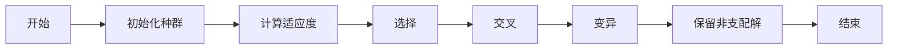
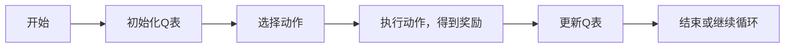
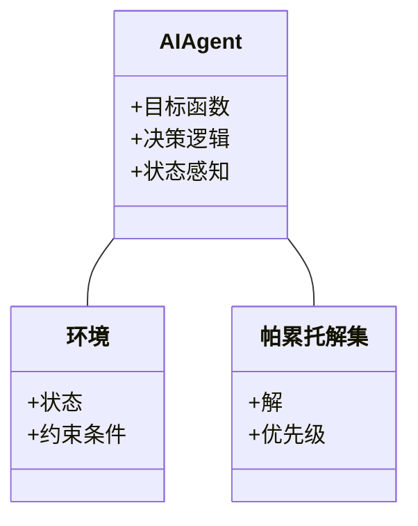
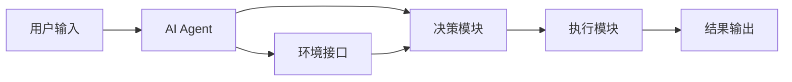
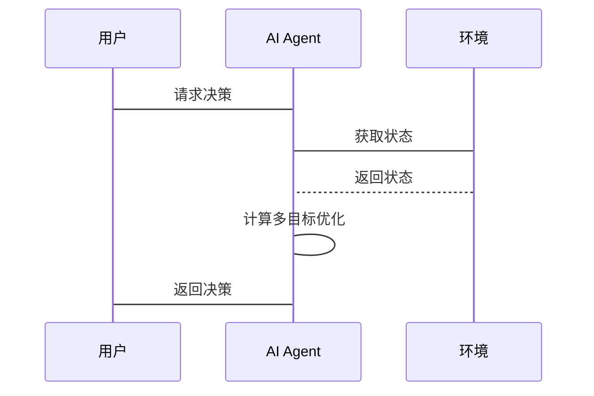

                 


# 构建具有多目标优化能力的AI Agent

> 关键词：多目标优化，AI Agent，强化学习，进化算法，系统架构

> 摘要：本文详细探讨了构建具有多目标优化能力的AI Agent的背景、核心概念、算法原理、系统架构及实际应用。通过逐步分析和深入讲解，帮助读者理解如何设计和实现能够同时优化多个目标的智能体，涵盖从理论到实践的全过程。

---

# 第一部分: 多目标优化AI Agent的背景与核心概念

## 第1章: 多目标优化AI Agent的背景与问题背景

### 1.1 多目标优化AI Agent的背景
#### 1.1.1 AI Agent的基本概念
AI Agent是一种智能体，能够感知环境、自主决策并执行任务。它通常具备学习、推理和自适应能力。

#### 1.1.2 多目标优化的定义与特点
多目标优化是指在多个目标之间找到平衡点的过程，这些目标可能相互冲突，因此需要找到帕累托最优解。

#### 1.1.3 多目标优化在AI Agent中的重要性
在现实场景中，AI Agent需要同时优化多个目标（如效率、成本、用户体验等），而单目标优化无法满足复杂需求。

### 1.2 问题背景与问题描述
#### 1.2.1 单目标优化的局限性
单目标优化只能解决单一目标的优化问题，无法应对复杂的多目标场景。

#### 1.2.2 多目标优化的必要性
在许多实际应用中，AI Agent需要在多个目标之间进行权衡，例如自动驾驶需要同时考虑速度、安全性和能耗。

#### 1.2.3 多目标优化AI Agent的应用场景
应用场景包括自动驾驶、机器人控制、资源分配、游戏AI等。

### 1.3 问题解决与边界
#### 1.3.1 多目标优化AI Agent的解决方案
通过算法（如遗传算法、强化学习）找到帕累托最优解集，帮助AI Agent在多个目标之间进行决策。

#### 1.3.2 问题的边界与外延
明确问题的边界（如资源限制、环境约束）和外延（如扩展到更多目标或更复杂的环境）。

#### 1.3.3 核心概念与组成要素
核心概念包括目标函数、决策空间、帕累托前沿等。

---

## 第2章: 多目标优化AI Agent的核心概念与联系

### 2.1 核心概念原理
#### 2.1.1 多目标优化的基本原理
多目标优化通过寻找多个目标的最优解集，通常以帕累托前沿表示。

#### 2.1.2 AI Agent的核心机制
AI Agent通过感知环境、推理和执行动作来实现目标优化。

#### 2.1.3 多目标优化与AI Agent的结合
通过多目标优化算法，AI Agent能够在复杂环境中做出最优决策。

### 2.2 核心概念属性特征对比表格
| 比较项 | 单目标优化 | 多目标优化 |
|--------|------------|------------|
| 目标数 | 1          | 多于1       |
| 解空间 | 单点最优    | 帕累托前沿   |
| 算法复杂度 | 较低       | 较高        |

### 2.3 ER实体关系图架构
```mermaid
erd
  entity AI Agent {
    [ID] (primaryKey)
    [目标列表]
    [决策逻辑]
  }
  entity 环境 {
    [状态]
    [约束条件]
  }
  entity 帕累托解集 {
    [解]
    [优先级]
  }
  AI Agent - 环境
  AI Agent - 帕累托解集
```

---

# 第二部分: 多目标优化AI Agent的算法原理

## 第3章: 多目标优化算法原理

### 3.1 多目标优化算法概述
#### 3.1.1 常见多目标优化算法
- 遗传算法（GA）
- 非支配排序遗传算法（NSGA）
- 强化学习（Q-learning）

#### 3.1.2 算法的优缺点分析
- 遗传算法优点：全局搜索能力强；缺点：计算复杂度高。
- 强化学习优点：适合在线优化；缺点：收敛速度慢。

#### 3.1.3 选择算法的策略
根据具体场景选择算法，例如动态环境适合强化学习，静态环境适合遗传算法。

### 3.2 基于进化算法的多目标优化
#### 3.2.1 遗传算法的基本原理
- 初始化种群
- 计算适应度
- 选择、交叉、变异
- 保留非支配解

#### 3.2.2 非支配排序遗传算法（NSGA）


#### 3.2.3 多目标进化算法的实现步骤
1. 初始化种群
2. 计算每个个体的适应度
3. 进行选择、交叉和变异操作
4. 保留非支配解
5. 重复直到满足终止条件

### 3.3 基于强化学习的多目标优化
#### 3.3.1 强化学习的基本原理
- 状态、动作、奖励
- Q值更新公式：$Q(s,a) = Q(s,a) + \alpha(r + \gamma \max Q(s',a'))$

#### 3.3.2 多目标强化学习的挑战
- 如何平衡多个目标的奖励信号
- 状态空间和动作空间的复杂性

#### 3.3.3 基于Q-learning的多目标优化


### 3.4 算法原理的数学模型与公式
#### 3.4.1 多目标优化的数学表达
$$\min_{x} f_1(x), f_2(x), \dots, f_n(x)$$
约束条件：$$g_i(x) \leq 0, h_j(x) = 0$$

#### 3.4.2 非支配解的概念
一个解$x$在非支配集中，如果不存在其他解$x'$在所有目标上都优于$x$。

#### 3.4.3 帕累托最优解的定义
帕累托最优解是指无法在不损害一个目标的情况下改善另一个目标的解。

---

## 第4章: 多目标优化AI Agent的算法实现

### 4.1 算法实现的步骤
#### 4.1.1 算法选择与参数设置
- 选择适合场景的算法（如NSGA、强化学习）
- 设置参数（如种群大小、交叉率）

#### 4.1.2 数据预处理与特征提取
- 数据标准化
- 特征选择

#### 4.1.3 模型训练与优化
- 使用训练数据训练模型
- 调整参数以优化性能

### 4.2 代码实现与分析
#### 4.2.1 NSGA算法的Python实现
```python
import numpy as np

def nsga_algorithm(objective_functions, constraints, population_size, generations):
    # 初始化种群
    population = np.random.rand(population_size, len(objective_functions))
    
    for _ in range(generations):
        # 计算适应度
        fitness = np.zeros(population_size)
        for i in range(population_size):
            x = population[i]
            fitness[i] = sum(objective_functions(x))
        
        # 选择非支配解
        non_dominated = []
        for i in range(population_size):
            is_dominated = False
            for j in range(population_size):
                if i != j and not any([fitness[i] > fitness[j]]):
                    is_dominated = True
                    break
            if not is_dominated:
                non_dominated.append(i)
        
        # 更新种群
        population = population[non_dominated]
        # 交叉和变异（简略）
        population = np.clip(population + np.random.randn(len(non_dominated), len(objective_functions)) * 0.1, 0, 1)
    
    return population
```

#### 4.2.2 算法优化与调优
- 交叉率和变异率的调整
- �种群大小和迭代次数的优化

---

# 第三部分: 多目标优化AI Agent的系统架构设计

## 第5章: 多目标优化AI Agent的系统架构

### 5.1 系统功能设计
#### 5.1.1 领域模型设计


#### 5.1.2 系统架构设计


#### 5.1.3 接口设计
- 输入接口：接收环境状态和目标函数
- 输出接口：输出决策和执行动作

### 5.2 系统交互流程


---

## 第6章: 多目标优化AI Agent的实际案例分析

### 6.1 案例分析
#### 6.1.1 应用场景：自动驾驶
- 多个目标：速度、安全、能耗

#### 6.1.2 数据分析与结果解读
- 通过NSGA算法找到帕累托最优解集
- 分析解的分布和优先级

### 6.2 项目实战
#### 6.2.1 环境安装与配置
- 安装Python、库（如numpy、scipy）

#### 6.2.2 核心代码实现
```python
import numpy as np

def multi_objective_optimization(objective_functions, constraints, population_size, generations):
    # 初始化种群
    population = np.random.rand(population_size, len(objective_functions))
    
    for _ in range(generations):
        # 计算适应度
        fitness = np.zeros(population_size)
        for i in range(population_size):
            x = population[i]
            fitness[i] = sum(objective_functions(x))
        
        # 选择非支配解
        non_dominated = []
        for i in range(population_size):
            is_dominated = False
            for j in range(population_size):
                if i != j and not any([fitness[i] > fitness[j]]):
                    is_dominated = True
                    break
            if not is_dominated:
                non_dominated.append(i)
        
        # 更新种群
        population = population[non_dominated]
        # 交叉和变异
        population = np.clip(population + np.random.randn(len(non_dominated), len(objective_functions)) * 0.1, 0, 1)
    
    return population
```

---

## 第7章: 多目标优化AI Agent的总结与展望

### 7.1 总结
- 多目标优化AI Agent的核心概念
- 算法实现的关键步骤
- 系统架构的设计要点

### 7.2 展望
- 新算法的研究（如深度强化学习）
- 多目标优化在更复杂场景中的应用

### 7.3 最佳实践tips
- 根据场景选择合适的算法
- 合理设置参数和约束条件
- 定期验证和优化模型

---

通过以上目录结构，我们可以系统地构建一个多目标优化AI Agent，涵盖从理论到实践的全过程。

