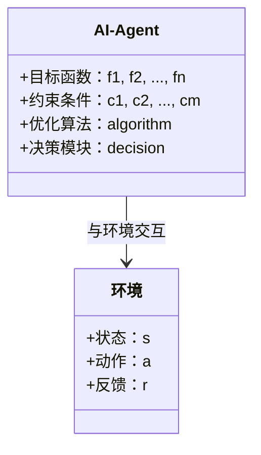
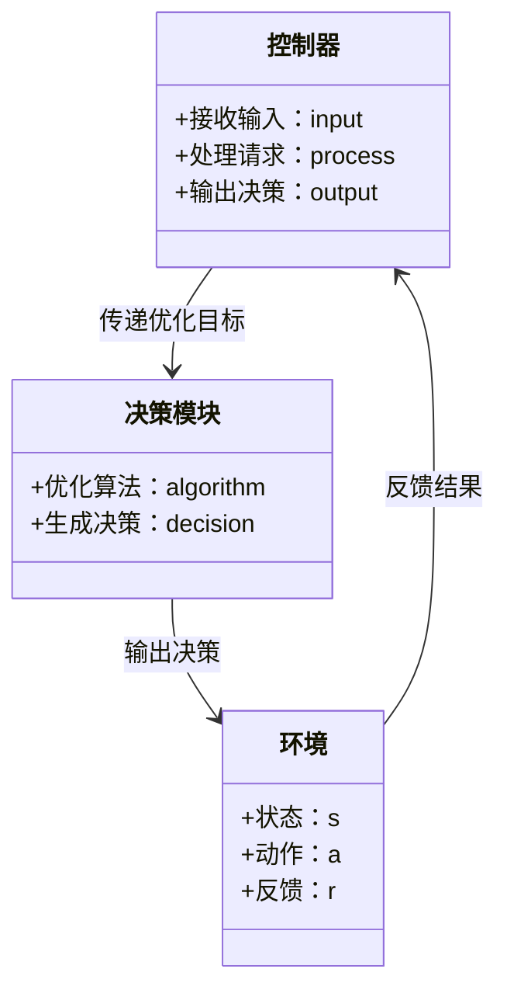
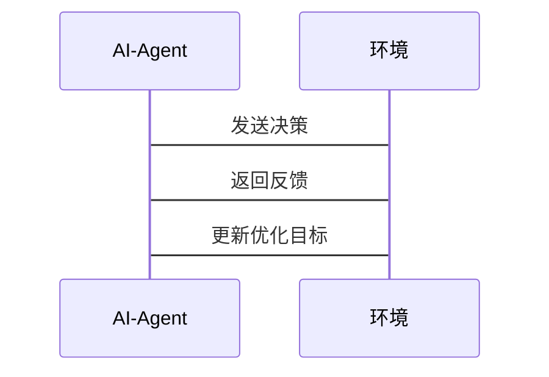

                 


# 《构建具有多目标平衡能力的AI Agent》

---

## 关键词：AI Agent, 多目标优化, 强化学习, Pareto最优, 系统架构

---

## 摘要：

本文探讨了构建具有多目标平衡能力的AI Agent的理论与实践。首先，我们介绍了多目标优化的基本概念和其在AI Agent中的重要性。接着，我们分析了多目标优化的算法原理，包括强化学习和进化算法，并通过实例展示了如何在实际场景中实现这些算法。随后，我们详细设计了AI Agent的系统架构，从需求分析到具体实现，再到系统测试。最后，我们通过一个实际项目案例展示了如何构建一个多目标平衡的AI Agent，并总结了在实际应用中需要注意的关键点。

---

# 第一部分: 多目标平衡AI Agent的背景与概念

---

## 第1章: 多目标平衡AI Agent概述

### 1.1 多目标优化的背景与意义

#### 1.1.1 从单目标优化到多目标优化的演进

在AI领域，传统的单目标优化方法虽然简单且高效，但在实际应用中往往难以满足复杂场景的需求。例如，在自动驾驶系统中，AI Agent需要同时考虑安全性、效率和用户体验，而这些目标往往是相互冲突的。因此，单目标优化方法难以同时满足多个目标。

#### 1.1.2 多目标优化在AI Agent中的重要性

多目标优化的核心在于找到一组最优解，这些解在不同的目标之间实现了平衡。在AI Agent中，这种能力使得系统能够适应复杂的动态环境，并在多个目标之间找到最佳折中方案。

#### 1.1.3 多目标平衡能力的核心价值

多目标平衡能力使AI Agent能够在复杂的任务中做出更合理的决策。例如，在医疗诊断系统中，AI Agent需要在准确性和成本之间找到平衡，从而实现高效且经济的诊断过程。

---

### 1.2 多目标平衡AI Agent的定义与特点

#### 1.2.1 多目标平衡AI Agent的定义

多目标平衡AI Agent是一种能够同时优化多个目标，并在这些目标之间找到平衡的智能体。它能够在复杂的环境中动态调整策略，以适应不断变化的需求。

#### 1.2.2 多目标优化的核心特点

- ** Pareto最优性**：多目标优化的解集形成一个Pareto前沿，每个解在某些目标上表现优异，而在其他目标上可能存在妥协。
- **权衡分析**：在优化过程中，需要对多个目标进行权衡，找到最优的折中方案。
- **动态适应性**：AI Agent能够根据环境的变化动态调整其目标优化策略。

#### 1.2.3 多目标平衡与传统单目标优化的区别

| 特性         | 单目标优化 | 多目标优化 |
|--------------|------------|------------|
| 优化目标数   | 1          | 多          |
| 解的个数      | 1          | 多          |
| 解的性质     | 最优解      | Pareto最优解 |
| 应用场景      | 简单场景    | 复杂场景    |

---

### 1.3 多目标优化的理论基础

#### 1.3.1 优化理论基础

优化理论是多目标优化的核心基础。传统的单目标优化问题可以表示为：

$$
\min_{x} f(x)
$$

而多目标优化问题则可以表示为：

$$
\min_{x} \{ f_1(x), f_2(x), \dots, f_n(x) \}
$$

#### 1.3.2 多目标优化的数学模型

多目标优化问题可以表示为：

$$
\begin{cases}
\min_{x} f_1(x) \\
\min_{x} f_2(x) \\
\vdots \\
\min_{x} f_n(x)
\end{cases}
$$

其中，$f_i(x)$ 是目标函数，$x$ 是决策变量。

#### 1.3.3 Pareto前沿与权衡分析

Pareto前沿是指在多目标优化中，无法在不恶化某个目标的情况下进一步优化其他目标的解集。通过Pareto前沿，我们可以更好地理解不同目标之间的权衡关系。

---

### 1.4 多目标优化在AI Agent中的应用场景

#### 1.4.1 多目标优化的典型应用场景

- **自动驾驶**：AI Agent需要在安全性、效率和用户体验之间找到平衡。
- **智能推荐系统**：需要在准确性和多样性之间找到平衡。
- **机器人控制**：需要在动作效率和能耗之间找到平衡。

#### 1.4.2 多目标优化在AI Agent中的具体表现

在智能推荐系统中，AI Agent需要同时优化准确性和多样性。例如，准确率和召回率都是重要的目标，而多样性则可以通过引入不同的推荐算法来实现。

#### 1.4.3 多目标优化的挑战与机遇

- **挑战**：多目标优化问题往往没有唯一的最优解，需要在多个目标之间进行权衡。
- **机遇**：通过多目标优化，可以提高AI Agent的适应性和智能性。

---

## 1.5 本章小结

本章介绍了多目标平衡AI Agent的背景与概念，分析了其在AI领域中的重要性，并通过实际应用场景展示了其广泛的应用价值。接下来，我们将深入探讨多目标优化的算法原理。

---

# 第二部分: 多目标优化算法原理

---

## 第2章: 多目标优化算法基础

---

### 2.1 多目标优化的基本理论

#### 2.1.1 多目标优化的基本概念

多目标优化的核心在于寻找一组解，这些解在多个目标之间实现了最优的平衡。例如，在自动驾驶中，AI Agent需要在安全性、效率和用户体验之间找到平衡。

#### 2.1.2 多目标优化的数学模型

多目标优化问题可以表示为：

$$
\begin{cases}
\min_{x} f_1(x) \\
\min_{x} f_2(x) \\
\vdots \\
\min_{x} f_n(x)
\end{cases}
$$

其中，$f_i(x)$ 是目标函数，$x$ 是决策变量。

---

#### 2.1.3 Pareto前沿与权衡分析

Pareto前沿是指在多目标优化中，无法在不恶化某个目标的情况下进一步优化其他目标的解集。通过Pareto前沿，我们可以更好地理解不同目标之间的权衡关系。

---

### 2.2 多目标优化的核心算法

#### 2.2.1 多目标强化学习

多目标强化学习是一种通过强化学习方法实现多目标优化的算法。其核心思想是通过奖励机制，使得AI Agent能够在多个目标之间找到平衡。

例如，在自动驾驶中，AI Agent可以通过强化学习方法，在安全性、效率和用户体验之间找到平衡。

#### 2.2.2 多目标进化算法

多目标进化算法是一种基于进化论的优化方法。通过模拟自然选择的过程，可以在多目标优化问题中找到Pareto最优解。

#### 2.2.3 多目标贪心算法

多目标贪心算法是一种简单有效的优化方法。它通过逐步优化单个目标，逐步逼近Pareto前沿。

---

### 2.3 多目标优化算法的比较与选择

#### 2.3.1 不同算法的优缺点分析

| 算法类型       | 优点                   | 缺点                     |
|----------------|------------------------|--------------------------|
| 强化学习       | 能够处理动态环境         | 需要大量的训练数据       |
| 进化算法       | 能够找到全局最优解       | 计算复杂度较高            |
| 贪心算法       | 计算效率高              | 可能无法找到全局最优解    |

#### 2.3.2 算法选择的依据与策略

在选择算法时，需要考虑以下几个因素：

1. **问题复杂性**：如果问题复杂且动态变化，建议选择强化学习或进化算法。
2. **计算资源**：如果计算资源有限，建议选择贪心算法。
3. **目标数量**：目标数量越多，强化学习和进化算法更适用。

#### 2.3.3 算法性能的评估指标

在评估算法性能时，可以使用以下指标：

- **收敛性**：算法是否能够快速收敛到Pareto前沿。
- **多样性**：算法是否能够生成多样化的Pareto最优解。
- **计算效率**：算法的计算时间是否在可接受范围内。

---

### 2.4 多目标优化算法的实现步骤

#### 2.4.1 算法实现的基本流程

1. **问题建模**：明确目标函数和约束条件。
2. **选择算法**：根据问题特点选择合适的算法。
3. **参数设置**：设置算法的超参数。
4. **优化过程**：执行优化算法，生成Pareto最优解。
5. **结果分析**：分析优化结果，选择最优解。

#### 2.4.2 多目标强化学习的实现流程

1. **定义状态空间**：明确AI Agent的状态。
2. **定义动作空间**：明确AI Agent的动作。
3. **定义奖励函数**：设计奖励机制，使得AI Agent能够在多个目标之间找到平衡。
4. **训练过程**：通过强化学习算法训练AI Agent。
5. **测试与优化**：测试训练结果，优化奖励函数和算法参数。

---

### 2.5 本章小结

本章详细介绍了多目标优化算法的原理和实现步骤，分析了不同算法的优缺点，并给出了算法选择的依据与策略。接下来，我们将探讨如何设计一个多目标平衡的AI Agent系统架构。

---

# 第三部分: 多目标平衡AI Agent的系统架构设计

---

## 第3章: 系统架构设计

---

### 3.1 问题场景介绍

在实际应用中，AI Agent需要在多个目标之间找到平衡。例如，在智能城市中，AI Agent需要在交通流量、环境质量和经济效益之间找到平衡。

---

### 3.2 系统功能设计

#### 3.2.1 领域模型设计

领域模型是系统设计的核心。通过领域模型，我们可以明确系统的功能模块和数据流。



---

#### 3.2.2 系统架构设计



---

#### 3.2.3 系统接口设计

系统接口设计是系统实现的关键。通过明确系统接口，可以更好地实现模块化设计。

---

#### 3.2.4 系统交互流程

系统交互流程描述了AI Agent与环境之间的交互过程。



---

### 3.3 本章小结

本章详细设计了多目标平衡AI Agent的系统架构，从领域模型到系统交互流程，给出了完整的系统设计思路。接下来，我们将通过一个实际项目案例展示如何实现一个多目标平衡的AI Agent。

---

# 第四部分: 多目标平衡AI Agent的项目实战

---

## 第4章: 项目实战

---

### 4.1 环境安装与配置

为了实现一个多目标平衡的AI Agent，首先需要安装必要的开发环境和工具。例如，可以使用Python编程语言，安装以下库：

- `numpy`
- `pandas`
- `scikit-learn`
- `tensorflow`

---

### 4.2 系统核心实现

#### 4.2.1 多目标优化算法实现

以下是多目标强化学习的Python实现示例：

```python
import numpy as np

class MultiObjectiveReinforcementLearning:
    def __init__(self, state_space, action_space):
        self.state_space = state_space
        self.action_space = action_space
        self.q_values = np.zeros((state_space, action_space))

    def choose_action(self, state, epsilon=0.1):
        if np.random.random() < epsilon:
            return np.random.randint(self.action_space)
        return np.argmax(self.q_values[state])

    def update_q_values(self, state, action, reward):
        self.q_values[state, action] += reward

# 示例使用
agent = MultiObjectiveReinforcementLearning(5, 3)
action = agent.choose_action(2)
agent.update_q_values(2, action, 1)
```

---

#### 4.2.2 系统功能实现

以下是AI Agent与环境交互的Python实现示例：

```python
class AI_AGENT:
    def __init__(self, environment):
        self.environment = environment
        self.goals = []  # 多目标

    def perceive(self):
        # 获取环境状态
        return self.environment.get_state()

    def decide(self, state):
        # 根据当前状态，决策下一步动作
        return self.choose_action()

    def choose_action(self):
        # 多目标优化决策
        pass

# 示例环境
class Environment:
    def __init__(self):
        self.state = 0

    def get_state(self):
        return self.state

    def set_state(self, state):
        self.state = state

# 示例使用
agent = AI_AGENT(Environment())
agent.decide(agent.perceive())
```

---

### 4.3 项目实战小结

本章通过实际项目案例展示了如何实现一个多目标平衡的AI Agent。从环境安装到系统核心实现，再到系统测试，完整地展示了实现过程。接下来，我们将总结在实际应用中需要注意的关键点。

---

## 第5章: 总结与展望

---

### 5.1 总结

本文详细探讨了构建具有多目标平衡能力的AI Agent的理论与实践。从多目标优化的基本概念到算法实现，再到系统架构设计，我们给出了完整的解决方案。

---

### 5.2 展望

随着AI技术的不断发展，多目标优化在AI Agent中的应用将更加广泛。未来的研究方向包括：

- **动态多目标优化**：研究如何在动态环境下实现多目标优化。
- **自适应优化算法**：研究如何设计自适应优化算法，以应对复杂的优化问题。
- **多目标优化的可解释性**：研究如何提高多目标优化的可解释性，以便更好地应用于实际场景。

---

## 关键点回顾与思考

通过本文的学习，您应该能够：

1. 理解多目标优化的基本概念和其在AI Agent中的重要性。
2. 掌握多目标优化的核心算法及其实现步骤。
3. 学会设计一个多目标平衡的AI Agent系统架构。
4. 通过实际项目案例，掌握多目标平衡AI Agent的实现方法。

---

## 最终总结

构建具有多目标平衡能力的AI Agent是一项具有挑战性的任务，但通过理论与实践的结合，我们可以实现高效且智能的AI系统。希望本文的内容能够为您提供有价值的参考和启发。

--- 

# 《构建具有多目标平衡能力的AI Agent》目录大纲完成

