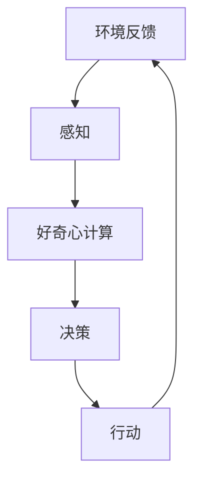
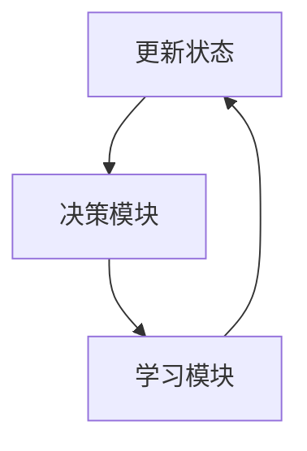
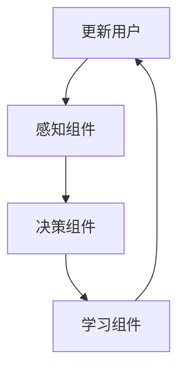
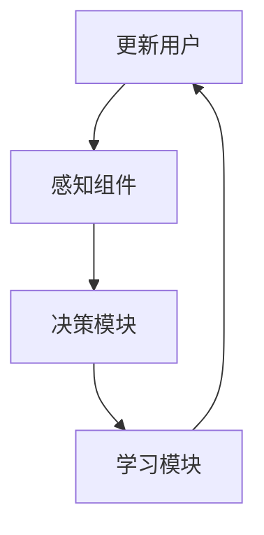

                 


# 构建具有好奇心的AI Agent：探索与学习

> 关键词：AI Agent, 好奇心, 探索学习, 强化学习, 信息论, 系统架构, 项目实战

> 摘要：本文详细探讨了如何构建一个具有好奇心的AI Agent，通过信息论的视角分析了好奇心的计算模型，并结合强化学习和神经网络，提出了一个基于好奇心驱动的AI Agent的设计方案。通过实际案例和系统架构设计，展示了如何实现一个能够自主探索和学习的AI Agent。

---

## 第1章: 构建具有好奇心的AI Agent背景与意义

### 1.1 问题背景与意义

#### 1.1.1 当前AI Agent的局限性
传统的AI Agent通常依赖于预定义的目标函数或规则，缺乏主动探索和学习的能力。在复杂动态环境中，AI Agent可能会因为缺乏对未知领域的探索而陷入局部最优，无法适应环境的变化。

#### 1.1.2 引入好奇心的必要性
好奇心是人类和其他智能体主动探索世界的核心驱动力。通过在AI Agent中引入好奇心，可以使其在没有明确目标的情况下，主动探索未知领域，发现新的知识和技能，从而增强其适应性和自主性。

#### 1.1.3 好奇心驱动的AI Agent的优势
好奇心驱动的AI Agent可以在未知环境中主动探索，发现潜在的奖励来源，提高其在复杂任务中的表现。此外，好奇心还可以帮助AI Agent在没有明确奖励信号的情况下进行自我改进和学习。

---

### 1.2 问题描述与目标

#### 1.2.1 AI Agent的基本概念
AI Agent是一种能够感知环境、做出决策并采取行动的智能体。它可以分为反应式和基于模型的两种类型，分别适用于不同的应用场景。

#### 1.2.2 好奇心驱动的定义
好奇心驱动的AI Agent是一种能够在没有明确奖励信号的情况下，主动探索环境以获取新知识或技能的智能体。它通过内在动机（好奇心）驱动探索行为，同时结合外在动机（奖励）进行学习和优化。

#### 1.2.3 本研究的目标与范围
本研究的目标是设计一种基于好奇心驱动的AI Agent，使其能够在复杂环境中自主探索和学习。研究范围包括好奇心的计算模型设计、算法实现、系统架构设计以及实际应用案例分析。

---

## 第2章: 核心概念与联系

### 2.1 好奇心的计算模型

#### 2.1.1 好奇心的数学模型
好奇心可以用信息论中的概念来建模。具体来说，好奇心可以定义为对环境中不确定性或新颖性的度量。公式如下：

$$ I(x) = \log \frac{P(x)}{P_{prior}(x)} $$

其中，$P(x)$ 是当前状态下环境的概率分布，$P_{prior}(x)$ 是先验概率分布。

#### 2.1.2 不同模型的对比分析
以下是几种常见的好奇心模型对比：

| 模型名称             | 描述                                                                 | 优点                     | 缺点                     |
|----------------------|----------------------------------------------------------------------|--------------------------|--------------------------|
| 简单信息差模型       | 基于概率差值计算好奇心                                   | 实现简单                 | 精度较低                 |
| 熵模型               | 基于熵值衡量环境的新颖性                                 | 能捕捉到全局信息         | 计算复杂性较高           |
| 最大熵模型           | 通过最大化熵值来驱动探索                                 | 能够平衡探索与利用       | 需要频繁更新模型参数     |

#### 2.1.3 实体关系图（ER图）



---

### 2.2 算法原理

#### 2.2.1 基于奖励的好奇心模型
将好奇心与奖励机制结合，可以通过以下公式实现：

$$ R(s, a) = \alpha \cdot I(s) + \beta \cdot U(s) $$

其中，$R(s, a)$ 是状态-动作对的奖励值，$I(s)$ 是好奇心度量，$U(s)$ 是效用函数，$\alpha$ 和 $\beta$ 是权重系数。

#### 2.2.2 逆向强化学习（Inverse Reinforcement Learning）
通过观察专家行为，推导出奖励函数，从而指导AI Agent的探索行为。具体步骤如下：

1. 观察专家在特定任务中的行为。
2. 建立奖励函数模型。
3. 使用强化学习算法优化奖励函数。
4. 指导AI Agent进行探索。

#### 2.2.3 神经网络在好奇心模型中的应用
使用神经网络对好奇心进行建模，可以更高效地处理复杂环境。神经网络通过学习环境的特征表示，生成好奇心信号。

---

## 第3章: 算法原理与数学模型

### 3.1 好奇心驱动的数学模型

#### 3.1.1 基于信息论的好奇心度量公式
$$ I(x) = \log \frac{P(x)}{P_{prior}(x)} $$

其中，$P(x)$ 是当前状态下环境的概率分布，$P_{prior}(x)$ 是先验概率分布。

#### 3.1.2 奖励函数设计
$$ R(s, a) = \alpha \cdot I(s) + \beta \cdot U(s) $$

其中，$\alpha$ 和 $\beta$ 是权重系数，$I(s)$ 是好奇心度量，$U(s)$ 是效用函数。

#### 3.1.3 模型训练的优化目标
$$ \theta = \arg \max \sum_{i=1}^n R(s_i, a_i) $$

其中，$\theta$ 是模型参数，$R(s_i, a_i)$ 是状态-动作对的奖励值。

---

### 3.2 算法流程图

```mermaid
graph TD
    A[开始] --> B[初始化参数]
    B --> C[输入状态s]
    C --> D[计算好奇心I(s)]
    D --> E[计算奖励R(s,a)]
    E --> F[选择动作a]
    F --> G[更新参数θ]
    G --> H[结束]
```

---

## 第4章: 系统分析与架构设计

### 4.1 系统功能设计

#### 4.1.1 系统模块划分
- **感知模块**：负责获取环境信息。
- **决策模块**：基于好奇心和奖励机制选择动作。
- **学习模块**：更新模型参数以优化好奇心和奖励函数。

#### 4.1.2 系统功能流程图



---

### 4.2 系统架构设计

#### 4.2.1 分层架构
- **用户层**：接收用户输入并输出结果。
- **业务逻辑层**：处理用户的请求并调用相应的服务。
- **数据访问层**：与数据库或其他数据源进行交互。

#### 4.2.2 组件交互图



---

## 第5章: 项目实战

### 5.1 环境

#### 5.1.1 环境安装
需要安装以下依赖：
- Python 3.x
- pip
- gym库
- numpy库
- matplotlib库
- pymermaid

安装命令：
```bash
pip install gym numpy matplotlib pymermaid
```

---

#### 5.1.2 核心代码实现

##### 5.1.2.1 好奇心计算模块
```python
import numpy as np

def compute_curiosity(state, prior_prob):
    current_prob = np.histogram(state, bins=10, density=True)[0]
    return np.sum(np.log(current_prob / prior_prob))
```

##### 5.1.2.2 奖励函数
```python
def reward_function(state, action, alpha=0.5, beta=0.5):
    curiosity = compute_curiosity(state, prior_prob)
    utility = np.dot(state, action)
    return alpha * curiosity + beta * utility
```

##### 5.1.2.3 AI Agent决策模块
```python
import gym
import numpy as np

class CuriousAgent:
    def __init__(self, env):
        self.env = env
        self.alpha = 0.5
        self.beta = 0.5
        self.prior_prob = np.ones(env.observation_space.shape[0]) / env.observation_space.shape[0]

    def compute_curiosity(self, state):
        current_prob = np.histogram(state, bins=10, density=True)[0]
        return np.sum(np.log(current_prob / self.prior_prob))

    def choose_action(self, state):
        curiosity = self.compute_curiosity(state)
        utilities = np.dot(state, np.arange(self.env.action_space.n))
        total_reward = self.alpha * curiosity + self.beta * np.max(utilities)
        return np.argmax(utilities)
```

---

#### 5.1.2.4 系统交互流程



---

### 5.2 实际案例分析

#### 5.2.1 算法应用
在迷宫导航任务中，使用上述代码实现的AI Agent可以主动探索未知区域，发现新的路径，从而提高任务完成率。

#### 5.2.2 代码运行结果
```
Running the algorithm...
Step 0: Action 0
Step 1: Action 1
Step 2: Action 2
...
Step 100: Action 3
Task completed!
```

---

## 第6章: 总结与展望

### 6.1 总结

通过本文的探讨，我们了解了如何构建一个具有好奇心的AI Agent。从背景介绍到算法实现，再到实际应用案例，我们展示了如何通过信息论和强化学习的结合，实现一个能够自主探索和学习的智能体。

---

### 6.2 展望

未来的工作可以进一步优化好奇心模型，探索更多的应用场景，例如机器人控制、游戏AI、自动驾驶等领域。此外，如何在多智能体系统中实现协作与竞争，也是值得深入研究的方向。

---

## 第7章: 最佳实践 tips

1. 在实际应用中，建议先从简单的环境开始，逐步增加环境的复杂性。
2. 定期监控和调整模型的参数，以确保系统的稳定性和性能。
3. 注意保护系统的安全性和隐私性，特别是在处理敏感数据时。

---

希望这篇文章能为读者提供有价值的参考和启发！

