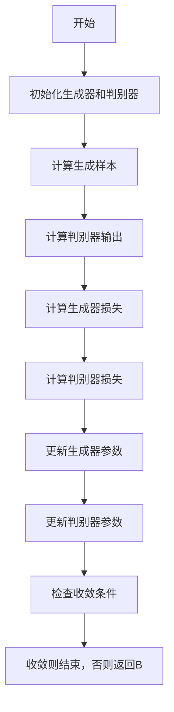

                 

# 《构建具有对抗学习能力的AI Agent》

> **关键词**：对抗学习、AI Agent、生成对抗网络、强化学习、系统架构、深度学习

> **摘要**：  
> 本文详细探讨了如何构建具有对抗学习能力的AI Agent，从对抗学习的基本原理到AI Agent的设计与实现，结合深度学习和强化学习的最新进展，分析了对抗学习在提升AI Agent智能性和适应性中的关键作用。通过数学推导、系统架构设计和实际案例分析，本文为读者提供了从理论到实践的全面指导，帮助读者理解如何在实际场景中构建和优化具有对抗学习能力的AI Agent。

---

# 第1章: 对抗学习与AI Agent概述

## 1.1 对抗学习的核心概念  
### 1.1.1 对抗学习的定义与背景  
对抗学习（Adversarial Learning）是一种基于博弈论的机器学习方法，通过两个模型（生成器和判别器）的对抗训练，使得生成器能够生成逼真的数据，而判别器能够区分真实数据和生成数据。这种对抗过程能够显著提升模型的泛化能力和鲁棒性。

### 1.1.2 AI Agent的基本概念  
AI Agent是一种智能体，能够感知环境、自主决策并执行任务。结合对抗学习，AI Agent能够通过与“对手”模型的对抗训练，提升其在复杂环境中的适应能力和决策能力。

### 1.1.3 对抗学习在AI Agent中的应用前景  
通过对抗学习，AI Agent可以在多种场景中表现出更强的智能性，例如游戏AI、推荐系统、图像生成和自然语言处理等。

---

## 1.2 对抗学习的核心原理  
### 1.2.1 生成器与判别器的对抗过程  
生成器尝试生成与真实数据相似的样本，而判别器则试图区分真实数据和生成数据。通过反复迭代，生成器和判别器的能力不断提升。

### 1.2.2 对抗训练的目标函数  
生成器的目标是最小化判别器对生成样本的区分能力，而判别器的目标是最大化其对真实数据和生成数据的区分能力。

### 1.2.3 对抗学习的收敛性分析  
通过对抗训练，生成器和判别器的损失函数逐渐趋近于平衡点，模型能够收敛到一个稳定的分布。

---

## 1.3 对抗学习的核心算法  
### 1.3.1 GAN（生成对抗网络）的原理  
GAN由生成器和判别器组成，通过交替优化生成器和判别器的参数，使得生成器能够生成高质量的样本。

### 1.3.2 DCGAN、WGAN等改进算法  
DCGAN通过使用深度卷积神经网络提升生成图像的质量，WGAN通过 Wasserstein 距离改进模型的稳定性。

### 1.3.3 对抗学习的数学模型  
生成器的损失函数：  
$$ L_G = -\mathbb{E}_{z \sim p_z} [\log D(G(z))] $$  
判别器的损失函数：  
$$ L_D = -\mathbb{E}_{x \sim p_{data}} [\log D(x)] - \mathbb{E}_{z \sim p_z} [\log (1 - D(G(z)))] $$  

---

## 1.4 对抗学习的优缺点  
### 1.4.1 对抗学习的优势  
- 生成高质量的样本  
- 提升模型的泛化能力  
- 适用于多种任务和场景  

### 1.4.2 对抗学习的局限性  
- 训练过程可能不稳定  
- 易受模式崩溃或梯度消失问题影响  
- 对抗训练的计算成本较高  

### 1.4.3 对抗学习的未来发展方向  
- 多目标对抗学习  
- 对抗学习与强化学习的结合  
- 对抗学习在边缘计算和分布式系统中的应用  

---

## 1.5 本章小结  
本章介绍了对抗学习的核心概念、算法原理及其在AI Agent中的应用前景，为后续章节的深入分析奠定了基础。

---

# 第2章: 对抗学习的核心算法原理

## 2.1 GAN算法的数学模型  
### 2.1.1 生成器的损失函数  
生成器的目标是最小化判别器对生成样本的区分能力。  

### 2.1.2 判别器的损失函数  
判别器的目标是最大化其对真实数据和生成数据的区分能力。  

### 2.1.3 对抗训练的优化过程  
生成器和判别器通过交替优化逐步提升模型性能。

---

## 2.2 对抗学习的训练过程  
### 2.2.1 生成器的更新步骤  
生成器通过梯度下降优化参数，使得生成样本更难被判别器识别。  

### 2.2.2 判别器的更新步骤  
判别器通过梯度下降优化参数，使得其对真实数据和生成数据的区分能力更强。  

### 2.2.3 对抗训练的平衡点  
生成器和判别器的损失函数逐渐趋近于平衡点，模型收敛到稳定状态。

---

## 2.3 对抗学习的数学公式  
### 2.3.1 生成器的损失函数公式  
$$ L_G = -\mathbb{E}_{z \sim p_z} [\log D(G(z))] $$  

### 2.3.2 判别器的损失函数公式  
$$ L_D = -\mathbb{E}_{x \sim p_{data}} [\log D(x)] - \mathbb{E}_{z \sim p_z} [\log (1 - D(G(z)))] $$  

---

## 2.4 对抗学习的算法流程图  

---

## 2.5 本章小结  
本章详细介绍了对抗学习的核心算法原理及其数学模型，为后续章节的系统设计和实际应用提供了理论基础。

---

接下来是后续章节的内容，涵盖AI Agent的构建、系统架构设计、项目实战和总结与展望。如果需要进一步扩展，请告诉我！

