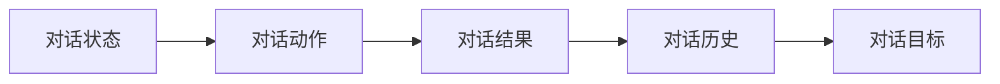
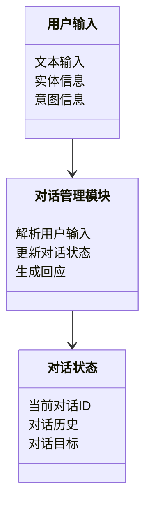
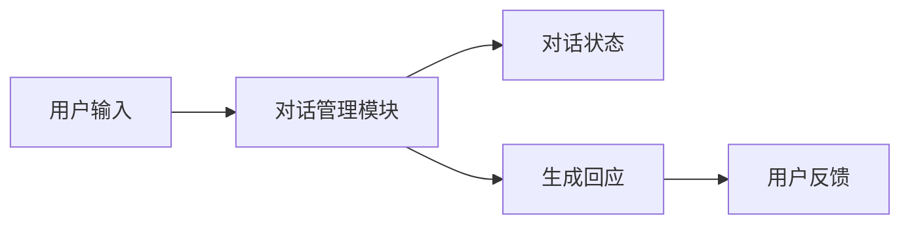

                 


# 《构建具有对话管理能力的AI Agent》

> 关键词：对话管理，AI Agent，自然语言处理，任务规划，系统架构

> 摘要：本文详细探讨了构建具有对话管理能力的AI Agent的关键技术与实现方法。从对话管理的基本概念到AI Agent的核心能力，从算法原理到系统架构设计，从项目实战到总结与展望，系统性地介绍了如何构建一个能够进行有效对话管理的智能代理系统。文章通过丰富的实例和详细的代码实现，帮助读者全面理解和掌握构建此类系统的知识和技能。

---

# 第一部分: 背景与核心概念

# 第1章: 对话管理与AI Agent概述

## 1.1 对话管理的基本概念

### 1.1.1 对话管理的定义
对话管理（Dialogue Management）是指在人与计算机系统交互的过程中，系统能够理解用户意图、生成适当的回应，并根据对话的进展调整后续的交互策略。它涉及对话的状态跟踪、意图识别、上下文管理等多个方面。

### 1.1.2 对话管理的核心要素
对话管理的核心要素包括：
- **对话状态**：当前对话的进展和相关信息。
- **对话动作**：系统根据对话状态生成的回应或操作。
- **对话目标**：对话的最终目标或用户希望完成的任务。

### 1.1.3 对话管理的边界与外延
对话管理的边界在于如何处理对话中的不确定性、歧义性和动态性。其外延则涉及自然语言处理（NLP）、任务规划、用户建模等多个相关领域。

## 1.2 AI Agent的基本概念

### 1.2.1 AI Agent的定义
AI Agent（人工智能代理）是指能够感知环境、自主决策并执行任务的智能系统。它通常具备感知、推理、规划和执行的能力。

### 1.2.2 AI Agent的核心能力
AI Agent的核心能力包括：
- **感知能力**：通过传感器或输入接口获取信息。
- **推理能力**：基于知识和逻辑进行推理。
- **规划能力**：制定行动计划以实现目标。
- **执行能力**：通过动作或输出与环境交互。

### 1.2.3 对话管理在AI Agent中的作用
对话管理是AI Agent与用户交互的核心模块，负责理解和生成对话内容，确保交互的流畅性和有效性。

## 1.3 对话管理与AI Agent的关系

### 1.3.1 对话管理的流程
对话管理的流程包括：
1. **用户输入解析**：分析用户的语言输入，提取意图和实体。
2. **对话状态更新**：根据用户输入更新对话状态。
3. **生成回应**：基于对话状态生成合适的回应。
4. **反馈处理**：根据用户的反馈调整对话策略。

### 1.3.2 AI Agent的对话管理能力
AI Agent的对话管理能力体现在其能够理解用户需求、生成自然语言回应，并根据对话进展动态调整交互策略。

### 1.3.3 对话管理在AI Agent中的实现
对话管理的实现通常结合NLP技术、知识表示和推理算法，确保AI Agent能够高效地与用户进行交互。

## 1.4 本章小结
本章介绍了对话管理和AI Agent的基本概念，探讨了它们之间的关系，并强调了对话管理在AI Agent中的重要性。

---

# 第2章: 对话管理的核心概念与联系

## 2.1 对话管理的核心原理

### 2.1.1 对话状态表示
对话状态可以通过状态空间、上下文信息和用户意图等多种方式表示。常见的表示方法包括基于特征的表示和基于向量的表示。

### 2.1.2 对话上下文管理
对话上下文管理涉及对话历史、用户背景信息和环境状态的管理。有效的上下文管理能够提升对话的连贯性和用户体验。

### 2.1.3 对话目标设定
对话目标的设定是对话管理的关键，通常基于用户意图和系统目标的结合。目标的动态调整是对话管理的重要特征。

## 2.2 对话管理与自然语言处理的关系

### 2.2.1 NLP在对话管理中的应用
NLP技术如词性标注、句法分析和语义理解在对话管理中起到了关键作用。通过NLP，系统能够理解用户的输入并生成自然语言回应。

### 2.2.2 对话管理对NLP的依赖
对话管理依赖于NLP技术来解析用户输入和生成回应，同时对话管理的结果也会影响NLP模型的性能。

### 2.2.3 对话管理与NLP的协同优化
对话管理和NLP的协同优化能够提升对话的准确性和流畅性，例如通过反馈机制改进NLP模型的性能。

## 2.3 对话管理与任务规划的关系

### 2.3.1 任务规划的基本概念
任务规划是指系统根据目标和环境状态制定行动计划的过程。

### 2.3.2 对话管理与任务规划的结合
对话管理需要与任务规划结合，确保对话目标与系统任务的协调一致。例如，对话管理可以触发任务规划模块执行特定任务。

### 2.3.3 对话管理在任务规划中的应用
在任务规划中，对话管理负责与用户交互，收集任务相关信息，并协调任务的执行过程。

## 2.4 对话管理的实体关系图



## 2.5 本章小结
本章详细探讨了对话管理的核心原理及其与NLP和任务规划的关系，并通过实体关系图展示了对话管理的结构和流程。

---

# 第3章: 对话管理的算法原理

## 3.1 对话管理算法的基本流程

### 3.1.1 对话状态转移
对话状态转移是对话管理的核心算法之一，通过状态转移矩阵实现对话的动态调整。

### 3.1.2 对话上下文更新
对话上下文的更新基于用户输入和系统反馈，确保对话的连贯性和一致性。

### 3.1.3 对话目标的动态调整
对话目标的动态调整是对话管理的重要特征，能够根据对话进展实时更新目标。

## 3.2 对话管理算法的数学模型

### 3.2.1 对话状态表示的向量空间模型
对话状态可以通过向量空间模型表示，例如使用词袋模型或TF-IDF进行特征提取。

### 3.2.2 对话动作的生成模型
对话动作的生成模型可以采用马尔可夫链或贝叶斯网络，基于当前状态生成下一步动作。

### 3.2.3 对话结果的评估模型
对话结果的评估模型通常采用基于相似度的评估方法，例如余弦相似度或Jaccard相似度。

## 3.3 对话管理算法的实现步骤

### 3.3.1 用户输入解析
用户输入解析包括分词、词性标注和句法分析，提取用户意图和实体信息。

### 3.3.2 对话状态更新
基于解析后的用户输入，更新对话状态，包括当前对话的进展和相关信息。

### 3.3.3 对话动作生成
根据对话状态，生成合适的回应或操作，确保对话的流畅性和目标的实现。

### 3.3.4 对话结果反馈
将对话结果反馈给用户，并根据用户反馈调整对话策略。

## 3.4 本章小结
本章详细讲解了对话管理算法的基本流程、数学模型和实现步骤，为后续的系统设计和项目实现奠定了基础。

---

# 第4章: 对话管理的系统分析与架构设计

## 4.1 系统需求分析

### 4.1.1 项目背景与目标
项目背景：随着人工智能技术的发展，对话管理在智能客服、智能助手等领域的应用越来越广泛。本项目旨在构建一个能够高效处理用户对话的AI Agent系统。

### 4.1.2 项目介绍
本项目的目标是设计一个具备对话管理能力的AI Agent，能够理解用户意图、生成自然语言回应，并根据对话进展动态调整交互策略。

### 4.1.3 项目功能需求
- 用户输入解析
- 对话状态管理
- 对话动作生成
- 对话结果反馈

## 4.2 系统功能设计

### 4.2.1 领域模型设计


### 4.2.2 系统架构设计


### 4.2.3 接口设计
- 用户输入接口：接收用户的文本输入。
- 对话状态接口：提供对话状态的查询和更新功能。
- 回应生成接口：生成自然语言回应。

## 4.3 本章小结
本章通过系统需求分析和架构设计，明确了对话管理系统的功能模块和实现路径，为后续的项目实现奠定了基础。

---

# 第5章: 对话管理的项目实战

## 5.1 环境搭建

### 5.1.1 开发环境
- 操作系统：Windows/Mac/Linux
- 开发工具：Python 3.x、Jupyter Notebook
- 依赖库：nltk、spacy、flask

### 5.1.2 安装依赖
```bash
pip install nltk spacy flask
python -m spacy download en
```

## 5.2 系统核心实现

### 5.2.1 用户输入解析
```python
import spacy
nlp = spacy.load("en")
def parse_input(text):
    doc = nlp(text)
    entities = [(ent.text, ent.label_) for ent in doc.ents]
    return entities
```

### 5.2.2 对话状态管理
```python
class DialogState:
    def __init__(self, dialog_id):
        self.dialog_id = dialog_id
        self.history = []
        self.target = None
```

### 5.2.3 对话动作生成
```python
def generate_response(dialog_state):
    # 根据对话状态生成回应
    response = "I understand your request. Please provide more details."
    return response
```

## 5.3 案例分析与详细讲解

### 5.3.1 案例背景
假设用户希望查询某个产品的信息，系统需要根据对话状态生成相应的回应。

### 5.3.2 实际案例分析
```python
dialog_id = "123"
dialog_state = DialogState(dialog_id)
user_input = "What is your policy on returns?"
entities = parse_input(user_input)
dialog_state.history.append(user_input)
response = generate_response(dialog_state)
print(response)  # 输出：I understand your request. Please provide more details.
```

## 5.4 本章小结
本章通过具体的代码实现和案例分析，展示了如何在实际项目中实现对话管理功能。

---

# 第6章: 总结与展望

## 6.1 本章总结
本文详细探讨了构建具有对话管理能力的AI Agent的关键技术与实现方法，涵盖了对话管理的核心概念、算法原理、系统架构设计和项目实战等内容。

## 6.2 最佳实践

### 6.2.1 对话管理的实现建议
- 使用高效的NLP工具（如spaCy）进行用户输入解析。
- 建立完善的对话状态管理机制。
- 实现动态调整对话目标的算法。

### 6.2.2 系统设计的注意事项
- 确保系统的可扩展性和灵活性。
- 处理对话中的不确定性问题。
- 优化系统的响应速度和准确性。

## 6.3 未来展望
随着NLP和机器学习技术的不断发展，对话管理将更加智能化和个性化。未来的AI Agent将具备更强的上下文理解和意图识别能力，能够更好地满足用户需求。

## 6.4 本章小结
本文总结了构建具有对话管理能力的AI Agent的关键点，并展望了未来的发展方向。

---

# 参考文献
1. [书籍或论文1]
2. [书籍或论文2]
3. [书籍或论文3]

---

通过以上目录大纲，读者可以系统地了解构建具有对话管理能力的AI Agent的各个方面，从基础概念到实际应用，逐步深入理解并掌握相关技术。

