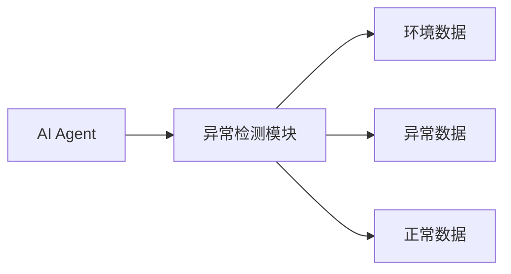

                 


# 《构建具有异常检测能力的AI Agent》

---

## 关键词：
- AI Agent
- 异常检测
- 机器学习
- 数据分析
- 系统架构

---

## 摘要：
本文将深入探讨如何构建具有异常检测能力的AI Agent。通过分析异常检测的核心概念、算法原理、系统架构以及实际应用场景，本文将帮助读者理解如何在AI Agent中实现高效的异常检测，从而提升系统的安全性和智能化水平。从基础概念到高级实现，本文将详细解析每一步骤，并通过实际案例展示如何将理论应用于实践。

---

## 第1章: 异常检测与AI Agent的背景介绍

### 1.1 异常检测的定义与重要性

#### 1.1.1 异常检测的核心概念
异常检测（Anomaly Detection）是指通过分析数据，识别出与正常数据模式不符的异常数据点或行为。这些异常可能是潜在的安全威胁、系统故障或操作错误，及时发现并处理这些异常对系统的稳定性和安全性至关重要。

#### 1.1.2 异常检测的常见应用场景
- **网络安全**：检测网络中的异常流量，识别潜在的攻击行为。
- **金融风控**：识别欺诈交易，保护用户资金安全。
- **设备监控**：检测工业设备的异常运行状态，预防设备故障。
- **用户行为分析**：识别用户的异常行为，防止账户被盗用。

#### 1.1.3 异常检测与AI Agent的结合
AI Agent（人工智能代理）是一种能够感知环境、自主决策并执行任务的智能实体。将异常检测能力集成到AI Agent中，可以使其在实时监控、智能预警和主动响应方面具备更强的能力。

### 1.2 AI Agent的基本概念

#### 1.2.1 AI Agent的定义与特点
AI Agent是一种能够感知环境、处理信息并采取行动的智能系统。它具有以下特点：
- **自主性**：能够自主决策，无需外部干预。
- **反应性**：能够实时感知环境并做出响应。
- **学习能力**：能够通过学习提升自身的性能。

#### 1.2.2 AI Agent的分类与功能
AI Agent可以根据功能和应用场景分为以下几类：
- **简单反射型AI Agent**：基于规则的简单决策。
- **基于模型的AI Agent**：基于预定义的模型进行复杂决策。
- **学习型AI Agent**：通过机器学习算法不断优化自身的决策能力。

#### 1.2.3 异常检测在AI Agent中的作用
异常检测能力是AI Agent的重要组成部分，它能够帮助AI Agent在复杂环境中识别潜在风险，提升系统的安全性和可靠性。

### 1.3 本章小结
本章从异常检测和AI Agent的基本概念出发，分析了异常检测的重要性和应用场景，并探讨了异常检测在AI Agent中的作用。通过本章的学习，读者可以理解异常检测与AI Agent结合的意义。

---

## 第2章: 异常检测的核心概念与原理

### 2.1 异常检测的原理

#### 2.1.1 基于统计的方法
基于统计的异常检测方法通过分析数据的分布特性，识别出偏离正常分布的数据点。常见的方法包括：
- **均值-标准差法**：通过计算数据的均值和标准差，判断数据点是否偏离均值超过一定倍数的标准差。
- **箱线图法**：通过绘制箱线图，识别数据中的异常值。

#### 2.1.2 基于机器学习的方法
基于机器学习的异常检测方法通过训练模型来学习正常数据的分布特性，识别异常数据。常见的方法包括：
- **支持向量机（SVM）**：通过构建分类模型，区分正常数据和异常数据。
- **随机森林**：通过构建决策树 ensemble，识别异常数据。

#### 2.1.3 基于深度学习的方法
基于深度学习的异常检测方法通过神经网络学习数据的高层次特征，识别异常数据。常见的方法包括：
- **自动编码器（Autoencoder）**：通过训练自动编码器重构数据，识别重构误差较大的数据点。
- **生成对抗网络（GAN）**：通过生成对抗网络生成正常数据的分布，识别偏离该分布的数据点。

### 2.2 异常检测与AI Agent的关系

#### 2.2.1 异常检测在AI Agent中的核心作用
异常检测是AI Agent的重要功能之一，它能够帮助AI Agent实时监控环境，识别潜在风险，提升系统的安全性和可靠性。

#### 2.2.2 异常检测与AI Agent的交互流程
1. AI Agent感知环境数据。
2. AI Agent将数据输入异常检测模块。
3. 异常检测模块识别异常数据。
4. AI Agent根据识别结果采取相应的行动。

#### 2.2.3 异常检测对AI Agent性能的影响
- **提升安全性**：及时发现并处理异常数据，防止潜在的安全威胁。
- **提高可靠性**：通过异常检测，减少系统故障的可能性。
- **增强智能性**：通过异常检测，AI Agent能够更好地理解环境，提升自主决策能力。

### 2.3 异常检测的核心要素

#### 2.3.1 数据特征分析
- 数据的分布特性
- 数据的相关性
- 数据的时序特性

#### 2.3.2 模型选择与优化
- 模型的性能
- 模型的可解释性
- 模型的可扩展性

#### 2.3.3 实时性与可扩展性
- 异常检测的实时性要求
- 系统的扩展能力

### 2.4 异常检测与AI Agent的实体关系图



---

## 第3章: 异常检测的核心概念与联系

### 3.1 异常检测的原理

#### 3.1.1 基于统计的方法
- 均值-标准差法
- 箱线图法

#### 3.1.2 基于机器学习的方法
- 支持向量机（SVM）
- 随机森林

#### 3.1.3 基于深度学习的方法
- 自动编码器（Autoencoder）
- 生成对抗网络（GAN）

### 3.2 异常检测与AI Agent的关系

#### 3.2.1 异常检测在AI Agent中的核心作用
- 提升安全性
- 提高可靠性
- 增强智能性

#### 3.2.2 异常检测与AI Agent的交互流程
1. AI Agent感知环境数据。
2. AI Agent将数据输入异常检测模块。
3. 异常检测模块识别异常数据。
4. AI Agent根据识别结果采取相应的行动。

#### 3.2.3 异常检测对AI Agent性能的影响
- 提升安全性
- 提高可靠性
- 增强智能性

### 3.3 异常检测的核心要素

#### 3.3.1 数据特征分析
- 数据的分布特性
- 数据的相关性
- 数据的时序特性

#### 3.3.2 模型选择与优化
- 模型的性能
- 模型的可解释性
- 模型的可扩展性

#### 3.3.3 实时性与可扩展性
- 异常检测的实时性要求
- 系统的扩展能力

### 3.4 异常检测与AI Agent的实体关系图


---

## 第4章: 异常检测算法的实现与优化

### 4.1 异常检测算法的实现

#### 4.1.1 基于统计的异常检测算法
- 均值-标准差法
- 箱线图法

#### 4.1.2 基于机器学习的异常检测算法
- 支持向量机（SVM）
- 随机森林

#### 4.1.3 基于深度学习的异常检测算法
- 自动编码器（Autoencoder）
- 生成对抗网络（GAN）

### 4.2 异常检测算法的优化

#### 4.2.1 模型调优
- 超参数优化
- 模型评估与验证

#### 4.2.2 数据预处理
- 数据清洗
- 特征工程

#### 4.2.3 实时性优化
- 线性扫描
- 分块处理

### 4.3 异常检测算法的数学模型

#### 4.3.1 基于概率的异常检测模型
$$ P(x) = \frac{1}{\sqrt{2\pi\sigma^2}}e^{-\frac{(x-\mu)^2}{2\sigma^2}} $$

#### 4.3.2 基于距离的异常检测模型
$$ d(x, y) = \sqrt{(x_1 - y_1)^2 + (x_2 - y_2)^2} $$

### 4.4 异常检测算法的代码实现

#### 4.4.1 基于统计的异常检测代码
```python
import numpy as np
from scipy import stats

def detect_anomalies(data):
    threshold = 3
    mean = np.mean(data)
    std = np.std(data)
    z_scores = [(x - mean)/std for x in data]
    anomalies = [x for x in data if np.abs((x - mean)/std) > threshold]
    return anomalies
```

#### 4.4.2 基于机器学习的异常检测代码
```python
from sklearn.svm import OneClassSVM

def detect_anomalies(data):
    model = OneClassSVM(nu=0.05)
    model.fit(data)
    predictions = model.predict(data)
    anomalies = [x for x in data if predictions[x] == -1]
    return anomalies
```

---

## 第5章: 异常检测的系统架构与实现

### 5.1 系统架构设计

#### 5.1.1 系统功能模块
- 数据采集模块
- 特征提取模块
- 异常检测模块
- 实时监控模块

#### 5.1.2 系统架构图


### 5.2 接口设计

#### 5.2.1 API接口
- 数据采集接口
- 异常检测接口
- 实时监控接口

#### 5.2.2 接口交互流程图


### 5.3 项目实战

#### 5.3.1 环境配置
- Python 3.8+
- numpy
- pandas
- scikit-learn
- mermaid

#### 5.3.2 核心代码实现
```python
import numpy as np
from sklearn.svm import OneClassSVM

def detect_anomalies(data):
    model = OneClassSVM(nu=0.05)
    model.fit(data)
    predictions = model.predict(data)
    anomalies = [x for x in data if predictions[x] == -1]
    return anomalies
```

#### 5.3.3 实际案例分析
- 网络安全中的异常流量检测
- 金融风控中的欺诈交易识别
- 工业设备中的异常状态监测

### 5.4 项目小结
通过本章的学习，读者可以掌握异常检测系统的整体架构设计，了解如何通过接口实现各模块之间的协同工作，并通过实际案例理解如何将理论应用于实践。

---

## 第6章: 异常检测的优化与未来展望

### 6.1 异常检测的优化方向

#### 6.1.1 提升模型的可解释性
- 可视化技术
- 解释性模型

#### 6.1.2 增强模型的实时性
- 分流处理
- 并行计算

#### 6.1.3 提高模型的可扩展性
- 模型微调
- 集成学习

### 6.2 未来展望

#### 6.2.1 多模态数据的异常检测
- 结合文本、图像等多种数据类型

#### 6.2.2 自适应异常检测
- 动态调整检测阈值
- 自动更新模型参数

#### 6.2.3 异常检测的智能化
- 自动识别异常模式
- 自动生成修复方案

### 6.3 总结与建议

#### 6.3.1 总结
异常检测是AI Agent的重要功能之一，通过不断优化算法和系统架构，可以提升异常检测的性能和效果。

#### 6.3.2 建议
- 加强模型的可解释性
- 提高系统的实时性和可扩展性
- 探索多模态数据的异常检测方法

---

## 第7章: 最佳实践与注意事项

### 7.1 最佳实践

#### 7.1.1 数据预处理
- 清洗数据
- 特征工程

#### 7.1.2 模型选择
- 根据场景选择合适的算法
- 多算法对比

#### 7.1.3 系统优化
- 优化算法性能
- 提高系统的实时性

### 7.2 注意事项

#### 7.2.1 数据隐私
- 确保数据的安全性和隐私性
- 遵守相关法律法规

#### 7.2.2 模型鲁棒性
- 避免过拟合和欠拟合
- 提高模型的泛化能力

#### 7.2.3 系统监控
- 实时监控系统性能
- 定期更新模型

---

## 第8章: 结语

### 8.1 总结
通过本文的深入探讨，读者可以全面了解如何构建具有异常检测能力的AI Agent。从异常检测的核心概念到算法实现，从系统架构到项目实战，本文为读者提供了完整的指导。

### 8.2 展望
未来，随着AI技术的不断发展，异常检测能力在AI Agent中的应用将更加广泛和深入。通过持续优化算法和系统架构，我们可以期待更加智能和高效的异常检测系统。

### 8.3 致谢
感谢读者的耐心阅读，感谢同行们的共同努力，感谢所有支持和帮助的人。

---

## 参考文献
（此处列出参考文献）

---

## 附录

### 附录A: 异常检测算法的数学公式

$$ P(x) = \frac{1}{\sqrt{2\pi\sigma^2}}e^{-\frac{(x-\mu)^2}{2\sigma^2}} $$

$$ d(x, y) = \sqrt{(x_1 - y_1)^2 + (x_2 - y_2)^2} $$

### 附录B: 异常检测系统架构图


---

# 结束语

通过本文的详细讲解，读者可以全面掌握如何构建具有异常检测能力的AI Agent。从理论到实践，从算法到系统架构，本文为读者提供了完整的指导。希望本文能为AI Agent的未来发展提供有益的参考和借鉴。

