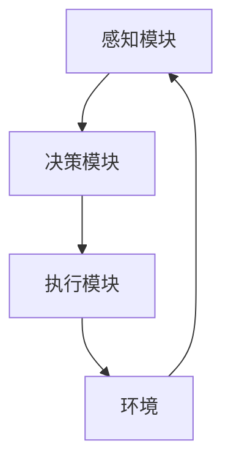

                 


# 构建具有强化学习能力的AI Agent

## 关键词：
- AI Agent, 强化学习, 算法实现, 系统架构, 项目实战, 应用案例

## 摘要：
本文详细探讨了如何构建一个具有强化学习能力的AI Agent。从强化学习的核心概念到具体算法的实现，从系统的整体架构到实际项目的实战经验，逐步深入分析，帮助读者全面理解并掌握AI Agent的设计与实现。文章内容丰富，涵盖理论与实践，适合希望在人工智能领域深入探索的技术从业者阅读。

---

# 1. 强化学习与AI Agent概述

## 1.1 AI Agent的基本概念
### 1.1.1 AI Agent的定义与特点
AI Agent（人工智能代理）是一种能够感知环境、自主决策并采取行动以实现目标的智能实体。AI Agent可以是软件程序、机器人或其他智能系统，其核心能力在于与环境互动并优化自身的决策过程。

### 1.1.2 强化学习在AI Agent中的作用
强化学习（Reinforcement Learning）是一种机器学习方法，通过智能体与环境的交互，学习最优策略以最大化累积奖励。强化学习为AI Agent提供了自主学习和适应复杂环境的能力，使其能够在动态环境中不断优化自身行为。

### 1.1.3 AI Agent的应用场景与优势
AI Agent广泛应用于游戏AI、机器人控制、自动驾驶、金融交易等领域。其优势在于能够通过强化学习快速适应复杂环境，实现自主决策和优化。

---

## 1.2 强化学习的核心概念
### 1.2.1 强化学习的基本原理
强化学习的核心是通过智能体与环境的交互，学习一个策略，使得智能体在特定环境下能够采取最优行动以获得最大累积奖励。

### 1.2.2 状态、动作与奖励的定义
- **状态（State）**：环境在某一时刻的描述，表示智能体所处的环境情况。
- **动作（Action）**：智能体在给定状态下采取的行为。
- **奖励（Reward）**：智能体采取动作后获得的反馈，用于指导智能体的学习。

### 1.2.3 策略与价值函数的介绍
- **策略（Policy）**：智能体在给定状态下选择动作的概率分布。
- **价值函数（Value Function）**：衡量某状态下采取某种策略的期望累积奖励。

---

## 1.3 强化学习的数学模型
### 1.3.1 状态空间的数学表示
状态空间可以表示为一个集合 \( S \)，其中每个元素 \( s \in S \) 表示一个状态。

### 1.3.2 动作空间的数学表示
动作空间可以表示为一个集合 \( A \)，其中每个元素 \( a \in A \) 表示一个动作。

### 1.3.3 奖励函数的数学模型
奖励函数 \( R(s, a) \) 表示智能体在状态 \( s \) 下采取动作 \( a \) 后获得的奖励。

---

## 1.4 本章小结
本章介绍了AI Agent的基本概念和强化学习的核心原理，为后续章节的深入分析奠定了基础。

---

# 2. 强化学习算法原理

## 2.1 Q-learning算法
### 2.1.1 Q-learning的基本原理
Q-learning是一种基于值函数的强化学习算法，通过更新Q值表来学习最优策略。

### 2.1.2 Q-learning的数学公式
$$ Q(s, a) = Q(s, a) + \alpha [r + \gamma \max Q(s', a') - Q(s, a)] $$

### 2.1.3 Q-learning的优缺点分析
- 优点：简单易实现，适用于离散状态和动作空间。
- 缺点：收敛速度较慢，难以处理连续状态和动作空间。

---

## 2.2 DQN算法
### 2.2.1 DQN的基本原理
DQN（Deep Q-Network）通过深度神经网络近似Q值函数，解决了Q-learning在处理复杂环境中的局限性。

### 2.2.2 DQN的网络结构
- 输入层：接收状态 \( s \)。
- 隐藏层：通过神经网络提取特征。
- 输出层：输出每个动作的Q值。

### 2.2.3 DQN的训练流程
1. 状态感知：智能体观察环境并获取当前状态 \( s \)。
2. 动作选择：根据当前策略选择一个动作 \( a \)。
3. 环境反馈：智能体采取动作 \( a \) 后，环境返回新的状态 \( s' \) 和奖励 \( r \)。
4. Q值更新：根据贝尔曼方程更新Q值。

---

## 2.3 政策梯度方法
### 2.3.1 政策梯度的基本原理
政策梯度方法直接优化策略，通过梯度上升方法最大化奖励函数的期望值。

### 2.3.2 政策梯度的数学公式
$$ \nabla \theta J(\theta) = \mathbb{E}[ \nabla \log \pi(a|s) Q(s,a) ] $$

### 2.3.3 政策梯度的优缺点分析
- 优点：可以直接优化策略，适用于连续动作空间。
- 缺点：计算复杂度较高，收敛速度较慢。

---

## 2.4 蒲公英算法
### 2.4.1 蒲公英算法的基本原理
蒲公英算法是一种基于群体智能的强化学习算法，通过模拟蒲公英种子的传播过程，实现多智能体协作。

### 2.4.2 蒲公英算法的数学公式
$$ r_i = \sum_{j \neq i} w_{ij} r_j $$

### 2.4.3 蒲公英算法的应用场景
适用于多智能体协作、分布式系统优化等领域。

---

## 2.5 本章小结
本章详细介绍了几种经典的强化学习算法，包括Q-learning、DQN和政策梯度方法，并分析了它们的优缺点及应用场景。

---

# 3. AI Agent的系统架构与设计

## 3.1 AI Agent的设计原则
### 3.1.1 模块化设计
- 感知模块：负责感知环境状态。
- 决策模块：负责根据状态选择动作。
- 执行模块：负责执行动作并返回结果。

### 3.1.2 分层设计
- 行为层：负责具体的动作执行。
- 规划层：负责制定长期策略。
- 学习层：负责算法的训练与优化。

### 3.1.3 可扩展性设计
- 模块的可扩展性：支持新增功能模块。
- 算法的可扩展性：支持多种算法的集成。
- 环境的可扩展性：支持不同环境的适配。

---

## 3.2 AI Agent的系统架构
### 3.2.1 系统架构概述
AI Agent的系统架构通常包括感知层、决策层和执行层。

### 3.2.2 感知模块的实现
- 状态感知：通过传感器或API获取环境状态。
- 环境交互：通过接口与环境进行数据交换。

### 3.2.3 决策模块的实现
- 策略网络：负责生成策略。
- Q值网络：负责计算Q值。

---

## 3.3 系统架构的mermaid图


---

## 3.4 本章小结
本章详细探讨了AI Agent的系统架构与设计原则，为后续章节的实现奠定了基础。

---

# 4. 项目实战：构建AI Agent

## 4.1 项目介绍
本项目旨在构建一个基于强化学习的AI Agent，使其能够在模拟环境中自主学习并优化决策策略。

---

## 4.2 环境安装
```bash
pip install gym numpy tensorflow
```

---

## 4.3 核心代码实现
### 4.3.1 感知模块
```python
class Perceptor:
    def __init__(self, env):
        self.env = env

    def get_state(self):
        return self.env.observation_space.sample()
```

### 4.3.2 决策模块
```python
class DecisionModule:
    def __init__(self, state_dim, action_dim):
        self.model = self.build_model(state_dim, action_dim)

    def build_model(self, state_dim, action_dim):
        model = Sequential()
        model.add(Dense(64, activation='relu', input_dim=state_dim))
        model.add(Dense(action_dim))
        model.compile(optimizer='adam', loss='mse')
        return model

    def act(self, state):
        prediction = self.model.predict(state)
        return np.argmax(prediction)
```

### 4.3.3 执行模块
```python
class Executor:
    def __init__(self, env):
        self.env = env

    def execute_action(self, action):
        observation, reward, done, info = self.env.step(action)
        return observation, reward, done, info
```

---

## 4.4 算法实现
### 4.4.1 Q-learning算法实现
```python
class QLearning:
    def __init__(self, state_dim, action_dim):
        self.q_table = np.zeros((state_dim, action_dim))

    def choose_action(self, state, epsilon):
        if np.random.random() < epsilon:
            return np.random.randint(action_dim)
        else:
            return np.argmax(self.q_table[state])

    def update_q_table(self, state, action, reward, next_state):
        self.q_table[state, action] += alpha * (reward + gamma * np.max(self.q_table[next_state]) - self.q_table[state, action])
```

---

## 4.5 测试与优化
### 4.5.1 测试场景
在模拟环境中测试AI Agent的决策能力，观察其在不同状态下的行为表现。

### 4.5.2 参数调整
调整学习率 \( \alpha \) 和折扣因子 \( \gamma \) ，以优化算法的收敛速度和性能。

---

## 4.6 项目小结
本章通过实际项目展示了如何构建一个基于强化学习的AI Agent，详细讲解了各个模块的设计与实现，并给出了代码示例。

---

# 5. 总结与展望

## 5.1 总结
本文详细探讨了如何构建一个具有强化学习能力的AI Agent，从理论到实践，全面分析了强化学习的核心算法和系统架构设计。

## 5.2 展望
未来的研究方向包括多智能体协作、复杂环境下的强化学习、以及强化学习与深度学习的结合。通过不断优化算法和系统架构，AI Agent将在更多领域展现出强大的应用潜力。

---

## tips
- 在实际项目中，建议从简单环境开始，逐步增加环境复杂度。
- 参数的选择对算法性能影响较大，需进行充分实验验证。
- 多与他人交流，学习优秀项目的经验。

---

通过本文的详细讲解，相信读者已经掌握了构建具有强化学习能力的AI Agent的核心方法和实现步骤。希望本文能为读者在人工智能领域的深入探索提供有价值的参考和指导。

