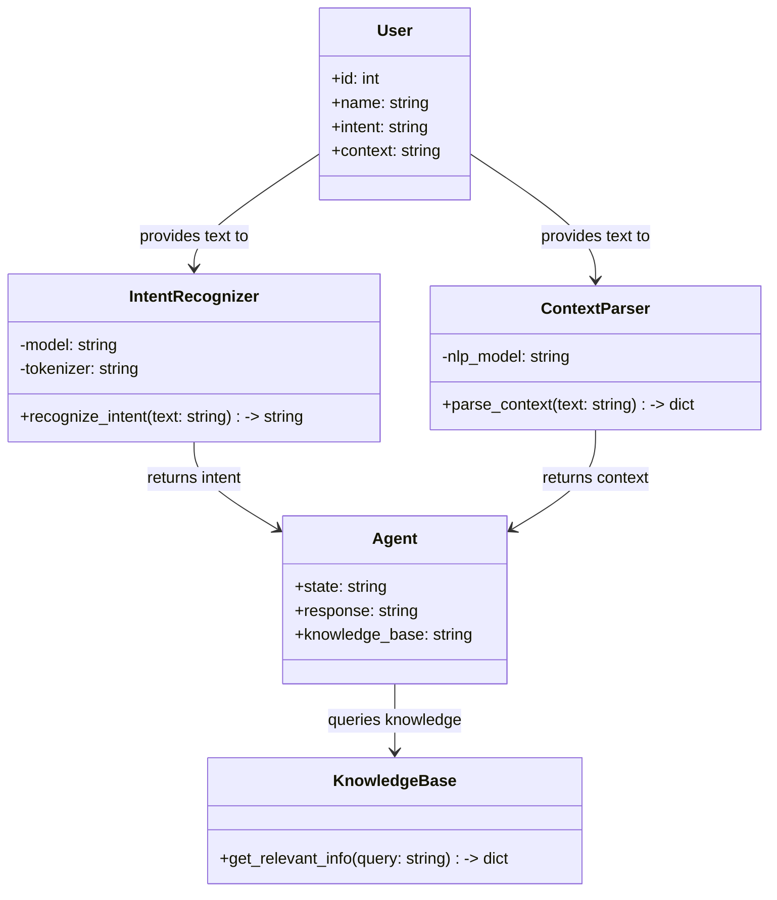
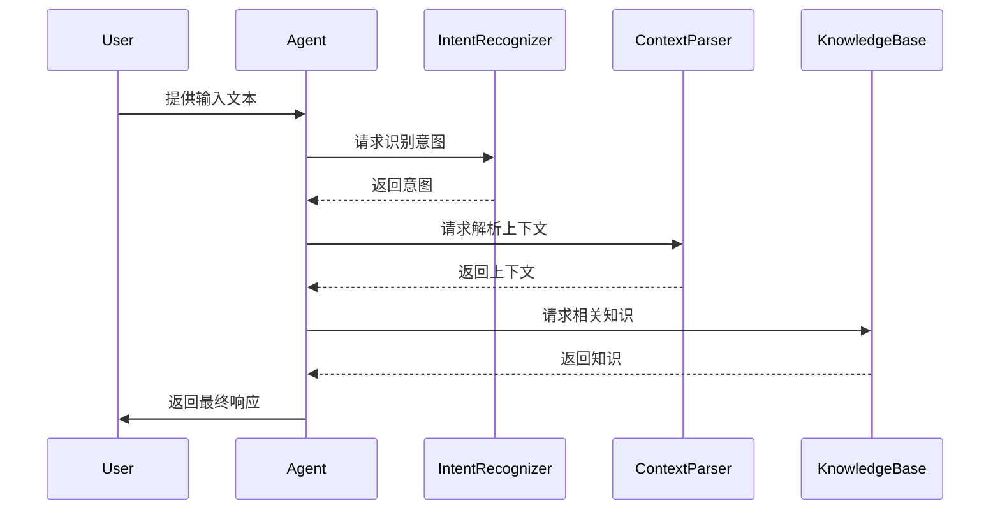

                 


# 第5章: 情境感知AI Agent的系统架构与设计

## 5.1 系统应用场景
### 5.1.1 智能助手
### 5.1.2 智慧教育
### 5.1.3 智慧医疗

## 5.2 系统功能设计
### 5.2.1 领域模型设计
### 5.2.2 领域模型的类图设计


## 5.3 系统架构设计
### 5.3.1 架构分层设计


## 5.4 系统接口设计
### 5.4.1 主要接口
- `IntentRecognizer.recognize_intent(text: str) -> str`
- `ContextParser.parse_context(text: str) -> dict`
- `KnowledgeBase.get_relevant_info(query: str) -> dict`

## 5.5 系统交互序列图


# 第6章: 情境感知AI Agent的项目实战

## 6.1 环境安装与配置
### 6.1.1 安装Python环境
```bash
python --version
pip install --upgrade pip
pip install numpy
pip install scikit-learn
pip install spacy
python -m spacy download en_core_web_sm
```

### 6.1.2 安装NLP库
```bash
pip install nltk
pip install transformers
pip install pytorch
```

## 6.2 核心代码实现
### 6.2.1 意图识别
```python
from transformers import pipeline

intent_classifier = pipeline("text-classification", model="snunlp/korean-kiwi-cls-ft-1024-mean-b1")
def recognize_intent(text):
    result = intent_classifier(text)
    return result[0]['label']
```

### 6.2.2 上下文理解
```python
import spacy

nlp = spacy.load("en_core_web_sm")
def parse_context(text):
    doc = nlp(text)
    entities = [(ent.label_, ent.text) for ent in doc.ents]
    return {"entities": entities}
```

### 6.2.3 知识推理
```python
from nltk import word_tokenize, pos_tag, ne_chunk
from nltk.chunk import tree2conlltags

def get_relevant_info(query):
    # 简单的关键词提取
    tokens = word_tokenize(query)
    tagged = pos_tag(tokens)
    ne = ne_chunk(tagged)
    conlltags = tree2conlltags(ne)
    entities = [ne[2] for ne in conlltags if ne[2] in ['NNP', 'NN']]
    return {"entities": entities}
```

## 6.3 项目实现案例分析
### 6.3.1 实际案例分析
### 6.3.2 代码实现与解读
### 6.3.3 案例总结与分析

## 6.4 项目小结
### 6.4.1 项目实现过程总结
### 6.4.2 关键问题总结
### 6.4.3 改进方向展望

# 第7章: 情境感知AI Agent的最佳实践与总结

## 7.1 最佳实践与经验分享
### 7.1.1 数据质量的重要性
### 7.1.2 模型可解释性的优化
### 7.1.3 系统可扩展性设计

## 7.2 小结与回顾
### 7.2.1 全书内容总结
### 7.2.2 读者注意事项
### 7.2.3 未来发展方向

# 参考文献
- 引用的论文、书籍、技术文档等

# 索引
- 关键词索引

# 致谢
- 致谢参与项目开发的人员或机构

