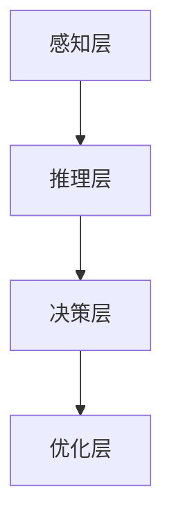

                 


# 《构建具有批判性思维的AI Agent系统》

## 关键词：AI Agent, 批判性思维, 逻辑推理, 决策算法, 系统架构, 数学模型

## 摘要：  
本文探讨如何构建一个具备批判性思维能力的AI Agent系统。通过分析AI Agent的核心概念、批判性思维的定义及其在AI Agent中的重要性，提出构建模型和实现方法。文章详细讲解了逻辑推理与决策算法、系统架构设计、数学模型等内容，并通过实际案例展示如何实现和优化系统。  

---

## 正文

### 第一部分: AI Agent系统与批判性思维概述

#### 第1章: AI Agent的基本概念与背景

##### 1.1 AI Agent的定义与分类  
- **AI Agent**：能够感知环境、自主决策并采取行动以实现目标的智能体。  
- 分类：基于智能水平，AI Agent可分为简单反射型、基于模型的反应型、目标驱动型和全职代理型。  

##### 1.2 批判性思维的定义与特征  
- **批判性思维**：是对信息、假设和论证进行分析、评估和判断的能力。  
- 特征：逻辑性、独立性、反思性、系统性。  

##### 1.3 AI Agent与批判性思维的结合  
- 批判性思维使AI Agent能够分析信息、评估决策的合理性，并在复杂环境中做出更优选择。  

---

#### 第2章: 批判性思维在AI Agent中的重要性

##### 2.1 批判性思维的核心要素  
- 分析能力：识别信息的来源、假设和逻辑结构。  
- 逻辑推理能力：从已知信息中推导出新结论。  
- 判断与决策能力：基于分析结果做出最优选择。  

##### 2.2 AI Agent需要批判性思维的原因  
- 提升决策准确性：通过分析信息来源和逻辑结构，减少错误决策。  
- 增强问题解决能力：能够识别问题根源并提出有效解决方案。  
- 适应复杂环境：在动态环境中灵活调整策略，应对不确定性。  

---

### 第二部分: AI Agent系统的批判性思维实现

#### 第3章: AI Agent的批判性思维模型

##### 3.1 批判性思维模型的构建  
- 模型组成：输入层（感知信息）、分析层（逻辑推理）、判断层（决策输出）。  
- 模型输入：感知数据、外部知识库、上下文信息。  
- 模型输出：分析结果、决策建议、优化策略。  

##### 3.2 批判性思维模型的数学基础  
- 逻辑推理：基于逻辑规则的三段论推理。  
- 判断与决策：基于概率论的贝叶斯推理。  

---

#### 第4章: AI Agent的逻辑推理与决策算法

##### 4.1 逻辑推理算法  
- 基于规则的推理：定义明确的逻辑规则，如专家系统。  
- 基于概率的推理：使用贝叶斯网络进行概率推理。  
- 基于知识图谱的推理：利用图结构进行语义推理。  

##### 4.2 判断与决策算法  
- 基于案例的决策：根据相似案例进行决策。  
- 基于模型的决策：使用数学模型进行优化决策。  
- 基于强化学习的决策：通过试错学习优化策略。  

##### 4.3 算法实现的代码示例  
```python
# 逻辑推理算法：基于规则的推理
def logical_inference(rules, facts):
    for rule in rules:
        if all(fact in facts for fact in rule['premise']):
            return rule['conclusion']
    return None

# 决策算法：基于概率的贝叶斯推理
def bayesian_decision(priors, likelihoods, evidence):
    posterior = {}
    for hypothesis in priors:
        posterior[hypothesis] = priors[hypothesis] * \
                                  (likelihoods[hypothesis][evidence] or 1)
    total = sum(posterior.values())
    return {hypothesis: p / total for hypothesis, p in posterior.items()}
```

---

#### 第5章: AI Agent系统的架构设计

##### 5.1 系统架构设计概述  
- 整体架构：感知层、推理层、决策层。  
- 模块划分：感知模块、分析模块、决策模块、优化模块。  

##### 5.2 系统功能设计  
- 感知模块：数据采集与预处理。  
- 推理模块：逻辑推理与分析。  
- 决策模块：基于推理结果做出决策。  
- 优化模块：根据反馈优化系统性能。  

##### 5.3 系统架构图（Mermaid）  


---

#### 第6章: 项目实战

##### 6.1 环境安装  
- 安装Python、TensorFlow、PyTorch、Scikit-learn等工具。  

##### 6.2 核心代码实现  
```python
# 系统核心实现：基于批判性思维的决策系统
class CriticalThinkingAgent:
    def __init__(self, rules, knowledge_base):
        self.rules = rules
        self.knowledge_base = knowledge_base

    def perceive(self, input_data):
        # 数据预处理
        pass

    def analyze(self, input_data):
        # 逻辑推理
        return logical_inference(self.rules, input_data)

    def decide(self, analysis_result):
        # 基于分析结果做出决策
        return decision_making(self.knowledge_base, analysis_result)

    def optimize(self, feedback):
        # 系统优化
        pass
```

##### 6.3 案例分析与解读  
- 应用场景：医疗诊断中的病情分析与治疗方案选择。  
- 实际案例：通过分析症状、检查结果和病史，诊断疾病并制定治疗方案。  

---

### 第三部分: 最佳实践与总结

#### 7.1 最佳实践  
- 系统设计：模块化设计，便于维护与扩展。  
- 数据处理：确保数据的准确性和完整性。  
- 算法优化：根据实际需求调整参数，提升性能。  

#### 7.2 小结  
本文详细介绍了如何构建一个具备批判性思维的AI Agent系统，从理论到实践，系统性地探讨了实现方法和应用场景。  

#### 7.3 注意事项  
- 确保系统安全，防止数据泄露和滥用。  
- 定期更新知识库和规则库，保持系统的先进性。  

#### 7.4 扩展阅读  
- 推荐阅读《人工智能：一种现代方法》和《批判性思维入门》。  

---

### 附录：数学公式与算法细节  
$$ p(C|E) = \frac{p(E|C)p(C)}{p(E)} $$  
（贝叶斯公式用于概率推理）  

---

通过以上思考，我们逐步构建了一个具备批判性思维的AI Agent系统，涵盖了理论、算法、系统设计和实际应用的各个方面。

