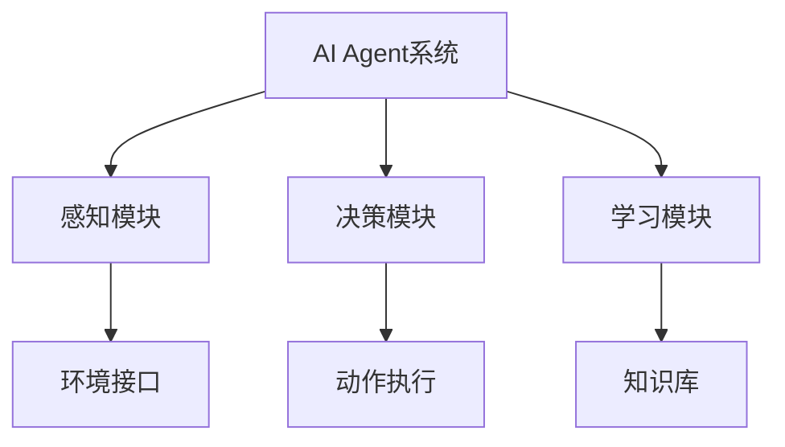
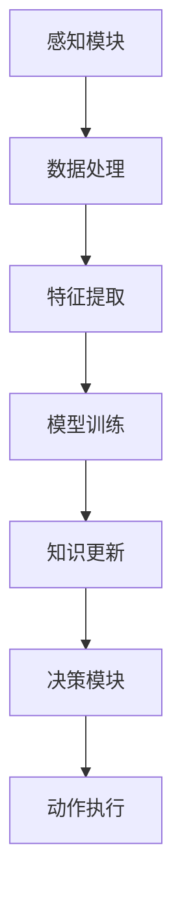
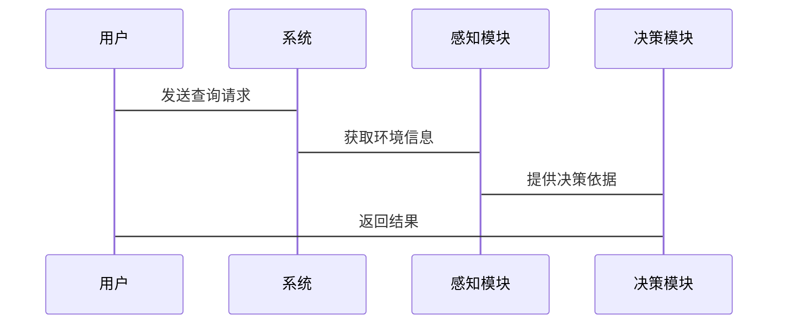

                 


# 构建具有持续学习与知识更新能力的AI Agent

> 关键词：AI Agent，持续学习，知识更新，机器学习，深度学习，自然语言处理

> 摘要：本文系统地探讨了如何构建一个能够持续学习和更新知识的AI Agent。首先，我们介绍了AI Agent的基本概念和持续学习的重要性。然后，详细分析了持续学习的核心机制，包括经验重放、策略优化和知识蒸馏。接下来，深入讲解了相关的算法原理，并通过Mermaid图展示了系统的架构设计。最后，通过实际项目案例，详细阐述了如何将理论应用于实践，并总结了最佳实践和注意事项。

---

# 第一部分：AI Agent与持续学习概述

## 第1章：AI Agent的基本概念

### 1.1 AI Agent的定义

AI Agent（人工智能代理）是指在计算机系统中，能够感知环境并采取行动以实现目标的智能实体。AI Agent可以是软件程序、机器人或其他智能系统，具备自主决策和问题解决的能力。

### 1.2 持续学习的背景与意义

持续学习是指AI Agent能够在不断变化的环境中，通过与环境的交互和数据的积累，逐步优化自身的知识和技能。持续学习的核心在于使AI Agent具备适应性和灵活性，能够应对新任务和新数据的挑战。

### 1.3 持续学习与知识更新的技术发展

- **知识蒸馏**：通过将复杂模型的知识迁移到简单模型中，实现模型的轻量化和高效更新。
- **知识表示学习**：研究如何将知识以一种可计算和可更新的形式表示，如图结构或向量表示。
- **知识图谱的构建与更新**：通过不断收集和更新数据，构建动态的知识图谱，支持AI Agent的知识更新。

---

## 第2章：持续学习的核心机制

### 2.1 经验重放

经验重放是一种常用的持续学习技术，通过存储和重复使用过去的经验来增强模型的学习能力。具体步骤如下：

1. **经验存储**：将AI Agent在环境中的交互经验存储在记忆库中。
2. **经验回放**：随机抽取部分经验，用于训练模型，避免模型陷入局部最优。
3. **经验优先级**：根据经验的重要性进行排序，优先回放重要的经验。

### 2.2 策略优化

策略优化是通过不断调整AI Agent的决策策略，使其在持续学习中更加高效和准确。常用的方法包括：

- **Q-Learning**：通过状态-动作-奖励-状态（SARSA）更新策略。
- **Deep Q-Networks（DQN）**：结合深度学习，利用神经网络近似Q值函数。

### 2.3 知识蒸馏

知识蒸馏通过将教师模型的知识迁移到学生模型中，实现模型的压缩和优化。具体步骤包括：

1. **教师模型训练**：训练一个高性能的教师模型。
2. **知识提取**：提取教师模型的知识，如概率分布或特征表示。
3. **学生模型训练**：利用提取的知识训练学生模型，使其快速接近教师模型的性能。

---

## 第3章：算法原理与实现

### 3.1 经验重放算法的实现

以下是经验重放算法的Python代码示例：

```python
import random
import numpy as np

class ExperienceReplay:
    def __init__(self, capacity):
        self.capacity = capacity
        self.memory = []
    
    def remember(self, state, action, reward, next_state):
        self.memory.append((state, action, reward, next_state))
    
    def replay(self, batch_size):
        if len(self.memory) < batch_size:
            return []
        indices = random.sample(range(len(self.memory)), batch_size)
        mini_batch = [self.memory[i] for i in indices]
        return mini_batch
```

### 3.2 策略优化的数学模型

策略优化的数学模型可以通过以下公式表示：

$$ Q(s, a) = Q(s, a) + \alpha (r + \gamma \max_a Q(s', a) - Q(s, a)) $$

其中：
- \( Q(s, a) \) 是当前状态下动作 \( a \) 的Q值。
- \( \alpha \) 是学习率。
- \( r \) 是奖励。
- \( \gamma \) 是折扣因子。
- \( s' \) 是下一个状态。

---

## 第4章：系统架构与设计

### 4.1 系统功能设计

以下是AI Agent系统的功能模块图：



### 4.2 系统架构设计

以下是系统的架构图：



### 4.3 系统接口设计

以下是系统接口的交互图：



---

## 第5章：项目实战与案例分析

### 5.1 项目环境安装

以下是项目所需的环境安装命令：

```bash
pip install numpy
pip install matplotlib
pip install gym
```

### 5.2 核心代码实现

以下是实现持续学习AI Agent的核心代码：

```python
import gym
import numpy as np

class AI_Agent:
    def __init__(self, env):
        self.env = env
        self.state_space = env.observation_space.shape[0]
        self.action_space = env.action_space.n
        self.model = self.build_model()
    
    def build_model(self):
        # 神经网络模型的构建
        pass
    
    def remember(self, state, action, reward, next_state):
        # 存储经验
        pass
    
    def replay(self, batch_size):
        # 经验回放
        pass
    
    def act(self, state):
        # 选择动作
        pass
    
    def train(self, batch_size):
        # 训练模型
        pass
```

### 5.3 案例分析

以下是AI Agent在强化学习中的应用案例：


---

## 第6章：最佳实践与注意事项

### 6.1 最佳实践

1. **数据预处理**：确保数据的多样性和质量，避免过拟合。
2. **模型选择**：根据任务需求选择合适的模型架构和算法。
3. **持续优化**：定期更新模型和知识库，保持AI Agent的性能。

### 6.2 小结

构建具有持续学习与知识更新能力的AI Agent是一个复杂但 rewarding 的过程。通过经验重放、策略优化和知识蒸馏等技术，可以显著提升AI Agent的智能水平和适应性。

### 6.3 注意事项

1. **数据隐私**：确保数据的收集和使用符合隐私保护法规。
2. **模型稳定性**：避免模型在更新过程中出现不稳定或性能下降。
3. **计算资源**：持续学习需要大量的计算资源，确保硬件配置充足。

---

## 第7章：拓展阅读与深入学习

### 7.1 拓展阅读

1. **深度强化学习**：进一步学习DQN、PPO等算法。
2. **知识图谱**：深入研究知识图谱的构建与应用。
3. **自监督学习**：探索自监督学习在持续学习中的应用。

### 7.2 深入学习

建议读者阅读以下书籍和论文：
- 《Deep Learning》（Ian Goodfellow等著）
- 《Reinforcement Learning: Theory and Algorithms》（S. L. Whiteson著）

---

# 结语

通过本文的系统讲解，读者可以全面了解如何构建具有持续学习与知识更新能力的AI Agent。从基础概念到算法实现，从系统设计到项目实战，每一步都详细展开，帮助读者掌握核心技术和实际应用。希望本文能为读者提供有价值的指导和启示。

