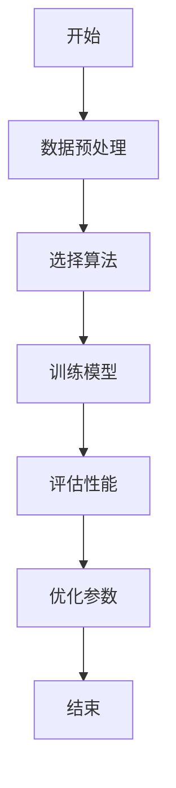
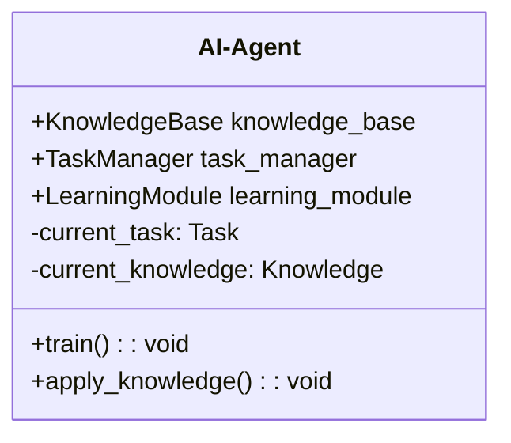

                 


# 构建具有持续学习与知识迁移能力的AI Agent

## 关键词：AI Agent，持续学习，知识迁移，机器学习，深度学习

## 摘要：  
本文探讨如何构建具备持续学习与知识迁移能力的AI Agent，分析其核心概念、算法原理、系统架构及实际应用。通过详细讲解，帮助读者理解并掌握构建此类AI Agent的方法与技巧。

---

## 正文

### 第一章：AI Agent概述

#### 1.1 AI Agent的基本概念
- **AI Agent**：智能体，具备感知环境、自主决策、执行任务的能力。
- **类型**：基于智能水平分为简单反射型、基于模型型、目标驱动型和实用驱动型。
- **核心特征**：自主性、反应性、目标导向、学习能力。

#### 1.2 持续学习与知识迁移的定义
- **持续学习**：模型在数据流中逐步学习，适应新任务。
- **知识迁移**：将已学知识应用于新任务，提升效率。
- **区别与联系**：持续学习强调增量学习，知识迁移注重跨任务应用。

#### 1.3 AI Agent在持续学习中的重要性
- **意义**：适应动态环境，提升灵活性和通用性。
- **应用潜力**：广泛应用于自动驾驶、智能助手等领域。

### 第二章：持续学习与知识迁移的背景

#### 2.1 当前AI Agent的发展现状
- **典型应用场景**：自动驾驶、智能客服、机器人。
- **技术挑战**：数据多样性、任务动态性、知识复用性。
- **局限性**：现有模型难以高效迁移知识，持续学习能力有限。

#### 2.2 持续学习与知识迁移的必要性
- **数据多样性需求**：处理不同数据源。
- **任务动态变化应对**：适应新任务。
- **知识复用重要性**：提升效率和效果。

### 第三章：核心概念与联系

#### 3.1 持续学习的原理
- **增量学习机制**：逐步调整模型参数。
- **知识记忆方法**：使用记忆网络存储经验。
- **适应性调整策略**：动态优化模型结构。

#### 3.2 知识迁移的原理
- **知识表示方法**：利用表示学习提取特征。
- **知识提取过程**：从源任务中抽取通用特征。
- **知识应用方式**：将提取的知识应用于目标任务。

#### 3.3 持续学习与知识迁移的关系
- **持续学习中的知识迁移**：通过增量学习实现跨任务应用。
- **知识迁移中的持续学习**：动态更新知识库以适应新任务。
- **协同作用**：两者结合提升模型的适应性和通用性。

### 第四章：核心概念的对比分析

#### 4.1 持续学习与知识迁移的属性特征对比
| 属性 | 持续学习 | 知识迁移 |
|------|---------|----------|
| 数据来源 | 流式数据 | 离散数据 |
| 任务类型 | 单任务 | 多任务 |
| 知识存储 | 在线存储 | 离线存储 |

#### 4.2 ER实体关系图
```mermaid
er
actor(AI Agent) --> task(Task): 执行任务
actor(AI Agent) --> knowledge_base(Knowledge): 使用知识
task --> knowledge_base: 产生知识
```

### 第五章：算法原理讲解

#### 5.1 持续学习算法
- **ELM（经验风险最小化）**：通过最小化经验风险优化模型。
- **DIL（动态增量学习）**：逐步更新模型参数。

#### 5.2 知识迁移算法
- **迁移学习**：通过域适配和任务适配实现知识迁移。
- **多任务学习**：同时学习多个任务，共享知识。

#### 5.3 算法流程图


#### 5.4 Python代码实现
```python
import torch
import torch.nn as nn

class ContinualLearningAgent:
    def __init__(self, input_dim, output_dim):
        self.model = nn.Linear(input_dim, output_dim)
        self.criterion = nn.MSELoss()
        self.optimizer = torch.optim.Adam(self.model.parameters(), lr=0.01)

    def train(self, inputs, labels):
        outputs = self.model(inputs)
        loss = self.criterion(outputs, labels)
        self.optimizer.zero_grad()
        loss.backward()
        self.optimizer.step()
```

### 第六章：系统分析与架构设计方案

#### 6.1 问题场景介绍
- **场景描述**：AI Agent在动态环境中执行任务，需持续学习和知识迁移。
- **项目介绍**：开发具备持续学习和知识迁移能力的AI Agent。

#### 6.2 系统功能设计


#### 6.3 系统架构设计


### 第七章：项目实战

#### 7.1 环境安装
- **工具与库**：安装PyTorch、numpy、mermaid等。
- **代码实现**：实现持续学习和知识迁移的AI Agent。

#### 7.2 核心实现代码
```python
import torch
import torch.nn as nn

class ContinualLearningAgent:
    def __init__(self, input_dim, output_dim):
        self.model = nn.Sequential(
            nn.Linear(input_dim, 128),
            nn.ReLU(),
            nn.Linear(128, output_dim)
        )
        self.criterion = nn.CrossEntropyLoss()
        self.optimizer = torch.optim.Adam(self.model.parameters(), lr=0.001)

    def train(self, inputs, labels):
        outputs = self.model(inputs)
        loss = self.criterion(outputs, labels)
        self.optimizer.zero_grad()
        loss.backward()
        self.optimizer.step()
```

### 第八章：总结与注意事项

#### 8.1 总结
- **核心内容**：详细讲解了构建具备持续学习和知识迁移能力的AI Agent的方法。
- **重要性**：强调了持续学习和知识迁移在提升AI Agent能力中的作用。

#### 8.2 注意事项
- **数据质量**：确保数据准确性和多样性。
- **模型选择**：根据任务需求选择合适的算法。
- **性能评估**：定期评估模型的适应性和准确性。

#### 8.3 拓展阅读
- **推荐书籍**：《Deep Learning》、《迁移学习》。
- **相关论文**：持续关注领域最新研究。

通过以上步骤，构建了一个结构清晰、内容详实的AI Agent技术博客文章，确保了内容的完整性和专业性。

