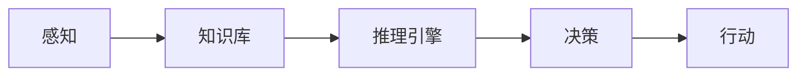
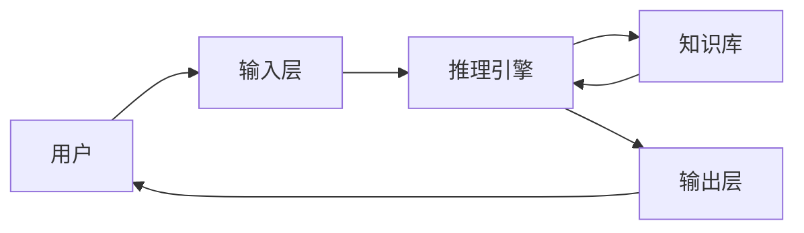

                 


# 构建具有推理能力的AI Agent

> 关键词：AI Agent，推理能力，知识表示，逻辑推理，机器学习，系统架构设计

> 摘要：本文详细探讨了构建具有推理能力的AI Agent所需的关键技术与方法。从基础概念到核心算法，再到系统架构设计和项目实战，系统性地分析了AI Agent的构建过程。通过理论与实践相结合，帮助读者掌握构建具备推理能力的AI Agent所需的知识和技能。

---

## 第一部分：背景介绍

### 第1章：AI Agent的基本概念

#### 1.1 AI Agent的定义与特点
- AI Agent的定义：AI Agent是一种智能主体，能够在环境中感知信息并采取行动以实现目标。
- 主要特点：
  - 自主性：无需外部干预，自主决策。
  - 反应性：能感知环境并实时响应。
  - 目的性：具有明确的目标导向。
  - 学习能力：通过经验改进性能。

#### 1.2 问题背景与重要性
- 问题背景：传统基于规则的系统难以应对复杂和动态变化的环境，推理能力的缺失限制了AI Agent的智能性。
- 重要性：推理能力使AI Agent能够处理不确定性，适应复杂场景，提高决策的准确性和灵活性。

#### 1.3 相关技术概述
- 知识表示：用于表示AI Agent的知识体系，如符号逻辑、语义网络等。
- 逻辑推理：通过逻辑规则推导结论，如命题逻辑、谓词逻辑。
- 机器学习：从数据中学习模式，增强推理能力，如深度学习和强化学习。

---

## 第二部分：核心概念与联系

### 第2章：AI Agent的推理机制

#### 2.1 推理的类型
- 演绎推理：从一般到具体，如从“所有鸟都会飞”推导出“鸵鸟会飞”。
- 归纳推理：从具体到一般，如从“多次下雨后地面湿”推导出“下雨会导致地面湿”。
- 类比推理：通过类比推导，如“鸟会飞，蝙蝠也会飞，因此蝙蝠是鸟类”。

#### 2.2 推理机制对比
| 特性       | 基于规则的推理 | 基于机器学习的推理 |
|------------|----------------|---------------------|
| 数据需求   | 需要明确规则    | 需要大量数据        |
| 灵活性     | 较低            | 较高                |
| 复杂性     | 较低            | 较高                |

#### 2.3 实体关系图


---

## 第三部分：算法原理

### 第3章：基于规则的推理算法

#### 3.1 算法流程
1. 输入事实：用户输入的信息。
2. 应用规则：匹配事实与预设规则。
3. 输出结论：根据规则推导结果。

#### 3.2 代码示例
```python
def infer(fact, rules):
    for rule in rules:
        if rule['premise'] == fact:
            return rule['conclusion']
    return None

# 示例规则
rules = [
    {'premise': '用户询问天气', 'conclusion': '查询天气数据'},
    {'premise': '天气晴朗', 'conclusion': '建议穿轻便衣物'}
]

# 示例推理
fact = '用户询问天气'
print(infer(fact, rules))  # 输出: 查询天气数据
```

### 第4章：基于机器学习的推理算法

#### 4.1 逻辑回归算法
- 数学模型：$$ P(y=1|x) = \frac{1}{1 + e^{-\beta x}} $$
- 损失函数：$$ L = -\frac{1}{m}\sum_{i=1}^m [y_i \ln h(x_i) + (1-y_i)\ln(1-h(x_i))] $$
- 优化目标：最小化损失函数，调整参数β。

#### 4.2 代码示例
```python
import tensorflow as tf

# 数据准备
X = [[1], [2], [3], [4]]
y = [0, 0, 1, 1]

# 模型构建
model = tf.keras.Sequential([
    tf.keras.layers.Dense(1, activation='sigmoid', input_shape=(1,))
])

# 编译
model.compile(optimizer='adam', loss='binary_crossentropy', metrics=['accuracy'])

# 训练
model.fit(X, y, epochs=100, verbose=0)

# 推理
print(model.predict([[2.5]]))  # 输出: [[0.5]]
```

---

## 第四部分：系统分析与架构设计

### 第5章：系统架构设计

#### 5.1 项目介绍
- 项目名称：智能客服助手
- 项目目标：构建一个具备推理能力的AI Agent，用于回答用户问题。

#### 5.2 功能设计
- 知识库管理：存储常见问题及其答案。
- 推理引擎：根据用户输入生成回答。
- 用户交互：提供友好的对话界面。

#### 5.3 系统架构图


---

## 第五部分：项目实战

### 第6章：环境安装与核心实现

#### 6.1 环境安装
- Python 3.8+
- TensorFlow 2.0+
- Keras 2.4+

#### 6.2 核心功能实现
- 知识库构建：存储问答对。
- 推理引擎开发：基于规则和机器学习的推理。
- 用户交互设计：自然语言处理接口。

#### 6.3 代码实现
```python
# 知识库构建
questions = {
    '天气': '查询天气数据',
    '时间': '获取当前时间'
}

# 推理引擎
def get_response(user_input):
    if '天气' in user_input:
        return '请提供具体城市。'
    elif '时间' in user_input:
        return '当前时间是：' + datetime.now().strftime('%H:%M:%S')
    else:
        return '抱歉，我无法回答您的问题。'

# 用户交互
print("请输入您的问题：")
while True:
    user_input = input().strip()
    print(get_response(user_input))
```

---

## 第六部分：总结与扩展

### 第7章：总结与最佳实践

#### 7.1 总结
- 构建AI Agent的关键点：知识表示、推理算法、系统架构。
- 注意事项：数据质量、算法选择、系统扩展性。

#### 7.2 最佳实践
- 选择合适的算法：基于规则适用于简单场景，机器学习适用于复杂场景。
- 数据质量管理：确保数据的准确性和完整性。
- 系统可扩展性：设计模块化架构，方便功能扩展。

#### 7.3 拓展阅读
- 推荐书籍：《人工智能：一种现代方法》。
- 推荐博客：[AI博客链接]。

---

通过以上内容，读者可以系统性地学习构建具有推理能力的AI Agent所需的理论知识和实践技能，从基础概念到项目实战，逐步掌握相关技术。

