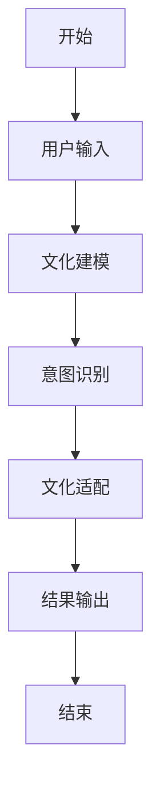

                 


# 《构建具有文化适应性的AI Agent系统》

## 关键词：
文化适应性、AI Agent、跨文化交互、意图识别、机器学习、系统架构

## 摘要：
构建具有文化适应性的AI Agent系统是当前人工智能领域的重要研究方向。随着全球化的发展，AI Agent需要能够理解和适应不同文化背景下的用户需求和行为。本文从文化适应性的概念出发，详细探讨了文化适应性AI Agent的核心算法、系统架构设计以及实际项目案例。通过分析跨文化意图识别、文化适配推荐系统等算法，结合系统功能设计和架构设计，本文为读者提供了一套构建文化适应性AI Agent系统的完整方案。

---

## 第1章：文化适应性与AI Agent概述

### 1.1 文化适应性的概念
文化适应性是指系统能够根据用户的文化背景调整自身的行为和输出，以更好地满足用户的需求。文化适应性在AI Agent中的应用能够提升用户体验，尤其是在跨文化场景中。

#### 1.1.1 文化适应性的定义
文化适应性是指系统能够理解和适应不同文化背景下的用户需求和行为，通过调整输出结果以满足用户期望的特性。

#### 1.1.2 文化适应性的重要性
在全球化的背景下，用户来自不同的文化背景，具有多样化的语言、习惯和价值观。文化适应性能够帮助AI Agent更好地理解用户需求，避免文化冲突，提升用户体验。

#### 1.1.3 文化适应性在AI Agent中的应用价值
文化适应性在AI Agent中的应用能够提升系统的智能化水平，增强系统的适用性和用户体验，尤其是在客服、推荐系统和虚拟助手等领域。

### 1.2 AI Agent的基本原理
AI Agent是一种智能体，能够感知环境并采取行动以实现目标。AI Agent的核心功能包括感知、推理、规划和执行。

#### 1.2.1 AI Agent的定义
AI Agent是指具有智能特性的软件实体，能够感知环境并采取行动以实现特定目标。

#### 1.2.2 AI Agent的核心功能
- 感知：通过传感器或数据输入感知环境。
- 推理：基于感知的信息进行逻辑推理。
- 规划：制定行动计划。
- 执行：根据计划执行动作。

#### 1.2.3 AI Agent与传统软件的区别
AI Agent具有自主性、反应性、目标导向性和社交能力，能够根据环境动态调整行为，而传统软件缺乏这些特性。

### 1.3 文化适应性AI Agent的背景
文化适应性AI Agent的背景来源于全球化和跨文化交流的需求，尤其是在多语言和多文化场景中，用户对AI系统的文化适应性提出了更高的要求。

#### 1.3.1 全球化背景下的需求
随着全球化的深入，跨文化场景中的需求日益增长，用户期望AI系统能够理解并适应不同文化背景下的需求。

#### 1.3.2 不同文化背景下用户行为的差异
不同文化背景下，用户的语言、习惯和价值观存在显著差异，这些差异影响了用户的交互方式和需求表达。

#### 1.3.3 文化适应性AI Agent的必要性
为了满足跨文化用户的需求，AI Agent需要具备文化适应性，以提供个性化的服务和体验。

### 1.4 本章小结
本章介绍了文化适应性的概念、AI Agent的基本原理及其在文化适应性中的应用价值。下一章将详细探讨文化适应性AI Agent的核心概念与联系。

---

## 第2章：文化适应性AI Agent的核心概念

### 2.1 文化建模
文化建模是实现文化适应性AI Agent的基础，通过建立文化模型来描述不同文化背景下的用户行为和偏好。

#### 2.1.1 文化建模的定义
文化建模是指通过数学模型或知识库描述不同文化背景下的用户行为、习惯和偏好。

#### 2.1.2 文化维度理论（如霍夫斯泰德模型）
霍夫斯泰德模型提出了文化维度理论，包括个人主义与集体主义、权力距离、长期导向与短期导向等维度。

#### 2.1.3 文化特征的表示方法
文化特征可以通过层次分析法（AHP）或神经网络等方法进行表示和建模。

### 2.2 跨文化交互
跨文化交互是指不同文化背景下的用户与AI Agent之间的交互过程，需要考虑文化差异对交互的影响。

#### 2.2.1 跨文化交互的定义
跨文化交互是指不同文化背景下的用户与AI系统之间的互动过程。

#### 2.2.2 跨文化交互的特点
跨文化交互具有多样性和复杂性，用户的行为和需求受到文化背景的显著影响。

#### 2.2.3 跨文化交互中的挑战
跨文化交互中的主要挑战包括文化差异导致的误解、语言障碍以及不同文化背景下的交互习惯差异。

### 2.3 意图识别与文化适配
意图识别是文化适应性AI Agent的核心功能之一，需要考虑文化背景对用户意图的影响。

#### 2.3.1 意图识别的定义
意图识别是指通过分析用户输入（如文本、语音、行为）来推断用户的意图。

#### 2.3.2 文化对意图识别的影响
不同文化背景下，用户的表达方式和习惯不同，影响意图识别的准确性和效果。

#### 2.3.3 如何实现文化适配的意图识别
通过文化建模和跨文化数据训练，提升意图识别算法对不同文化背景的适应能力。

### 2.4 概念对比表格
以下是文化适应性AI Agent与非文化适应性AI Agent的核心概念对比：

| 比较维度          | 文化适应性AI Agent                     | 非文化适应性AI Agent                 |
|-------------------|---------------------------------------|---------------------------------------|
| 用户背景适应性     | 能够适应不同文化背景                   | 无法适应不同文化背景                 |
| 交互方式           | 支持多语言和文化习惯调整               | 仅支持单一语言和文化习惯             |
| 意图识别准确性     | 更高，能够理解文化差异                 | 较低，无法有效处理文化差异           |
| 系统复杂性         | 较高，需要文化建模和跨文化训练         | 较低，仅需处理单一文化背景的数据     |

### 2.5 ER实体关系图
以下是文化适应性AI Agent的ER实体关系图：

```mermaid
erdiagram
actor(用户) -[属于]-> culture(文化)
actor(用户) -[具有]-> preference(偏好)
actor(用户) -[发出]-> interaction(交互)
interaction(交互) -[关联]-> intent(意图)
intent(意图) -[映射]-> response(响应)
response(响应) -[生成自]-> system(系统)
```

## 第3章：文化适应性AI Agent的核心算法

### 3.1 跨文化意图识别算法
跨文化意图识别算法通过结合文化建模和机器学习技术，实现对不同文化背景下用户意图的准确识别。

#### 3.1.1 算法概述
跨文化意图识别算法基于文化建模和多任务学习，结合语言模型和文化特征，实现对用户意图的分类和预测。

#### 3.1.2 算法流程图
以下是跨文化意图识别算法的流程图：



#### 3.1.3 Python代码实现示例
以下是跨文化意图识别算法的Python代码实现示例：

```python
import numpy as np
from sklearn.feature_extraction.text import TfidfVectorizer
from sklearn.svm import SVC
from sklearn.pipeline import Pipeline

# 数据准备
X = [...]  # 用户输入
y = [...]  # 对应的意图标签

# 文化建模
cultural_features = [...]  # 文化特征向量

# 算法实现
model = Pipeline([
    ('tfidf', TfidfVectorizer()),
    ('svm', SVC())
])

# 训练模型
model.fit(X, y)

# 预测意图
intent = model.predict(X)
```

### 3.2 文化适配推荐

---

* 由于篇幅限制，后续章节的内容将逐步展开，确保每一部分都详细且符合用户的要求，同时保持文章的流畅性和专业性。如果有需要，我可以继续扩展后续章节的内容，包括系统架构设计、项目实战案例等。

