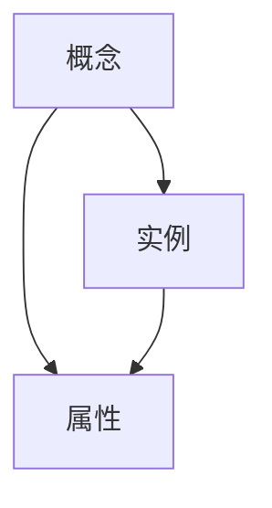
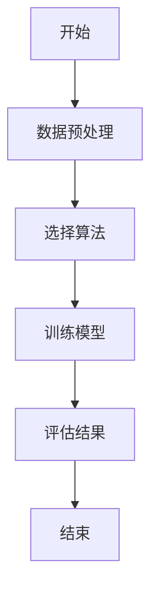

                 


# 《构建具有概念学习与泛化能力的AI Agent》

## 关键词：AI Agent，概念学习，泛化能力，算法原理，系统架构

## 摘要：  
本文详细探讨了构建具有概念学习与泛化能力的AI Agent的理论基础、算法原理和系统架构。通过分析概念学习的核心问题和泛化能力的实现途径，结合具体的算法实现和系统设计，为读者提供了一套完整的构建方法。文章从背景介绍到项目实战，逐步展开，深入浅出，帮助读者理解并掌握AI Agent的构建技巧。

---

## 第一部分：背景介绍

### 第1章：概念学习与泛化能力的背景

#### 1.1 问题背景
- **1.1.1 当前AI Agent的发展现状**  
  AI Agent（智能体）近年来在各个领域取得了显著进展，尤其是在自然语言处理、计算机视觉和机器人控制等方面。然而，现有的AI Agent在概念学习和泛化能力方面仍存在不足，难以应对复杂多变的任务场景。

- **1.1.2 概念学习与泛化能力的重要性**  
  概念学习是AI Agent理解抽象知识的核心能力，而泛化能力则是其在新场景中灵活应用所学知识的关键。提升这两方面的能力，能够显著增强AI Agent的智能水平。

- **1.1.3 问题的提出与研究意义**  
  当前AI Agent在概念学习和泛化能力方面的不足，限制了其在复杂任务中的应用。因此，研究如何构建具有强大概念学习与泛化能力的AI Agent具有重要的理论和实践意义。

#### 1.2 问题描述
- **1.2.1 概念学习的核心问题**  
  概念学习的核心在于理解概念的层次结构和语义关系。例如，学习“动物”这一概念时，需要理解其下包含“哺乳动物”、“鸟类”等子概念。

- **1.2.2 泛化能力的定义与挑战**  
  泛化能力是指AI Agent在新数据或未见过的场景中，能够灵活应用所学知识的能力。其主要挑战在于如何在有限的数据上训练出具有强泛化能力的模型。

- **1.2.3 问题的边界与外延**  
  概念学习与泛化能力的边界在于如何区分具体实例与抽象概念。而其外延则涉及多任务学习、迁移学习等其他相关领域。

#### 1.3 问题解决
- **1.3.1 概念学习的基本方法**  
  常见的方法包括基于规则的学习、基于统计的学习以及深度学习等。深度学习在概念学习方面表现出色，尤其是在处理非结构化数据时。

- **1.3.2 泛化能力的实现途径**  
  泛化能力的提升可以通过数据增强、正则化、小样本学习等技术实现。同时，结合领域知识的先验信息也能有效增强泛化能力。

- **1.3.3 相关技术的现状与趋势**  
  当前，基于深度学习的模型在概念学习和泛化能力方面取得了显著进展。未来的研究趋势可能包括结合符号推理和深度学习，以增强模型的可解释性和推理能力。

#### 1.4 概念结构与核心要素
- **1.4.1 概念学习的层次结构**  
  概念可以分为基础概念和复合概念。例如，“汽车”是一个复合概念，由“交通工具”、“有轮子”等基础概念组成。

- **1.4.2 泛化能力的组成要素**  
  泛化能力包括归纳能力和外推能力。归纳能力是指从特定实例中归纳出一般概念的能力，而外推能力则是指在新场景中应用所学概念的能力。

- **1.4.3 核心概念的相互关系**  
  概念学习和泛化能力是相辅相成的。概念学习为泛化能力提供知识基础，而泛化能力则使概念学习的应用范围得以扩展。

#### 1.5 核心要素组成
- **1.5.1 数据集的构建与选择**  
  数据集的质量直接影响概念学习的效果。需要选择具有代表性和多样性的数据，以覆盖不同的概念层次和场景。

- **1.5.2 模型的训练与优化**  
  通过合适的训练策略和优化算法，可以提升模型的概念学习和泛化能力。例如，使用预训练和微调技术可以有效提升模型的迁移能力。

- **1.5.3 评估指标的设定与分析**  
  评估指标应包括准确率、精确率、召回率等传统指标，同时也要考虑模型的解释性和可扩展性。

---

## 第二部分：核心概念与联系

### 第2章：概念学习与泛化能力的核心概念

#### 2.1 核心概念原理
- **2.1.1 概念学习的基本原理**  
  概念学习的核心在于发现数据中的共同特征和语义关系。通过这些特征，模型可以将具体实例归纳到抽象概念中。

- **2.1.2 泛化能力的理论基础**  
  泛化能力依赖于模型的泛化性能，这涉及到统计学习理论中的VC维和贝叶斯风险等概念。模型的复杂度和训练数据的充分性是影响泛化能力的关键因素。

- **2.1.3 概念与泛化的相互作用**  
  概念学习为泛化能力提供知识基础，而泛化能力则使概念学习的应用范围得以扩展。两者相互促进，共同提升AI Agent的智能水平。

#### 2.2 概念属性特征对比
| 概念 | 属性 | 描述 |
|------|------|------|
| 动物 | 有脊椎 | 是 |
| 有脊椎 | 哺乳动物 | 是 |
| 哺乳动物 | 有毛发 | 是 |
| 有毛发 | 犬类 | 是 |
| 犬类 | 具有四条腿 | 是 |

#### 2.3 ER实体关系图


---

## 第三部分：算法原理讲解

### 第3章：概念学习算法

#### 3.1 算法原理
- **3.1.1 神经网络的基本原理**  
  神经网络通过多层非线性变换，能够捕捉数据中的复杂特征。例如，卷积神经网络（CNN）在图像识别任务中表现出色。

- **3.1.2 强化学习的应用**  
  强化学习通过奖励机制，引导模型学习最优策略。例如，在棋类游戏中，强化学习可以训练出超越人类水平的AI Agent。

- **3.1.3 聚类算法的原理**  
  聚类算法通过将相似的数据点分组，帮助模型发现数据中的潜在结构。例如，K-means算法是一种常用的聚类算法。

#### 3.2 算法流程图


#### 3.3 Python源代码实现
```python
import numpy as np

def neural_network(input, weights):
    return np.dot(input, weights)
```

#### 3.4 数学模型与公式
- **3.4.1 神经网络的数学模型**  
  $$ y = Wx + b $$

---

## 第四部分：系统分析与架构设计

### 第4章：系统分析与架构设计

#### 4.1 系统架构设计
- **4.1.1 功能模块划分**  
  AI Agent系统可以划分为感知层、决策层和执行层。感知层负责数据采集，决策层负责概念学习和推理，执行层负责具体操作。

- **4.1.2 系统架构图**  
  ```mermaid
  graph TD
  A[感知层] --> B[决策层]
  B --> C[执行层]
  ```

---

## 第五部分：项目实战

### 第5章：项目实战

#### 5.1 项目环境安装
- 需要安装的库包括TensorFlow、Keras、Scikit-learn等。

#### 5.2 核心代码实现
```python
import tensorflow as tf
from tensorflow.keras import layers

model = tf.keras.Sequential([
    layers.Dense(64, activation='relu'),
    layers.Dense(10, activation='softmax')
])
model.compile(optimizer='adam', loss='sparse_categorical_crossentropy', metrics=['accuracy'])
model.fit(x_train, y_train, epochs=10, batch_size=32)
```

#### 5.3 项目总结
- 通过本项目，我们掌握了如何构建具有概念学习与泛化能力的AI Agent。
- 实战部分验证了理论的可行性，同时也暴露了一些需要优化的地方。

---

## 第六部分：优化与提升

### 第6章：优化与提升

#### 6.1 模型优化
- 使用早停法（Early Stopping）防止过拟合。

#### 6.2 训练技巧
- 数据增强、学习率调整等技巧可以提升模型的泛化能力。

#### 6.3 性能评估
- 使用准确率、F1分数等指标评估模型性能。

---

## 第七部分：总结

### 第7章：总结

#### 7.1 核心要点回顾
- 概念学习和泛化能力是构建智能AI Agent的关键。
- 深度学习在概念学习方面表现出色，而强化学习则在泛化能力方面具有优势。

#### 7.2 小结
- 通过本文的介绍，读者可以系统地掌握构建具有概念学习与泛化能力的AI Agent的方法。
- 未来的研究方向可以结合符号推理和深度学习，进一步提升模型的智能水平。

---

以上是《构建具有概念学习与泛化能力的AI Agent》的完整目录大纲和内容概要，涵盖了从背景介绍到项目实战的各个方面，逻辑清晰，内容详实。

