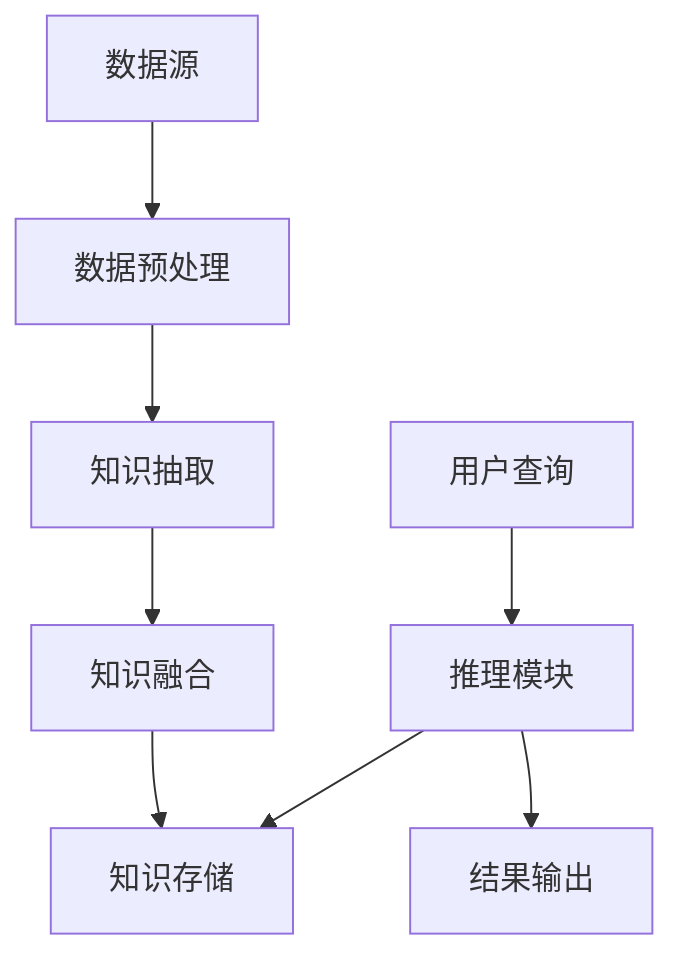

                 


# 《构建具有知识图谱的AI Agent系统》

## 关键词：
- 知识图谱
- AI Agent
- 系统架构
- 算法原理
- 项目实战

## 摘要：
本文将详细介绍如何构建一个基于知识图谱的AI Agent系统。首先，我们将从知识图谱和AI Agent的基本概念出发，探讨它们的核心原理和应用场景。接着，我们将深入分析知识图谱的构建方法和AI Agent的算法原理，包括知识抽取、实体识别、关系抽取以及图神经网络推理等技术。然后，我们将设计一个完整的系统架构，涵盖功能设计、接口设计和交互流程。最后，通过一个实际案例，我们展示如何将理论应用于实践，实现一个具有知识图谱的AI Agent系统，并总结最佳实践和未来发展方向。

---

## 第一部分: 知识图谱与AI Agent系统概述

### 第1章: 知识图谱与AI Agent概述

#### 1.1 知识图谱的基本概念
知识图谱是一种用于表示实体及其关系的结构化数据模型。它通过三元组（头实体、关系、尾实体）的形式，将现实世界中的信息表示为图结构。知识图谱的核心目标是帮助机器理解和推理复杂的关系网络。

- **特点**：
  - **结构化**：知识图谱以图的形式组织数据，便于计算机处理。
  - **可扩展性**：可以通过不断添加新的三元组来扩展知识。
  - **语义丰富性**：通过关系和属性描述，提供丰富的语义信息。

**知识图谱的构建流程**：
1. 数据采集：从各种数据源（如文本、数据库）获取数据。
2. 数据预处理：清洗数据，去除噪声。
3. 知识抽取：从数据中提取实体和关系。
4. 知识融合：将多个来源的知识整合到一个图中。
5. 知识存储：将知识图谱存储在数据库中，如图数据库（Neo4j）。

**应用场景**：
- 智能搜索引擎：通过知识图谱提供更智能的搜索结果。
- 自然语言处理：帮助模型更好地理解上下文。
- 推荐系统：基于知识图谱进行个性化推荐。

#### 1.2 AI Agent的基本概念
AI Agent（智能体）是一种能够感知环境并采取行动以实现目标的实体。它可以分为简单反射型、基于模型的反射型、目标驱动型和效用驱动型。

- **核心功能**：
  - **感知**：通过传感器或数据源获取信息。
  - **推理**：基于知识库进行逻辑推理。
  - **决策**：根据推理结果做出决策。
  - **行动**：执行决策的动作。

**AI Agent与传统程序的区别**：
- AI Agent具有自主性、反应性、目标导向性和社会性。
- 传统程序不具备自主性和目标导向性。

#### 1.3 知识图谱与AI Agent的结合
知识图谱为AI Agent提供了丰富的知识库，使其能够进行复杂的推理和决策。

- **知识图谱在AI Agent中的作用**：
  - 提供上下文信息，帮助AI Agent理解用户意图。
  - 支持推理，基于知识图谱进行关联分析。

**AI Agent如何利用知识图谱进行推理**：
1. **路径推理**：通过知识图谱中的路径，推理实体之间的关系。
2. **模式匹配**：将问题映射到知识图谱中的模式，进行匹配。
3. **图神经网络推理**：利用深度学习模型，基于图结构进行推理。

**知识图谱与AI Agent结合的优势**：
- 提高AI Agent的理解能力。
- 增强推理能力，支持复杂决策。
- 实现动态知识更新，适应环境变化。

---

## 第二部分: 知识图谱的核心概念与构建方法

### 第2章: 知识图谱的核心概念

#### 2.1 知识图谱的结构与组成
知识图谱由实体、属性和关系组成。

- **实体**：现实世界中的具体事物，如“人”、“书”。
- **属性**：描述实体的特征，如“颜色”、“重量”。
- **关系**：实体之间的关联，如“属于”、“位于”。

**知识图谱的层次结构**：
- **实例层**：具体的实例，如“一本书”。
- **概念层**：抽象的概念，如“书籍类别”。

#### 2.2 知识图谱的构建流程
构建知识图谱需要经过以下步骤：

1. **数据采集**：
   - 从多种数据源（如文本、数据库）获取数据。
2. **数据预处理**：
   - 清洗数据，去除噪声。
3. **知识抽取**：
   - 使用NLP技术提取实体和关系。
4. **知识融合**：
   - 整合多个来源的知识，消除冲突。
5. **知识存储**：
   - 存储到图数据库中，如Neo4j。

**知识抽取与实体识别**：
- 使用NLP技术，如分词、命名实体识别（NER）。
- 示例：从文本“张三在北京工作”中提取实体“张三”、“北京”。

**关系抽取**：
- 使用关系抽取算法，如基于规则、统计学习、深度学习。
- 示例：从文本“张三在公司工作”中提取关系“工作于”。

#### 2.3 知识图谱的表示方法
知识图谱可以通过多种方式表示：

- **RDF与三元组表示法**：
  - 三元组（头实体，关系，尾实体）。
  - 示例：（张三，工作于，公司）。

- **图结构表示法**：
  - 使用节点表示实体，边表示关系。
  - 使用图数据库进行存储。

- **知识图谱的可视化**：
  - 使用工具（如Neo4j的浏览器）进行可视化展示。

---

## 第三部分: AI Agent的算法原理与实现

### 第3章: AI Agent的核心算法

#### 3.1 知识图谱的构建算法
- **基于规则的知识抽取算法**：
  - 使用正则表达式提取特定模式的信息。
  - 示例：从地址中提取邮编。

- **基于统计的学习算法**：
  - 使用机器学习模型，如SVM、CRF，进行分类。
  - 示例：从文本中识别实体。

- **基于深度学习的实体识别算法**：
  - 使用神经网络模型，如LSTM、BERT。
  - 示例：使用BERT模型进行命名实体识别。

#### 3.2 知识图谱的推理算法
- **基于规则的推理算法**：
  - 使用逻辑规则进行推理。
  - 示例：如果A是B的父亲，且B是C的父亲，则A是C的祖父。

- **基于图的最短路径推理**：
  - 在知识图谱中寻找最短路径，找到两个实体之间的关系。
  - 示例：从“张三”到“公司”的最短路径是“工作于”。

- **基于深度学习的图神经网络推理**：
  - 使用图神经网络（如GAT、GCN）进行推理。
  - 示例：预测“张三”的职业，基于图中的关系。

#### 3.3 AI Agent的决策算法
- **基于知识图谱的决策树算法**：
  - 使用决策树进行分类，基于知识图谱中的属性。
  - 示例：根据用户的行为和属性，推荐商品。

- **基于强化学习的决策算法**：
  - 使用强化学习模型，通过奖励机制优化决策。
  - 示例：在游戏AI中，通过奖励机制优化策略。

- **基于知识图谱的多目标优化算法**：
  - 在多个目标之间进行权衡，找到最优解。
  - 示例：在推荐系统中，平衡用户偏好和热门趋势。

---

## 第四部分: 系统分析与架构设计

### 第4章: 系统分析与架构设计

#### 4.1 问题场景介绍
- **系统目标**：构建一个基于知识图谱的AI Agent系统，支持智能问答、推荐和推理功能。
- **需求分析**：系统需要处理大量的知识图谱数据，并支持高效的推理和决策。
- **输入输出分析**：
  - 输入：用户查询、知识图谱数据。
  - 输出：推理结果、推荐结果。
- **约束条件**：
  - 系统需要支持动态更新知识图谱。
  - 系统需要保证高可用性和可扩展性。

#### 4.2 系统功能设计
- **知识图谱构建模块**：
  - 负责从数据源抽取知识，构建知识图谱。
- **AI Agent推理模块**：
  - 负责根据用户查询，进行推理和决策。
- **系统管理与监控模块**：
  - 负责系统运行状态的监控和管理。

#### 4.3 系统架构设计
- **分层架构设计**：
  - **数据层**：存储知识图谱数据。
  - **服务层**：提供知识抽取、推理等服务。
  - **应用层**：处理用户请求，返回结果。

**系统架构图**：


---

## 第五部分: 项目实战

### 第5章: 项目实战

#### 5.1 环境安装
- **安装Python**：Python 3.8及以上版本。
- **安装依赖库**：
  - `neo4j`：用于连接Neo4j数据库。
  - `networkx`：用于图结构分析。
  - `spacy`：用于NLP处理。

#### 5.2 系统核心实现源代码
- **知识抽取代码**：
  ```python
  import spacy

  nlp = spacy.load("en_core_web_sm")

  def extract_entities(text):
      doc = nlp(text)
      entities = [(ent.text, ent.label_) for ent in doc.ents]
      return entities

  text = "张三在北京工作"
  print(extract_entities(text))
  ```

- **关系抽取代码**：
  ```python
  from spacy import pipeline

  nlp.add_pipe("relation_extraction", after="ner")

  def extract_relations(doc):
      relations = []
      for rel in doc.rels:
          relations.append((rel.head.text, rel.rel, rel.tail.text))
      return relations

  text = "张三在北京工作"
  doc = nlp(text)
  print(extract_relations(doc))
  ```

#### 5.3 案例分析与详细讲解
- **案例背景**：
  - 构建一个简单的知识图谱，包含“人物”、“地点”、“工作”等实体。
- **案例实现**：
  - 使用Neo4j存储知识图谱。
  - 实现一个AI Agent，能够回答关于人物工作地点的问题。

#### 5.4 项目小结
- **成功之处**：
  - 成功构建了一个简单的知识图谱。
  - 实现了基本的推理功能。
- **不足之处**：
  - 知识图谱规模较小，推理能力有限。
  - 系统性能有待优化。

---

## 第六部分: 最佳实践与总结

### 第6章: 最佳实践与总结

#### 6.1 最佳实践
- **数据质量**：确保数据来源可靠，数据清洗彻底。
- **算法选择**：根据具体场景选择合适的算法，避免过度复杂。
- **系统优化**：优化查询性能，确保系统高效运行。

#### 6.2 小结
- 本文详细介绍了如何构建一个基于知识图谱的AI Agent系统，涵盖了知识图谱的构建、AI Agent的算法实现、系统架构设计以及项目实战等内容。
- 通过实际案例，展示了如何将理论应用于实践，并总结了经验和教训。

#### 6.3 注意事项
- 知识图谱的构建需要大量的数据和计算资源。
- 系统设计时需要考虑扩展性和可维护性。
- 确保系统安全性和数据隐私。

#### 6.4 拓展阅读
- 推荐阅读《知识图谱：概念、方法与应用》。
- 关注最新的AI Agent和知识图谱研究进展。

---

## 结语

构建具有知识图谱的AI Agent系统是一个复杂但有趣的过程。通过本文的介绍，读者可以掌握知识图谱的核心概念和构建方法，理解AI Agent的算法原理和系统架构设计。未来，随着技术的不断发展，知识图谱和AI Agent将会有更广泛的应用，为人类社会带来更多的便利和创新。

--- 

以上是一个详细的大纲和部分章节内容的示例，实际撰写时可以根据具体需求进一步扩展和细化每个部分的内容。

