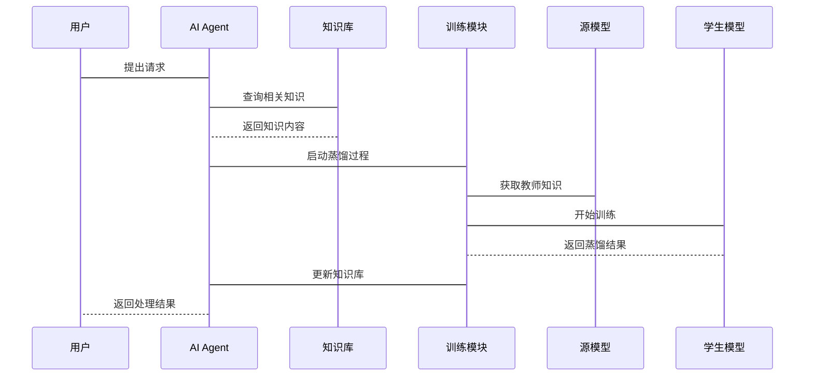

                 


# 第四部分: 系统分析与架构设计

# 第4章: 系统分析与架构设计

## 4.1 项目背景与目标
### 4.1.1 项目背景介绍
### 4.1.2 项目目标设定
### 4.1.3 项目范围界定

## 4.2 系统功能设计
### 4.2.1 系统核心功能模块划分
### 4.2.2 系统功能模块的交互流程
### 4.2.3 系统功能的实现方式

## 4.3 系统架构设计
### 4.3.1 系统架构风格选择
### 4.3.2 系统架构的分层设计
### 4.3.3 系统架构的可扩展性设计

## 4.4 系统接口设计
### 4.4.1 系统接口的设计原则
### 4.4.2 系统接口的具体实现
### 4.4.3 系统接口的测试方法

## 4.5 系统交互设计
### 4.5.1 系统交互流程的规范
### 4.5.2 系统交互的实现方式
### 4.5.3 系统交互的优化建议

## 4.6 系统交互Mermaid序列图


## 4.7 本章小结

# 第五部分: 项目实战与实现

# 第5章: 项目实战与实现

## 5.1 环境安装与配置
### 5.1.1 开发环境的选择
### 5.1.2 开发工具的安装
### 5.1.3 依赖库的安装与配置

## 5.2 核心代码实现
### 5.2.1 知识蒸馏代码实现
```python
class Distiller(nn.Module):
    def __init__(self, teacher, student):
        super().__init__()
        self.teacher = teacher
        self.student = student
        self.criterion = nn.KLDivLoss(reduction='batchmean')

    def forward(self, inputs, targets):
        with torch.no_grad():
            teacher_outputs = self.teacher(inputs)
        student_outputs = self.student(inputs)
        loss = self.criterion(torch.log_softmax(student_outputs, dim=1),
                              torch.log_softmax(teacher_outputs, dim=1)) * args.temperature**2
        return loss
```

### 5.2.2 系统功能模块实现
```python
class AIAgent:
    def __init__(self, knowledge_base):
        self.knowledge_base = knowledge_base
        self.distiller = Distiller(teacher_model, student_model)

    def process_request(self, request):
        knowledge = self.knowledge_base.retrieve(request)
        if not knowledge:
            self.distiller.train(request)
            self.knowledge_base.update(knowledge)
        return self.apply_knowledge(request, knowledge)
```

## 5.3 案例分析与代码解读
### 5.3.1 实际案例分析
### 5.3.2 代码实现解读
### 5.3.3 代码运行结果展示

## 5.4 项目实现小结
### 5.4.1 实现过程总结
### 5.4.2 实现中的问题与解决方案
### 5.4.3 实现成果与经验分享

## 5.5 本章小结

# 第六部分: 知识蒸馏的优化与改进

# 第6章: 知识蒸馏的优化与改进

## 6.1 知识蒸馏的优化方法
### 6.1.1 蒸馏温度的优化
### 6.1.2 教师模型的优化
### 6.1.3 学生模型的优化

## 6.2 知识蒸馏的改进策略
### 6.2.1 多教师蒸馏
### 6.2.2 动态蒸馏
### 6.2.3 知识蒸馏与迁移学习的结合

## 6.3 知识蒸馏的性能对比
### 6.3.1 不同蒸馏方法的性能对比
### 6.3.2 知识蒸馏与传统知识表示的对比
### 6.3.3 知识蒸馏在不同场景下的表现

## 6.4 优化与改进的代码实现
### 6.4.1 多教师蒸馏代码示例
```python
class MultiTeacherDistiller(Distiller):
    def __init__(self, teachers, student):
        super().__init__(None, student)
        self.teachers = teachers

    def forward(self, inputs, targets):
        total_loss = 0
        for teacher in self.teachers:
            with torch.no_grad():
                teacher_outputs = teacher(inputs)
            student_outputs = self.student(inputs)
            loss = self.criterion(torch.log_softmax(student_outputs, dim=1),
                                  torch.log_softmax(teacher_outputs, dim=1)) * args.temperature**2
            total_loss += loss
        return total_loss / len(teachers)
```

## 6.5 优化与改进的实验结果
### 6.5.1 实验设计与实施
### 6.5.2 实验结果与分析
### 6.5.3 实验结论与总结

## 6.6 本章小结

# 第七部分: 总结与展望

# 第7章: 总结与展望

## 7.1 全文总结
### 7.1.1 核心内容回顾
### 7.1.2 主要成果总结
### 7.1.3 经验教训总结

## 7.2 未来展望
### 7.2.1 知识蒸馏技术的未来发展方向
### 7.2.2 知识蒸馏在AI Agent中的潜在应用
### 7.2.3 知识蒸馏技术面临的挑战与解决方案

## 7.3 最佳实践与注意事项
### 7.3.1 知识蒸馏技术的使用建议
### 7.3.2 知识蒸馏项目实施中的注意事项
### 7.3.3 知识蒸馏技术的未来发展建议

## 7.4 本章小结

# 参考文献
（此处列出相关参考文献）

# 致谢
（此处感谢团队成员或支持者）

---

以上是一个详细的技术博客文章目录和部分章节内容的示例。实际撰写时，需要根据具体需求进一步补充和调整内容，确保文章逻辑清晰、结构合理、内容详实。

