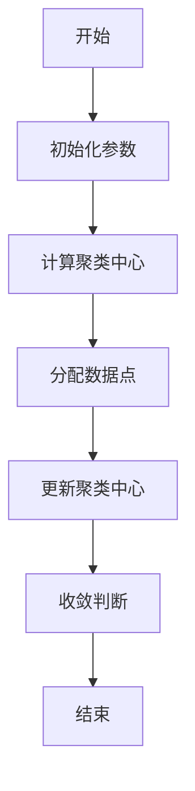
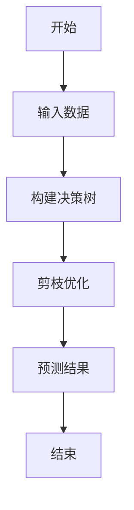
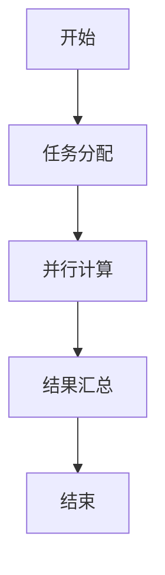
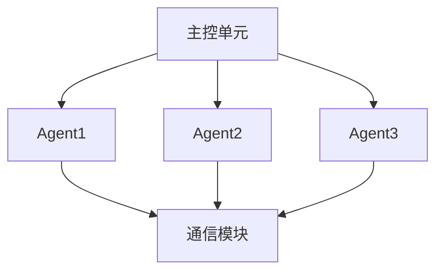
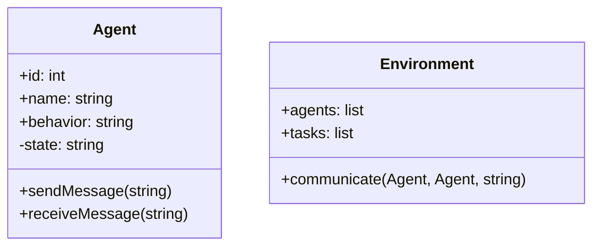
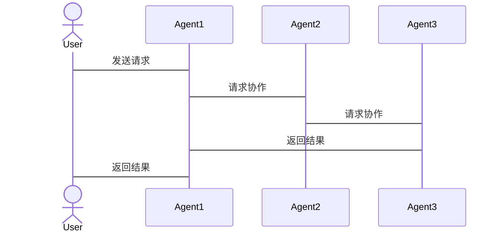

                 

# 构建具有群体智能决策能力的多Agent系统

> 关键词：多Agent系统、群体智能、分布式计算、决策算法、系统架构、通信机制

> 摘要：本文详细探讨了构建具有群体智能决策能力的多Agent系统的各个方面。从基本概念到核心算法，从系统架构到项目实战，全面解析了如何设计和实现这样一个复杂的系统。文章首先介绍了多Agent系统的基本概念和群体智能的核心原理，然后详细讲解了多Agent系统的通信与协作机制，接着深入探讨了群体智能决策算法及其数学模型，最后通过一个具体的项目案例展示了系统的实现过程，并总结了最佳实践和未来发展方向。

---

## 第一部分：多Agent系统基础

### 第1章：多Agent系统概述

#### 1.1 多Agent系统的基本概念

##### 1.1.1 什么是Agent
Agent（智能体）是指能够感知环境并采取行动以实现目标的实体。Agent可以是软件程序、机器人或其他智能设备。Agent的核心特征包括自主性、反应性、主动性、社会性和智能性。

##### 1.1.2 多Agent系统的定义与特点
多Agent系统（Multi-Agent System, MAS）是由多个相互作用的Agent组成的系统，这些Agent通过协作完成复杂的任务。其特点包括分布性、协作性、智能性和适应性。

##### 1.1.3 多Agent系统与单Agent系统的区别
单Agent系统依赖单一智能体完成任务，而多Agent系统通过多个智能体的协作来实现目标。多Agent系统具有更强的鲁棒性和灵活性，但设计和实现更为复杂。

#### 1.2 多Agent系统的分类
多Agent系统可以根据任务类型、结构或智能水平进行分类。任务型多Agent系统专注于完成特定任务，结构型多Agent系统注重系统内部的组织结构，而智能水平型多Agent系统则关注Agent的智能程度。

#### 1.3 多Agent系统的核心要素
多Agent系统的核心要素包括Agent的智能性、自主性和协作性。智能性决定了Agent解决问题的能力，自主性使其能够在没有外部干预的情况下运行，协作性则确保多个Agent能够共同完成任务。

---

### 第2章：群体智能与多Agent系统

#### 2.1 群体智能的基本概念
群体智能是指通过多个简单个体的协作，实现复杂任务的智能行为。群体智能的关键在于个体之间的局部交互和整体行为的涌现性。

#### 2.2 群体智能的核心算法
群体智能的核心算法包括聚群算法、分层决策算法和分布式计算算法。这些算法通过模拟生物群体的行为，实现复杂任务的分解与协作。

#### 2.3 群体智能与多Agent系统的联系
群体智能为多Agent系统的决策和协作提供了理论基础，而多Agent系统则是群体智能实现的重要载体。两者结合能够实现更高效的群体决策和任务分配。

---

## 第二部分：多Agent系统的通信与协作

### 第3章：多Agent系统的通信机制

#### 3.1 多Agent系统的通信协议
通信协议的选择直接影响多Agent系统的信息交换效率。常用的通信协议包括JADE、Jason和AgentSpeak，这些协议提供了标准化的通信接口和数据交换格式。

#### 3.2 多Agent系统的通信模型
通信模型的设计需要考虑Agent之间的信息传递方式和交互逻辑。常用的通信模型包括发布-订阅模型和请求-响应模型。

#### 3.3 通信中的数据交换格式
数据交换格式的选择直接影响通信的效率和可靠性。JSON和XML是常用的通信数据格式，而二进制协议则适用于对性能要求较高的场景。

---

### 第4章：多Agent系统的协作机制

#### 4.1 协作协议的选择
协作协议的选择需要考虑系统的任务需求和协作方式。P2P（点对点）协作协议适用于分布式系统，而集中式协作协议则适用于任务高度依赖中心控制的场景。

#### 4.2 协作任务的分配
任务分配是多Agent系统协作的核心问题。基于角色的分配、基于能力的分配和基于优先级的分配是常见的任务分配策略。

#### 4.3 协作中的冲突解决
冲突解决机制是确保多Agent系统协作顺畅的关键。基于规则的冲突解决、基于协商的冲突解决和基于仲裁的冲突解决是常用的策略。

---

## 第三部分：多Agent系统的决策机制

### 第5章：基于群体智能的决策模型

#### 5.1 分布式决策模型
分布式决策模型通过多个Agent的独立决策实现整体目标。每个Agent基于局部信息做出决策，通过通信机制将决策结果传递给其他Agent。

#### 5.2 集中式决策模型
集中式决策模型通过一个中心决策单元统一协调多个Agent的行动。这种模型适合任务高度依赖全局信息的场景。

#### 5.3 混合式决策模型
混合式决策模型结合了分布式和集中式决策模型的优点，通过局部决策和全局决策的结合实现高效的决策过程。

---

### 第6章：群体智能决策算法

#### 6.1 贝叶斯网络模型
贝叶斯网络模型是一种基于概率推理的决策模型。通过构建概率图模型，Agent可以基于不完整的信息做出最优决策。

#### 6.2 分层决策树算法
分层决策树算法通过构建决策树，将复杂的决策问题分解为多个简单的子问题，逐步缩小决策范围。

#### 6.3 遗传算法优化决策
遗传算法通过模拟自然选择和遗传变异的过程，优化决策过程中的参数和策略，实现更高效的决策。

---

## 第四部分：多Agent系统的实现与应用

### 第7章：多Agent系统的实现框架

#### 7.1 基于JADE的实现框架
JADE（Java Agent Development Environment）是一种常用的多Agent系统开发框架，提供了丰富的API和工具支持。

#### 7.2 基于Jason的实现框架
Jason是一种基于AgentSpeak语言的多Agent系统开发框架，支持复杂逻辑和动态协作。

#### 7.3 基于AgentSpeak的实现框架
AgentSpeak是一种基于逻辑的编程语言，适用于实现具有推理能力的Agent。

---

### 第8章：多Agent系统的实际应用案例

#### 8.1 智能交通系统
智能交通系统通过多Agent协作实现交通流量的优化和管理，提高了道路的利用率和交通效率。

#### 8.2 智能制造系统
智能制造系统通过多Agent协作实现生产过程的智能化和自动化，提高了生产效率和产品质量。

---

## 第五部分：系统分析与架构设计方案

### 第9章：问题场景介绍

#### 9.1 问题背景
在复杂的现实场景中，单个Agent难以完成复杂的任务，因此需要通过多Agent协作实现整体目标。

#### 9.2 项目介绍
本项目旨在构建一个具有群体智能决策能力的多Agent系统，用于解决实际问题。

---

### 第10章：系统功能设计

#### 10.1 领域模型设计
领域模型设计是系统功能设计的核心。通过构建领域模型，明确了系统的需求和功能模块。

#### 10.2 系统架构设计
系统架构设计是实现多Agent系统的关键。通过设计系统的架构，明确了各模块之间的关系和交互方式。

#### 10.3 系统接口设计
系统接口设计是实现多Agent系统的基础。通过设计系统的接口，确保各模块之间的高效协作。

---

### 第11章：系统架构设计

#### 11.1 系统架构图
系统架构图是系统架构设计的重要工具。通过绘制系统架构图，明确了系统的组成和各部分之间的关系。

#### 11.2 系统交互图
系统交互图是系统交互设计的重要工具。通过绘制系统交互图，明确了系统内部的交互流程和逻辑。

---

### 第12章：系统实现与测试

#### 12.1 环境安装
环境安装是系统实现的基础。通过安装必要的软件和工具，确保系统的顺利运行。

#### 12.2 系统核心实现
系统核心实现是系统开发的关键。通过编写核心代码，实现了系统的功能和逻辑。

#### 12.3 代码应用解读与分析
代码应用解读与分析是系统调试和优化的重要步骤。通过分析代码，发现和解决系统中的问题。

---

## 第六部分：项目实战

### 第13章：环境安装

#### 13.1 系统需求分析
系统需求分析是环境安装的前提。通过分析系统的硬件和软件需求，确保安装环境的兼容性和稳定性。

#### 13.2 系统安装步骤
系统安装步骤是环境安装的核心。通过按照步骤安装必要的软件和工具，确保系统的顺利运行。

---

### 第14章：系统核心实现

#### 14.1 代码实现
代码实现是系统开发的关键。通过编写核心代码，实现了系统的功能和逻辑。

#### 14.2 代码解读与分析
代码解读与分析是系统调试和优化的重要步骤。通过分析代码，发现和解决系统中的问题。

---

### 第15章：实际案例分析

#### 15.1 案例背景介绍
案例背景介绍是案例分析的前提。通过了解案例的背景，明确了案例的目标和需求。

#### 15.2 案例实现过程
案例实现过程是案例分析的核心。通过详细描述案例的实现过程，展示了系统的开发和部署。

#### 15.3 案例分析与总结
案例分析与总结是案例研究的重要步骤。通过分析案例的实现过程和结果，总结了系统的优缺点和改进建议。

---

## 第七部分：最佳实践、小结与展望

### 第16章：最佳实践

#### 16.1 系统设计中的注意事项
系统设计中的注意事项是系统开发的关键。通过总结系统设计中的注意事项，避免了系统开发中的常见问题。

#### 16.2 系统实现中的技巧
系统实现中的技巧是系统开发的重要内容。通过分享系统实现中的技巧，提高了系统的开发效率和质量。

#### 16.3 系统优化建议
系统优化建议是系统维护的重要内容。通过提出系统的优化建议，提升了系统的性能和稳定性。

---

### 第17章：小结与展望

#### 17.1 本文总结
本文总结了构建具有群体智能决策能力的多Agent系统的各个方面，从基本概念到实现和应用，全面解析了系统的开发和部署。

#### 17.2 未来展望
未来展望了多Agent系统的发展方向，指出了群体智能决策技术在人工智能和分布式系统中的广泛应用前景。

---

## 第八部分：数学公式与算法模型

### 第18章：数学公式

#### 18.1 贝叶斯网络模型
贝叶斯网络模型的数学公式如下：

$$ P(A|B) = \frac{P(B|A)P(A)}{P(B)} $$

#### 18.2 分层决策树算法
分层决策树算法的数学模型如下：

$$ \text{信息增益} = \text{熵} - \text{条件熵} $$

#### 18.3 遗传算法优化决策
遗传算法优化决策的数学模型如下：

$$ \text{适应度} = \sum_{i=1}^{n} f(x_i) $$

---

### 第19章：算法模型

#### 19.1 聚群算法
聚群算法的算法流程图如下：

#### 19.2 分层决策算法
分层决策算法的算法流程图如下：

#### 19.3 分布式计算算法
分布式计算算法的算法流程图如下：

---

## 第九部分：系统架构图与类图

### 第20章：系统架构图

系统架构图展示了系统的组成和各部分之间的关系：

### 第21章：类图

类图展示了系统的类及其之间的关系：

---

## 第十部分：系统交互图

### 第22章：系统交互图

系统交互图展示了系统的交互流程：

---

## 第十一部分：总结与注意事项

### 第23章：总结

通过本文的详细讲解，读者可以全面了解构建具有群体智能决策能力的多Agent系统的各个方面。从基本概念到实现和应用，本文为读者提供了丰富的知识和实践指导。

### 第24章：注意事项

在实际项目中，需要注意系统的可扩展性、可靠性和安全性。同时，要合理选择通信机制和协作机制，确保系统的高效运行和稳定维护。

---

## 第十二部分：拓展阅读

### 第25章：拓展阅读

读者可以通过以下资源进一步深入学习多Agent系统和群体智能的相关知识：

1. [书籍推荐](#)
2. [论文推荐](#)
3. [在线课程推荐](#)

---

通过本文的详细讲解和系统分析，读者可以全面掌握构建具有群体智能决策能力的多Agent系统的各个方面。从理论到实践，从基础到高级，本文为读者提供了丰富的知识和实践指导，帮助读者在实际项目中实现高效的多Agent系统。

