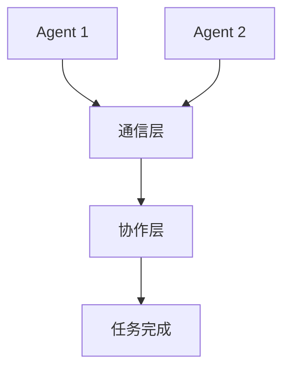
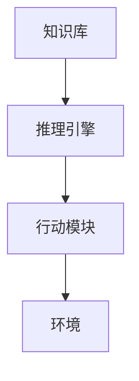
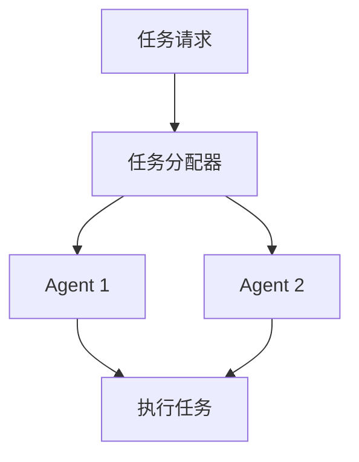
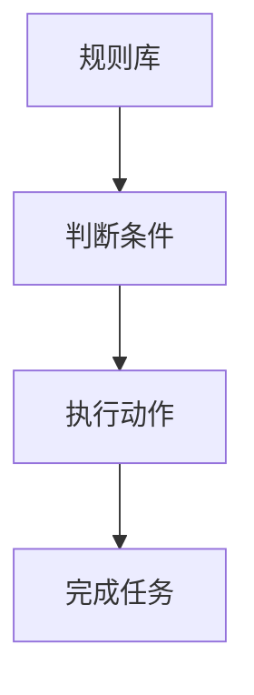
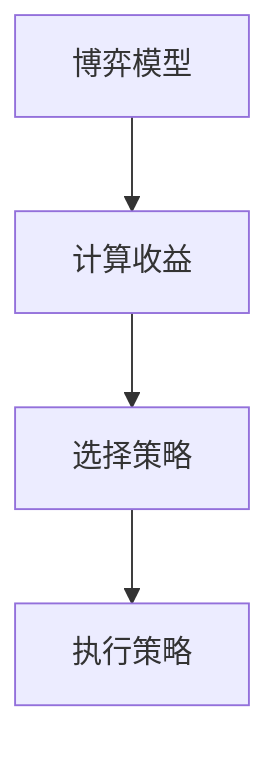
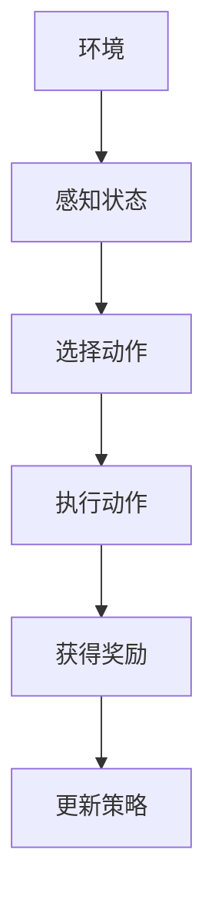
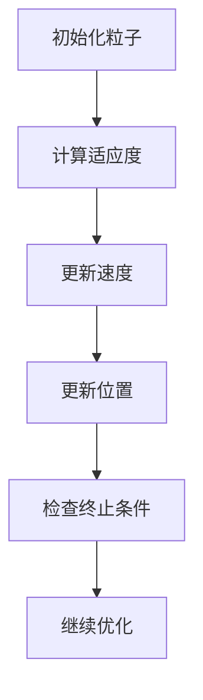
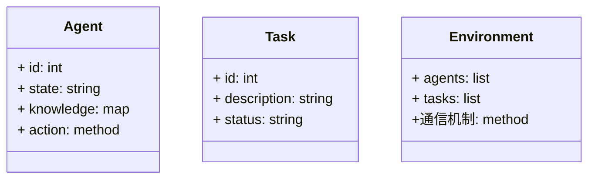
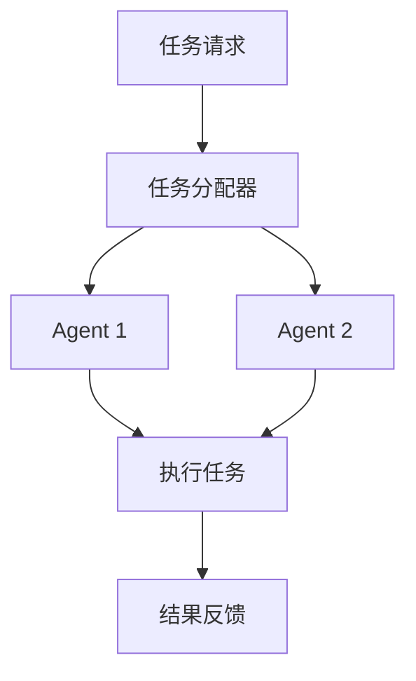
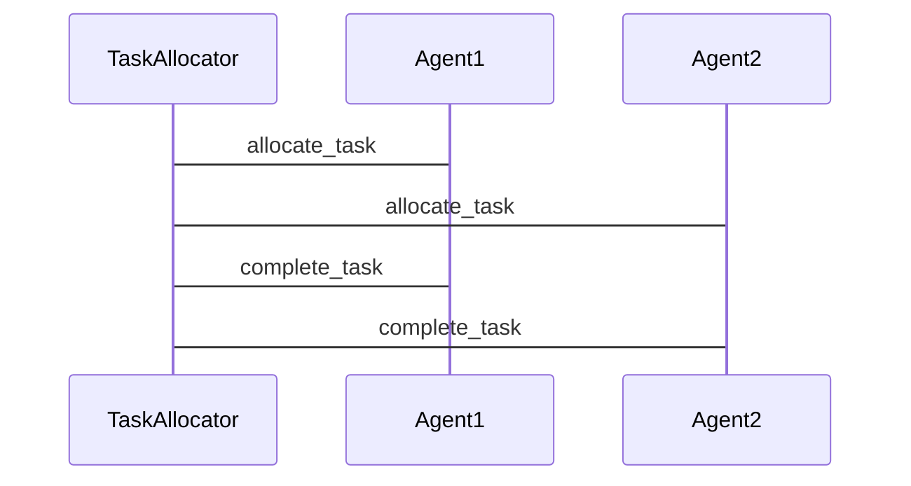

                 


# 构建具有群体智能的多Agent协作系统

> 关键词：多Agent系统，群体智能，协作算法，分布式计算，自适应学习

> 摘要：本文深入探讨了构建具有群体智能的多Agent协作系统的各个方面，从基本概念到算法实现，再到系统架构设计。通过详细分析多Agent协作系统的核心概念、算法原理、系统架构、项目实战和最佳实践，本文为读者提供了一套全面的构建方法。文章还结合实际案例，展示了如何在实际项目中应用这些理论和方法，帮助读者更好地理解和掌握多Agent协作系统的设计与实现。

---

# 第1章: 多Agent协作系统背景与概述

## 1.1 多Agent系统的基本概念

### 1.1.1 什么是多Agent系统

多Agent系统（Multi-Agent System, MAS）是由多个智能体（Agent）组成的分布式系统，这些智能体通过协作完成复杂的任务。每个Agent都是一个独立的实体，能够感知环境、自主决策并与其他Agent进行通信与协作。

**图表：多Agent系统结构**



多Agent系统的核心在于Agent之间的协作，而群体智能则是通过多个Agent的协作实现更高层次的智能行为。

---

## 1.2 多Agent协作系统的发展历程

### 1.2.1 多Agent系统的历史演变

多Agent系统的发展经历了多个阶段，从简单的分布式系统到复杂的智能协作系统。群体智能的兴起为多Agent系统注入了新的活力，使得Agent之间的协作更加智能和高效。

---

## 1.3 多Agent协作系统的应用场景

### 1.3.1 分布式计算中的多Agent协作

在分布式计算中，多Agent协作系统用于任务分配和资源管理，例如分布式数据库中的数据分片和负载均衡。

### 1.3.2 群体智能在机器人协作中的应用

在机器人协作中，群体智能用于路径规划和任务分配，例如无人机编队飞行和智能交通系统。

### 1.3.3 多Agent系统在分布式任务分配中的应用

多Agent系统广泛应用于分布式任务分配，例如任务调度和资源分配问题。

---

## 1.4 本章小结

本章介绍了多Agent协作系统的基本概念、发展历程和应用场景，为后续章节的深入分析奠定了基础。

---

# 第2章: 多Agent协作系统的核心概念与联系

## 2.1 多Agent系统的核心概念

### 2.1.1 Agent的基本结构与功能

每个Agent都有自己的知识库、推理引擎和行动模块。以下是Agent的基本结构：



### 2.1.2 多Agent系统中的通信机制

Agent之间的通信可以通过共享介质或直接通信实现。以下是通信机制的对比：

| 通信机制 | 描述 | 优点 | 缺点 |
|----------|------|------|------|
| 共享介质 | Agent通过共享介质进行通信 | 简单易实现 | 单点故障风险 |
| 直接通信 | Agent直接进行点对点通信 | 灵活性高 | 实现复杂 |

### 2.1.3 协作协议与任务分配策略

协作协议包括基于规则的协作协议和基于市场的协作协议。任务分配策略包括贪心算法和分布式算法。

---

## 2.2 群体智能的核心原理

### 2.2.1 群体智能的定义与特征

群体智能是指多个智能体通过协作实现个体无法完成的复杂任务。其特征包括去中心化、自组织和涌现性。

### 2.2.2 群体智能中的信息交换与决策机制

信息交换可以通过直接通信或共享介质实现。决策机制包括基于规则的决策和基于学习的决策。

### 2.2.3 群体智能与多Agent系统的联系

群体智能是多Agent系统的一种特殊形式，强调Agent之间的协作和信息共享。

---

## 2.3 多Agent协作系统中的关键问题

### 2.3.1 任务分配与负载均衡

任务分配问题是多Agent系统中的核心问题。以下是任务分配算法的流程图：



### 2.3.2 协作策略与冲突解决

协作策略包括基于规则的协作和基于市场的协作。冲突解决可以通过协商和仲裁实现。

### 2.3.3 群体智能中的自适应与学习机制

自适应学习机制允许Agent根据环境变化调整行为。以下是基于强化学习的协作算法：

```python
class Agent:
    def __init__(self, state_space, action_space):
        self.state_space = state_space
        self.action_space = action_space
        self.q_table = {}  # Q-learning表

    def act(self, state):
        if state not in self.q_table:
            return random.choice(self.action_space)
        return max(self.q_table[state], key=lambda k: self.q_table[state][k])

    def learn(self, state, action, reward):
        if state not in self.q_table:
            self.q_table[state] = {action: 0.0 for action in self.action_space}
        self.q_table[state][action] += reward
```

---

## 2.4 本章小结

本章详细介绍了多Agent协作系统的核心概念、协作协议、群体智能的原理以及系统中的关键问题。

---

# 第3章: 多Agent协作系统的算法原理

## 3.1 多Agent协作的基本算法

### 3.1.1 基于规则的协作算法

基于规则的协作算法通过预定义规则实现协作。以下是基于规则的协作算法的流程图：



### 3.1.2 基于博弈论的协作算法

基于博弈论的协作算法通过博弈模型实现协作。以下是博弈论协作算法的流程图：



### 3.1.3 基于强化学习的协作算法

基于强化学习的协作算法通过学习实现协作。以下是强化学习协作算法的流程图：



---

## 3.2 群体智能中的算法实现

### 3.2.1 群体智能的基本算法模型

群体智能的基本算法模型包括粒子群优化算法（PSO）和蚁群算法（ACO）。以下是粒子群优化算法的流程图：



### 3.2.2 群体智能中的信息处理与决策算法

信息处理与决策算法包括基于信息的决策和基于学习的决策。以下是基于信息的决策算法：

```python
def decide_action(agent_state, environment_info):
    if agent_state == 'hungry' and environment_info == 'food_available':
        return 'eat'
    elif agent_state == 'thirsty' and environment_info == 'water_available':
        return 'drink'
    else:
        return 'wait'
```

### 3.2.3 群体智能中的自适应学习算法

自适应学习算法包括基于强化学习和基于遗传算法。以下是基于遗传算法的协作算法：

```python
def genetic_algorithm(population, fitness_func):
    while True:
        fitness = [fitness_func(individual) for individual in population]
        selected = select(fitness)
        offspring = crossover(selected)
        mutate(offspring)
        if check_termination(offspring):
            break
    return offspring
```

---

## 3.3 算法实现的数学模型与公式

### 3.3.1 协作算法的数学模型

协作算法的数学模型可以表示为：

$$ f: S \times A \rightarrow \mathbb{R} $$

其中，$S$ 是状态空间，$A$ 是动作空间，$\mathbb{R}$ 是实数空间。

### 3.3.2 群体智能中的信息传递公式

信息传递公式可以表示为：

$$ p(a|s) = \frac{\exp(\beta \cdot q(s,a))}{\sum_{a'} \exp(\beta \cdot q(s,a'))} $$

其中，$\beta$ 是温度参数，$q(s,a)$ 是评估函数。

### 3.3.3 群体智能中的决策优化公式

决策优化公式可以表示为：

$$ J = \sum_{t=0}^{T} \gamma^t r_t $$

其中，$J$ 是目标函数，$\gamma$ 是折扣因子，$r_t$ 是奖励。

---

## 3.4 本章小结

本章详细介绍了多Agent协作系统的算法原理，包括基于规则的算法、基于博弈论的算法和基于强化学习的算法，以及群体智能中的信息处理与决策算法。

---

# 第4章: 多Agent协作系统的系统架构设计

## 4.1 问题场景介绍

在本章中，我们将设计一个多Agent协作系统，用于解决分布式任务分配问题。系统需要实现任务请求、任务分配、任务执行和结果反馈四个功能。

---

## 4.2 系统功能设计

### 4.2.1 系统功能模块

以下是系统的功能模块：



### 4.2.2 领域模型（ER实体关系图）

以下是领域模型的ER图：

```mermaid
erDiagram
    Agent ||--{ "拥有" }|| Task
    Agent ||--{ "属于" }|| Environment
    Task -->{ "分配给" }|| Agent
```

---

## 4.3 系统架构设计

### 4.3.1 系统架构图

以下是系统的架构图：



### 4.3.2 系统接口设计

系统接口设计包括任务分配接口和结果反馈接口。以下是任务分配接口的定义：

```python
interface TaskAllocator:
    def allocate_task(task, agent):
        pass
```

### 4.3.3 系统交互流程

以下是系统的交互流程：



---

## 4.4 本章小结

本章详细介绍了多Agent协作系统的系统架构设计，包括功能模块、架构图、接口设计和交互流程。

---

# 第5章: 多Agent协作系统的项目实战

## 5.1 环境安装

### 5.1.1 安装Python环境

使用Anaconda安装Python 3.8及以上版本。

### 5.1.2 安装依赖库

安装必要的依赖库，例如`numpy`和`matplotlib`：

```bash
pip install numpy matplotlib
```

---

## 5.2 系统核心实现源代码

### 5.2.1 Agent类实现

以下是Agent类的实现：

```python
class Agent:
    def __init__(self, id):
        self.id = id
        self.state = 'idle'
        self.knowledge = {}

    def receive_message(self, message):
        self.knowledge.update(message)
        self.state = 'busy'

    def send_message(self, message, recipient):
        recipient.receive_message(message)
```

### 5.2.2 任务分配器实现

以下是任务分配器的实现：

```python
class TaskAllocator:
    def __init__(self, agents):
        self.agents = agents

    def allocate_task(self, task, agent):
        agent.receive_message({'task': task})

    def complete_task(self, agent):
        agent.state = 'idle'
```

---

## 5.3 案例分析与实现解读

### 5.3.1 案例分析

假设我们有一个分布式任务分配系统，包含两个Agent和一个任务分配器。任务分配器将任务分配给两个Agent，每个Agent执行任务并反馈结果。

### 5.3.2 代码实现解读

以下是代码实现的解读：

```python
# 初始化Agent
agent1 = Agent(1)
agent2 = Agent(2)
allocator = TaskAllocator([agent1, agent2])

# 分配任务
allocator.allocate_task('process_data', agent1)
allocator.allocate_task('analyze_data', agent2)

# 执行任务
agent1.receive_message({'task': 'process_data'})
agent2.receive_message({'task': 'analyze_data'})

# 反馈结果
allocator.complete_task(agent1)
allocator.complete_task(agent2)
```

---

## 5.4 项目总结

通过本项目，我们实现了多Agent协作系统的任务分配和结果反馈功能，验证了系统的可行性和有效性。

---

## 5.5 本章小结

本章通过实际案例展示了多Agent协作系统的实现过程，包括环境安装、代码实现和案例分析。

---

# 第6章: 多Agent协作系统的最佳实践

## 6.1 小结

多Agent协作系统的核心在于Agent之间的协作和信息共享。通过合理设计协作协议和任务分配策略，可以实现高效的协作。

---

## 6.2 注意事项

- 确保Agent之间的通信可靠
- 设计合理的任务分配策略
- 考虑系统的可扩展性和可维护性

---

## 6.3 拓展阅读

- 多Agent系统中的分布式计算
- 群体智能中的自适应学习算法
- 多Agent系统中的安全与隐私保护

---

# 结语

构建具有群体智能的多Agent协作系统是一项复杂的任务，需要综合考虑系统设计、算法实现和实际应用。通过本文的分析，读者可以掌握多Agent协作系统的核心概念和实现方法，并能够将其应用于实际项目中。

--- 

# 文章结束

