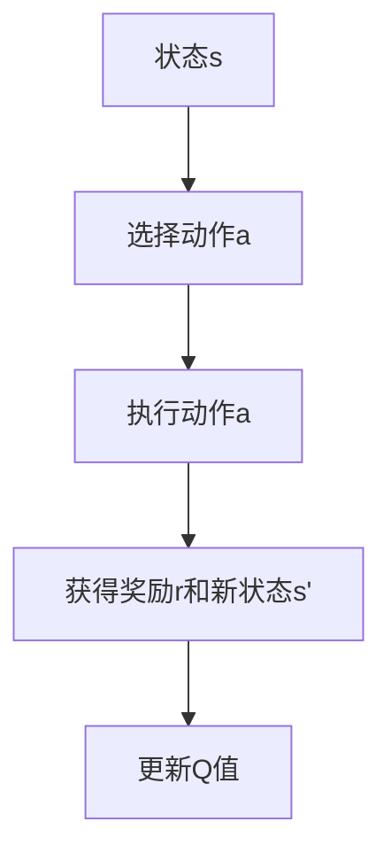
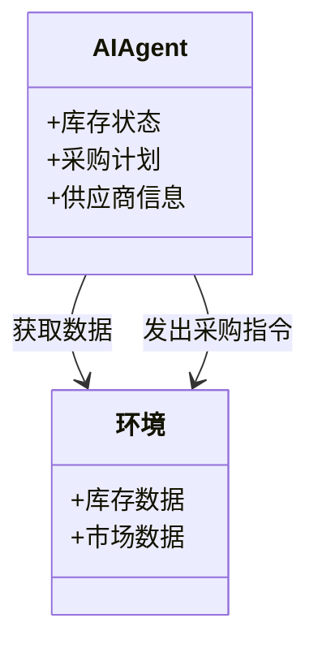
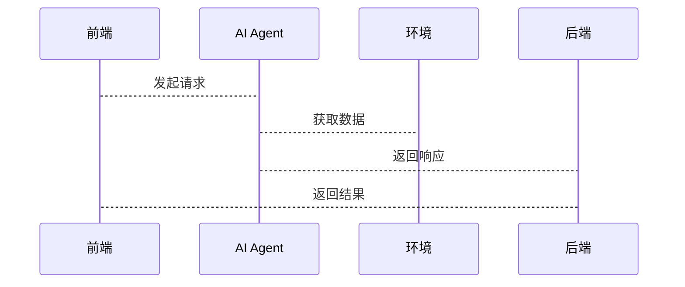

                 


# 《构建具有自主决策能力的AI Agent》

---

## 关键词：AI Agent、自主决策、人工智能、强化学习、决策树、系统架构、实战案例

---

## 摘要：  
本文详细探讨了构建具有自主决策能力的AI Agent的全过程。从基础概念到算法原理，再到系统架构和实战案例，系统性地分析了如何设计和实现一个能够自主决策的智能体。通过理论与实践相结合的方式，深入解读了强化学习、决策树等核心算法，并结合实际应用场景，展示了如何构建一个完整的AI Agent系统。文章最后总结了关键点，并提供了进一步学习和实践的建议。

---

## 正文

### 第1章: AI Agent与自主决策概述

#### 1.1 AI Agent的基本概念

##### 1.1.1 什么是AI Agent

AI Agent（人工智能代理）是指能够感知环境、自主决策并执行任务的智能实体。它能够通过传感器获取信息，利用算法处理信息，并通过执行器与环境交互。AI Agent的核心目标是帮助人类完成复杂的任务，提高效率和准确性。

##### 1.1.2 自主决策AI Agent的定义

自主决策AI Agent是指能够在没有外部干预的情况下，独立完成决策过程的智能体。它具备以下特点：

- **自主性**：能够在没有外部控制的情况下独立运行。
- **反应性**：能够实时感知环境并做出反应。
- **目标导向**：具有明确的目标，并能够为实现目标而采取行动。

##### 1.1.3 自主决策能力的核心要素

自主决策能力的核心要素包括：

1. **感知能力**：通过传感器或数据接口获取环境信息。
2. **决策能力**：基于感知信息，利用算法做出决策。
3. **执行能力**：通过执行器或接口将决策转化为实际操作。

#### 1.2 自主决策AI Agent的背景与现状

##### 1.2.1 自主决策AI Agent的发展背景

随着人工智能技术的快速发展，自主决策AI Agent的应用场景越来越广泛。从工业自动化到智能交通，从智能家居到医疗健康，自主决策AI Agent正在改变我们的生活方式。

##### 1.2.2 当前技术现状与挑战

当前，自主决策AI Agent的技术发展面临以下挑战：

- **复杂环境的适应性**：如何在动态变化的环境中做出准确的决策。
- **多目标优化**：在多个目标之间找到平衡点，避免优先级冲突。
- **安全与伦理问题**：如何确保AI Agent的决策符合伦理规范，避免对人类造成伤害。

##### 1.2.3 自主决策AI Agent的应用场景

自主决策AI Agent的应用场景包括：

1. **自动驾驶**：通过感知环境和实时决策实现车辆自主行驶。
2. **智能助手**：通过自然语言处理和决策算法为用户提供个性化服务。
3. **工业自动化**：通过工业机器人和自动化系统实现生产过程的优化。

#### 1.3 本书的目标与结构

##### 1.3.1 本书的目标

本书旨在帮助读者从零开始，系统性地学习如何构建具有自主决策能力的AI Agent。通过理论与实践相结合的方式，深入解读自主决策AI Agent的核心技术。

##### 1.3.2 本书的结构安排

本书分为以下几个部分：

- **基础篇**：介绍AI Agent的基本概念和核心技术。
- **算法篇**：详细讲解强化学习和决策树等核心算法。
- **系统篇**：探讨AI Agent的系统架构和实现方法。
- **实战篇**：通过实际案例展示如何构建自主决策AI Agent。

##### 1.3.3 如何阅读本书

建议读者按照以下顺序阅读本书：

1. 先阅读引言部分，了解本书的核心内容和目标。
2. 学习基础篇，掌握AI Agent的基本概念和核心技术。
3. 深入算法篇，理解强化学习和决策树等核心算法。
4. 研究系统篇，学习如何设计和实现AI Agent系统。
5. 最后，通过实战篇，掌握如何将理论应用于实际项目。

---

### 第2章: 自主决策AI Agent的核心概念

#### 2.1 智能体模型

##### 2.1.1 理解智能体模型

智能体模型是AI Agent的核心组成部分，它描述了智能体的结构和功能。常见的智能体模型包括：

- **反应式模型**：基于当前感知做出反应。
- **认知式模型**：结合知识库和推理能力进行决策。
- **混合式模型**：结合反应式和认知式模型的优点。

##### 2.1.2 智能体的分类与特点

智能体可以按照以下分类：

1. **简单反射式智能体**：基于简单的规则做出反应。
2. **基于模型的反射式智能体**：利用内部模型进行决策。
3. **目标驱动智能体**：以目标为导向进行决策。
4. **效用驱动智能体**：基于效用函数进行决策。

##### 2.1.3 自主决策智能体的属性特征对比表格

| 特性          | 简单反射式智能体 | 基于模型的反射式智能体 | 目标驱动智能体 | 效用驱动智能体 |
|---------------|------------------|-----------------------|----------------|----------------|
| 决策方式      | 基于简单规则     | 基于内部模型           | 基于目标函数   | 基于效用函数   |
| 复杂性        | 低               | 中                   | 高             | 高             |
| 应用场景      | 简单任务         | 中等复杂任务           | 复杂任务       | 综合任务       |

---

#### 2.2 决策机制

##### 2.2.1 决策机制的定义

决策机制是指智能体在感知环境后，通过算法选择最优行动的方式。决策机制的核心在于如何将感知信息转化为具体的行动。

##### 2.2.2 基于规则的决策机制

基于规则的决策机制通过预定义的规则进行决策。例如：

- 如果温度 > 30°C，则开启空调。
- 如果温度 < 20°C，则关闭空调。

##### 2.2.3 基于学习的决策机制

基于学习的决策机制通过机器学习算法进行决策。例如：

- 使用强化学习算法训练智能体在动态环境中做出最优决策。

---

#### 2.3 学习方法

##### 2.3.1 监督学习与无监督学习

监督学习通过标记数据进行训练，无监督学习通过未标记数据进行训练。

##### 2.3.2 强化学习在决策中的应用

强化学习通过奖励机制训练智能体做出最优决策。例如：

- 在自动驾驶中，智能体通过接收奖励信号优化驾驶策略。

##### 2.3.3 迁移学习与自适应学习

迁移学习通过将已有的知识迁移到新的任务中，提高学习效率。自适应学习通过实时更新模型参数，适应环境的变化。

---

### 第3章: 强化学习与决策树

#### 3.1 强化学习算法

##### 3.1.1 强化学习的基本原理

强化学习通过智能体与环境的交互，逐步优化决策策略。其核心在于通过试错的方式，找到最优的行动路径。

##### 3.1.2 Q-learning算法的数学模型

Q-learning算法的数学模型如下：

$$ Q(s, a) = r + \gamma \max Q(s', a') $$

其中，$s$是当前状态，$a$是当前动作，$r$是奖励，$s'$是新状态，$\gamma$是折扣因子。

##### 3.1.3 DQN算法的流程图



---

#### 3.2 决策树算法

##### 3.2.1 决策树的基本原理

决策树是一种基于树状结构的分类方法。它通过特征选择和剪枝，构建最优的决策路径。

##### 3.2.2 决策树的构建步骤

1. 特征选择：选择对分类最有影响力的特征。
2. 数据划分：根据特征将数据划分为子集。
3. 递归构建：递归地构建决策树的各个节点。
4. 剪枝：剪去不必要的节点，防止过拟合。

##### 3.2.3 决策树的优缺点

- **优点**：直观易懂，适合处理复杂问题。
- **缺点**：对噪声数据敏感，容易过拟合。

---

### 第4章: 自主决策AI Agent的系统架构

#### 4.1 系统功能设计

##### 4.1.1 问题场景介绍

以库存管理为例，设计一个自主决策AI Agent，帮助企业优化库存管理。

##### 4.1.2 系统功能需求

- 实时监控库存状态。
- 自动补货。
- 优化采购计划。

##### 4.1.3 领域模型设计



##### 4.1.4 系统架构设计


##### 4.1.5 系统接口设计

- **API接口**：提供RESTful API，供前端调用。
- **数据接口**：与数据库和外部系统对接。

##### 4.1.6 系统交互设计



---

#### 4.2 系统实现

##### 4.2.1 项目介绍

以库存管理为例，设计一个自主决策AI Agent系统。

##### 4.2.2 核心实现

```python
class AI_Agent:
    def __init__(self):
        self.inventory_status = {}
        self.purchase_plan = {}
    
    def get_inventory_data(self):
        # 获取库存数据
        pass
    
    def decide_purchase(self):
        # 基于库存数据和市场数据，决策是否需要补货
        pass
    
    def send_purchase_order(self):
        # 发出采购指令
        pass
```

---

### 第5章: 实战案例

#### 5.1 项目实战

##### 5.1.1 环境安装

安装Python和相关库：

```bash
pip install numpy
pip install scikit-learn
```

##### 5.1.2 代码实现

```python
import numpy as np
from sklearn.tree import DecisionTreeClassifier

class AI_Agent:
    def __init__(self):
        self.model = DecisionTreeClassifier()
    
    def train(self, X, y):
        self.model.fit(X, y)
    
    def predict(self, X):
        return self.model.predict(X)
```

##### 5.1.3 案例分析

以库存管理为例，训练决策树模型，预测是否需要补货。

---

### 第6章: 总结与展望

#### 6.1 总结

通过本文的学习，读者可以系统性地掌握如何构建具有自主决策能力的AI Agent。从基础概念到算法实现，再到系统架构，我们全面探讨了自主决策AI Agent的核心技术。

#### 6.2 小结

- **关键点回顾**：强化学习、决策树、系统架构。
- **注意事项**：确保数据质量，避免过拟合。
- **扩展阅读**：推荐学习深度强化学习和多智能体协作。

#### 6.3 拓展阅读

- 《强化学习（第2版）》
- 《机器学习实战》

---

以上是《构建具有自主决策能力的AI Agent》的完整目录大纲和内容概要。通过理论与实践相结合的方式，读者可以全面掌握自主决策AI Agent的核心技术，并能够将其应用于实际项目中。

