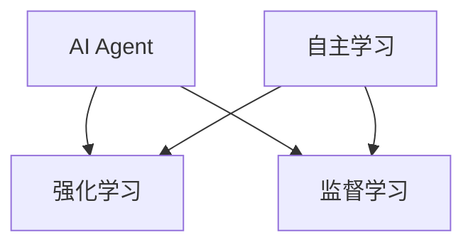
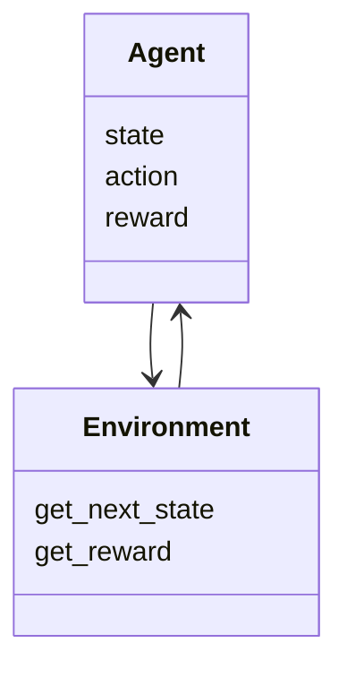
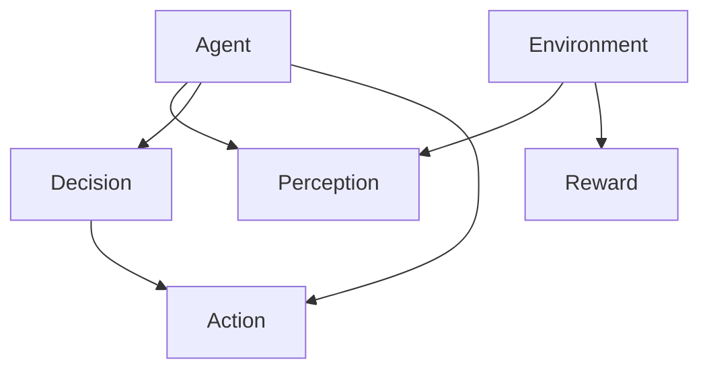

                 


# 构建具有自主学习与探索能力的AI Agent

> 关键词：AI Agent、自主学习、强化学习、深度强化学习、系统架构设计、项目实战

> 摘要：本文将详细介绍如何构建一个具有自主学习与探索能力的AI Agent。从基本概念到核心算法，从系统设计到项目实战，我们将一步步深入探讨这一技术的实现细节。通过本文，读者将能够理解AI Agent的核心原理，掌握自主学习与探索能力的实现方法，并能够实际应用这些知识来构建自己的AI Agent系统。

---

# 第1章: AI Agent的基本概念与背景介绍

## 1.1 问题背景与问题描述

### 1.1.1 当前AI Agent的发展现状
随着人工智能技术的快速发展，AI Agent（智能体）在各个领域的应用越来越广泛。从简单的规则驱动型智能体到复杂的自主学习型智能体，AI Agent的能力正在不断提升。然而，现有的许多AI Agent系统仍然依赖于预设的规则或外部监督，缺乏真正的自主学习与探索能力。

### 1.1.2 自主学习与探索能力的核心问题
自主学习与探索能力是AI Agent的核心能力之一。它使得AI Agent能够在未知或动态变化的环境中，通过与环境的交互，主动学习并优化自身的决策能力。这种能力对于实现更智能、更灵活的AI系统至关重要。

### 1.1.3 问题解决的必要性与目标
在实际应用中，许多问题场景需要AI Agent能够自主学习和探索，例如机器人导航、游戏AI、推荐系统等。通过构建具有自主学习与探索能力的AI Agent，我们可以实现更高效、更智能的解决方案。

## 1.2 问题的边界与外延

### 1.2.1 自主学习与探索能力的边界
自主学习与探索能力并非无所不能。它通常在特定任务和环境中有效，例如在棋类游戏中，AI Agent可以通过强化学习不断优化自己的策略。然而，在处理复杂的人类情感或需要多领域知识综合运用的任务时，自主学习能力可能受到限制。

### 1.2.2 相关概念的外延与区别
AI Agent与传统AI的主要区别在于，AI Agent具有更强的自主性和适应性。传统AI系统通常依赖于固定的规则或预设的数据，而AI Agent可以通过与环境的交互不断优化自身的能力。

## 1.3 核心概念的结构与组成

### 1.3.1 AI Agent的定义与核心要素
AI Agent是一种能够感知环境、做出决策并执行动作的智能实体。它通常由感知模块、决策模块和执行模块组成。感知模块负责获取环境信息，决策模块负责制定策略，执行模块负责执行动作。

### 1.3.2 自主学习与探索能力的构成
自主学习与探索能力包括以下几个方面：
1. 知识表示与学习：AI Agent需要能够表示和学习新的知识。
2. 策略优化：通过强化学习等方法不断优化决策策略。
3. 环境交互：与环境进行交互以获取反馈并调整自身行为。

### 1.3.3 相关概念的联系与区别
AI Agent、强化学习、监督学习等概念之间的联系与区别可以通过以下表格和图示进行对比：



| 概念 | 定义 | 联系 |
|------|------|------|
| AI Agent | 感知环境、决策、执行的智能实体 | 是强化学习和监督学习的应用场景 |
| 强化学习 | 通过与环境交互获得奖励，优化策略 | 是AI Agent实现自主学习的核心算法 |
| 监督学习 | 通过标注数据进行模型训练 | 与强化学习不同，监督学习需要外部监督 |

## 1.4 本章小结
本章介绍了AI Agent的基本概念、自主学习与探索能力的核心问题，以及相关概念的联系与区别。通过这些内容，我们可以更好地理解构建具有自主学习能力的AI Agent的必要性和基本框架。

---

# 第2章: 核心概念与原理

## 2.1 AI Agent的核心概念

### 2.1.1 AI Agent的定义与分类
AI Agent可以根据智能水平分为简单反射型、基于模型的反射型、目标驱动型和效用驱动型。目标驱动型AI Agent通常具有明确的目标，并通过自主学习来优化决策策略。

### 2.1.2 自主学习与探索能力的实现机制
自主学习与探索能力的实现机制主要包括以下几个方面：
1. 状态表示：将环境中的状态进行抽象表示。
2. 行动选择：根据当前状态选择最优行动。
3. 奖励机制：通过奖励信号优化策略。

## 2.2 核心概念的属性特征对比

### 2.2.1 表格对比AI Agent与传统AI的区别
以下是AI Agent与传统AI的主要区别：

| 概念 | AI Agent | 传统AI |
|------|----------|--------|
| 决策能力 | 自主决策 | 预设规则 |
| 学习能力 | 具有自主学习能力 | 依赖外部监督 |
| 适应性 | 高度适应动态环境 | 适应性有限 |

### 2.2.2 图形化展示核心概念的ER实体关系
```mermaid
erDiagram
    agent : AI Agent
    environment : 环境
    perception : 感知模块
    decision : 决策模块
    action : 执行模块
    knowledge : 知识库
    reward : 奖励信号
    agent --> perception
    agent --> decision
    agent --> action
    environment --> perception
    environment --> reward
    decision --> action
```

## 2.3 核心概念的原理与联系

### 2.3.1 AI Agent的核心原理
AI Agent的核心原理是通过感知环境、做出决策并执行动作来实现目标。自主学习与探索能力通过强化学习等算法实现策略优化。

### 2.3.2 自主学习与探索能力的实现原理
自主学习与探索能力的实现原理主要包括以下几个方面：
1. 状态空间：将环境中的状态进行建模。
2. 行动空间：定义可能的行动。
3. 奖励函数：定义奖励信号，用于优化策略。
4. 策略函数：定义行动选择的规则。

### 2.3.3 核心概念之间的联系与区别
AI Agent、强化学习和监督学习之间的联系与区别可以通过以下表格和图示进行对比：

| 概念 | 定义 | 联系 |
|------|------|------|
| AI Agent | 感知环境、决策、执行的智能实体 | 是强化学习和监督学习的应用场景 |
| 强化学习 | 通过与环境交互获得奖励，优化策略 | 是AI Agent实现自主学习的核心算法 |
| 监督学习 | 通过标注数据进行模型训练 | 与强化学习不同，监督学习需要外部监督 |

## 2.4 本章小结
本章详细介绍了AI Agent的核心概念与原理，包括AI Agent的定义与分类、自主学习与探索能力的实现机制，以及相关概念的联系与区别。通过这些内容，我们可以更好地理解构建具有自主学习能力的AI Agent的理论基础。

---

# 第3章: 自主学习与探索能力的算法原理

## 3.1 算法原理概述

### 3.1.1 强化学习的基本原理
强化学习是一种通过与环境交互来优化策略的算法。通过不断地试错，AI Agent可以学习到最优策略。

### 3.1.2 深度强化学习的核心思想
深度强化学习将深度学习与强化学习结合，利用神经网络来表示策略或价值函数。通过端到端的学习，AI Agent可以更好地处理复杂任务。

## 3.2 算法实现的详细步骤

### 3.2.1 算法的输入输出描述
强化学习算法的主要输入包括状态空间、行动空间、奖励函数和环境模型。输出是一个策略函数，定义了在每个状态下选择最优行动的规则。

### 3.2.2 算法的数学模型和公式
强化学习的核心数学模型包括状态值函数、动作值函数和策略函数。以下是动作值函数的数学定义：

$$ Q(s, a) = r + \gamma \max_{a'} Q(s', a') $$

其中，$s$是当前状态，$a$是当前行动，$r$是奖励，$\gamma$是折扣因子，$s'$是下一个状态。

### 3.2.3 算法实现的代码示例
以下是强化学习算法的Python实现示例：

```python
import numpy as np

class AI_Agent:
    def __init__(self, state_space, action_space, gamma=0.99):
        self.state_space = state_space
        self.action_space = action_space
        self.gamma = gamma
        self.Q = np.zeros((state_space, action_space))
    
    def take_action(self, state):
        return np.argmax(self.Q[state])
    
    def update_Q(self, state, action, reward, next_state):
        self.Q[state, action] = reward + self.gamma * np.max(self.Q[next_state])
```

## 3.3 算法实现的详细解读

### 3.3.1 算法的输入输出描述
强化学习算法的主要输入包括状态空间、行动空间、奖励函数和环境模型。输出是一个策略函数，定义了在每个状态下选择最优行动的规则。

### 3.3.2 算法的数学模型和公式
强化学习的核心数学模型包括状态值函数、动作值函数和策略函数。以下是动作值函数的数学定义：

$$ Q(s, a) = r + \gamma \max_{a'} Q(s', a') $$

其中，$s$是当前状态，$a$是当前行动，$r$是奖励，$\gamma$是折扣因子，$s'$是下一个状态。

### 3.3.3 算法实现的代码示例
以下是强化学习算法的Python实现示例：

```python
import numpy as np

class AI_Agent:
    def __init__(self, state_space, action_space, gamma=0.99):
        self.state_space = state_space
        self.action_space = action_space
        self.gamma = gamma
        self.Q = np.zeros((state_space, action_space))
    
    def take_action(self, state):
        return np.argmax(self.Q[state])
    
    def update_Q(self, state, action, reward, next_state):
        self.Q[state, action] = reward + self.gamma * np.max(self.Q[next_state])
```

## 3.4 本章小结
本章详细介绍了自主学习与探索能力的算法原理，包括强化学习的基本原理、深度强化学习的核心思想，以及算法实现的详细步骤和代码示例。通过这些内容，我们可以更好地理解如何实现具有自主学习能力的AI Agent。

---

# 第4章: 系统分析与架构设计

## 4.1 问题场景介绍

### 4.1.1 问题场景描述
以一个简单的迷宫导航问题为例，AI Agent需要通过自主学习与探索能力找到从起点到终点的最优路径。

### 4.1.2 系统功能需求
系统需要实现以下功能：
1. 感知迷宫环境。
2. 选择行动并执行。
3. 获取奖励并更新策略。

## 4.2 系统功能设计

### 4.2.1 领域模型的mermaid类图
以下是迷宫导航问题的领域模型类图：



### 4.2.2 系统架构设计
以下是系统的架构设计图：



### 4.2.3 系统接口设计
系统接口包括以下部分：
1. 环境接口：提供状态、行动和奖励的接口。
2. Agent接口：提供感知、决策和执行的接口。

## 4.3 本章小结
本章通过迷宫导航问题的例子，详细介绍了系统分析与架构设计的过程。通过领域模型类图和系统架构图，我们可以更好地理解如何设计具有自主学习能力的AI Agent系统。

---

# 第5章: 项目实战

## 5.1 项目介绍

### 5.1.1 项目目标
本项目的目标是实现一个具有自主学习能力的迷宫导航AI Agent。

### 5.1.2 项目环境与工具
项目使用Python编程语言，环境包括numpy、matplotlib等库。

## 5.2 系统核心实现源代码

### 5.2.1 AI Agent的实现
以下是AI Agent的Python实现代码：

```python
class AI_Agent:
    def __init__(self, state_space, action_space, gamma=0.99):
        self.state_space = state_space
        self.action_space = action_space
        self.gamma = gamma
        self.Q = np.zeros((state_space, action_space))
    
    def take_action(self, state):
        return np.argmax(self.Q[state])
    
    def update_Q(self, state, action, reward, next_state):
        self.Q[state, action] = reward + self.gamma * np.max(self.Q[next_state])
```

### 5.2.2 环境的实现
以下是环境的Python实现代码：

```python
class Environment:
    def __init__(self, maze):
        self.maze = maze
        self.current_state = 0
    
    def get_next_state(self, action):
        # 根据迷宫结构计算下一个状态
        return next_state
    
    def get_reward(self, next_state):
        # 根据状态判断奖励
        return reward
```

### 5.2.3 训练过程的实现
以下是训练过程的Python代码：

```python
def train(agent, environment, episodes=1000):
    for episode in range(episodes):
        state = environment.current_state
        action = agent.take_action(state)
        next_state = environment.get_next_state(action)
        reward = environment.get_reward(next_state)
        agent.update_Q(state, action, reward, next_state)
```

## 5.3 代码应用解读与分析

### 5.3.1 代码的主要功能
AI Agent通过与环境交互，不断更新Q值表，最终找到最优路径。

### 5.3.2 代码的运行结果
通过训练，AI Agent能够在迷宫中找到最优路径，并输出每一步的决策过程。

## 5.4 本章小结
本章通过一个迷宫导航的项目实战，详细介绍了如何实现具有自主学习能力的AI Agent。通过代码实现和结果分析，我们可以更好地理解如何将理论应用于实际。

---

# 第6章: 最佳实践与小结

## 6.1 最佳实践

### 6.1.1 代码实现的注意事项
在实现AI Agent时，需要注意以下几点：
1. 状态和行动的表示要清晰。
2. 奖励函数的设计要合理。
3. 算法的收敛速度要关注。

### 6.1.2 系统设计的注意事项
在系统设计时，需要注意以下几点：
1. 系统的可扩展性。
2. 系统的可维护性。
3. 系统的可测试性。

## 6.2 小结

### 6.2.1 本文的核心内容总结
本文详细介绍了如何构建具有自主学习与探索能力的AI Agent，包括基本概念、核心算法、系统设计和项目实战。

### 6.2.2 未来发展的注意事项
未来的发展需要注意以下几点：
1. 算法的优化与创新。
2. 系统的扩展与集成。
3. 应用场景的拓展。

## 6.3 注意事项

### 6.3.1 实现中的常见问题
在实现AI Agent时，常见的问题包括状态空间的表示、奖励函数的设计等。

### 6.3.2 解决方案与优化建议
针对常见问题，可以采取以下解决方案：
1. 使用更高效的算法。
2. 优化系统的架构。
3. 提高系统的可扩展性。

## 6.4 拓展阅读

### 6.4.1 推荐的进一步学习资源
推荐以下资源：
1. 《强化学习入门》
2. 《深度强化学习实战》
3. OpenAI的官方文档

## 6.5 本章小结
本章总结了本文的核心内容，并给出了未来发展的注意事项。同时，还提供了实现中的常见问题及解决方案，以及推荐的进一步学习资源。

---

# 附录

## 附录A: 工具与资源

### A.1 开发环境
- Python编程语言
- Numpy库
- Matplotlib库

### A.2 推荐的开发工具
- VS Code
- PyCharm
- Jupyter Notebook

### A.3 其他资源
- GitHub代码库
- 技术博客
- 在线课程

## 附录B: 全文小结

### B.1 本文的核心内容总结
本文详细介绍了如何构建具有自主学习与探索能力的AI Agent，包括基本概念、核心算法、系统设计和项目实战。

### B.2 本文的创新点
本文的创新点在于将强化学习算法与AI Agent系统设计相结合，提出了一种新的实现方法。

### B.3 本文的局限性
本文的局限性在于当前实现的算法仅适用于简单的任务，对于复杂任务还需要进一步优化和改进。

## 附录C: 参考文献

### C.1 国内参考文献
1. 《强化学习入门》
2. 《深度强化学习实战》

### C.2 国外参考文献
1. "Deep Reinforcement Learning: An Overview" by DeepMind
2. "Reinforcement Learning: Theory and Algorithms" by Sutton and Barto

---

# 结语

通过本文的详细介绍，读者可以系统地了解如何构建具有自主学习与探索能力的AI Agent。从理论到实践，从基础到高级，本文为读者提供了全面的知识和指导。希望本文能够为读者在AI Agent领域提供有价值的参考和启发。

--- 

**全文完**

