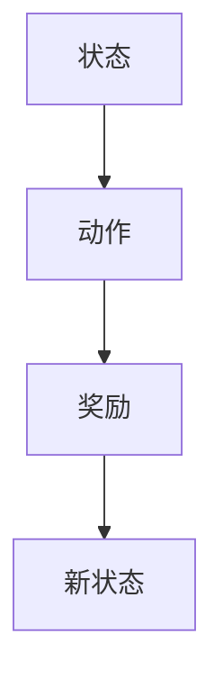
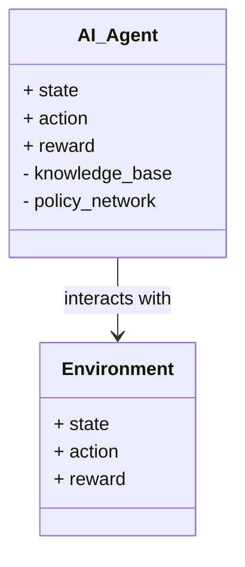
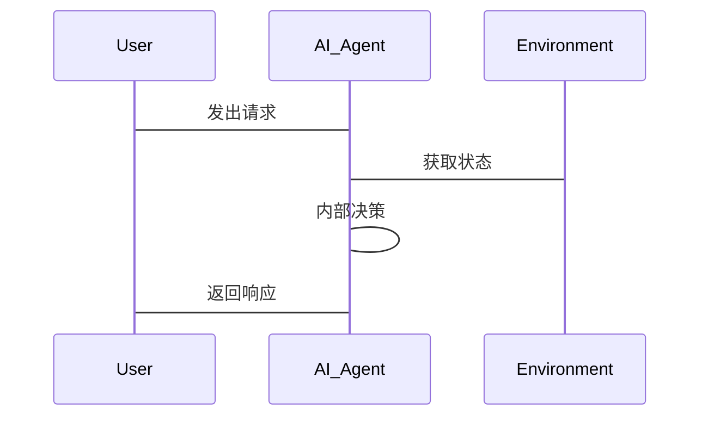

                 

# 构建具有自主学习能力的AI Agent

> 关键词：AI Agent, 自主学习, 强化学习, 知识图谱, 系统架构

> 摘要：本文详细探讨了构建具有自主学习能力的AI Agent的各个方面，包括其核心概念、算法原理、系统架构、项目实战等内容。通过背景介绍、核心概念分析、算法实现、系统设计和实际案例，帮助读者全面理解如何设计和实现一个能够自主学习的AI代理。

---

## 第一部分: 自主学习AI Agent的背景与概念

### 第1章: 自主学习AI Agent的背景与概念

#### 1.1 自主学习AI Agent的定义与特点

自主学习AI Agent是指能够通过与环境互动和数据学习，不断优化自身行为和决策能力的智能体。与传统的被动接收指令的AI不同，自主学习AI Agent具备主动探索、自我改进和自适应的能力。其核心特点包括：

- **主动性**：AI Agent能够主动探索环境，发现新信息并调整行为。
- **自适应性**：能够根据新数据和环境变化，实时优化模型和策略。
- **知识表示**：通过知识图谱或逻辑推理，构建对世界的理解和表示。
- **多目标优化**：在复杂环境中，能够权衡多个目标，做出最优决策。

#### 1.2 自主学习AI Agent的应用场景

自主学习AI Agent的应用场景广泛，包括：

- **机器人技术**：用于服务机器人、工业机器人等，使其能够自主完成任务。
- **智能助手**：如虚拟助手，能够主动学习用户的习惯，提供更智能的服务。
- **游戏AI**：在游戏环境中，AI Agent能够自主学习策略，提高游戏水平。
- **自动驾驶**：通过自主学习，提升车辆在复杂环境中的决策能力。

#### 1.3 自主学习AI Agent的发展现状

当前，自主学习AI Agent的发展主要依赖于强化学习、知识图谱和深度学习等技术。然而，仍面临一些挑战，如数据效率、安全性、伦理问题等。未来，随着技术的进步，自主学习AI Agent将在更多领域发挥重要作用。

---

### 第2章: 自主学习AI Agent的核心概念与原理

#### 2.1 自主学习机制

##### 2.1.1 强化学习

强化学习是一种通过试错机制，使AI Agent在环境中学习策略的方法。其核心包括：

- **状态（State）**：环境中的当前情况。
- **动作（Action）**：AI Agent采取的行动。
- **奖励（Reward）**：环境对动作的反馈，用于指导学习。

##### 2.1.2 监督学习与无监督学习的结合

监督学习通过标注数据训练模型，无监督学习则通过未标注数据发现模式。两者的结合可以提升模型的泛化能力。

##### 2.1.3 知识表示与推理

知识表示是将知识以结构化形式存储的过程，推理则是基于知识进行逻辑推导。

#### 2.2 自主学习中的知识表示

##### 2.2.1 知识图谱

知识图谱通过实体和关系构建知识网络，常用于语义搜索和推理。

##### 2.2.2 逻辑推理与概率推理

逻辑推理基于逻辑规则进行推导，概率推理则考虑不确定性。

#### 2.3 自主学习中的推理与决策

##### 2.3.1 基于知识的推理

通过知识图谱进行推理，提升决策的准确性。

##### 2.3.2 基于数据的推理

利用数据驱动的方法进行实时推理和决策。

##### 2.3.3 多目标优化与权衡

在多个目标之间找到最优平衡点。

---

### 第3章: 自主学习AI Agent的算法原理

#### 3.1 强化学习算法

##### 3.1.1 Q-learning算法

Q-learning是一种经典的强化学习算法，通过Q表记录状态-动作的值。

##### 3.1.2 Deep Q-Networks (DQN)

DQN结合深度神经网络，提升Q-learning的表达能力。

##### 3.1.3 策略梯度方法

策略梯度直接优化策略，避免Q表的维护。

#### 3.2 监督学习与无监督学习的结合

##### 3.2.1 使用监督学习进行预训练

通过标注数据预训练模型，提升初始性能。

##### 3.2.2 使用无监督学习进行自我改进

通过无监督学习发现数据中的潜在结构，进一步优化模型。

##### 3.2.3 混合学习策略

结合两种学习方式，提升模型的多样性和鲁棒性。

---

## 第四部分: 自主学习AI Agent的系统设计与架构

### 第4章: 自主学习AI Agent的系统设计与架构

#### 4.1 系统功能设计

##### 4.1.1 领域模型设计

通过Mermaid类图展示系统中的实体及其关系。

#### 4.2 系统架构设计

##### 4.2.1 分层架构

系统分为感知层、决策层和执行层，每一层负责不同的功能。

##### 4.2.2 微服务架构

通过微服务实现各功能模块的独立开发和部署。

#### 4.3 系统接口设计

##### 4.3.1 API接口

定义RESTful API，供其他系统调用。

##### 4.3.2 交互接口

设计用户友好的交互界面，方便用户与AI Agent互动。

#### 4.4 系统交互设计

##### 4.4.1 交互流程

通过Mermaid序列图展示系统与用户之间的交互流程。

---

## 第五部分: 自主学习AI Agent的项目实战

### 第5章: 自主学习AI Agent的项目实战

#### 5.1 环境搭建

##### 5.1.1 安装必要的库

安装Python、TensorFlow、Keras等必要库。

##### 5.1.2 配置开发环境

配置Jupyter Notebook或IDE。

#### 5.2 核心实现

##### 5.2.1 强化学习算法实现

实现DQN算法，训练AI Agent在环境中学习。

##### 5.2.2 知识图谱构建

使用Ubergraph构建领域知识图谱。

##### 5.2.3 系统集成

将各模块集成，完成AI Agent的整体实现。

#### 5.3 案例分析

##### 5.3.1 游戏AI案例

训练AI Agent在游戏环境中自主学习策略。

##### 5.3.2 服务机器人案例

实现一个能够自主学习用户习惯的智能助手。

#### 5.4 总结与优化

##### 5.4.1 总结

总结项目实现的关键点和经验教训。

##### 5.4.2 优化方向

提出进一步优化的方向，如算法改进、系统性能提升等。

---

## 第六部分: 总结与展望

### 第6章: 总结与展望

#### 6.1 总结

总结本文的核心内容，强调自主学习AI Agent的重要性和实现方法。

#### 6.2 未来展望

展望自主学习AI Agent的发展方向，包括技术进步和应用扩展。

---

## 第七部分: 最佳实践 tips、小结、注意事项、拓展阅读

### 7.1 最佳实践 tips

- 在项目中，建议先从简单场景入手，逐步增加复杂度。
- 确保数据质量和多样性，以提升模型的泛化能力。
- 定期监控和更新模型，以适应环境的变化。

### 7.2 小结

本文详细介绍了构建具有自主学习能力的AI Agent的各个方面，从理论到实践，帮助读者全面掌握相关知识。

### 7.3 注意事项

- 在实际应用中，需注意数据隐私和安全问题。
- 强化学习的训练过程可能需要大量计算资源，需做好资源规划。
- 知识图谱的构建需要领域专家的参与，以确保准确性。

### 7.4 拓展阅读

- 推荐阅读《深度学习》（Deep Learning）等书籍，深入了解相关技术。
- 关注学术论文，了解最新的研究成果和技术进展。

---

通过以上结构，本文系统地介绍了构建具有自主学习能力的AI Agent的各个方面，为读者提供了从理论到实践的全面指导。

