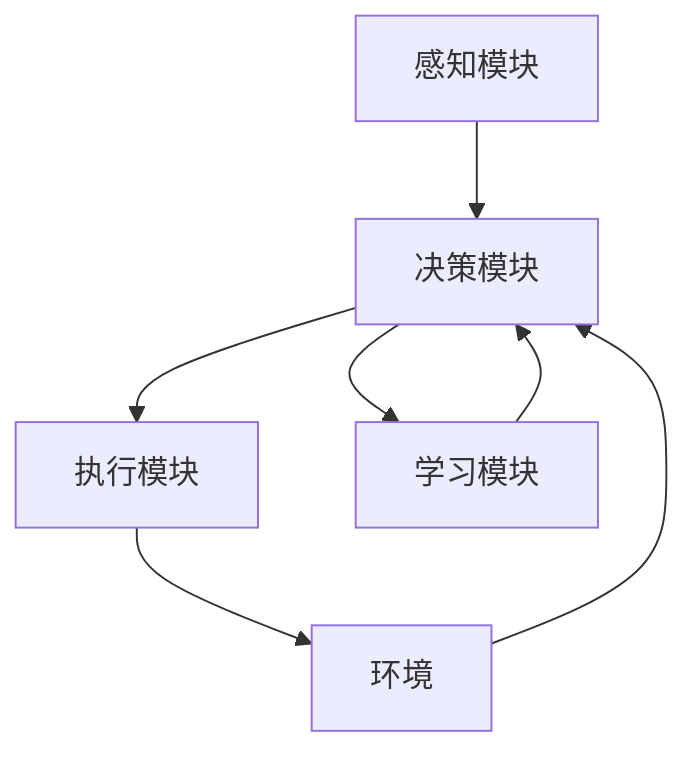

                 


# 《构建具有自主探索与学习能力的AI Agent》

## 关键词：
AI Agent, 自主探索, 强化学习, 深度学习, 机器学习, 自主学习能力, AI系统设计

## 摘要：
本文将深入探讨如何构建一个具有自主探索与学习能力的AI Agent。通过理论与实践相结合的方式，系统地介绍AI Agent的基本概念、自主探索与学习的机制、相关算法原理、系统架构设计以及实际项目实现。文章内容涵盖了从基础概念到高级算法，再到实际应用的各个方面，旨在为读者提供一个全面而深入的指南，帮助他们理解和掌握构建具有自主探索与学习能力的AI Agent所需的知识和技能。

---

## 正文

### 第一部分: AI Agent的基础概念

#### 第1章: AI Agent的基本概念

##### 1.1 AI Agent的定义与特点
- **AI Agent**（人工智能代理）是指能够感知环境并采取行动以实现特定目标的智能实体。
- **特点**：
  - **自主性**：能够在没有外部干预的情况下自主运作。
  - **反应性**：能够根据环境的变化实时调整行为。
  - **目标导向**：所有行为都围绕实现特定目标展开。
  - **学习能力**：能够通过与环境的交互不断优化自身的策略和行为。

##### 1.2 自主探索与学习能力的定义
- **自主探索**：AI Agent在没有明确指导的情况下，通过与环境的交互来发现新知识或解决问题。
- **自主学习**：AI Agent无需外部监督，通过自我探索和经验积累来提升自身能力。
- **自主探索与学习能力的结合**：AI Agent能够在动态和不确定的环境中，通过自我探索和学习不断优化其行为和决策能力。

##### 1.3 自主探索与学习能力的重要性
- **在AI领域的重要性**：自主探索与学习能力使AI Agent能够适应复杂和动态变化的环境，从而在更广泛的场景中应用。
- **在实际应用中的意义**：能够解决传统算法难以应对的复杂问题，如自动驾驶、智能机器人、游戏AI等领域。
- **对未来技术发展的推动作用**：推动AI技术向更智能化、自主化的方向发展。

---

### 第二部分: 自主探索与学习的理论基础

#### 第2章: 强化学习基础

##### 2.1 强化学习的基本概念
- **强化学习**：一种机器学习范式，通过智能体与环境的交互，智能体通过试错方式学习如何采取行动以最大化累积奖励。
- **核心概念**：
  - **状态（State）**：智能体所处的环境情况。
  - **动作（Action）**：智能体在给定状态下采取的行为。
  - **奖励（Reward）**：智能体采取某个动作后获得的反馈，用于评估该动作的好坏。
  - **策略（Policy）**：智能体选择动作的规则，通常表示为策略函数。
  - **价值函数（Value Function）**：评估某状态下采取某个动作后的预期累积奖励。

##### 2.2 策略与价值函数
- **策略（Policy）**：定义了在给定状态下选择动作的概率分布。
  - 确定性策略：$\pi(a|s)$ 表示在状态$s$下选择动作$a$的概率。
  - 随机性策略：$\pi(a|s)$ 表示在状态$s$下选择动作$a$的概率分布。
- **价值函数（Value Function）**：评估某状态下采取某个动作后的预期累积奖励。
  - 状态-动作价值函数：$Q(s, a)$ 表示在状态$s$下采取动作$a$后的预期累积奖励。
  - 状态价值函数：$V(s)$ 表示在状态$s$下采取最优策略后的预期累积奖励。
- **策略与价值函数的关系**：
  - $Q(s, a) = V(s)$ 当且仅当在状态$s$下采取动作$a$时，$a$是最优动作。

##### 2.3 常见的强化学习算法
- **Q-Learning算法**：
  - **算法原理**：
    - 使用Q表（Q-table）记录每个状态-动作对的预期累积奖励。
    - 更新公式：$Q(s, a) = Q(s, a) + \alpha [r + \gamma \max Q(s', a') - Q(s, a)]$
    - 其中，$\alpha$是学习率，$\gamma$是折扣因子。
  - **应用场景**：适用于离散状态和动作空间的环境。
  - **优缺点**：
    - 优点：简单易实现，适合小规模问题。
    - 缺点：依赖于状态和动作的离散化，不适合大规模复杂环境。

- **Deep Q-Networks (DQN) 算法**：
  - **算法原理**：
    - 使用深度神经网络近似Q函数，替代传统的Q表。
    - 使用两个神经网络：主网络和目标网络。
    - 更新公式：$Q_{target}(s', a') = r + \gamma Q_{main}(s', a')$
    - 通过最小化损失函数来更新主网络：$\min \mathbb{E}[(r + \gamma Q_{target}(s', a') - Q_{main}(s, a))^2]$
  - **应用场景**：适用于高维状态和动作空间的环境。
  - **优缺点**：
    - 优点：能够处理高维状态空间，适合大规模复杂环境。
    - 缺点：训练过程复杂，需要处理经验回放和目标网络同步等问题。

- **Policy Gradient方法**：
  - **算法原理**：
    - 直接优化策略，而不是价值函数。
    - 使用概率梯度上升方法，最大化累积奖励的期望。
    - 更新公式：$\theta_{t+1} = \theta_t + \alpha \nabla_\theta \mathbb{E}[R]$
  - **应用场景**：适用于连续动作空间的环境。
  - **优缺点**：
    - 优点：可以直接优化策略，适合连续动作空间。
    - 缺点：训练过程不稳定，容易陷入局部最优。

##### 2.4 强化学习算法的比较
| 算法名称      | 状态空间 | 动作空间 | 是否需要环境模型 | 优缺点                           |
|---------------|----------|----------|-----------------|----------------------------------|
| Q-Learning    | 离散     | 离散     | 不需要           | 简单易实现，适合小规模问题       |
| DQN           | 连续     | 离散     | 不需要           | 能处理高维状态，训练复杂           |
| Policy Gradient| 连续     | 连续     | 不需要           | 直接优化策略，适合连续动作空间    |

---

#### 第3章: 自主学习机制

##### 3.1 自主学习的定义与特点
- **自主学习**：AI Agent无需外部监督，通过与环境的交互，自动生成经验并优化自身的策略和行为。
- **特点**：
  - **无监督性**：无需标注数据，通过经验累积进行学习。
  - **自适应性**：能够根据环境的变化动态调整学习策略。
  - **持续性**：能够不断学习和优化，适应长期任务。

##### 3.2 自主学习的核心机制
- **经验回放（Experience Replay）**：
  - 将经验存储在回放缓冲区（Replay Buffer）中，随机抽取样本进行训练。
  - 目的：打破样本的相关性，加速收敛，提高学习稳定性。
- **策略优化（Policy Optimization）**：
  - 使用强化学习算法优化策略，最大化累积奖励。
  - 包括策略迭代（Policy Iteration）和值迭代（Value Iteration）两种方法。

##### 3.3 自主学习的应用场景
- **游戏AI**：如AlphaGo、OpenAI的Dota 2 AI。
- **机器人控制**：如自动驾驶、工业机器人。
- **智能推荐系统**：如动态推荐用户感兴趣的内容。

##### 3.4 自主学习的挑战
- **环境不确定性**：动态变化的环境可能导致策略失效。
- **计算资源需求**：需要大量计算资源进行训练。
- **安全性和伦理问题**：自主学习可能导致不可预测的行为，引发安全和伦理问题。

---

### 第三部分: 自主探索与学习的系统设计

#### 第4章: 系统分析与架构设计

##### 4.1 系统架构设计
- **系统组成**：
  - **感知模块**：负责感知环境状态，如视觉、听觉等。
  - **决策模块**：负责根据感知到的状态，选择最优动作。
  - **执行模块**：负责执行决策模块选择的动作。
  - **学习模块**：负责根据经验回放和强化学习算法优化策略。

- **系统架构图**（Mermaid图）：



##### 4.2 接口设计
- **输入接口**：接收环境状态和奖励信号。
- **输出接口**：输出动作和优化后的策略。

##### 4.3 交互流程
- **初始化**：设定目标和初始状态。
- **循环执行**：
  1. 感知环境状态。
  2. 根据当前状态选择动作。
  3. 执行动作并观察新的状态和奖励。
  4. 将经验存储到回放缓冲区。
  5. 从回放缓冲区随机抽取样本进行训练，优化策略。

##### 4.4 系统优化
- **经验回放优化**：通过经验回放加速学习。
- **网络架构优化**：使用更深的网络结构提高学习能力。
- **奖励机制优化**：设计合理的奖励函数，引导学习方向。

---

#### 第5章: 项目实战

##### 5.1 项目介绍
- **项目目标**：构建一个能够在迷宫中自主探索并找到出口的AI Agent。
- **项目环境**：二维迷宫，状态为位置坐标，动作包括上下左右移动。
- **项目工具**：Python、TensorFlow、OpenAI Gym。

##### 5.2 核心代码实现
- **环境定义**（使用OpenAI Gym）：
  ```python
  import gym
  env = gym.make('CustomMaze-v0')  # 假设自定义迷宫环境
  ```

- **Q-Learning算法实现**：
  ```python
  class QLearning:
      def __init__(self, state_space, action_space):
          self.state_space = state_space
          self.action_space = action_space
          self.Q = np.zeros((state_space, action_space))
      
      def choose_action(self, state, epsilon=0.1):
          if np.random.random() < epsilon:
              return np.random.randint(self.action_space)
          return np.argmax(self.Q[state])
      
      def update_Q(self, current_state, action, reward, next_state, alpha=0.1, gamma=0.9):
          self.Q[current_state, action] += alpha * (reward + gamma * np.max(self.Q[next_state]) - self.Q[current_state, action])
  ```

- **DQN算法实现**：
  ```python
  import tensorflow as tf
  import numpy as np

  class DQN:
      def __init__(self, state_size, action_size, learning_rate=0.001, gamma=0.99):
          self.state_size = state_size
          self.action_size = action_size
          self.learning_rate = learning_rate
          self.gamma = gamma
          
          self.model = self.build_model()
          self.target_model = self.build_model()
          self.target_update()
      
      def build_model(self):
          model = tf.keras.Sequential([
              tf.keras.layers.Dense(64, activation='relu', input_shape=(self.state_size,)),
              tf.keras.layers.Dense(64, activation='relu'),
              tf.keras.layers.Dense(self.action_size, activation='linear')
          ])
          model.compile(optimizer=tf.keras.optimizers.Adam(self.learning_rate), loss='mse')
          return model
      
      def target_update(self):
          self.target_model.set_weights(self.model.get_weights())
      
      def remember(self, state, action, reward, next_state):
          # 假设有一个经验回放缓冲区
          self.memory.append((state, action, reward, next_state))
      
      def replay(self, batch_size=64):
          if len(self.memory) < batch_size:
              return
          mini_batch = random.sample(self.memory, batch_size)
          states = np.array([t[0] for t in mini_batch])
          actions = np.array([t[1] for t in mini_batch])
          rewards = np.array([t[2] for t in mini_batch])
          next_states = np.array([t[3] for t in mini_batch])
          
          targets = self.model.predict(states)
          next_q_values = self.target_model.predict(next_states)
          targets[:, actions] = rewards + self.gamma * np.max(next_q_values, axis=1)
          
          self.model.fit(states, targets, epochs=1, verbose=0)
  ```

##### 5.3 案例分析与详细解读
- **训练过程**：
  - 初始化Q-Learning或DQN算法。
  - 在迷宫环境中进行多次训练，逐步优化策略。
  - 监控累积奖励的变化，评估学习效果。
- **结果分析**：
  - Q-Learning在小规模迷宫中表现良好。
  - DQN在大规模迷宫中表现更优，能够处理高维状态空间。

##### 5.4 项目小结
- **项目总结**：通过实现Q-Learning和DQN算法，验证了自主探索与学习能力在迷宫问题中的有效性。
- **经验与教训**：Q-Learning适合小规模问题，而DQN更适合大规模和复杂环境。
- **改进建议**：未来可以尝试结合多种算法，如结合Q-Learning和DQN的优点，设计更高效的算法。

---

### 第四部分: 最佳实践与总结

#### 第6章: 最佳实践

##### 6.1 算法选择与优化
- 根据问题规模和环境类型选择合适的算法。
- 在复杂环境中优先选择DQN等深度强化学习算法。
- 在简单环境中优先选择Q-Learning等传统强化学习算法。

##### 6.2 系统设计与实现
- 确保系统架构清晰，模块化设计便于维护和扩展。
- 使用经验回放和目标网络等技术优化训练过程。
- 定期监控和调整学习率、折扣因子等超参数。

##### 6.3 安全性和伦理考虑
- 设计合理的奖励机制，避免引导AI Agent进入不安全或伦理上不可接受的行为。
- 定期评估AI Agent的行为，确保其符合预期目标和伦理规范。

#### 第7章: 总结与展望

##### 7.1 本文总结
- 本文系统地介绍了AI Agent的基本概念、自主探索与学习的理论基础、算法原理、系统设计以及实际项目实现。
- 通过具体案例分析，验证了不同算法在实际应用中的表现和适用性。

##### 7.2 对未来工作的展望
- 结合多模态感知技术，提升AI Agent的感知能力。
- 研究更高效的强化学习算法，优化训练过程。
- 探索AI Agent在更多领域的应用，如医疗、教育、金融等。

---

## 结语

通过本文的详细讲解，读者可以全面了解如何构建具有自主探索与学习能力的AI Agent。从基础理论到算法实现，再到系统设计和项目实战，文章为读者提供了从理论到实践的完整指南。希望本文能够帮助读者在AI Agent领域取得更大的突破和成功。

