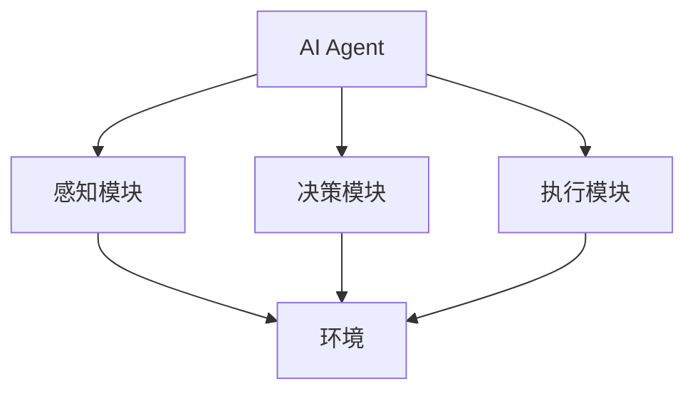
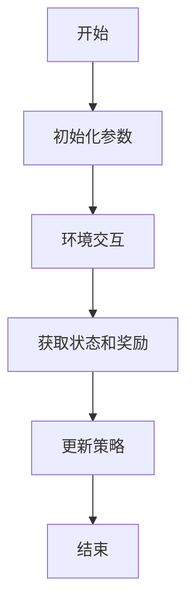
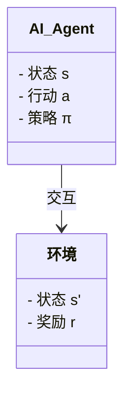
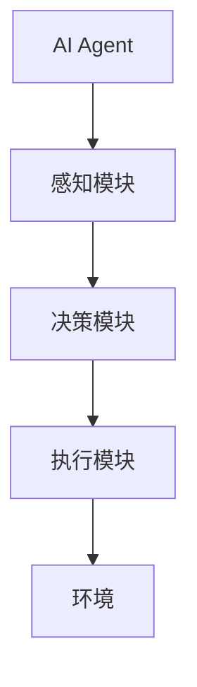
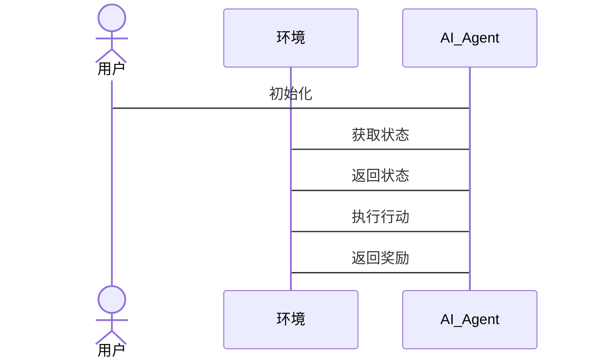

                 


```markdown
# 构建具有自主探索能力的AI Agent

> 关键词：AI Agent, 自主探索, 强化学习, 环境交互, 系统架构, 项目实战

> 摘要：本文详细讲解了如何构建具有自主探索能力的AI Agent，涵盖从核心概念到系统架构的完整流程。通过理论与实践结合，帮助读者掌握AI Agent的设计与实现，包括算法原理、系统架构设计、项目实战等。

---

# 第一部分: 自主探索AI Agent的背景与核心概念

# 第1章: 自主探索AI Agent概述

## 1.1 AI Agent的基本概念
### 1.1.1 AI Agent的定义与分类
AI Agent是一种智能体，能够感知环境并采取行动以实现目标。根据智能性，可分为简单反应型、基于模型的反应型、目标驱动型和效用驱动型。

### 1.1.2 自主探索能力的核心特征
自主探索是指AI Agent能够在未知或动态环境中主动学习和适应，具备自我改进和决策能力。

### 1.1.3 自主探索与传统AI的区别
传统AI依赖于预设规则，而自主探索AI能够动态调整策略，适应变化。

## 1.2 自主探索的背景与意义
### 1.2.1 自主探索的背景介绍
随着环境复杂化，传统AI难以应对动态变化，自主探索成为必要。

### 1.2.2 自主探索在AI Agent中的重要性
提升AI Agent的适应性和智能性，使其在复杂环境中表现更佳。

### 1.2.3 自主探索的实际应用场景
应用于机器人、自动驾驶、游戏AI、智能推荐等领域。

## 1.3 问题背景与目标
### 1.3.1 问题背景分析
动态环境中，AI Agent需要自主学习和调整策略。

### 1.3.2 自主探索的目标设定
实现AI Agent的自我改进和动态适应能力。

### 1.3.3 自主探索的边界与外延
明确自主探索的范围和与相关概念的区分。

## 1.4 核心概念与联系
### 1.4.1 核心概念原理
自主探索依赖于感知、决策和执行模块的协同工作。

### 1.4.2 核心概念属性特征对比表格
| 概念       | 描述                       |
|------------|---------------------------|
| 感知模块   | 处理环境输入               |
| 决策模块   | 选择最优行动               |
| 执行模块   | 执行决策并反馈结果         |

### 1.4.3 ER实体关系图架构（Mermaid流程图）


---

# 第2章: 自主探索AI Agent的核心算法原理

## 2.1 算法原理概述
### 2.1.1 算法核心思想
通过与环境交互，学习最优策略。

### 2.1.2 算法实现步骤
1. 初始化参数
2. 与环境交互，获取状态和奖励
3. 更新策略
4. 重复步骤2-3

### 2.1.3 算法优缺点分析
优点：适应性强；缺点：计算量大，可能陷入局部最优。

## 2.2 算法流程图（Mermaid）


## 2.3 算法数学模型与公式
### 2.3.1 算法数学模型
$$ V(s) = \max_a Q(s,a) $$

### 2.3.2 算法公式推导
$$ Q(s,a) = r + \gamma \max_{a'} Q(s',a') $$

## 2.4 算法实现代码示例
```python
def explore_action():
    if random.random() < epsilon:
        return random_action()
    else:
        return
```

---

# 第3章: 自主探索AI Agent的系统架构设计

## 3.1 问题场景介绍
动态环境中的任务，如机器人导航、游戏AI。

## 3.2 项目介绍
### 3.2.1 项目背景
开发一个能在未知环境中自主导航的AI Agent。

### 3.2.2 系统功能设计
- 感知环境
- 决策行动
- 执行操作

### 3.2.3 领域模型（Mermaid类图）


### 3.2.4 系统架构设计（Mermaid架构图）


### 3.2.5 系统接口设计
- 接收环境状态
- 返回行动指令

### 3.2.6 系统交互（Mermaid序列图）


---

# 第4章: 自主探索AI Agent的项目实战

## 4.1 环境安装与配置
### 4.1.1 安装Python和依赖库
```bash
pip install numpy matplotlib
```

## 4.2 系统核心实现
### 4.2.1 核心代码实现
```python
class AI_Agent:
    def __init__(self):
        self.epsilon = 0.1
        self.Q = defaultdict(int)

    def explore_action(self, state):
        if random.random() < self.epsilon:
            return random.choice(actions)
        else:
            return self.exploit_action(state)

    def exploit_action(self, state):
        return max(actions, key=lambda a: self.Q[(state, a)])

    def update_Q(self, state, action, reward, next_state):
        self.Q[(state, action)] = reward + self.gamma * max(self.Q[(next_state, a)] for a in actions)
```

### 4.2.2 代码应用解读与分析
- `explore_action`：平衡探索与利用。
- `update_Q`：更新Q值，基于当前奖励和未来期望奖励。

## 4.3 实际案例分析
### 4.3.1 案例场景
迷宫导航问题，AI Agent学习路径选择。

### 4.3.2 案例分析与详细讲解
AI Agent通过不断探索和利用，找到最优路径。

## 4.4 项目小结
成功实现自主探索AI Agent，验证算法的有效性。

---

# 第5章: 最佳实践

## 5.1 小结
自主探索AI Agent的核心在于算法与系统架构的结合。

## 5.2 注意事项
- 确保环境交互的实时性
- 避免陷入局部最优
- 处理动态环境变化

## 5.3 拓展阅读
推荐相关书籍和论文，深入学习AI Agent和强化学习。

---

# 附录: 总结

通过本文，读者可以全面了解如何构建具有自主探索能力的AI Agent，从理论到实践，掌握核心算法和系统架构设计。

---

# 结束语

感谢您的阅读，希望本文对您有所帮助，欢迎留言交流。
```

