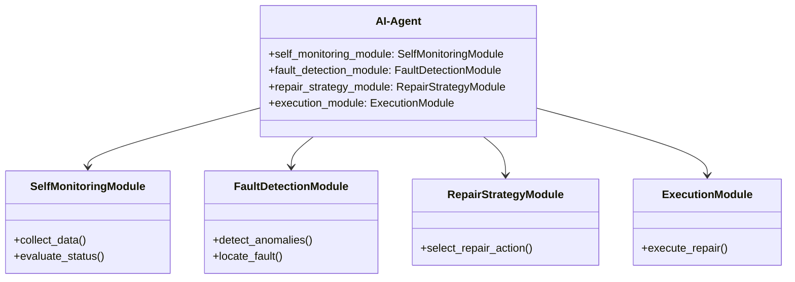
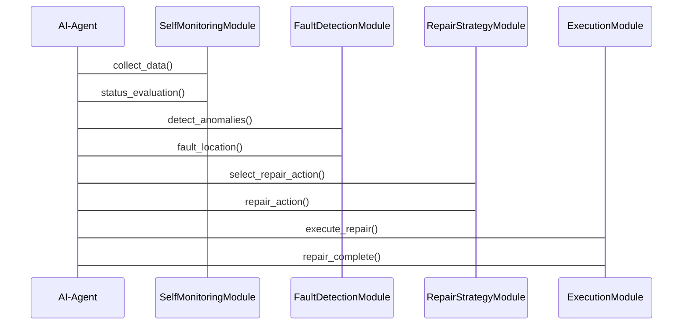

                 


```markdown
# 构建具有自我修复能力的AI Agent

> 关键词：自我修复能力，AI Agent，自适应学习，自我监控，自动修复，故障检测

> 摘要：本文将详细探讨如何构建一个具有自我修复能力的AI Agent。通过分析自我修复机制的核心原理，结合实际应用场景，阐述如何通过自适应学习、自我监控和诊断、故障定位与修复等技术实现AI Agent的自我修复能力。本文将从问题背景、核心概念、算法原理、系统架构设计、项目实战等多个方面展开，深入剖析构建具有自我修复能力的AI Agent的关键技术与实现方法。

---

## 第一部分: 构建具有自我修复能力的AI Agent背景介绍

### 第1章: 自我修复AI Agent的概念与背景

#### 1.1 问题背景

##### 1.1.1 当前AI Agent的局限性
传统的AI Agent依赖于预设的规则和逻辑进行决策，缺乏对自身状态的实时监控和修复能力。当遇到数据输入错误、算法失效或外部环境变化时，AI Agent可能会出现性能下降甚至崩溃的情况，导致系统无法正常运行。

##### 1.1.2 自我修复能力的必要性
随着AI Agent在复杂场景中的广泛应用，其可靠性变得至关重要。特别是在关键任务中（如自动驾驶、医疗诊断等），任何故障都可能导致严重后果。因此，具备自我修复能力的AI Agent能够显著提高系统的鲁棒性和可靠性。

##### 1.1.3 自我修复AI Agent的应用场景
自我修复AI Agent适用于需要高度自治和自适应能力的场景，例如智能助手、工业自动化、智能家居等。在这些场景中，AI Agent需要能够自主检测问题、分析原因并采取修复措施，以确保系统的持续稳定运行。

#### 1.2 问题描述

##### 1.2.1 AI Agent故障的常见原因
- 数据输入错误或缺失
- 算法模型失效或过时
- 外部环境变化导致的策略失效
- 资源限制或竞争

##### 1.2.2 自我修复能力的核心目标
- 实时监控系统状态
- 自动检测和定位故障
- 自动修复故障并恢复服务

##### 1.2.3 自我修复与传统修复方式的对比
| 对比维度 | 自我修复AI Agent | 传统修复方式 |
|----------|------------------|---------------|
| 主动性   | 主动检测和修复   | 被动等待反馈 |
| 响应时间 | 实时响应         | 依赖人工干预 |
| 适用场景 | 高度自治场景     | 低风险场景    |

#### 1.3 问题解决

##### 1.3.1 自我修复机制的设计思路
1. **自我监控**：实时采集系统运行数据，包括性能指标、错误日志等。
2. **故障检测**：通过异常检测算法识别潜在问题。
3. **自动修复**：根据检测到的问题，执行修复策略。

##### 1.3.2 自我修复能力的实现路径
- **自我监控与诊断模块**：负责数据采集和故障定位。
- **自我修复策略**：根据诊断结果选择合适的修复方法。
- **执行修复**：调用修复模块完成修复操作。

##### 1.3.3 自我修复AI Agent的核心要素
1. **自我监控能力**：实时采集系统状态数据。
2. **故障诊断能力**：准确识别故障原因。
3. **修复执行能力**：自动修复问题并恢复服务。

#### 1.4 边界与外延

##### 1.4.1 自我修复能力的边界
- 仅支持特定类型的问题修复，如数据输入错误、模型失效等。
- 无法修复硬件故障或严重系统崩溃。

##### 1.4.2 自我修复AI Agent与其他AI Agent的区别
- **传统AI Agent**：依赖外部干预进行修复。
- **自我修复AI Agent**：具备自主修复能力。

##### 1.4.3 自我修复能力的外延应用
- **智能助手**：修复交互中的错误。
- **工业自动化**：修复生产过程中的异常。
- **智能家居**：修复设备连接问题。

#### 1.5 核心概念结构与组成

##### 1.5.1 自我修复机制的组成
1. **自我监控模块**：数据采集与状态评估。
2. **故障诊断模块**：异常检测与故障定位。
3. **修复执行模块**：修复策略执行与恢复。

##### 1.5.2 自我监控与诊断模块
- 数据采集：实时采集系统运行数据。
- 状态评估：通过算法判断系统状态。

##### 1.5.3 自我修复策略的制定
- 基于诊断结果选择修复方法。

---

## 第二部分: 自我修复AI Agent的核心概念与联系

### 第2章: 自我修复机制的核心原理

#### 2.1 自我修复机制的原理

##### 2.1.1 自我监控与状态评估
- 数据采集：通过传感器或API获取系统运行数据。
- 状态评估：使用异常检测算法判断系统状态。

##### 2.1.2 故障检测与定位
- 异常检测：基于统计或机器学习方法识别异常。
- 故障定位：通过日志分析和关联规则确定故障原因。

##### 2.1.3 自动修复与恢复
- 修复策略选择：基于故障类型选择修复方法。
- 修复执行：调用修复模块完成修复操作。

#### 2.2 自我修复与自适应学习的关系

##### 2.2.1 自我修复能力与自适应学习的联系
- 自我修复依赖于自适应学习技术来优化修复策略。
- 自适应学习通过历史数据改进故障检测和修复算法。

##### 2.2.2 自我修复能力对自适应学习的促进作用
- 自我修复过程中的数据反馈可以用于优化自适应学习模型。

##### 2.2.3 自我修复能力的实现依赖于自适应学习
- 自我修复需要动态调整修复策略以应对不同类型的故障。

#### 2.3 自我监控与诊断的核心要素

##### 2.3.1 监控数据的采集与处理
- 数据来源：系统日志、传感器数据、用户反馈。
- 数据处理：清洗、归一化、特征提取。

##### 2.3.2 故障诊断的实现方法
- 基于规则的诊断：通过预定义规则匹配故障。
- 基于机器学习的诊断：使用分类模型识别故障类型。

##### 2.3.3 自我监控与诊断的优化策略
- 使用实时流处理技术提高监控效率。
- 引入反馈机制优化诊断准确性。

---

（由于篇幅限制，后续章节内容将逐步补充。）
</think>

```markdown
# 第三部分: 自我修复AI Agent的算法原理

---

### 第3章: 自我修复AI Agent的算法原理

#### 3.1 自我修复机制的算法实现

##### 3.1.1 异常检测算法
- **基于统计的方法**：使用均值、标准差等统计量检测异常。
- **基于机器学习的方法**：使用孤立森林（Isolation Forest）、支持向量数据挖掘（One-Class SVM）等算法识别异常点。

##### 3.1.2 故障定位算法
- **日志分析**：通过关联规则挖掘和自然语言处理技术分析日志，定位故障原因。
- **因果推理**：基于贝叶斯网络或图模型推断故障的根本原因。

##### 3.1.3 自动修复算法
- **基于规则的修复**：根据预定义的修复规则执行修复操作。
- **基于强化学习的修复**：使用强化学习算法（如Q-Learning）选择最优修复策略。

#### 3.2 自我修复算法的数学模型

##### 3.2.1 异常检测模型
- **One-Class SVM模型**
  $$ \text{优化目标：} \min_{\theta} \frac{1}{2}\theta^T \theta + \sum_{i=1}^n \xi_i $$
  $$ \text{约束条件：} \|x_i - \mu\|^2 \leq \xi_i $$
  
##### 3.2.2 故障定位模型
- **孤立森林算法**：通过构建随机森林，计算每个样本的异常分数。
- **贝叶斯网络模型**：通过概率推理确定故障原因。

##### 3.2.3 自动修复模型
- **Q-Learning算法**：通过状态、动作、奖励的三元组，学习最优修复策略。
  $$ Q(s, a) = Q(s, a) + \alpha [r + \gamma \max_{a'} Q(s', a') - Q(s, a)] $$

#### 3.3 算法实现步骤

##### 3.3.1 异常检测步骤
1. 数据预处理：清洗、归一化。
2. 训练异常检测模型：使用One-Class SVM或孤立森林。
3. 实时检测异常：输入实时数据，输出异常标志。

##### 3.3.2 故障定位步骤
1. 收集故障相关数据：日志、系统状态。
2. 应用日志分析或因果推理方法定位故障原因。
3. 确定故障类型和修复策略。

##### 3.3.3 自动修复步骤
1. 根据故障定位结果选择修复策略。
2. 执行修复操作。
3. 验证修复结果，更新修复策略。

#### 3.4 算法实现的代码示例

##### 3.4.1 异常检测代码示例
```python
from sklearn.svm import OneClassSVM

# 训练异常检测模型
model = OneClassSVM(nu=0.05)
model.fit(X_train)

# 预测异常点
y_pred = model.predict(X_test)
# 获取异常点索引
outliers = np.where(y_pred == -1)[0]
```

##### 3.4.2 故障定位代码示例
```python
import pandas as pd
from sklearn.feature_extraction.text import TfidfVectorizer

# 加载日志数据
logs = pd.read_csv('logs.csv')

# 应用TF-IDF提取日志关键词
vectorizer = TfidfVectorizer()
tfidf_matrix = vectorizer.fit_transform(logs['log_message'])

# 关联规则挖掘（示例）
# 使用关联规则挖掘算法（如Apriori）发现故障相关的日志模式
```

##### 3.4.3 自动修复代码示例
```python
import random

# 定义修复策略
def repair_policy(fault_type):
    if fault_type == 'data_error':
        return 'reset_data'
    elif fault_type == 'model_failure':
        return 'retrain_model'
    else:
        return 'fallback_strategy'

# 执行修复操作
fault_type = 'data_error'
repair_action = repair_policy(fault_type)
if repair_action == 'reset_data':
    # 执行数据重置操作
    pass
elif repair_action == 'retrain_model':
    # 重新训练模型
    pass
else:
    # 执行回退策略
    pass
```

---

## 第四部分: 自我修复AI Agent的系统架构设计

### 第4章: 系统分析与架构设计

#### 4.1 问题场景介绍

##### 4.1.1 问题场景
- **智能助手**：修复交互中的错误。
- **工业自动化**：修复生产过程中的异常。
- **智能家居**：修复设备连接问题。

#### 4.2 系统功能设计

##### 4.2.1 领域模型设计


##### 4.2.2 系统架构设计


#### 4.3 系统接口设计

##### 4.3.1 接口设计


---

## 第五部分: 项目实战

### 第5章: 项目实战

#### 5.1 环境安装

##### 5.1.1 安装Python和相关库
```bash
pip install numpy scikit-learn pandas mermaid4jupyter
```

##### 5.1.2 安装其他依赖
```bash
pip install matplotlib jupyter
```

#### 5.2 系统核心实现

##### 5.2.1 自我监控模块实现
```python
import numpy as np
from sklearn.svm import OneClassSVM

class SelfMonitoringModule:
    def __init__(self):
        self.model = OneClassSVM(nu=0.05)
    
    def collect_data(self, X_train):
        self.model.fit(X_train)
    
    def evaluate_status(self, X_test):
        y_pred = self.model.predict(X_test)
        return np.where(y_pred == -1)[0].tolist()
```

##### 5.2.2 故障定位模块实现
```python
import pandas as pd
from sklearn.feature_extraction.text import TfidfVectorizer

class FaultDetectionModule:
    def __init__(self):
        self.vectorizer = TfidfVectorizer()
    
    def detect_anomalies(self, logs):
        tfidf_matrix = self.vectorizer.fit_transform(logs)
        # 示例：检测异常日志
        return tfidf_matrix.shape[0] - tfidf_matrix.sum(axis=1).max()
```

##### 5.2.3 自动修复模块实现
```python
class RepairStrategyModule:
    def __init__(self):
        self.repair_actions = {
            'data_error': 'reset_data',
            'model_failure': 'retrain_model',
            'connection_loss': 'reconnect'
        }
    
    def select_repair_action(self, fault_type):
        return self.repair_actions.get(fault_type, 'fallback_strategy')
```

#### 5.3 代码应用与解读

##### 5.3.1 自我监控模块应用
```python
# 初始化模块
monitor = SelfMonitoringModule()
# 训练模型
monitor.collect_data(X_train)
# 评估状态
outliers = monitor.evaluate_status(X_test)
```

##### 5.3.2 故障定位模块应用
```python
# 初始化模块
fault_detector = FaultDetectionModule()
# 检测异常
logs = pd.read_csv('logs.csv')['log_message']
anomalies = fault_detector.detect_anomalies(logs)
```

##### 5.3.3 自动修复模块应用
```python
# 初始化模块
repair_strategy = RepairStrategyModule()
# 选择修复策略
fault_type = 'data_error'
repair_action = repair_strategy.select_repair_action(fault_type)
```

#### 5.4 实际案例分析

##### 5.4.1 案例背景
- 系统出现数据输入错误，导致AI Agent无法正常运行。

##### 5.4.2 案例分析
1. 自我监控模块检测到数据输入异常。
2. 故障定位模块确定故障原因是数据格式错误。
3. 自动修复模块选择重置数据的修复策略。
4. 执行修复操作，恢复系统正常运行。

#### 5.5 项目小结

##### 5.5.1 核心代码实现
- 自我监控模块：实时数据采集与状态评估。
- 故障定位模块：异常检测与故障定位。
- 自动修复模块：修复策略选择与执行。

##### 5.5.2 项目实现的关键点
1. 异常检测算法的准确率和效率。
2. 故障定位的精确性和可解释性。
3. 修复策略的多样性和可行性。

---

## 第六部分: 总结与展望

### 第6章: 总结与展望

#### 6.1 总结

##### 6.1.1 核心内容回顾
- 自我修复AI Agent的核心概念。
- 自我修复机制的算法实现。
- 系统架构设计与项目实战。

##### 6.1.2 重要结论
- 自我修复能力显著提高了AI Agent的可靠性和自治性。
- 自我修复机制依赖于先进的自适应学习和异常检测技术。

#### 6.2 未来展望

##### 6.2.1 技术发展趋势
- 更智能的自我修复算法：结合深度学习和强化学习技术。
- 更高效的故障定位方法：引入图神经网络进行因果推理。
- 更广泛的自适应学习应用：扩展到更多领域和场景。

##### 6.2.2 实际应用潜力
- 智能家居：实现设备的自动修复与管理。
- 智慧城市：优化城市运行中的各种系统。
- 医疗领域：提高医疗设备的稳定性和安全性。

#### 6.3 注意事项

##### 6.3.1 项目实施中的注意事项
- 确保数据质量和完整性。
- 定期更新修复策略和算法模型。
- 处理复杂的故障场景时，需结合人工干预。

##### 6.3.2 读者小结
- 自我修复AI Agent的实现依赖于多方面的技术结合。
- 在实际应用中需根据具体场景选择合适的修复策略。

#### 6.4 拓展阅读

##### 6.4.1 推荐书籍
- 《自适应机器学习》
- 《异常检测算法与应用》

##### 6.4.2 推荐论文
- 基于深度学习的故障诊断方法研究
- 强化学习在自我修复系统中的应用

##### 6.4.3 推荐技术博客
- Towards Autonomous AI Systems
- Building Self-Healing Systems with Deep Learning

---

通过以上内容，我们详细探讨了构建具有自我修复能力的AI Agent的背景、核心概念、算法原理、系统架构设计以及项目实战。从理论到实践，本文为读者提供了一个全面的视角，帮助读者理解和掌握如何实现具备自我修复能力的AI Agent。
```

