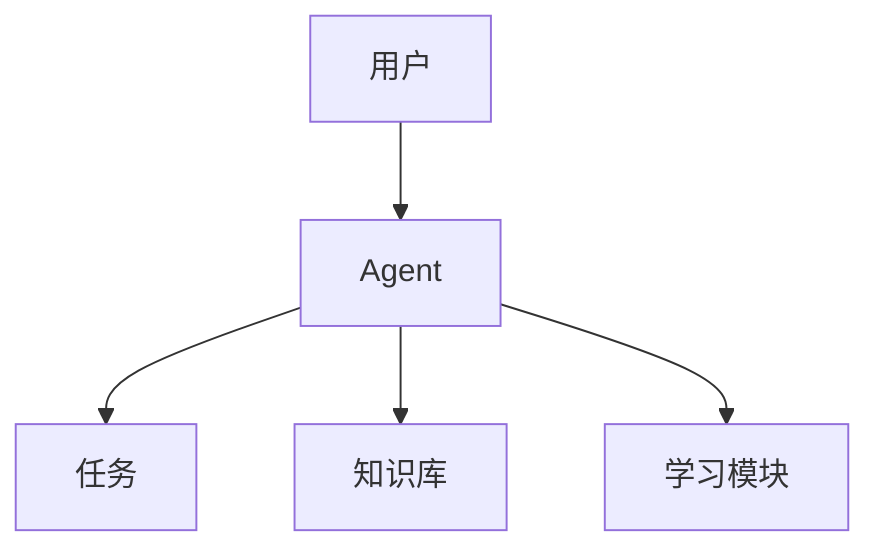
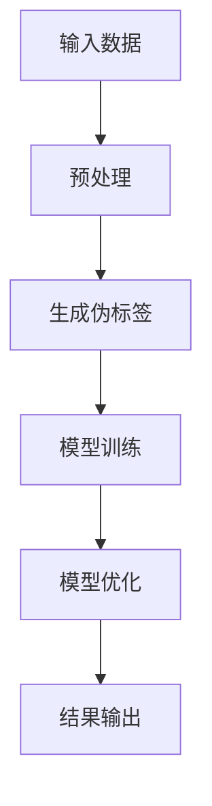
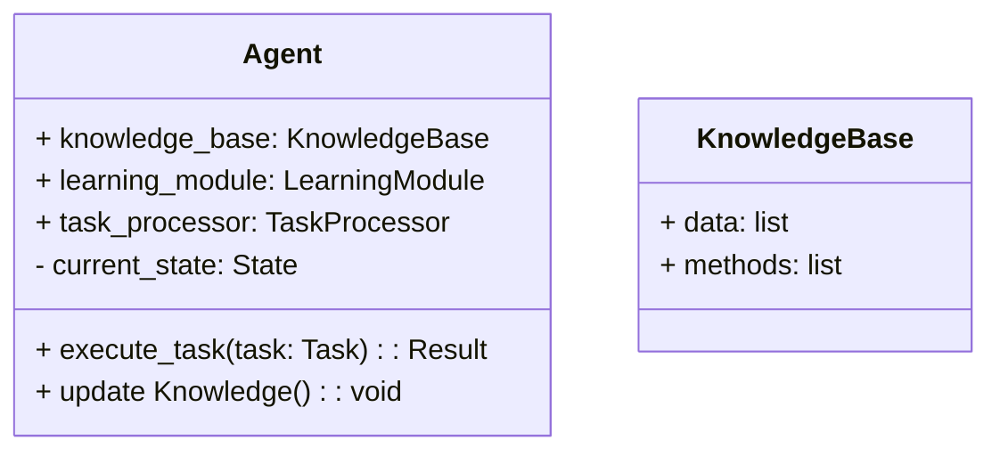
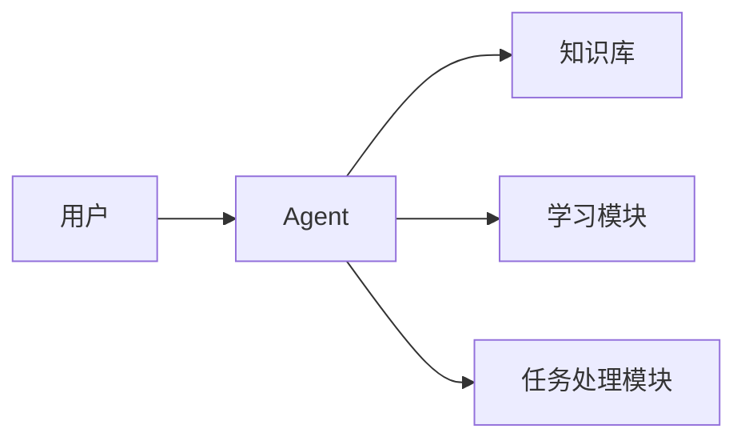
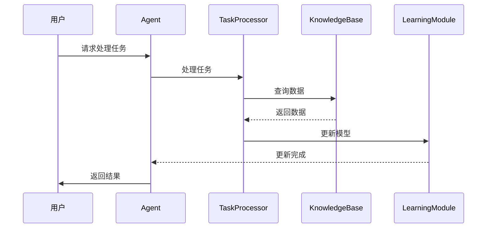

                 


# 构建具有自我学习能力的AI Agent

## 关键词
- AI Agent
- 自我学习
- 人工智能
- 自适应系统
- 机器学习

## 摘要
随着人工智能技术的快速发展，构建具有自我学习能力的AI Agent已成为实现智能系统的重要方向。本文从基础概念出发，详细探讨了自我学习AI Agent的核心原理、算法实现、系统架构以及实际应用案例。通过分析自我监督学习和增量学习的算法流程，结合Mermaid图和Python代码示例，本文为读者提供了全面的技术指导。最后，文章总结了构建过程中的注意事项和未来的发展方向，帮助读者更好地理解和应用这一技术。

---

## 目录大纲

### 第一部分：构建具有自我学习能力的AI Agent概述

#### 第1章：自我学习AI Agent的背景与概念

##### 1.1 问题背景与描述
- 1.1.1 当前AI Agent的发展现状
- 1.1.2 自我学习能力的必要性
- 1.1.3 问题解决的核心目标

##### 1.2 自我学习AI Agent的定义与特点
- 1.2.1 核心概念的定义
- 1.2.2 自我学习能力的特征对比
- 1.2.3 与其他AI Agent的主要区别

##### 1.3 自我学习AI Agent的边界与外延
- 1.3.1 能力边界分析
- 1.3.2 外延范围的界定
- 1.3.3 相关概念的对比

##### 1.4 自我学习AI Agent的概念结构与核心要素
- 1.4.1 概念结构图
- 1.4.2 核心要素的组成
- 1.4.3 各要素之间的关系

#### 第2章：自我学习AI Agent的核心概念与联系

##### 2.1 自我学习机制的原理
- 2.1.1 自我监督学习的定义
- 2.1.2 增量学习的核心流程
- 2.1.3 知识表示的学习方法

##### 2.2 自我学习模型的属性特征对比
- 2.2.1 不同模型的特征对比表
- 2.2.2 模型性能的评估指标
- 2.2.3 模型适用场景的分析

##### 2.3 自我学习AI Agent的ER实体关系图


#### 第3章：自我学习AI Agent的算法原理

##### 3.1 自我监督学习算法的流程


##### 3.2 增量学习算法的实现
```python
def incremental_learning(model, new_data):
    # 数据预处理
    preprocessed_data = preprocess(new_data)
    # 生成伪标签
    pseudo_labels = generate_pseudo_labels(model, preprocessed_data)
    # 更新模型
    model.train(preprocessed_data, pseudo_labels)
    return model
```

##### 3.3 算法的数学模型与公式
- 损失函数：
  $$ L = \frac{1}{n}\sum_{i=1}^{n} (y_i - \hat{y_i})^2 $$
- 优化目标：
  $$ \min_{\theta} \sum_{i=1}^{n} L_i $$

---

## 第二部分：系统分析与架构设计

#### 第4章：系统分析与架构设计方案

##### 4.1 问题场景介绍
- 描述AI Agent在实际应用中的典型场景
- 分析自我学习能力在这些场景中的作用

##### 4.2 系统功能设计
- 领域模型类图


##### 4.3 系统架构设计
- 系统架构图


##### 4.4 系统接口设计
- 主要接口列表
- 接口交互流程

##### 4.5 系统交互序列图


---

## 第三部分：项目实战

#### 第5章：项目实战

##### 5.1 环境安装与配置
- 安装必要的依赖库
- 配置开发环境

##### 5.2 核心代码实现
- 代码实现示例
```python
class Agent:
    def __init__(self, knowledge_base, learning_module):
        self.knowledge_base = knowledge_base
        self.learning_module = learning_module
        self.current_state = State()
    
    def execute_task(self, task):
        # 获取相关知识
        knowledge = self.knowledge_base.get_knowledge(task)
        # 更新模型
        self.learning_module.update_model(knowledge)
        # 处理任务
        result = self.task_processor.process_task(task)
        return result
```

##### 5.3 案例分析与解读
- 具体案例分析
- 代码实现的详细解读

##### 5.4 项目小结
- 项目总结
- 经验与教训

---

## 第四部分：最佳实践与总结

#### 第6章：最佳实践与总结

##### 6.1 最佳实践
- 开发过程中的注意事项
- 常见问题及解决方案

##### 6.2 小结
- 本章内容的总结
- 对未来发展的展望

##### 6.3 注意事项
- 关键问题提醒
- 开发中的常见误区

##### 6.4 拓展阅读
- 推荐阅读的书籍和资源

---

## 结语

通过以上详细的内容结构，本文系统地探讨了构建具有自我学习能力的AI Agent的各个方面，从理论到实践，从算法到架构，为读者提供了全面的指导和深入的分析。希望这篇文章能够帮助读者更好地理解和应用这一技术。

