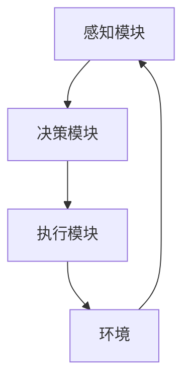
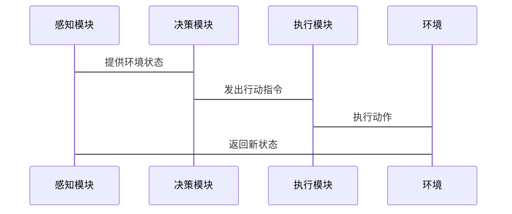

                 


# 构建具有自我演化能力的AI Agent系统

> 关键词：AI Agent, 自我演化, 强化学习, 系统架构, 项目实战

> 摘要：本文详细探讨了构建具有自我演化能力的AI Agent系统的各个方面，从核心概念到算法原理，从系统架构设计到项目实战，再到最佳实践，为读者提供了一套完整的构建指南。文章结合理论与实践，通过丰富的图表和代码示例，深入剖析了如何实现一个能够自我适应和优化的AI Agent系统。

---

## 第1章: 背景介绍与核心概念

### 1.1 AI Agent的基本概念

#### 1.1.1 AI Agent的定义
AI Agent（智能体）是指能够感知环境并采取行动以实现目标的实体。它可以是一个软件程序、机器人或其他智能系统。

#### 1.1.2 自我演化能力的定义
自我演化能力是指AI Agent能够通过与环境的交互，自动调整自身的行为策略、知识库和系统架构，以适应变化的环境和任务需求。

#### 1.1.3 AI Agent的核心特点
- **自主性**：能够独立决策和行动。
- **反应性**：能够实时感知环境并做出反应。
- **目标导向**：行动以实现特定目标为导向。
- **自我适应性**：能够通过学习和优化提升自身能力。

---

### 1.2 自我演化AI Agent的背景与意义

#### 1.2.1 当前AI Agent的发展现状
AI Agent技术近年来发展迅速，广泛应用于自动驾驶、智能助手、机器人控制等领域。然而，传统AI Agent在面对复杂动态环境时，往往缺乏灵活性和适应性。

#### 1.2.2 自我演化能力的重要性
- **提升系统鲁棒性**：能够更好地应对不确定性。
- **增强适应性**：能够根据环境变化自动调整策略。
- **降低人工干预需求**：减少对人类的依赖，提升系统自主性。

#### 1.2.3 自我演化AI Agent的应用场景
- **自动驾驶**：实时调整驾驶策略以应对复杂交通情况。
- **智能助手**：根据用户行为动态优化服务。
- **机器人控制**：在复杂环境中自主学习和适应。

---

## 第2章: 自我演化AI Agent的核心概念

### 2.1 自我演化AI Agent的体系结构

#### 2.1.1 感知模块
- **功能**：通过传感器或数据输入感知环境状态。
- **实现**：包括视觉、听觉、触觉等多种感知方式。
- **示例**：自动驾驶汽车通过摄像头和雷达感知交通状况。

#### 2.1.2 决策模块
- **功能**：基于感知信息制定行动策略。
- **实现**：结合强化学习和监督学习算法。
- **示例**：智能助手根据用户需求推荐相关内容。

#### 2.1.3 执行模块
- **功能**：将决策转化为具体行动。
- **实现**：通过执行器或输出接口实现。
- **示例**：机器人根据决策模块的指令执行动作。

### 2.2 自我演化机制的实现原理

#### 2.2.1 知识表示与更新
- **知识表示**：使用符号逻辑或神经网络表示知识。
- **知识更新**：通过强化学习和监督学习不断优化知识库。

#### 2.2.2 行为策略的自适应调整
- **策略调整**：基于实时反馈优化行为策略。
- **策略更新**：通过在线学习或离线训练更新策略。

#### 2.2.3 系统状态的监控与反馈
- **状态监控**：实时跟踪系统运行状态。
- **反馈机制**：根据反馈信息调整系统参数。

### 2.3 自我演化能力的评估指标

#### 2.3.1 系统适应性
- **定义**：系统在动态环境中的适应能力。
- **评估方法**：通过实验测试系统在不同环境下的表现。

#### 2.3.2 学习效率
- **定义**：系统从经验中学习的速度。
- **评估方法**：通过训练时间、收敛速度等指标评估。

#### 2.3.3 稳定性与鲁棒性
- **定义**：系统在面对干扰和噪声时的稳定性。
- **评估方法**：通过压力测试和异常情况下的表现评估。

---

## 第3章: 自我演化AI Agent的算法原理

### 3.1 强化学习算法

#### 3.1.1 Q-learning算法
- **定义**：一种基于值函数的强化学习算法。
- **流程**：
  1. 状态感知。
  2. 选择动作。
  3. 获取奖励。
  4. 更新Q值表。

#### 3.1.2 Deep Q-Network (DQN)算法
- **定义**：结合深度学习的强化学习算法。
- **流程**：
  1. 状态输入神经网络。
  2. 输出动作值。
  3. 选择动作并执行。
  4. 更新神经网络参数。

#### 3.1.3 策略梯度算法
- **定义**：直接优化策略的强化学习算法。
- **流程**：
  1. 状态感知。
  2. 策略网络输出概率分布。
  3. 选择动作并执行。
  4. 更新策略网络参数。

### 3.2 监督学习与无监督学习的结合

#### 3.2.1 监督学习在行为预测中的应用
- **定义**：使用标记数据训练模型预测行为。
- **流程**：
  1. 数据预处理。
  2. 模型训练。
  3. 行为预测。

#### 3.2.2 无监督学习在知识发现中的应用
- **定义**：通过无监督学习发现隐含知识。
- **流程**：
  1. 数据聚类。
  2. 知识提取。
  3. 知识应用。

#### 3.2.3 半监督学习的混合策略
- **定义**：结合监督学习和无监督学习的混合策略。
- **流程**：
  1. 使用少量标记数据初始化模型。
  2. 使用无监督学习扩展知识库。
  3. 在线更新模型参数。

---

## 第4章: 自我演化AI Agent的数学模型

### 4.1 强化学习的数学模型

#### 4.1.1 状态空间的表示
- **定义**：用向量表示环境状态。
- **公式**：
  $$ s_t \in S $$
  其中，\( S \) 是状态空间。

#### 4.1.2 动作空间的表示
- **定义**：用动作向量表示可能的行动。
- **公式**：
  $$ a_t \in A $$
  其中，\( A \) 是动作空间。

#### 4.1.3 奖励函数的设计
- **定义**：定义状态和动作对的奖励。
- **公式**：
  $$ r(s_t, a_t) $$
  奖励值为实数。

### 4.2 神经网络的构建与训练

#### 4.2.1 网络结构的设计
- **定义**：设计适合任务的神经网络结构。
- **示例**：使用深度神经网络（DNN）或卷积神经网络（CNN）。

#### 4.2.2 损失函数的定义
- **定义**：衡量预测值与真实值的差异。
- **公式**：交叉熵损失函数：
  $$ L = -\sum_{t} y_t \log(p_t) + (1-y_t)\log(1-p_t) $$
  其中，\( y_t \) 是真实值，\( p_t \) 是预测值。

#### 4.2.3 优化算法的选择
- **定义**：选择合适的优化算法训练网络。
- **示例**：使用Adam优化器：
  $$ \theta_{t+1} = \theta_t - \eta \frac{\partial L}{\partial \theta_t} $$

---

## 第5章: 自我演化AI Agent的系统架构设计

### 5.1 系统模块划分

#### 5.1.1 感知模块的设计
- **功能**：实时感知环境状态。
- **实现**：使用传感器或API获取数据。

#### 5.1.2 决策模块的实现
- **功能**：基于感知信息制定决策。
- **实现**：结合强化学习和监督学习算法。

#### 5.1.3 执行模块的实现
- **功能**：将决策转化为具体行动。
- **实现**：通过执行器或输出接口实现。

### 5.2 系统架构的Mermaid图



### 5.3 系统交互的Mermaid序列图



---

## 第6章: 项目实战

### 6.1 环境安装

```bash
pip install gym numpy tensorflow
```

### 6.2 核心代码实现

#### 6.2.1 强化学习Agent代码

```python
import gym
import numpy as np
import tensorflow as tf

class Agent:
    def __init__(self, state_space, action_space):
        self.state_space = state_space
        self.action_space = action_space
        self.model = self.build_model()

    def build_model(self):
        model = tf.keras.Sequential([
            tf.keras.layers.Dense(64, activation='relu', input_shape=(self.state_space,)),
            tf.keras.layers.Dense(self.action_space, activation='softmax')
        ])
        return model

    def act(self, state):
        state = np.array([state])
        prediction = self.model.predict(state)
        action = np.argmax(prediction[0])
        return action

    def train(self, state, action, reward, next_state):
        target = np.zeros((1, self.action_space))
        target[0][action] = reward
        self.model.fit(state, target, epochs=1, verbose=0)
```

#### 6.2.2 环境与训练循环

```python
env = gym.make('CartPole-v0')
agent = Agent(env.observation_space.shape[0], env.action_space.n)

for episode in range(1000):
    state = env.reset()
    total_reward = 0
    while True:
        action = agent.act(state)
        next_state, reward, done, _ = env.step(action)
        agent.train(state, action, reward, next_state)
        total_reward += reward
        state = next_state
        if done:
            break
    print(f"Episode {episode}: Total Reward = {total_reward}")
```

### 6.3 实际案例分析

#### 6.3.1 训练过程分析
- **初始表现**：Agent在开始时表现较差。
- **学习过程**：随着训练的进行，Agent逐渐掌握环境规律。
- **最终表现**：Agent能够稳定地完成任务。

#### 6.3.2 性能优化
- **优化点**：增加网络层数、调整学习率、引入经验回放机制。
- **优化效果**：提升训练效率和最终性能。

---

## 第7章: 最佳实践与小结

### 7.1 最佳实践

#### 7.1.1 系统设计 tips
- **模块化设计**：确保各模块独立且易于扩展。
- **实时监控**：持续监控系统状态，及时发现和解决问题。

#### 7.1.2 代码实现 tips
- **代码复用**：尽量复用已有代码库和框架。
- **性能优化**：通过并行计算、优化算法等提升性能。

### 7.2 小结

构建具有自我演化能力的AI Agent系统是一项复杂的任务，需要综合运用机器学习、系统架构设计和实时优化等多方面的知识。通过模块化设计、强化学习算法和深度神经网络的结合，我们可以实现一个能够自我适应和优化的AI Agent系统。

### 7.3 注意事项

- **数据质量**：确保数据的准确性和完整性。
- **系统稳定性**：在实际应用中，确保系统的稳定性和安全性。
- **持续优化**：定期监控和优化系统性能。

### 7.4 拓展阅读

- **推荐书籍**：
  - 《Deep Learning》
  - 《Reinforcement Learning: Theory and Algorithms》
- **推荐论文**：
  - "Deep Q-Networks: Experiments on Four Difficult Atari Games"
  - "Actor-Critic Algorithms"

---

## 第8章: 总结与展望

### 8.1 总结

本文详细探讨了构建具有自我演化能力的AI Agent系统的各个方面，从核心概念到算法原理，从系统架构设计到项目实战，再到最佳实践，为读者提供了一套完整的构建指南。通过理论与实践的结合，我们展示了如何实现一个能够自我适应和优化的AI Agent系统。

### 8.2 展望

未来，随着人工智能技术的不断发展，具有自我演化能力的AI Agent系统将具有更广泛的应用场景。我们期待在更多领域看到这类技术的应用，同时也希望有更多创新算法和系统架构的出现，推动人工智能技术的进步。

---

通过以上目录结构和内容设计，我们可以系统地构建一个具有自我演化能力的AI Agent系统，为实际应用提供理论和实践指导。

