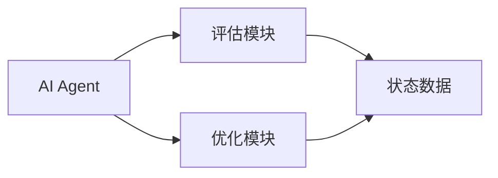
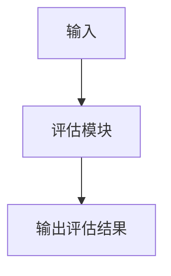

                 


# 构建具有自我评估与优化能力的AI Agent系统

## 关键词：AI Agent、自我评估、优化机制、算法实现、系统架构、项目实战、最佳实践

## 摘要：本文详细讲解如何构建具备自我评估与优化能力的AI Agent系统，涵盖核心概念、算法原理、系统架构设计、项目实战和最佳实践。

---

### 第一部分: 背景与核心概念

#### 第1章: AI Agent系统概述

##### 1.1 问题背景与问题描述
- 当前AI系统的主要挑战：传统AI系统依赖于固定的规则和数据，难以适应动态变化的环境。
- 自我评估与优化的必要性：AI Agent需要能够根据环境反馈调整自身行为，以提高效率和准确性。
- 问题解决的目标与边界：通过自我评估和优化机制，使AI Agent能够自主调整策略，适应复杂环境。

##### 1.2 AI Agent的核心概念
- AI Agent的基本定义：AI Agent是一个智能实体，能够感知环境并采取行动以实现目标。
- 自我评估与优化机制：AI Agent通过内部算法评估当前状态，并根据评估结果优化自身行为。
- 系统的核心要素与组成：感知模块、决策模块、执行模块、评估模块和优化模块。

#### 第2章: 自我评估与优化机制

##### 2.1 核心概念与联系
- 自我评估机制的原理：通过收集环境反馈，评估当前策略的有效性。
- 优化机制的实现方式：基于评估结果，调整策略参数或行为模式。
- 两者的关系与协同：自我评估为优化提供依据，优化增强评估的准确性。

##### 2.2 核心概念对比表
| 概念 | 描述 | 示例 |
|------|------|------|
| 自我评估 | 系统对自身状态的判断 | 判断当前模型准确性 |
| 优化机制 | 根据评估结果进行调整 | 调整模型参数 |

##### 2.3 实体关系图


---

### 第二部分: 算法原理与实现

#### 第3章: 自我评估算法

##### 3.1 算法原理
- 基于强化学习的评估方法：通过奖励机制判断策略的好坏。
- 基于监督学习的评估方法：根据已知结果评估预测的准确性。
- 混合评估策略：结合强化学习和监督学习的优势。

##### 3.2 算法流程图


##### 3.3 评估指标
- 准确率、召回率、F1值：常用的评估指标，用于衡量AI Agent的表现。

#### 第4章: 优化算法实现

##### 4.1 基于强化学习的优化算法
###### 4.1.1 强化学习基础
- 强化学习：通过试错和奖励机制优化策略。
- 状态、动作、奖励和策略的概念。

###### 4.1.2 Q-learning算法实现
- Q-learning算法的步骤：选择动作、获得奖励、更新Q表。
- Q-learning算法公式：
$$ Q(s, a) = Q(s, a) + \alpha [r + \gamma \max Q(s', a') - Q(s, a)] $$

##### 4.2 基于遗传算法的优化
###### 4.2.1 遗传算法基础
- 遗传算法的步骤：选择、交叉和变异。
- 适应度函数的定义。

###### 4.2.2 应用遗传算法进行优化的步骤
- 初始化种群、计算适应度、选择、交叉和变异，重复迭代。

##### 4.3 遗传算法的数学模型
$$ f_{\text{适应度}}(x) = \sum w_i x_i $$

#### 第5章: 优化算法实现的数学模型与公式

##### 5.1 强化学习的数学模型
$$ Q(s, a) = Q(s, a) + \alpha [r + \gamma \max Q(s', a') - Q(s, a)] $$

##### 5.2 遗传算法的数学模型
$$ f_{\text{适应度}}(x) = \sum w_i x_i $$

#### 第6章: 算法实现的代码示例

##### 6.1 强化学习评估代码
```python
class AI-Agent:
    def __init__(self):
        self.model = ...  # 初始化模型
        self.env = ...    # 初始化环境
        self.q_table = {}  # 初始化Q表
```

---

### 第三部分: 系统分析与架构设计

#### 第7章: 项目背景与系统功能设计

##### 7.1 项目背景
- 项目目标与范围：构建一个能够自我评估和优化的AI Agent系统。
- 项目的关键利益相关者：开发团队、用户、测试人员。
- 项目的主要挑战：动态环境适应、算法效率、系统集成。

##### 7.2 系统功能设计
- 核心功能模块：感知模块、决策模块、执行模块、评估模块和优化模块。
- 功能模块之间的交互关系：感知模块提供数据，决策模块基于数据做出决策，执行模块执行动作，评估模块评估结果，优化模块调整策略。

#### 第8章: 系统架构设计

##### 8.1 系统架构设计概述
- 总体架构图：展示各个模块之间的关系。
- 关键模块的设计原则：模块化、高内聚低耦合。

##### 8.2 实体关系图


---

### 第四部分: 项目实战

#### 第9章: 环境配置与核心代码实现

##### 9.1 环境配置
- 安装必要的依赖：Python、TensorFlow、OpenAI API等。
- 配置开发环境：安装IDE、设置虚拟环境。

##### 9.2 核心代码实现
- 评估模块的实现：使用监督学习或强化学习算法进行评估。
- 优化模块的实现：基于遗传算法或Q-learning进行优化。

#### 第10章: 项目案例分析

##### 10.1 案例背景介绍
- 项目目标：构建一个能够优化自身推荐策略的AI Agent。
- 数据来源：用户行为数据、点击流数据。
- 环境设置：模拟电商推荐系统。

##### 10.2 实施步骤
1. 数据收集与预处理。
2. 构建AI Agent模型。
3. 实现自我评估模块。
4. 实现优化模块。
5. 测试与优化。

##### 10.3 案例结果分析
- 实验结果：准确率、召回率等指标的提升。
- 成功经验：模块化设计、高效的算法实现。
- 改进方向：优化算法效率、增强环境适应性。

---

### 第五部分: 最佳实践、小结与展望

#### 第11章: 最佳实践与注意事项

##### 11.1 实践中的常见问题与解决方案
- 问题：评估指标选择不当。
- 解决：根据具体任务选择合适的指标。
- 问题：优化算法收敛速度慢。
- 解决：调整参数、选择合适的算法。

##### 11.2 关键成功因素
- 明确的目标和需求。
- 高效的算法实现。
- 合理的系统架构设计。

##### 11.3 常见误区与避免策略
- 误区：过度依赖单一算法。
- 策略：结合多种算法，进行混合优化。

#### 第12章: 小结与未来展望

##### 12.1 全文总结
- 构建具有自我评估与优化能力的AI Agent系统，能够显著提升系统的适应性和效率。
- 关键在于模块化设计、高效的算法实现和合理的系统架构。

##### 12.2 未来展望
- 研究更高效的评估和优化算法。
- 探索多模态数据的利用。
- 结合边缘计算，提升实时性。

---

通过以上结构，我们可以系统地构建一个具有自我评估与优化能力的AI Agent系统。从理论到实践，逐步实现一个高效、智能的AI系统。

