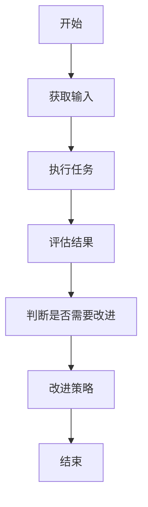
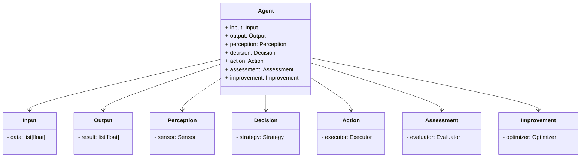

                 


# 构建具有自我评估与改进能力的AI Agent

> 关键词：AI Agent，自我评估，改进能力，算法原理，系统架构，项目实战

> 摘要：本文详细探讨了构建具有自我评估与改进能力的AI Agent的理论基础、算法实现、系统设计和项目实战。通过分析AI Agent的核心概念，讲解了自我评估与改进的具体实现方法，并通过实际案例展示了如何将理论应用于实践。文章结构清晰，内容详实，适合AI开发者和研究人员阅读。

---

## 第1章: AI Agent的背景与核心概念

### 1.1 问题背景

AI Agent（智能体）是一种能够感知环境、自主决策并执行任务的智能系统。随着人工智能技术的快速发展，AI Agent在各个领域的应用越来越广泛，例如自动驾驶、智能助手、机器人等。然而，现有的AI Agent大多依赖于固定的规则或预训练的模型，缺乏自我评估与改进的能力，导致在复杂多变的环境中表现受限。

自我评估与改进能力是AI Agent实现智能化的核心能力之一。它使得AI Agent能够根据环境反馈不断优化自身的行为策略，从而更好地适应动态变化的环境。本文将重点探讨如何构建具有这种能力的AI Agent。

### 1.2 问题描述

AI Agent的自我评估与改进能力包括两个核心部分：

1. **自我评估**：AI Agent需要能够评估自身在特定任务中的表现，并识别存在的问题或改进空间。
2. **改进能力**：基于评估结果，AI Agent能够调整自身的算法参数、行为策略或知识库，以提升任务执行的效率和质量。

### 1.3 问题解决思路

为实现上述目标，我们提出了以下解决方案：

1. **评估机制**：设计一种基于环境反馈的评估算法，能够量化AI Agent在任务中的表现。
2. **改进策略**：结合评估结果，采用强化学习或自适应优化算法，动态调整AI Agent的行为策略。
3. **模块化设计**：将AI Agent划分为感知、决策、执行和评估四个模块，每个模块独立运行并协同工作。

### 1.4 本章小结

本章主要介绍了AI Agent的背景、核心概念以及自我评估与改进能力的重要性。通过分析当前AI Agent的局限性，我们提出了构建具有自我评估与改进能力的AI Agent的解决方案。

---

## 第2章: 核心概念与联系

### 2.1 核心概念原理

AI Agent的核心概念包括以下几个方面：

1. **感知能力**：AI Agent通过传感器或接口获取环境信息。
2. **决策能力**：基于感知信息，AI Agent选择最优的行为策略。
3. **执行能力**：根据决策结果执行具体任务。
4. **评估能力**：评估自身行为的效果，并识别改进空间。

### 2.2 核心概念对比

以下是一个对比表格，展示了AI Agent与传统程序的主要区别：

| **属性**       | **AI Agent**             | **传统程序**             |
|----------------|--------------------------|--------------------------|
| 行为方式         | 自主决策并执行任务      | 执行预定义的规则或任务    |
| 环境适应能力     | 能够适应动态变化的环境    | 适应性较弱                |
| 学习能力         | 能够通过经验改进性能      | 无法学习，依赖固定规则      |

### 2.3 ER实体关系图

以下是一个简单的ER实体关系图，展示了AI Agent的核心组件及其关系：

```mermaid
er
  actor: 用户
  agent: AI Agent
  action: 行为
  assessment: 评估结果
  improvement: 改进策略
  actor --> action
  action --> agent
  agent --> assessment
  assessment --> improvement
  improvement --> agent
```

---

## 第3章: 算法原理讲解

### 3.1 算法原理

AI Agent的自我评估与改进能力主要依赖于以下算法：

1. **评估函数**：用于量化AI Agent在任务中的表现。例如，可以使用以下公式：
   $$ f(x) = \sum_{i=1}^{n} w_i x_i $$
   其中，$w_i$是权重，$x_i$是任务表现的指标。

2. **改进策略**：基于评估结果，调整AI Agent的行为策略。例如，可以使用以下公式：
   $$ \theta_{new} = \theta_{old} + \alpha \nabla f(\theta_{old}) $$
   其中，$\alpha$是学习率，$\nabla f(\theta_{old})$是评估函数的梯度。

### 3.2 算法流程图

以下是一个算法的流程图，展示了AI Agent从输入到输出的完整流程：



### 3.3 Python实现代码

以下是一个简单的Python代码示例，展示了AI Agent的核心实现：

```python
def assess_and_improve():
    input = get_input()  # 获取输入
    result = execute_task(input)  # 执行任务
    score = evaluate(result)  # 评估结果
    if score < threshold:  # 判断是否需要改进
        improve(result, score)  # 改进策略
    return final_result  # 返回最终结果
```

### 3.4 本章小结

本章详细讲解了AI Agent的算法原理，包括评估函数和改进策略的具体实现。通过流程图和代码示例，读者可以清晰地理解AI Agent的工作机制。

---

## 第4章: 系统分析与架构设计

### 4.1 问题场景介绍

在构建AI Agent时，我们需要考虑以下场景：

1. **动态环境**：环境中的条件可能会发生变化，例如温度、光照等。
2. **任务复杂性**：任务可能涉及多个步骤，需要协调多个模块共同完成。
3. **反馈延迟**：环境反馈可能存在延迟，影响AI Agent的实时性。

### 4.2 项目介绍

本项目的目标是构建一个能够自我评估与改进的AI Agent，主要功能包括：

1. **感知环境**：通过传感器获取环境信息。
2. **决策与执行**：根据感知信息，选择最优的行为策略并执行。
3. **自我评估**：评估自身行为的表现，并识别改进空间。
4. **改进策略**：根据评估结果，动态调整算法参数或行为策略。

### 4.3 系统功能设计

以下是一个系统功能设计的类图：



### 4.4 本章小结

本章通过对AI Agent的系统分析与架构设计，明确了AI Agent的核心组件及其关系。通过类图和功能模块的划分，读者可以更好地理解AI Agent的实现方式。

---

## 第5章: 项目实战

### 5.1 环境安装

为了实现AI Agent，我们需要安装以下环境：

1. Python 3.8+
2. PyTorch或TensorFlow框架
3. Mermaid图生成工具
4. 算法依赖库（如numpy、pandas等）

### 5.2 代码实现

以下是一个简单的代码实现示例：

```python
import numpy as np

def assess_and_improve(input_data):
    # 执行任务
    result = np.dot(input_data, weights)  # 简单的线性回归模型
    # 评估结果
    score = np.mean(np.abs(result - target))  # �均方误差
    # 判断是否需要改进
    if score > threshold:
        # 改进策略：调整权重
        weights += learning_rate * (target - result).T.dot(input_data)
    return result

# 调用函数
input_data = np.random.rand(100, 10)
target = np.random.rand(100, 1)
weights = np.random.rand(10, 1)
threshold = 0.1
learning_rate = 0.01

output = assess_and_improve(input_data)
```

### 5.3 案例分析

以下是一个实际案例分析：

假设我们构建一个AI Agent用于自动调节室内温度。通过传感器获取室内温度数据，AI Agent根据历史数据和当前环境评估自身的调节策略，并通过强化学习算法优化温度调节参数。

### 5.4 本章小结

本章通过实际案例展示了如何将理论应用于实践，帮助读者更好地理解和实现AI Agent。

---

## 第6章: 最佳实践与注意事项

### 6.1 小结

构建具有自我评估与改进能力的AI Agent是一个复杂而有趣的过程。通过本文的讲解，读者可以掌握AI Agent的核心概念、算法原理和系统设计方法。

### 6.2 注意事项

1. **模块化设计**：确保各个模块独立运行，便于后续优化和维护。
2. **数据处理**：注意数据的预处理和标准化，避免数据质量问题影响评估结果。
3. **性能优化**：合理选择算法和参数，提升AI Agent的运行效率。
4. **安全措施**：确保AI Agent的安全性，避免潜在的安全漏洞。

### 6.3 拓展阅读

1. 《Reinforcement Learning: Theory and Algorithms》
2. 《Self-Improving AI Systems: A Tutorial》
3. 《Software Architecture: Patterns and Practices》

---

## 附录: 总结与展望

本文详细探讨了构建具有自我评估与改进能力的AI Agent的理论基础、算法实现和系统设计。通过实际案例分析，读者可以更好地理解如何将理论应用于实践。未来的研究方向可以包括更复杂的动态环境适应能力、多智能体协作优化算法等。

---

# END

