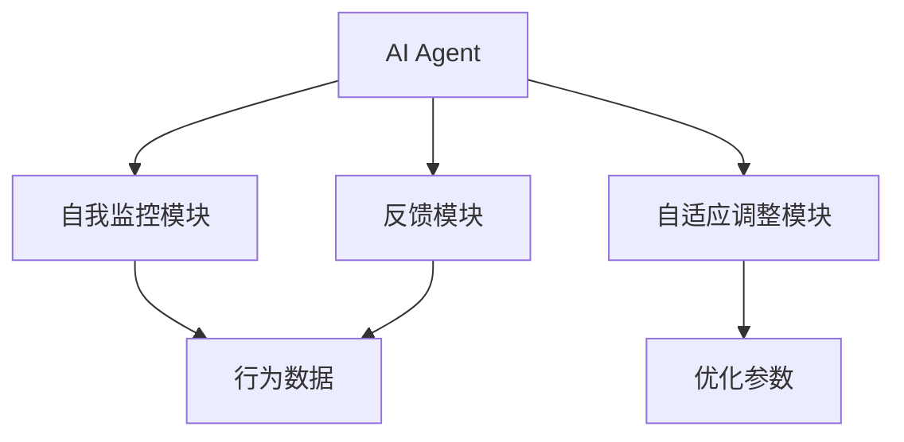
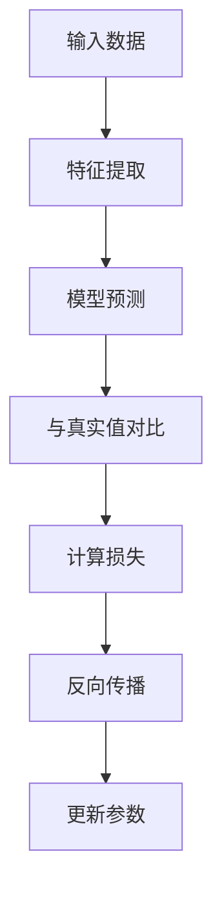
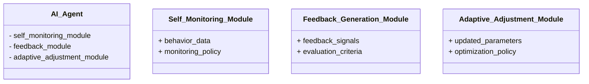
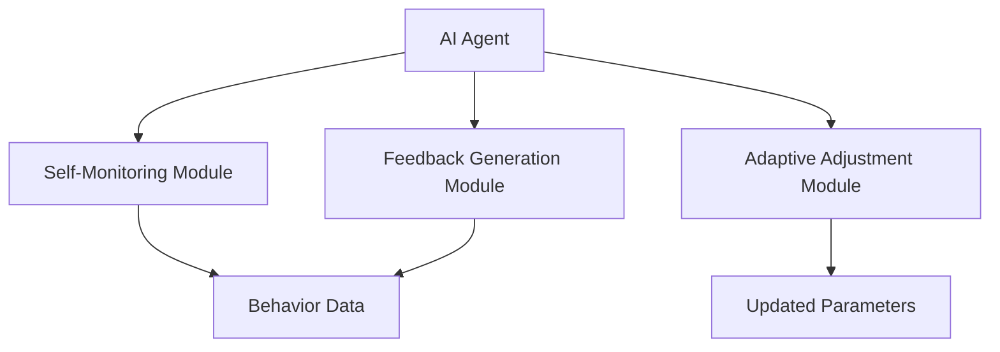
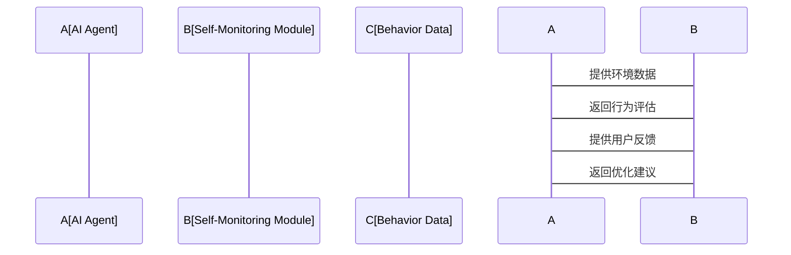

                 


# 构建具有自我评估能力的AI Agent

> 关键词：AI Agent，自我评估，反馈机制，主动学习，自适应优化

> 摘要：本文将详细探讨如何构建一个能够自我评估的AI Agent。通过分析其核心概念、算法原理、系统架构及项目实战，我们将逐步揭示其实现方法和应用场景。文章从问题背景出发，结合理论与实践，为读者提供全面的技术指导。

---

# 第一部分: 构建具有自我评估能力的AI Agent概述

## 第1章: 自我评估AI Agent的背景与概念

### 1.1 问题背景与挑战

#### 1.1.1 AI Agent的基本概念
AI Agent（智能体）是一种能够感知环境、做出决策并采取行动的实体。它通过接收输入信息，执行内部处理，输出行动或结果。AI Agent可以是软件程序、机器人或其他智能系统。

#### 1.1.2 自我评估能力的核心问题
传统的AI Agent依赖于外部监督或预定义规则来评估其行为，这种方式在复杂动态环境中存在局限性。自我评估能力使AI Agent能够主动监控和评估自身行为，从而在无外部干预的情况下实现优化。

#### 1.1.3 当前AI Agent技术的局限性
1. **依赖外部反馈**：传统AI Agent通常需要人工干预或外部数据来评估性能，这在实时动态环境中效率低下。
2. **缺乏自适应性**：当环境变化时，传统AI Agent难以快速调整策略。
3. **计算开销大**：复杂的评估机制可能导致性能下降。

### 1.2 自我评估AI Agent的定义与特点

#### 1.2.1 自我评估能力的定义
自我评估能力是指AI Agent能够通过内部机制实时监控和评估自身行为、决策和结果的能力，并根据评估结果调整其行为策略以提高性能。

#### 1.2.2 自我评估AI Agent的核心特点
- **自主性**：无需外部干预，自主完成评估与优化。
- **实时性**：能够实时监控行为并快速调整。
- **自适应性**：根据评估结果动态优化模型参数。

#### 1.2.3 自我评估与传统AI Agent的区别
| 对比维度 | 传统AI Agent | 自我评估AI Agent |
|----------|---------------|--------------------|
| 评估机制 | 外部监督或规则 | 内部自主评估       |
| 灵活性   | 低             | 高                 |
| 计算开销 | 高             | 中                 |

### 1.3 自我评估AI Agent的应用领域

#### 1.3.1 智能助手与个人任务管理
AI Agent可以帮助用户管理日程、优化任务流程，通过自我评估不断优化用户体验。

#### 1.3.2 自动化系统监控与优化
在工业自动化、网络监控等领域，自我评估AI Agent可以实时监控系统状态并优化性能。

#### 1.3.3 企业级AI决策支持
在企业决策支持系统中，AI Agent可以通过自我评估优化决策过程，提高企业效率。

---

## 第2章: 自我评估机制的核心概念

### 2.1 自我评估机制的原理

#### 2.1.1 输入-处理-输出模型
AI Agent接收输入信息（如传感器数据、用户反馈），经过内部处理（如推理、计算），输出行动或结果。

#### 2.1.2 自我监控与反馈机制
AI Agent通过内部日志记录和状态跟踪，监控自身行为，并根据结果生成反馈。

#### 2.1.3 自适应调整策略
根据反馈，AI Agent调整其行为策略或模型参数，以提高性能。

### 2.2 核心概念对比表

| 概念         | 描述                                                                 |
|--------------|----------------------------------------------------------------------|
| 自我监控     | 对自身行为的实时观察与记录                                             |
| 反馈机制     | 根据结果调整行为的策略                                                 |
| 自适应调整   | 根据反馈动态优化模型参数                                               |

### 2.3 实体关系图



---

## 第3章: 自我评估AI Agent的算法原理

### 3.1 算法概述

#### 3.1.1 算法目标函数
$$ \text{损失函数} = \text{预测值} - \text{真实值} $$

#### 3.1.2 优化器选择
$$ \text{Adam优化器} = \text{学习率} \times \text{梯度} $$

### 3.2 算法流程



### 3.3 算法实现代码

```python
import torch

def self_assessment_model(input_data):
    # 特征提取
    features = extract_features(input_data)
    # 模型预测
    output = model(features)
    return output

def update_parameters(loss):
    # 反向传播
    optimizer.zero_grad()
    loss.backward()
    # 参数更新
    optimizer.step()
```

---

## 第4章: 自我评估AI Agent的系统架构设计

### 4.1 问题场景介绍

#### 4.1.1 系统目标
构建一个能够实时监控和优化自身行为的AI Agent，应用于智能助手、自动化系统等领域。

#### 4.1.2 问题分析
AI Agent需要具备自我监控、反馈生成和自适应调整能力。

### 4.2 系统功能设计

#### 4.2.1 领域模型设计


#### 4.2.2 系统架构设计


### 4.3 系统接口设计

#### 4.3.1 接口描述
- **输入接口**：接收环境数据、用户反馈。
- **输出接口**：输出行动、状态报告。

#### 4.3.2 交互序列图


---

## 第5章: 自我评估AI Agent的项目实战

### 5.1 环境安装与配置

#### 5.1.1 安装依赖
```bash
pip install torch numpy matplotlib
```

### 5.2 核心功能实现

#### 5.2.1 自我监控模块实现
```python
def monitor_behavior(input_data):
    # 提取行为数据
    behavior_features = extract_behavior_features(input_data)
    # 生成监控信号
    return behavior_features
```

#### 5.2.2 反馈生成模块实现
```python
def generate_feedback(predicted_output, ground_truth):
    # 计算损失
    loss = calculate_loss(predicted_output, ground_truth)
    # 生成反馈信号
    return loss
```

### 5.3 应用案例分析

#### 5.3.1 案例背景
假设我们正在开发一个智能客服AI Agent，需要实时监控对话质量。

#### 5.3.2 实施步骤
1. 收集用户对话数据。
2. 使用自我监控模块评估对话质量。
3. 根据反馈生成模块生成优化建议。
4. 更新AI Agent的参数。

### 5.4 代码实现与解读

```python
import torch

# 定义模型
class SelfAssessmentModel(torch.nn.Module):
    def __init__(self, input_dim, output_dim):
        super().__init__()
        self.fc = torch.nn.Linear(input_dim, output_dim)

    def forward(self, x):
        return self.fc(x)

# 初始化模型
model = SelfAssessmentModel(input_dim=10, output_dim=1)
optimizer = torch.optim.Adam(model.parameters(), lr=0.001)

# 训练循环
def train_step(x, y):
    optimizer.zero_grad()
    outputs = model(x)
    loss = calculate_loss(outputs, y)
    loss.backward()
    optimizer.step()
    return loss

# 自我评估循环
def self_assess():
    for epoch in range(num_epochs):
        x = get_input_data()
        y = get_ground_truth()
        loss = train_step(x, y)
        # 根据损失调整模型参数
        adjust_parameters(loss)
```

---

## 第6章: 自我评估AI Agent的最佳实践

### 6.1 小结与总结

- **核心内容总结**：本文详细介绍了如何构建具有自我评估能力的AI Agent，从理论到实践，为读者提供了全面的技术指导。

### 6.2 注意事项与建议

- **数据质量**：确保输入数据的准确性和完整性。
- **模型调优**：根据实际需求调整学习率和优化策略。
- **性能监控**：实时监控系统性能，及时发现和解决问题。

### 6.3 拓展阅读

- **相关文献**：推荐阅读关于自适应优化和反馈机制的经典论文。
- **工具与库**：建议学习使用深度学习框架（如TensorFlow、PyTorch）进行模型实现。

---

# 结语

构建具有自我评估能力的AI Agent是一项具有挑战性的任务，但通过本文的系统介绍，读者可以逐步掌握其实现方法。从理论到实践，本文为读者提供了全面的技术指导，帮助他们在复杂动态环境中构建高效、自适应的智能系统。

